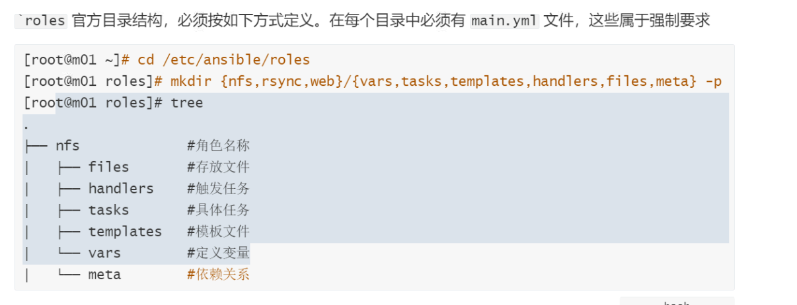

# ansible-playbook进阶

## 目录

-   [ansible-playbook进阶](#ansible-playbook进阶)
    -   [ansible deleget](#ansible-deleget)
        -   [什么是委派](#什么是委派)
        -   [场景](#场景)
        -   [场景2](#场景2)
    -   [roles](#roles)
        -   [基本介绍](#基本介绍)
        -   [目录结构](#目录结构)
        -   [依赖关系](#依赖关系)
    -   [分步执行](#分步执行)

# ansible-playbook进阶

## ansible deleget

### 什么是委派

简单来说，就是本来需要在当前"被控制端主机”执行的操作，被委派给其他主机执行。

### 场景

1.为 172.16.1.7 服务器添加一条 hosts 记录: 1.1.1.1 [oldxu.com](http://oldxu.com "oldxu.com")&#x20;

2.同时要把这个 hosts 记录写一份至到 172.16.1.5 节点&#x20;

3.除此任务以外 172.16.1.7 的其他任务都不会委 派给 172.16.1.5 执行。

```yaml
#使用delegate_to关键字实现委派
[root@ansible project1]# cat ansible_de.yml
- hosts: 172.16.1.7
  tasks:
    - name: Add WebServers DNS
      shell: "echo 1.1.1.1 oldxu.com >> /etc/hosts"
    - name: delegate_to Host 172.16.1.5
      shell: "echo 1.1.1.1 oldxu.com >> /etc/hosts"
      delegate_to: 172.16.1.5
    - name: Add WebServers DNS
      shell: "echo 2.2.2.2 oldxu2.com >> /etc/hosts"
#如果该任务要对 ansible 控制节点执行怎么办? 可以委派 127.0.0.1 或者使用 local_action 来实现。
[root@oldxu-ansible-172 ~]# cat ansible_de.yml
- hosts: 172.16.1.7
  tasks:
    - name: Add WebServers DNS
      shell: "echo 1.1.1.1 oldxu.com >>/etc/hosts"
    - name: delegate_to Host 172.16.1.5
      shell: "echo 1.1.1.1 oldxu.com >>/etc/hosts"
      delegate_to: 172.16.1.5
    - name: delegate_to Host 127.0.0.1
      shell: "echo 1.1.1.1 oldxu.com >>/etc/hosts"
      connection: local
# - name: delegate_to Host 127.0.0.1
# shell: "echo 1.1.1.1 oldxu.com >>/etc/hosts"
# delegate_to: 127.0.0.1
# delegate_facts: True # 收集被委托机器的facts

```

### 场景2

```yaml
# 创建普通用户管理ansible
[root@lb01 ~]# cat user_manager_ansible.yml
- hosts: webservers
  vars:
    - user_name: oldxu_demo
  tasks:
# manager
    - name: Create Manager Oldxu_demo
      user:
        name: "{{ user_name }}"
        generate_ssh_key: yes
        ssh_key_bits: 2048
        ssh_key_file: .ssh/id_rsa
      register: user_message
      delegate_to: localhost # 委派给管理端
      run_once: true # 委派任务仅执行一次
# node
    - name: 打印管理用户的key结果
      debug:
        msg: "{{user_message.ssh_public_key }}"
    - name: 在被控端上创建用户
      user:
        name: "{{ user_name }}"
    - name: 在被控端上创建用户.ssh目录
      file:
        path: /home/{{ user_name }}/.ssh
        state: directory
        owner: "{{ user_name }}"
        group: "{{ user_name }}"
        mode: "0700"
    - name: 将管理端 {{ user_name }} 用户的key存储到被控端
      copy:
        content: "{{
   user_message.ssh_public_key }}"
dest: /home/{{ user_name
}}/.ssh/authorized_keys
owner: "{{ user_name }}"
group: "{{ user_name }}"
mode: "0600"
- name: 配置被控制端sudo提权,最后追加一行
lineinfile:
dest: /etc/sudoers
line: "{{ user_name }} ALL=(ALL)
NOPASSWD:ALL"
 
```

## roles

### 基本介绍

Roles是组织Playbook最好的一种方式，它基于一个已知的文件结构，去自动的加载vars， tasks以及`handlers`以便 playbook更好的调用。roles相比 playbook的结构更加的清晰有层次，但roles要比playbook稍微麻烦一些;

比如:安装任何软件都需要先安装时间同步服务，那么每个playbook 都要编写时间同步服务的task，会显得整个配置比较臃肿，且难以维护;

如果使用Role:我们则可以将时间同步服务task任务编写好，等到需要使用的时候进行调用就行了减少重复编写task带来的文件臃肿;

### 目录结构



### 依赖关系

roles 允许在使用时自动引入其他role,role依赖关系存储在meta/main.ym1文件中

例如:安装wordpress项目时:

1.需要先确保nginx与php-fpm的role都能正常运行

2.然后在wordpress的role中定义，依赖关系

3.依赖的ro1e有nginx以及 php-fpm

Roles是组织Playbook最好的一种方式，它基于一个已知的文件结构，去自动的加载vars， tasks以及`handlers`以便 playbook更好的调用。roles相比 playbook的结构更加的清晰有层次，但roles要比playbook稍微麻烦一些;
比如:安装任何软件都需要先安装时间同步服务，那么每个playbook 都要编写时间同步服务的task，会显得整个配置比较臃肿，且难以维护;
如果使用Role:我们则可以将时间同步服务task任务编写好，等到需要使用的时候进行调用就行了
减少
重复编写task带来的文件臃肿;

## 分步执行

ansible-playbook playbook.yml --step
