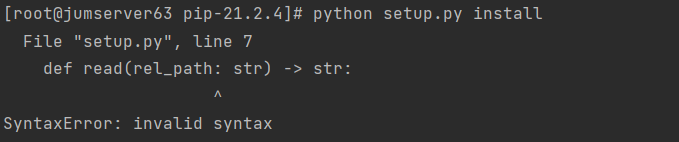

# jumpserver自动化安装

## 目录

-   [出现的问题](#出现的问题)

# 出现的问题

该问题是pip本身问题缺少依赖工具，解决方法：

1.  wget [https://bootstrap.pypa.io/pip/2.7/get-pip.py](https://bootstrap.pypa.io/pip/2.7/get-pip.py "https://bootstrap.pypa.io/pip/2.7/get-pip.py")
2.  python [get-pip.py](http://get-pip.py "get-pip.py")
3.  pip install --upgrade setuptools
