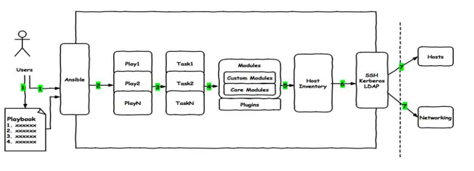
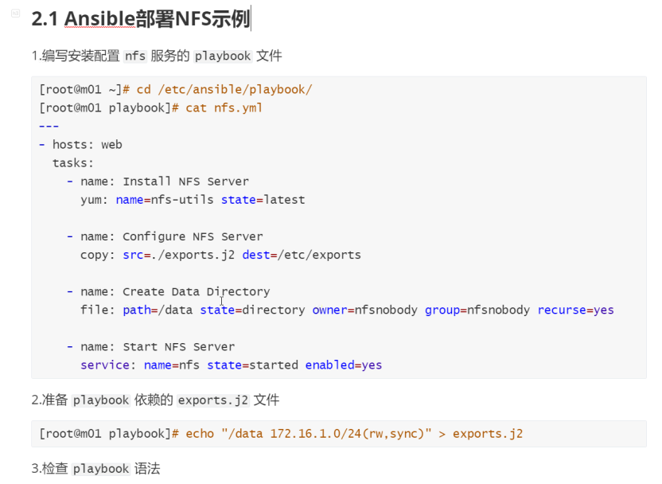
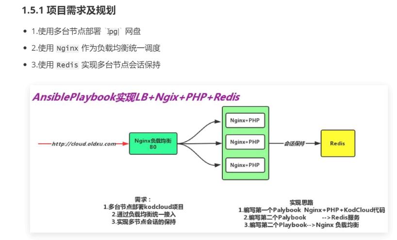

# ansible-playbool入门

## 目录

-   [playbook入门](#playbook入门)
    -   [什么是playbook](#什么是playbook)
    -   [playbook和ansible-hoc关系](#playbook和ansible-hoc关系)
    -   [书写格式](#书写格式)
-   [playbook案例实战](#playbook案例实战)
    -   [ansible部署NFS示例](#ansible部署NFS示例)
    -   [ansible部署Httpd示例](#ansible部署Httpd示例)
    -   [ansible部署rsync示例](#ansible部署rsync示例)
    -   [ansible部署lamp示例](#ansible部署lamp示例)
    -   [playbook部署集群架构](#playbook部署集群架构)
        -   [项目需求规划](#项目需求规划)
        -   [项目环境准备](#项目环境准备)
        -   [部署redis](#部署redis)
        -   [部署php环境](#部署php环境)
        -   [部署负载均衡](#部署负载均衡)
    -   [所用机器](#所用机器)

# playbook入门

## 什么是playbook

playbook是一个由yml语法编写的文本文件，它由 play和task 两部分组成。

play :主要定义要操作主机或者主机组

task:主要定义对主机或主机组具体执行的任务，可以是一个任务，也可以是多个任务(模块)



总结: playbook是由一个或多个play组成，一个play可以包含多个task任务。可以理解为:使用多个不同的模块来共同完成一件事情。

## playbook和ansible-hoc关系

1\) playbook 是对 AD-Hoc的一种编排方式。

2\) playbook可以持久运行，而Ad-Hoc只能临时运行。

3\) playbook适合复杂的任务，而Ad-Hoc适合做快速简单的任务。

·

4\) playbook能控制任务执行的先后顺序。

## 书写格式

playbook 是由ym1语法书写，结构清晰，可读性强，所以必须掌握yml语法

| 语法  | 描述                                       |
| --- | ---------------------------------------- |
| 缩进  | YAML使用固定的缩进风格表示层级结构,每个缩进由两个空格组成,不能使用tabs |
| 冒号  | 以冒号结尾的除外，其他所有冒号后面所有必须有空格。                |
| 短横线 | 表示列表项，使用一个短横杠加一个空格。多个项使用同样的缩进级别作为同一列表。   |

```bash
- hosts:顶格写
  tasks:任务空两格
    - name:任务名称（自定义）
      yum:要进行操作的名称  #参考模块操作进行编写
        name:进行上面操作的名称
        state:present
    - name:Configure NFS server #新的任务名称
      copy:#新的操作
         src: ./exports.j2
        dest: /etc/exports
        owner: root
        group: root
        mode: '0644' 
      notify: Restart NFS Server #触发器
    - name:Create SHare DIrectory
      file:
        path:/ansible
        state:directory
        owner:www
        group:www
        recurse:yes
    - name:Systemd Start NFS Server
      systemd:
        name:nfs
        state:started
 handlers:
   - name:restart nfs server
     systemd:
       name:nfs
       state:restarted
- hosts: 172.16.1.8
  tasks:
   - name: Mount NFS data
     mount:
       src: 172.16.1.7:/ansible
       path: /bb
       fstype: nfs
       opts: defaults
       state: mounted        
```

# playbook案例实战

## ansible部署NFS示例



## ansible部署Httpd示例

## ansible部署rsync示例

## ansible部署lamp示例

## playbook部署集群架构

### 项目需求规划

### 项目环境准备

### 部署redis

### 部署php环境

### 部署负载均衡



```yaml
#安装nginx
- hosts: webservers
  tasks:
    - name: install nginx
      yum: 
        name: nginx
        enablerepo: nginx-stable
        state: present
    - name: delete
      lineinfile:
        path: /etc/nginx/nginx.conf
        regexp: '^user'
        state: absent
    - name: delete
      lineinfile:
        path: /etc/nginx/nginx.conf
        regexp: '^use'
        state: absent
    - name: create nginx.conf
      lineinfile:
        path: /etc/nginx/nginx.conf
        insertbefore: worker_processes  auto;
        line: user luo;
    - name: systemctl start nginx
      systemd:
        name: nginx
        state: started
        enabled: yes

#安装php
    - name: Find all rpm
      find:
        paths: "/root/php/"
        patterns: "*.rpm"
      register: rpm_files
 
    - name: Setting rpm_list
      set_fact:
        rpm_list: "{{ rpm_files.files | map(attribute='path') | list}}"

    - name: installing the rpm files
      yum:
        name: "{{rpm_list}}"
        state: present    
    - name: copy php
      copy:
        src: ./php.ini.j2
        dest: /etc/php.ini
        owner: root
        group: root
        mode: 0644
      notify: restart php server
    - name: copy php.conf
      copy:
        src: ./file/php-fpm.www.conf.j2
        dest: /etc/php-fpm.d/www.conf
        owner: root
        group: 0644
      notify: restart php server
    - name: systemctl start php
      systemd:
        name: php-fpm
        state: started
        enabled: yes

#phpmyadmincode

    - name: copy nfinxwenjian
      copy:
        src: ./file/ansible.lyjjhh.top.conf.j2 
        dest: /etc/nginx/conf.d/ansible.lyjjhh.top.conf
      notify: restart nginx server
    - name: create ansibe directory
      file: 
        path: /ansible
        owner: luo
        group: luo
        mode: 0755
        recurse: yes
    - name: unzip phpmyadmin
      unarchive:
        src: ./phpMyAdmin-5.1.1-all-languages.zip
        dest: /ansible
    - name: create link
      file:
        src: /ansible/phpMyAdmin-5.1.1-all-languages/
        dest: /ansible/phpmyadmin
        state: link
    - name: copyphp
      copy:
        src: ./config.inc.php.j2
        dest: /ansible/phpmyadmin/config.inc.php

#装redis


    - name: install redis
      yum:
        name: redis
        state: present
    - name: systemctl statr redis
      systemd:
        name: redis
        state: started
        enabled: yes
#https

- hosts: proxyserver
  tasks:
    - name: unzip ssl
      unarchive:
        src: ./ansible.lyjjhh.top.zip
        dest: /etc/nginx/
    - name: copy file
      copy:
        src: ./file/proxy_ansible.lyjjhh.top.conf.j2
        dest: /etc/nginx/conf.d/proxy_ansible.lyjjhh.top.conf
#haproxy均衡负载
    - name: Unarchive /tmp Directory
      unarchive:
        src: ./haproxy22.rpm.tar.gz
        dest: /tmp
        creates: /tmp/haproxy

    - name: Installed Haproxy
      yum:
        name: "{{ pack }}"
      vars:
        pack:
          - /tmp/haproxy/haproxy22-2.2.9-3.el7.ius.x86_64.rpm
          - /tmp/haproxy/lua53u-5.3.4-1.ius.el7.x86_64.rpm
          - /tmp/haproxy/lua53u-devel-5.3.4-1.ius.el7.x86_64.rpm
          - /tmp/haproxy/lua53u-libs-5.3.4-1.ius.el7.x86_64.rpm
          - /tmp/haproxy/lua53u-static-5.3.4-1.ius.el7.x86_64.rpm
        remote_src: no
    - name: Configure Haproxy Server
      copy:
        src: ./file/haproxy_http.cfg.j2
        dest: /etc/haproxy/haproxy.cfg
        owner: root
        group: root
        mode: 0644
      notify: Restart Haproxy Server
    - name: Started Haproxy Server
      systemd:
        name: haproxy
        state: started
#配置ssl证书
    - name: unzip ssl
      unarchive:
        src: ./ansible.lyjjhh.top.zip
        dest: /etc/nginx/ssl
    - name: copy file
      copy:
        src: ./file/proxy_ansible.lyjjhh.top.conf.j2
        dest: /etc/nginx/conf.d/proxy_ansible.lyjjhh.top.conf
      notify: restart nginx server
    - name: copy nginx.conf
      copy:
        src: ./file/nginx_lb.conf.j2
        dest: /etc/nginx/nginx.conf
      notify: restart nginx server
    - name: start nginx server
      systemd:
        name: nginx 
        state: started
#触发器
  handlers:
    - name: restart redis
      systemd:
        name: redis
        state: restarted
    - name: restart nginx server
      systemd: 
        name: nginx
        state: restarted 
    - name: restart php server
      systemd: 
        name: php-fpm
        state: restarted
    - name: Restart Haproxy Server
      systemd:
        name: haproxy
        state: restarted

```

[redis+nginx+php+proxy+https.txt](file/redis+nginx+php+proxy+https_9P0xaGY6SG.txt " redis+nginx+php+proxy+https.txt")

## 所用机器

10.0.0.7和8是后端节点

10.0.0.62是ansible

10.0.0.9是负载均衡

10.0.0.42是redis

10.0.0.52是数据库
