# asnible Variables&#x20;

## 目录

-   [什么是变量](#什么是变量)
-   [变量定义的方式](#变量定义的方式)
-   [在playbook中定义变量](#在playbook中定义变量)
    -   [vars定义](#vars定义)
    -   [vars\_files定义变量](#vars_files定义变量)
    -   [inventory中定义变量](#inventory中定义变量)
        -   [在文件中定义变量](#在文件中定义变量)
        -   [使用host\_vars定义变量](#使用host_vars定义变量)
    -   [通过执行playbook传递变量](#通过执行playbook传递变量)
    -   [通过执行playbook传递变量](#通过执行playbook传递变量)
    -   [变量优先级](#变量优先级)
-   [ansible registrer](#ansible-registrer)
    -   [什么是ansible registrer](#什么是ansible-registrer)
    -   [场景示例1](#场景示例1)
    -   [场景示例2](#场景示例2)
    -   [场景示例3](#场景示例3)
-   [ansible facts variables](#ansible-facts-variables)
    -   [什么是facts](#什么是facts)
    -   [使用场景](#使用场景)
    -   [语法示例](#语法示例)
    -   [案例](#案例)
        -   [根据主机IP生成redis配置](#根据主机IP生成redis配置)
        -   [根据主机cpu生成nginx配置](#根据主机cpu生成nginx配置)
        -   [根据主机内存生成memcache配置](#根据主机内存生成memcache配置)
        -   [根据主机名称生成zabbix配置](#根据主机名称生成zabbix配置)
        -   [使用facts批量修改主机名称](#使用facts批量修改主机名称)
    -   [facts变量性能优化](#facts变量性能优化)
        -   [关闭facts变量加速执行](#关闭facts变量加速执行)
        -   [缓存facts变量加速执行](#缓存facts变量加速执行)
-   [anisble Task control](#anisble-Task-control)
    -   [when条件语句](#when条件语句)
        -   [根据不同操作系统安装相同的软件](#根据不同操作系统安装相同的软件)
        -   [为特定主机添加nginx仓库](#为特定主机添加nginx仓库)
        -   [判断服务是否正常运行](#判断服务是否正常运行)
        -   [为特定主机执行任务](#为特定主机执行任务)
    -   [loop循环语句](#loop循环语句)
        -   [模板](#模板)
        -   [使用循环批量启动服务](#使用循环批量启动服务)
        -   [循环批量安装软件](#循环批量安装软件)
        -   [循环批量创建用户](#循环批量创建用户)
        -   [循环批量拷贝文件](#循环批量拷贝文件)
-   [hanlers和notify](#hanlers和notify)
    -   [变更服务配置触发重启](#变更服务配置触发重启)
    -   [变更服务配置触发通知](#变更服务配置触发通知)
    -   [注意事项和说明](#注意事项和说明)
    -   [tags任务标签](#tags任务标签)
        -   [指定执行某个tags](#指定执行某个tags)
        -   [执行排除某个tags](#执行排除某个tags)
    -   [include任务复用](#include任务复用)

## 什么是变量

变量提供了便捷的方式来管理ansible项目中的动态值。比如nginx-1.12，可能后期会反复的使用到这个版本的值，那么如果将此值设置为变量，后续使用和修改都将变得非常方便。

## 变量定义的方式

在Ansible中定义变量分为如下三种方式:

1\)通过命令行传递变量参数定义

2\)在play文件中进行定义变量

2.1)通过vars定义变量

2.2)通过vars\_files定义变量

3\)通过inventory在主机组或单个主机中设置变量

3.1)通过host\_vars对主机进行定义

3.2)通过group\_vars对主机组进行定义

问题:如果定义的变量出现重复，造成冲突，如何解决?

## 在playbook中定义变量

### vars定义

```yaml
[root@ansible project1]# cat f1.yml
- hosts: webservers
  valrs:
    - web_packages: httpd 
    - ftp_packages: vsftpd
  tasks:
    - name : output vaiables
      debug:
        msg:
          - "{{ web_packages }}"
          - "{{ ftp_packages }}"
```

### vars\_files定义变量

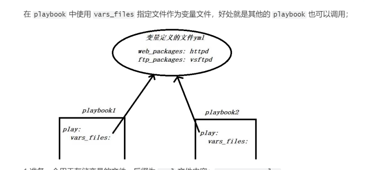

```yaml
#准备一个需要调用的yml变量文件，
  vim vars.yml
  web_packages: httpd
  ftp_packages: vsftpd
#使用playbook调用变量文件
  [root@ansible bianliang]# cat debug.yml 
- hosts: webservers
  vars_files: ./vars.yml
  tasks:
    - name: optput viasble
      debug:
        msg:
          - "{{ web_packages }}"
          - "{{ ftp_packages }}"

```

### inventory中定义变量

#### 在文件中定义变量

```yaml
#设定主机变量和组变量
[root@m01 project1]# vim /etc/ansible/hosts
    [webservers]
    172.16.1.7 myid=1 state=master
    172.16.1.8 myid=2 state=backup
    [webservers:vars]
    port=80 # 组变量
#在playbook定义变量
   [root@m01 project1]# cat p3.yml
- hosts: webserverss
  tasks:
    - name: Output Vaiables
      debug:
        msg:
        - "{{ myid }} {{ state }} {{ port}}"
```

#### 使用host\_vars定义变量

```yaml
#在项目目录中创建group_vars目录，然后在创建一个文件，文件的文件名称要与inventory 清单中的组名称保持完全一致;
  [root@ansible project1]# cat hosts
      [webserver]
      172.16.1.7
      172.16.1.8
  [root@ansible project1]# mkdir host_vars
#在host_vars目录中创建文件，给7主机定义变量
  [root@ansible project1]# cathost_vars/172.16.1.7
    web_packages: zlib-static
    ftp_packages: zmap
#准备一个playbook文件调用host_vars目录中定义的主机变量
  [root@ansible bianliang]# cat v.yml 
      - hosts: 172.16.1.7
        tasks:
          - name: ouput cat
            debug:
              msg:
              - '{{ web_packages }}'
              - '{{ ftp_packages }}'
      - hosts: 172.16.1.8
        tasks:
          - name: ouput cat
            debug:
              msg:
              - '{{ web_packages }}'
              - '{{ ftp_packages }}'

```

### 通过执行playbook传递变量

```yaml
#在项目目录中创建 group_vars目录，然后在创建一个文件，文件的文件名称要与inventory 清单中的组名称保持完全一致
 [root@ansible project1]# cat hosts
    [webservers]
    172.16.1.7
    172.16.1.8
  [root@ansible project1]# mkdir group_vars
#在 group_vars 目录中创建 webservers文件，为webservers主机组设定变量；
  [root@ansible project1]# cat group_vars/webservers
    web_packages: wget
    ftp_packages: tree  
#编写 playbook，只需在 playbook 文件中使用变量即可
  [root@ansible project1]# cat f6.yml
- hosts: webservers
  tasks:
    - name: Output Vaiables"
      debug:
        msg:
          - "{{ web_packages }}"
          - "{{ ftp_packages }}"
#测试其他组能否使用 webservers 组中定义的变量；测试后会发现无法调用；
  [root@ansible project1]# cat f6.yml
- hosts: lbservers #使用lbservers
  tasks:
    - name: Output Vaiables
      debug:
        msg:
          - "{{ web_packages }}"
          - "{{ ftp_packages }}"
#系统提供了特殊的 all 组，也就说在group_vars 目录下创建一个 all 文件，定义变量对所有的主机组都生效；
  [root@ansible project1]# cat group_vars/all
    web_packages: wget
    ftp_packages: tree
[root@ansible project1]# cat f6.yml
- hosts: lbserver #无论哪个组使用该变量，都没有任何的问题
  tasks:
    - name: Output Vaiables
      debug:
        msg:
          - "{{ web_packages }}"
          - "{{ ftp_packages }}"
    

```

### 通过执行playbook传递变量

在执行playbook时，可以通过命令行- -extra-vars或-e外置传参设定变量

```yaml
#准备playbook文件
  [root@ansible bianliang]# cat v.yml 
- hosts: 172.16.1.7
  tasks:
    - name: ouput cat
      debug:
        msg:
        - '{{ web_packages }}'
        - '{{ ftp_packages }}'
#执行playbook时进行变量的传递
  ansible-playbook v.yml -i hosts -e "web_packages=111"
#传递多个外置变量的方式
  ansible-playbook v.yml -i hosts -e "web_packages=111" -e "ftp_packages=222"

```

### 变量优先级

命令行外置传参>playbook的var files>playbook中的vars变量>inventory中的主机变量>group\_vars中的组变量>group\_vars的all变量>inventory组变量

## ansible registrer

### 什么是ansible registrer

register可以将task 执行的任务结果存储至某个变量中，便于后续的引用;

### 场景示例1

```yaml
#使用register获取控制节点端口信息
  [root@ansible bianliang]# cat netstat.yml 
- hosts: all
  tasks:
    - name:
      shell: netstat -lntp
      register: system_port
        
    - name: get netstat 
      debug: 
        msg: "{{ system_port.stdout_lines }}"

```

### 场景示例2

```yaml
#批量处理200台主机的名称
  [root@m01 ~]# cat te_2.yaml
- hosts: all
  tasks:
    - name: #定义一个随机数，设定为变量，然后后续调用
      shell: echo $((RANDOM%200))
      register: shuzhu
    - name : #使用debug输出变量结果，这样好知道需要提取的关键值
      debug: 
        msg: "{{ shuzhu }}"
    - name: #使用hostname模块将主机名修改为web_随机数
      hostname: 
        name: 'web_{{ shuzhu.stdout }}'
#批量修改200台主机名称不使用shell模块
- hosts: all
  tasks:
    - name: #首先打印facts变量的内容
      debug:
        msg: "{{ ansible_eth0.ipv4.address }}"
    - name: #方式1 使用hostname模块将主机名称改为web_{ip}
      hostname:
        name: "web_{{ ansible_eth0.ipv4.address }}"
    - name: #获取facts变量。然后提取IP地址
      hostname:
        name: "web_{{ ansible_eth0.ipv4.address.split('.')[-1] }}"

```

### 场景示例3

```yaml
#使用register关键字完成jumpserver key的创建
#主机操作生成
  if [ ! "$BOOTSTRAP_TOKEN" ]; then
    BOOTSTRAP_TOKEN=`cat /dev/urandom | tr -dc A-Za-z0-9 | head -c 16`;
    echo "BOOTSTRAP_TOKEN=$BOOTSTRAP_TOKEN">> ~/.bashrc;
    echo $BOOTSTRAP_TOKEN;
  else
    echo $BOOTSTRAP_TOKEN;
  fi
#ansible-playbook自动化安装
 [root@ansible bianliang]# cat jumpserver.yml 
- hosts: webservers
  tasks:
    - name: run shell command random string
      shell:
        cmd: 'if ! grep "SECRET_KEY" ~/.bashrc; then
            SECRET_KEY=`cat /dev/urandom | tr -dc A-Za-z0-9 | head -c 50`;
            echo "SECRET_KEY=$SECRET_KEY" >> ~/.bashrc;
            echo $SECRET_KEY;
        else
            echo $SECRET_KEY;
        fi'
      register: SECRET_KEY
    - name: BOOTSTRAP_TOKEN
      shell:
        cmd: 'if ! grep "BOOTSTRAP_TOKEN" ~/.bashrc; then
              BOOTSTRAP_TOKEN=`cat /dev/urandom | tr -dc A-Za-z0-9 | head -c 16`;
              echo"BOOTSTRAP_TOKEN=$BOOTSTRAP_TOKEN" >> ~/.bashrc;
              echo $BOOTSTRAP_TOKEN;
          else
              echo $BOOTSTRAP_TOKEN;
          fi'
      register: BOOTSTRAP_TOKEN
    - name: copy config.yml
      template:
        src: ./config.yml
        dest: /tmp/config.yml
  

```

## ansible facts variables

### 什么是facts

Ansible facts变量主要用来自动采集，"被控端主机”自身的状态信息。

比如:被动端的，主机名、IE地址、系统版本、CPU数量、内存状态、磁盘状态等等。

### 使用场景

1.通过facts变量检查被控端硬件CPU信息，从而生成不同的Nginx配置文件。

⒉通过facts变量检查被控端内存状态信息，从而生成不同的memcached的配置文件。

3.通过facts变量检查被控端主机名称信息，从而生成不同的Zabbix配置文件。

4.通过facts变量检查被控端主机P地址信息，从而生成不同的redis配置文件。

5.通过facts变量...…. I

### 语法示例

```yaml
#通过facts获取被控端的主机名与IP地址，然后debug输出
- hosts: webservers
  tasks:
    - name: outpur nansible facts
      debug:
        msg: >
          this default IPv4 address "{{ansible_fqdn}}" is "{{ansible_default_ipv6.address}}
#关闭facts变量需求。加速ansible执行性能
- hosts: web
  gather_facts: no #关闭信息采集
  tasks:


```

### 案例

#### 根据主机IP生成redis配置

```yaml
#首先编写配置redis的playbook文件
- hosts: webservers
  tasks:
    - name: install redis server
      yum:
        name: redis
        state: present
    - name: copy redis file
      template:
        src: ./redis.conf.j2
        dest: /etc/redis.conf
      notify: restart redis server
    - name: start redis server
      systemd:
        name: redis
        state: started
        enabled: yes
  handlers:
    - name: restart redis server
      systemd:
        name: redis
        state: restarted
#编写带有系统变量的配置文件
[root@ansible bianliang]# cat redis.cong.j2
    # ~~~ WARNING ~~~ If the computer running Redis is directly exposed to the
    # internet, binding to all the interfaces is dangerous and will expose the
    # instance to everybody on the internet. So by default we uncomment the
    # following bind directive, that will force Redis to listen only into
    # the IPv4 lookback interface address (this means Redis will be able to
    # accept connections only from clients running into the same computer it
    # is running).
    #
    # IF YOU ARE SURE YOU WANT YOUR INSTANCE TO LISTEN TO ALL THE INTERFACES
    # JUST COMMENT THE FOLLOWING LINE.
    # ~~~~~~~~~~~~~~~~~~~~~~~~~~~~~~~~~~~~~~~~~~~~~~~~~~~~~~~~~~~~~~~~~~~~~~~~
    bind 127.0.0.1 {{ ansible_eth1.ipv4.address }}


```

#### 根据主机cpu生成nginx配置

```yaml
#部分内核参数设置
  ansible_processor_corres: 4  #核心数（每颗物理cpu核心数）
  ansible_processor_corres: 2  #颗数（有几个cpu）
  ansible_processor_vcpus: 8   #总核心数
#编写playbook文件
- hosts: webservers
  tasks:
    - name: install nginx
      yum:
        name: nginx
          state: present
    - name: nginx.conf
      template:
        src: ./nginx.conf.j2
        dest: /tmp/nginx.cof
      notify: restart nginx server
    - name: start nginx server
      systemd:
        name: nginx
        state: started
        enabled: yes
  handlers:
    - name: restart nginx server
      systemd:
        name: nginx
        state: restarted
#准备含有变量的配置文件
user www;
worker_processes {{ ansible_processor_vcpus * 2 }};
error_log   /var/log/nginx/error.log warn;
pid    /var/run/nginx.pid;
events {worker_connections 1024;
}
http {
    include /etc/nginx/mime.types;
    default_type application/octet-stream;
    log_format main '$remote_addr -$remote_user [$time_local] "$request" '
'$status $body_bytes_sent "$http_referer" '
'"$http_user_agent" "$http_x_forwarded_for"';
    access_log /var/log/nginx/access.log
main;
    sendfile on;
    tcp_nopush on;
    keepalive_timeout 65;
    gzip on;
    include /etc/nginx/conf.d/*.conf;
}


```

#### 根据主机内存生成memcache配置

#### 根据主机名称生成zabbix配置

#### 使用facts批量修改主机名称

```yaml
```

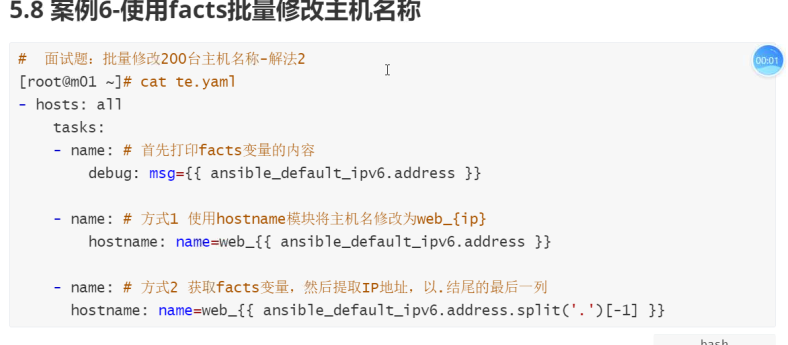

### facts变量性能优化

#### 关闭facts变量加速执行

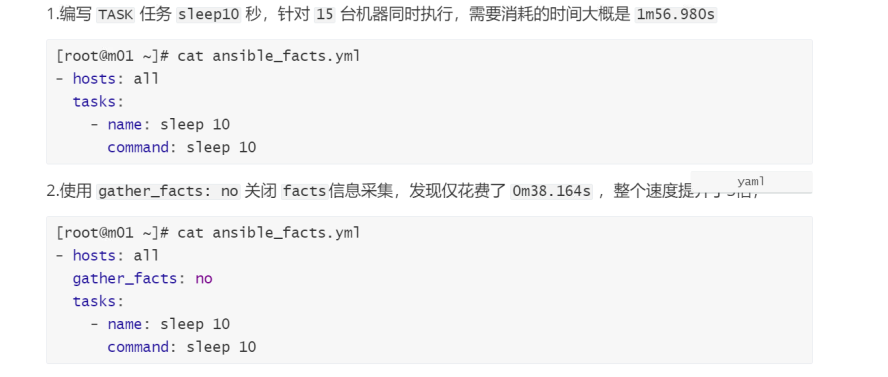

#### 缓存facts变量加速执行

当我们关闭facts以后能加速，但有时有需要用到其中的内容，可以设置facts缓存

```yaml
yum install python-pip
pip install redis
cat /etc/ansible/ansible.cfg
[defaults]
      # smart 表示默认收集 facts，但 facts 已有的情况下不会收集，即使用缓存 facts
      # implicit 表示默认收集 facts，要禁止收集，必须使用 gather_facts: False；
      # explicit 则表示默认不收集，要显式收集，必须使用gather_facts: Ture。
      gathering = smart #在使用 facts 缓存时设置为smart
      fact_caching_timeout = 86400
      fact_caching = redis
      fact_caching_connection =172.16.1.41:6379:1
      # 若 redis 设置了密码
      # fact_caching_connection =172.16.1.41:6379:1:passwd
#编写playbook测试
[root@m01 ~]# cat ansible_facts.yml -f 20
- hosts: all
  gather_facts: no
    tasks:
      - name: sleep 10
        command: sleep 1

```

## anisble Task control

### when条件语句

when 关键字主要针对 TASK任务进行判断，对于此前我们使用过的yum模块是可以自动检测软件包是否被安装，无需人为干涉;但对于有些任务则是需要进行判断才可以实现的。

比如: web 节点都需要配置nginx仓库，但其他节点并不需要，此时就会用到when判断。

比如: centos与ubuntu 都需要安装 Apache，而centos系统软件包为 httpd，而 ubuntu系统软件包为httpd2，那么此时就需要判断主机系统，然后为不同的主机系统安装不同的软件包。

#### 根据不同操作系统安装相同的软件

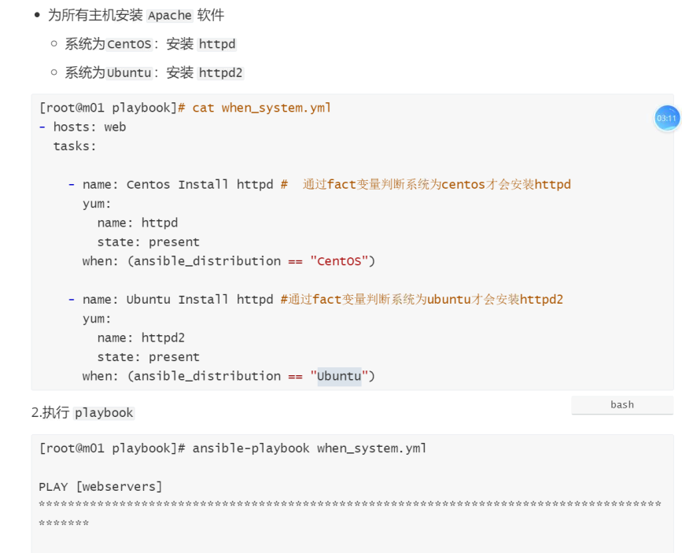

#### 为特定主机添加nginx仓库

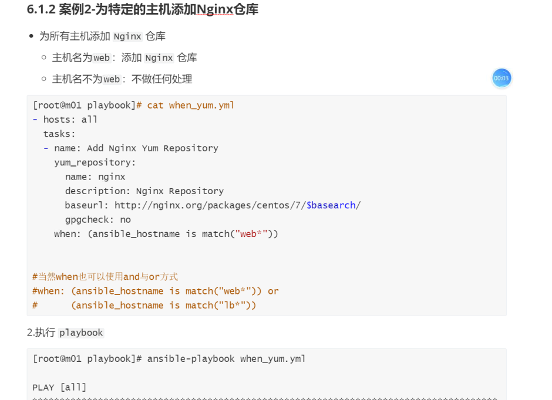

#### 判断服务是否正常运行


#### 为特定主机执行任务

### loop循环语句

在写 playbook的时候发现了很多task 都要重复引用某个相同的模块，比如一次启动10个服务，或者一次拷贝10个文件，如果按照传统的写法最少要写10次，这样会显得playbook很臃肿。如果使用循环的方式来编写playbook，这样可以减少重复编写task 带来的臃肿;

#### 模板

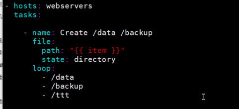

#### 使用循环批量启动服务

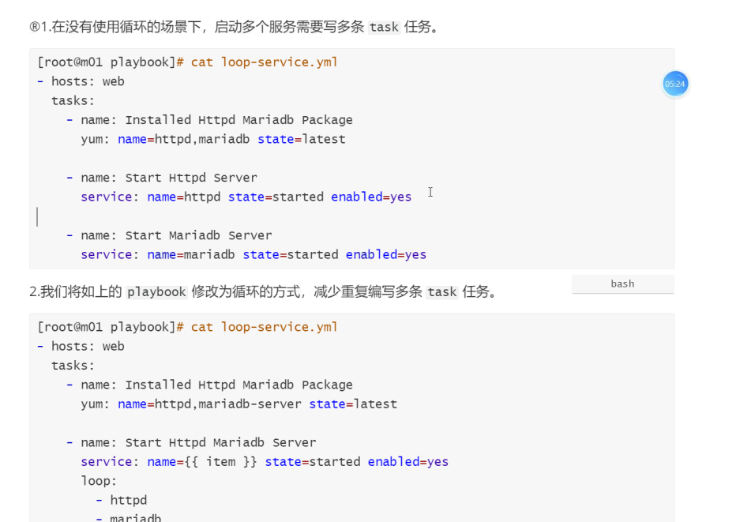

#### 循环批量安装软件

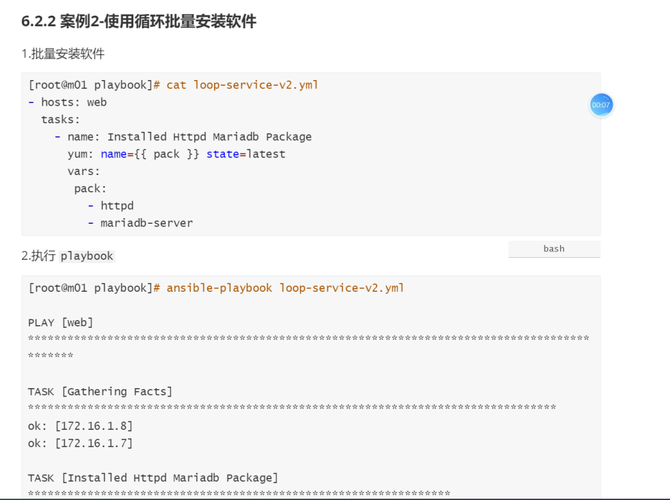

#### 循环批量创建用户

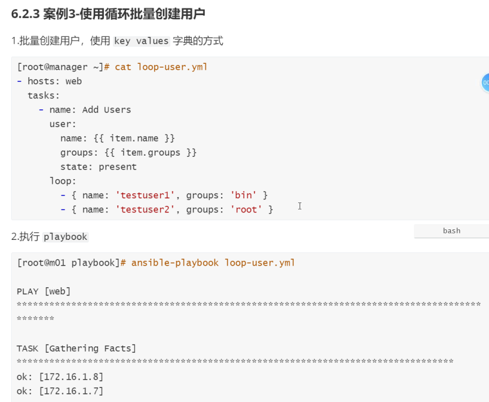

#### 循环批量拷贝文件

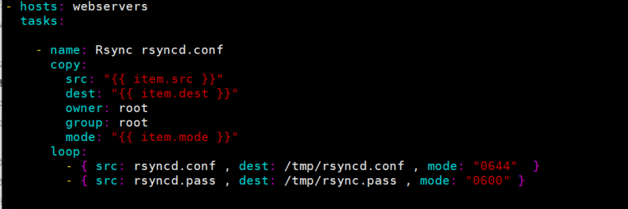

## hanlers和notify

Handlers是一个触发器，同时是一个特殊的tasks，它无法直接运行，它需要被tasks通知后才会运行。

比如: httpd 服务配置文件发生变更，我们则可通过Notify通知给指定的 handlers触发器，然后执行相应重启服务的操作，如果配置文件不发生变更操作，则不会触发Handlers任务的执行;

#### 变更服务配置触发重启

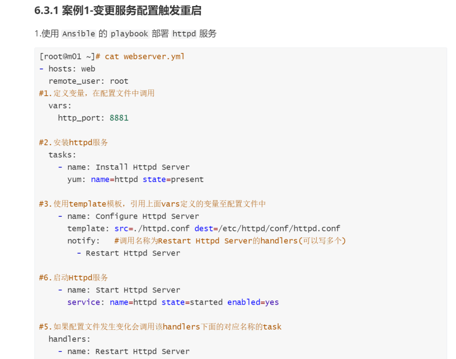

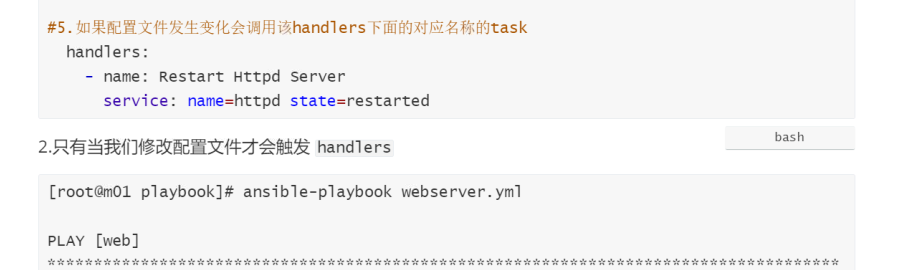

#### 变更服务配置触发通知

#### 注意事项和说明

1.无论多少个task通知了相同的 handlers，handlers仅会在所有tasks结束后运行一次

2.只有task 发生改变了才会通知handlers，没有改变则不会触发handlers

3.不能使用handlers替代 tasks、因为handlers是一个特殊的tasks

### tags任务标签

默认情况下，Ansible在执行一个playbook时，会执行 playbook 中所有的任务。而标签功能是用来指定要运行playbook中的某个特定的任务;

1.为 playbook添加标签的方式有如下几种:

对一个task打一个标签

对一个task打多个标签

对多个task 打一个标签.

2.task打完标签使用的几种方式

-t执行指定tag标签对应的任务

\--skip-tags执行除--skip-tags标签之外的所有任务

#### 指定执行某个tags

#### 执行排除某个tags

### include任务复用
