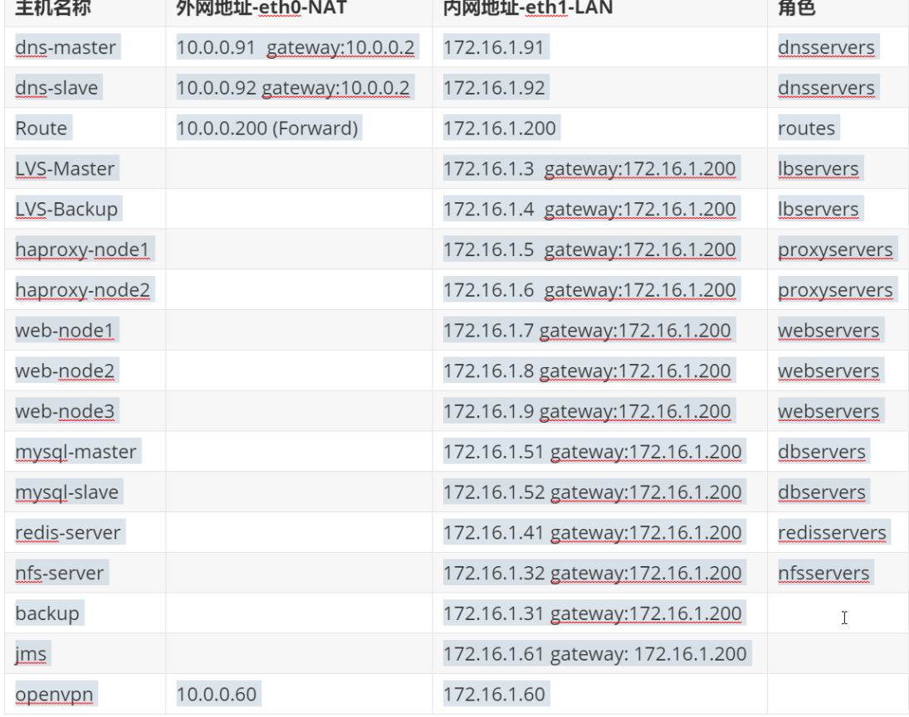
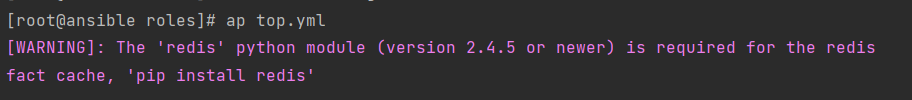
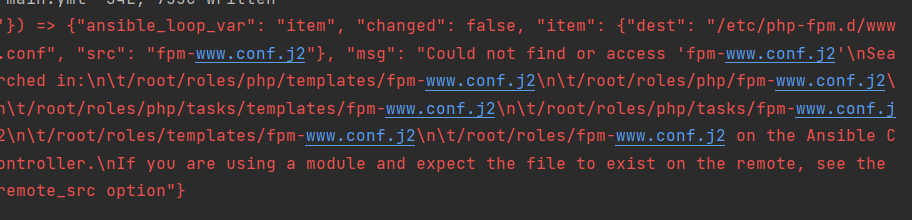
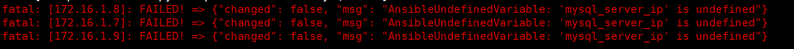

# 实验

## 目录

-   [集群服务器分布](#集群服务器分布)
    -   [ansible配置文件](#ansible配置文件)
    -   [主机配置（hosts）](#主机配置hosts)
    -   [共用的变量文件（group\_vars/all）](#共用的变量文件group_varsall)
    -   [初始化网络配置文件（network.yml）](#初始化网络配置文件networkyml)
    -   [执行文件（top.yml）](#执行文件topyml)
-   [基础操作（base）](#基础操作base)
    -   [推送密钥](#推送密钥)
    -   [测试互通性](#测试互通性)
    -   [设置防火墙（firewall.yml）](#设置防火墙firewallyml)
    -   [配置内核参数（kernem.yml）](#配置内核参数kernemyml)
    -   [配置文件描述符数量（limit.yml）](#配置文件描述符数量limityml)
    -   [创建用户组（user.yml）](#创建用户组useryml)
    -   [配置所需软件的仓库源（yum\_repository）](#配置所需软件的仓库源yum_repository)
    -   [安装所必需的软件（yum\_pkg.yml）](#安装所必需的软件yum_pkgyml)
    -   [主配置文件（main）](#主配置文件main)
-   [安装必要程序并配置文件](#安装必要程序并配置文件)
    -   [nginx](#nginx)
        -   [执行文件（tasks/main.yml）](#执行文件tasksmainyml)
        -   [触发器（handlers/main.yml）](#触发器handlersmainyml)
        -   [配置文件（templates/nginx.conf.j2）](#配置文件templatesnginxconfj2)
    -   [php-fpm](#php-fpm)
        -   [任务执行文件（tasks/main.yml）](#任务执行文件tasksmainyml)
        -   [触发器（handlers/main.yml）](#触发器handlersmainyml)
        -   [配置文件（templates）](#配置文件templates)
    -   [redis](#redis)
        -   [执行文件（tasks/main.yml）](#执行文件tasksmainyml)
        -   [触发器文件（handlers/main.yml）](#触发器文件handlersmainyml)
        -   [配置文件（templates）](#配置文件templates)
    -   [nfs-servers](#nfs-servers)
        -   [执行文件（tasks/main.yml）](#执行文件tasksmainyml)
        -   [触发器（handlers/main.yml）](#触发器handlersmainyml)
        -   [执行配置文件（templates）](#执行配置文件templates)
    -   [mariadb](#mariadb)
        -   [查询用户并删除](#查询用户并删除)
        -   [执行配置文件（tasks/main.yml）](#执行配置文件tasksmainyml)
    -   [haproxy](#haproxy)
        -   [执行文件（task/main.yml）](#执行文件taskmainyml)
        -   [触发器文件（handlers/main.yml）](#触发器文件handlersmainyml)
        -   [配置文件（templates）](#配置文件templates)
-   [配置高可用及负载均衡](#配置高可用及负载均衡)
    -   [keepalived](#keepalived)
        -   [执行文件（tasks/main.yml）](#执行文件tasksmainyml)
        -   [触发器文件（handlers/main.yml）](#触发器文件handlersmainyml)
        -   [配置文件（templates）](#配置文件templates)
    -   [lvs](#lvs)
        -   [处理依赖文件（meta/main.yml）](#处理依赖文件metamainyml)
        -   [执行文件（tasks/main.yml）](#执行文件tasksmainyml)
        -   [触发器文件（handlers/main.yml）](#触发器文件handlersmainyml)
        -   [配置文件（templates）](#配置文件templates)
        -   [四层负载lvs-devel](#四层负载lvs-devel)
            -   [执行文件（tasks/main.yml）](#执行文件tasksmainyml)
            -   [触发器（handlers/main.yml）](#触发器handlersmainyml)
            -   [配置文件（templates）](#配置文件templates)
-   [配置route及DNS](#配置route及DNS)
    -   [route](#route)
        -   [执行文件（task/main.yml）](#执行文件taskmainyml)
    -   [DNS](#DNS)
        -   [执行文件（tasks/main.yml）](#执行文件tasksmainyml)
        -   [触发器（handlers/main.yml）](#触发器handlersmainyml)
        -   [文件](#文件)
-   [部署代码](#部署代码)
    -   [blog-web(后端节点部署)\[blogfile\]](#blog-web后端节点部署blogfile)
        -   [代码压缩文件（files）](#代码压缩文件files)
        -   [依赖关系处理（meta/main.yml）](#依赖关系处理metamainyml)
        -   [执行文件（tasks/main.yml）](#执行文件tasksmainyml)
        -   [触发器文件（handlers/main.yml）](#触发器文件handlersmainyml)
        -   [配置文件（templates）](#配置文件templates)
    -   [blogproxy及https](#blogproxy及https)
        -   [依赖关系文件（meta/main.yml）](#依赖关系文件metamainyml)
        -   [执行文件（tasks/main.yml）](#执行文件tasksmainyml)
        -   [触发器文件（handlers/main.yml）](#触发器文件handlersmainyml)
        -   [配置文件（templates）](#配置文件templates)
-   [可能出现的问题](#可能出现的问题)
    -   [问题一](#问题一)
    -   [问题二](#问题二)
    -   [问题3](#问题3)



# 集群服务器分布

| 服务集群名称        | IP地址                             |
| ------------- | -------------------------------- |
| dnsservers    | 172.16.1.91，172.16.1.92          |
| routes        | 172.16.1.200                     |
| lbservers     | 172.16.1.3，172.16.1.4            |
| proxyservers  | 172.16.1.5，172.16.1.6            |
| webservers    | 172.16.1.7，172.16.1.8，172.16.1.9 |
| dbservers     | 172.16.1.51                      |
| redisservers  | 172.16.1.41                      |
| nfsservers    | 172.16.1.32                      |
| backupservers | 172.16.1.31                      |

> 📌一个共同属组变量文件-group\_vars

## ansible配置文件

```bash
[defaults]
inventory      = ./hosts
host_key_checking = False
forks          = 50

gathering = smart
fact_caching = redis
fact_caching_timeout = 86400
fact_caching_connection = localhost:6379
```

## 主机配置（hosts）

```yaml
[dnsservers]
172.16.1.91
172.16.1.92

[routes]
172.16.1.200

[lbservers]
172.16.1.3
172.16.1.4

[proxyservers]
172.16.1.5
172.16.1.6

[webservers]
172.16.1.7
172.16.1.8
172.16.1.9

[dbservers]
172.16.1.51

[redisservers]
172.16.1.41

[nfsservers]
172.16.1.32

[backupservers]
172.16.1.31
```

## 共用的变量文件（group\_vars/all）

```bash
#角色中需要用到的变量
#base
all_group: www
all_gid: 666
all_user: www
all_uid: 666
#nginx
nginx_conf_path: /etc/nginx/nginx.conf
nginx_include_dir: /etc/nginx/conf.d
nginx_include_path: /etc/nginx/conf.d/*.conf
# php
php_ini_path: /etc/php.ini
php_fpm_path: /etc/php-fpm.d/www.conf
session_method: redis
session_redis_path: "tcp://172.16.1.41:6379?weight=1&timeout=2.5"
fpm_max_process: 100
fpm_start_process: 10
fpm_min_spare_servers: 10
fpm_max_spare_servers: 50
#nfs
nfs_share_zrlog: /data/zrlog
nfs_share_blog: /data/blog
nfs_allow_ip: 172.16.1.0/24
#mariadb
mysql_super_user: ansible_app
mysql_super_pass: xiaoluozi
mysql_super_user_priv: '*.*:ALL'
mysql_allow_ip: '172.16.1.%'
mysql_server_ip: 172.16.1.51
#dns
dns_master_ip: 172.16.1.91
dns_slave_ip: 172.16.1.92
dns_zone_path: /var/named
xiaoluozi_top_zone_name: xiaoluozi.top.zone
# lvs
lvs_vip: 172.16.1.100
lvs_port_http: 80
lvs_port_https: 443
lvs_rs_network: lo:0
#blog
type_name: blog.xiaoluozi.top
type_path: /code/build
#haproxy
haproxy_include_path: /etc/haproxy/conf.d/
proxy_vip: 172.16.1.100
haproxy_port: 80


```

## 初始化网络配置文件（network.yml）

```bash
- hosts: all:!dnsservers:!routes  #除dns和routes以外的所有节点
  tasks:

    - name: Delete Gateway
      lineinfile:
        path: /etc/sysconfig/network-scripts/ifcfg-eth1
        regexp: '^GATEWAY='
        state: absent  #删除匹配到的网关

    - name: Delete DNS
      lineinfile:
        path: /etc/sysconfig/network-scripts/ifcfg-eth1
        regexp: '^DNS*'
        state: absent  #删除匹配到的dns

    - name: Add  DNS
      lineinfile:
        path: /etc/sysconfig/network-scripts/ifcfg-eth1
        line: "DNS1=223.5.5.5"   #网卡接入阿里dns


    - name: Add Gateway
      lineinfile:
        path: /etc/sysconfig/network-scripts/ifcfg-eth1
        line: "GATEWAY=172.16.1.200"  #加网关

    - name: Restart Network
      systemd:
        name: network
        state: restarted  #重启网卡

```

## 执行文件（top.yml）

```yaml
- hosts: all
  roles:
    - role: base
- hosts: webservers
  roles:
    - role: nginx
    - name: php
    - role: blogfile
- hosts: redisservers
  roles:
    - role: redis
- hosts: nfsservers
  roles:
    - role: nfs
- hosts: dbservers
  roles:
    - role: mariadb
- hosts: dnsservers
  roles:
    - role: dns
- hosts: routes
  roles:
    - role: route
- hosts: proxyservers
  roles:
    - role: haproxy

```

# 基础操作（base）

## 推送密钥

```bash
ssh-copy-id -i ~/.ssh/id_rsa.pub root@172.16.1.91
ssh-copy-id -i ~/.ssh/id_rsa.pub root@172.16.1.200
ssh-copy-id -i ~/.ssh/id_rsa.pub root@172.16.1.3
ssh-copy-id -i ~/.ssh/id_rsa.pub root@172.16.1.4
ssh-copy-id -i ~/.ssh/id_rsa.pub root@172.16.1.5
ssh-copy-id -i ~/.ssh/id_rsa.pub root@172.16.1.6
ssh-copy-id -i ~/.ssh/id_rsa.pub root@172.16.1.51
ssh-copy-id -i ~/.ssh/id_rsa.pub root@172.16.1.41
ssh-copy-id -i ~/.ssh/id_rsa.pub root@172.16.1.32
ssh-copy-id -i ~/.ssh/id_rsa.pub root@172.16.1.31

```

## 测试互通性

```bash
anisble all -m ping
```

## 设置防火墙（firewall.yml）

```bash
#关闭防火墙
- name: stop firewall
  systemd:
    name: firewall
    state: stopped
    enabled: no
#关闭内核防火墙
- name: disable selinux firewall
  selinux:
    state: disabled
```

## 配置内核参数（kernem.yml）

```bash
#该文件定义的参数可在/proc/sys文件夹内，或用sysctl -a查看
#定义链接端口范围
- name: change port range
  sysctl:
    name: net.ipv4.ip_local_port_range
    value: '1024 65000'
    sysctl_set: yes
#开启转发
- name: enabled forward
  sysctl:
    name: net.ipv4.ip_forward
    value: '1'
    sysctl_set: yes
#允许tcp回复转发
- name: enabled tcp_reuse
  sysctl:
    name: net.ipv4.tcp_tw_reuse
    value: '1'
    sysctl_set: yes

- name: Chanage tcp tw_buckets
  sysctl:
    name: net.ipv4.tcp_max_tw_buckets
    value: '5000'
    sysctl_set: yes

- name: Chanage tcp_syncookies
  sysctl:
    name: net.ipv4.tcp_syncookies
    value: '1'
    sysctl_set: yes

- name: Chanage tcp max_syn_backlog
  sysctl:
    name: net.ipv4.tcp_max_syn_backlog
    value: '8192'
    sysctl_set: yes

- name: Chanage tcp Established Maxconn
  sysctl:
    name: net.core.somaxconn
    value: '32768'
    sysctl_set: yes
    state: present

- name: Chanage tcp_syn_retries
  sysctl:
    name: net.ipv4.tcp_syn_retries
    value: '2'
    sysctl_set: yes
    state: present

- name: Chanage net.ipv4.tcp_synack_retries
  sysctl:
    name: net.ipv4.tcp_synack_retries
    value: '2'
    sysctl_set: yes
    state: present
```

## 配置文件描述符数量（limit.yml）

```bash
[root@ansible tasks]# vim limit.yml
- name: Change Limit /etc/security/limit.conf
  pam_limits:
    domain: "*"
    limit_type: "{{ item.limit_type }}"
    limit_item: "{{ item.limit_item }}"
    value: "{{ item.value  }}"
  loop:
    - { limit_type: 'soft', limit_item: 'nofile',value: '100000' }
    - { limit_type: 'hard', limit_item: 'nofile',value: '100000' }
#通过命令方式调整打开的文件数量，以及进程数都是临时操作，所以需要进行永久配置
#soft：软限制，超过则提示
#hard：硬限制，超过则停止
```

## 创建用户组（user.yml）

```bash
- name: create goup  #创建一个共同的用户组和用户
  group:
    name: "{{ all_group }}"
    gid: "{{ all_gid }}"

- name: create user
  user:
    name: "{{ all_user }}"
    uid: "{{ all_uid }}"
    group: "{{ all_group }}"
    create_home: no  #不要创建家目录
    shell: /sbin/nologin  #不允许登录系统
```

## 配置所需软件的仓库源（yum\_repository）

```bash
- name: Add Base Yum Repository  #基础源仓库
  yum_repository:
    name: base
    description: Base Aliyun Repository
    baseurl: http://mirrors.aliyun.com/centos/$releasever/os/$basearch/
    gpgcheck: yes
    gpgkey: http://mirrors.aliyun.com/centos/RPM-GPG-KEY-CentOS-7

- name: Add Epel Yum Repository  #epel源仓库
  yum_repository:
    name: epel
    description: Epel Aliyun Repository
    baseurl: http://mirrors.aliyun.com/epel/7/$basearch
    gpgcheck: no

- name: Add Nginx Yum Repository  #nginx源仓库
  yum_repository:
    name: nginx
    description: Nginx Repository
    baseurl: http://nginx.org/packages/centos/7/$basearch/
    gpgcheck: no

- name: Add PHP Yum Repository  #php源仓库（在国外）
  yum_repository:
    name: php71w
    description: php Repository
    baseurl: http://us-east.repo.webtatic.com/yum/el7/x86_64/
    gpgcheck: no


- name: Add Haproxy Yum Repository  #haproxy仓库源
  yum_repository:
    name: haproxy
    description: haproxy repository
    baseurl: https://repo.ius.io/archive/7/$basearch/
    gpgcheck: yes
    gpgkey: https://repo.ius.io/RPM-GPG-KEY-IUS-7
#配置所需应用的仓库源
```

## 安装所必需的软件（yum\_pkg.yml）

```bash
[root@ansible roles]# cat base/tasks/yum_pkg.yml
- name: Installed Packages All
  yum:
    name: "{{ item }}"
    state: present
  loop:
      - rsync
      - nfs-utils
      - net-tools
      - wget
      - tree
      - lrzsz
      - vim
      - unzip
      - httpd-tools
      - bash-completion
      - iftop
      - iotop
      - glances
      - gzip
      - psmisc
      - MySQL-python
      - bind-utils
#配置安装所必需的软件

```

## 主配置文件（main）

```bash
[root@ansible roles]# cat base/tasks/main.yml
- name: stop firewall
  include: firewall.yml
- name: kernel
  include: kernel.yml
- name: create user group
  include: user.yml
- name: limitsxiaanzhi
  include: limit.yml
- name: creste yum repo
  include: yum_repository.yml
- name: install app
  include: yum_pkg.yml

```

# 安装必要程序并配置文件

## nginx

### 执行文件（tasks/main.yml）

```bash
- name: install nginx
  yum:
    name: nginx
    enablerepo: nginx
    state: present
- name: copy nginx.conf
  template:
    src: nginx.conf.j2
    dest: '{{ nginx_conf_path }}'
  notify: restart nginx server #触发器
- name: start nginx
  systemd:
    name: nginx
    state: started
    enabled: yes
```

### 触发器（handlers/main.yml）

```bash
- name: restart nginx server
  systemcd:
    name: nginx
    state: restarted  #触发重启nginx任务

```

### 配置文件（templates/nginx.conf.j2）

```bash
user {{ all_user }};
worker_processes  {{ ansible_processor_vcpus }};

error_log  /var/log/nginx/error.log notice;
pid        /var/run/nginx.pid;

events {
    worker_connections  {{ ansible_processor_vcpus * 1024 }};
}


http {
    include       /etc/nginx/mime.types;
    default_type  application/octet-stream;
    log_format  main  '$remote_addr - $remote_user [$time_local] "$request" '
                      '$status $body_bytes_sent "$http_referer" '
                      '"$http_user_agent" "$http_x_forwarded_for" "$http_x_via"';

    access_log  /var/log/nginx/access.log  main;
    include {{ nginx_include_path }};
}
```

## php-fpm

### 任务执行文件（tasks/main.yml）

```yaml
[root@ansible roles]# cat php/tasks/main.yml
- name: install php-fpm
  yum:
    name: "{{ item }}"
    enablerepo: php71w
    state: present
  loop:
    - php71w-cli
    - php71w-common
    - php71w-devel
    - php71w-embedded
    - php71w-gd
    - php71w-mcrypt
    - php71w-mbstring
    - php71w-pdo
    - php71w-xml
    - php71w-fpm
    - php71w-mysqlnd
    - php71w-opcache
    - php71w-pecl-memcached
    - php71w-pecl-redis
    - php71w-pecl-mongodb
- name: Configure PHP php.ini php-fpm
  template:
    src: "{{ item.src }}"
    dest: "{{ item.dest }}"
  loop:
    - { src: php.ini.j2 , dest: "{{ php_ini_path }}" }
    - { src: php-www.conf.j2 ,dest: "{{ php_fpm_path }}" }
  notify: restart php server
- name: start php server
  systemd:
    name: php-fpm
    state: started
    enabled: yes

```

### 触发器（handlers/main.yml）

```yaml
[root@ansible roles]# cat php/handlers/main.yml
- name: restart php server
  systemd:
    name: php-fpm
    state: restarted
    enabled: yes

```

### 配置文件（templates）

[php.ini.j2](file/php.ini_A0Ids0abNR.j2 " php.ini.j2")

[php-www.conf.j2](file/php-www.conf_BbetriR6xN.j2 " php-www.conf.j2")

## redis

### 执行文件（tasks/main.yml）

```yaml
- name: install redis server
  yum:
    name: redis
    state: present
- name: copy redis.conf
  template:
    src: redis.conf.j2
    dest: /etc/redis.conf
    owner: redis
    group: root
    mode: '0640'
  notify: restart redis server
- name: start redis
  systemd:
    name: redis
    state: started
    enabled: yes

```

### 触发器文件（handlers/main.yml）

```yaml
- name: restart redis server
  systemd:
    name: redis
    state: restarted

```

### 配置文件（templates）

[redis.conf.j2](file/redis.conf_mWoIbbRhld.j2 " redis.conf.j2")

## nfs-servers

### 执行文件（tasks/main.yml）

```yaml
- name: install nfs server
  yum:
    name: nfs
    state: present
- name: copy nfs.conf
  template:
    src: exports.j2
    dest: /etc/exports
    owner: root
    group: root
    mode: "0644"
  notify: restart nfs server
- name: create nfs dir
  file:
    path: "{{ item }}"
    state: directory
    owner: "{{ all_user }}"
    group: "{{ all_group }}"
    mode: "0755"
    recurse: yes
  loop:
    - "{{ nfs_share_blog }}"
    - "{{ nfs_share_zrlog }}"
- name: start nfs server
  systemd:
    name: nfs
    state: started
```

### 触发器（handlers/main.yml）

```yaml
- name: restart nfs server
  systemd:
    name: nfs
    state: restarted
```

### 执行配置文件（templates）

[exports.j2](file/exports_6vwdx0M9pB.j2 " exports.j2")

## mariadb

### 查询用户并删除

```yaml
#查找用户及密码
  MariaDB [(none)]> select Host,user,Password from mysql.user;    
#删除指定用户及密码
  MariaDB [(none)]>  update   mysql.user   set Password = ''  where Host="localhost" and user="root" ;
#加载数据库数据
  MariaDB [(none)]> flush privileges;

```

### 执行配置文件（tasks/main.yml）

```yaml
[root@ansible roles]# cat mariadb/tasks/main.yml
- name: Installed Maraidb
  yum:
    name: "{{ item }}"
    state: present
  loop:
    - mariadb-server
    - mariadb

- name: Start Mariadb Server
  systemd:
    name: mariadb
    state: started
    enabled: yes

- name: Removes all anonymous user accounts
  mysql_user:
    name: ''
    host_all: yes
    state: absent

- name: Create Super User {{ mysql_super_user }}
  mysql_user:
    name: "{{ mysql_super_user }}"
    password: "{{ mysql_super_pass }}"
    priv:  "{{ mysql_super_user_priv }}"
    host: "{{ mysql_allow_ip }}"
    state: present

```

## haproxy

### 执行文件（task/main.yml）

```yaml
- name: Install Haproxy Server
  yum:
    name: haproxy22
    enablerepo: haproxy
    state: present

- name: Configure Haproxy Server
  template:
    src: haproxy.cfg.j2
    dest: /etc/haproxy/haproxy.cfg
  notify: restart haproxy server

- name: Create Haproxy Include Dir
  file:
    path: "{{ haproxy_include_path }}"
    state: directory

- name: Change Service Configure Add
  lineinfile:
    path: /usr/lib/systemd/system/haproxy.service
    insertafter: '^\[Service\]'
    line: 'Environment="CONFIG_D={{ haproxy_include_path }}"'

- name: Change Service Configure ExecStart
  lineinfile:
    path: /usr/lib/systemd/system/haproxy.service
    regexp: '^ExecStart='
    line: 'ExecStart=/usr/sbin/haproxy -Ws -f $CONFIG -f $CONFIG_D -p $PIDFILE $OPTIONS'

- name: Change Service Configure ExecStartPre
  lineinfile:
    path: /usr/lib/systemd/system/haproxy.service
    regexp: '^ExecStartPre='
    line: 'ExecStartPre=/usr/sbin/haproxy -f $CONFIG -f $CONFIG_D -c -q $OPTIONS'


- name: Start Haproxy Server
  systemd:
    name: haproxy
    state: started
    daemon_reload: yes
    enabled: yes

```

### 触发器文件（handlers/main.yml）

```yaml
- name: restart haproxy server
  systemd:
    name: haproxy
    state: restarted
```

### 配置文件（templates）

[haproxy.cfg.j2](file/haproxy.cfg_dg9vBuSGwH.j2 " haproxy.cfg.j2")

# 配置高可用及负载均衡

## keepalived

### 执行文件（tasks/main.yml）

```yaml
- name: install keepalived
  yum:
    name: keepalived
    state: present
- name: copy keepalived server
  template:
    src: keepalived.conf.j2
    dest: /etc/keepalived/keepalived.conf
  notify: restart keepalived server
- name: start keepalived server
  systemd:
    name: keepalived
    state: started
    enabled: yes
```

### 触发器文件（handlers/main.yml）

```yaml
- name: restart keepalived server
  systemd:
    name: keepalived
    state: restarted
```

### 配置文件（templates）

```yaml
global_defs {
    router_id {{ ansible_hostname }}
}

vrrp_instance VI_1 {


    state MASTER
    priority 200

    state BACKUP
    priority 100


    interface  eth1            # 绑定当前虚拟路由使用的物理接口；
    virtual_router_id 49            # 当前虚拟路由标识，VRID；
    advert_int 3                    # vrrp通告时间间隔，默认1s；
    #nopreempt
    authentication {
        auth_type PASS              # 密码类型，简单密码；
        auth_pass 1111              # 密码不超过8位字符；
    }

    virtual_ipaddress {
       {{ proxy_vip }}
    }
}

```

## lvs

### 处理依赖文件（meta/main.yml）

```yaml
dependencies:
 - { role: keepalived }
```

### 执行文件（tasks/main.yml）

```yaml
- name: install lpvsdam
  yum:
    name: ipvsadm
    state: present
- name: copy lvs files
  template:
    src:
    dest:
  notify: restart keepalived server
- name: start lvs
  systemd:
    name: keepalived
    state: started
    enabled: yes
```

### 触发器文件（handlers/main.yml）

```yaml
- name: restart keepalived server
  systemd:
    name: keepalived
    state: restarted
```

### 配置文件（templates）

[keepalived.conf.j2](file/keepalived.conf__PvJvgSOK8.j2 " keepalived.conf.j2")

### 四层负载lvs-devel

#### 执行文件（tasks/main.yml）

```yaml
- name: Configure VIP lo:0
  template:
    src: ifcfg-lo:0.j2
    dest: /etc/sysconfig/network-scripts/ifcfg-{{ lvs_rs_network }}
  notify: restart network

- name: Configure Arp_Ignore
  sysctl:
    name: "{{ item }}"
    value: '1'
    sysctl_set: yes
  loop:
    - net.ipv4.conf.default.arp_ignore
    - net.ipv4.conf.all.arp_ignore
    - net.ipv4.conf.lo.arp_ignore

- name: Configure Arp_Announce
  sysctl:
    name: "{{ item }}"
    value: '2'
    sysctl_set: yes
  loop:
    - net.ipv4.conf.default.arp_announce
    - net.ipv4.conf.all.arp_announce
    - net.ipv4.conf.lo.arp_announce

```

#### 触发器（handlers/main.yml）

```yaml
- name: restart network
  systemd:
    name: network
    state: restarted
```

#### 配置文件（templates）

[ifcfg-lo\_0.j2](file/ifcfg-lo_0_LC0JUVr46j.j2 " ifcfg-lo_0.j2")

# 配置route及DNS

## route

### 执行文件（task/main.yml）

```yaml
- name: Iptables SNAT Share Network
  iptables:
    table: nat
    chain: POSTROUTING
    source: 172.16.1.0/24
    jump: SNAT
    to_source: "{{ ansible_eth0.ipv4.address }}"


- name: Iptables DNAT Http 80 Port
  iptables:
    table: nat
    chain: PREROUTING
    protocol: tcp
    destination: "{{ ansible_eth0.ipv4.address }}"
    destination_port: '{{ lvs_port_http|int }}'
    jump: DNAT
    to_destination: "{{ lvs_vip }}:{{ lvs_port_http }}"

- name: Iptables DNAT Http 443 Port
  iptables:
    table: nat
    chain: PREROUTING
    protocol: tcp
    destination: "{{ ansible_eth0.ipv4.address }}"
    destination_port: '{{ lvs_port_https|int }}'
    jump: DNAT
    to_destination: "{{ lvs_vip }}:{{ lvs_port_https }}"

```

## DNS

### 执行文件（tasks/main.yml）

```yaml
- name: install bind sever
  yum :
    name: "{{ item }}"
    state: present
  loop:
    - bind
    - bind-utils  #安装bind服务
- name: copy named.conf
  template:
    src: named.conf.j2
    dest: /etc/named.conf
    owner: root
    roup: named
    mode: '0640'
  notify: restart bind server   #复制文件到dns服务器
- name: copy xiaoluozi.top.zone.j2
  template:
    src: xiaoluozi.top.zone.j2
    dest: "{{ dns_zone_path }}/{{ xiaoluozi_top_zone_name }}"
  when: ( ansible_hostname=="dns-master" )
  notify: restart bind server
- name: start bind server
  systemd:
    name: named
    state: started
    enabled: yes
```

### 触发器（handlers/main.yml）

```yaml
- name: restart bind server
  systemd:
    name: named
    state: restarted
```

### 文件

[named.conf.j2](file/named.conf_i1GrmBf6u4.j2 " named.conf.j2")

[xiaoluozi.top.zong.j2](file/xiaoluozi.top.zong_kr7wa4vnMT.j2 " xiaoluozi.top.zong.j2")

# 部署代码

## blog-web(后端节点部署)\[blogfile]

### 代码压缩文件（files）

[1.1-17.10.30-release.tar.gz](file/1.1-17.10.30-release.tar_AfTx1DMbuq.gz " 1.1-17.10.30-release.tar.gz")

### 依赖关系处理（meta/main.yml）

```yaml
dependencies:
 - { role: nginx }
 - { role: php-fpm }
```

### 执行文件（tasks/main.yml）

```yaml
- name: tar typecho code
  unarchive:
    src: 1.1-17.10.30-release.tar.gz
    dest: /code
- name: copy files
  template:
    src: xiaoluozi.top.conf.j2
    dest: /etc/nginx/conf.d/xiaoluozi.top.conf
  notify: restart nginx server
```

### 触发器文件（handlers/main.yml）

```yaml
- name: restart nginx server
  systemd:
    name: nginx
    state: restarted
```

### 配置文件（templates）

[config.inc.php](file/config.inc_HfKhdwKNYv.php " config.inc.php")

[xiaoluozi.top.conf.j2](file/xiaoluozi.top.conf_dxX_HcL4Vq.j2 " xiaoluozi.top.conf.j2")

## blogproxy及https

### 依赖关系文件（meta/main.yml）

```yaml
dependencies:
 - { role: haproxy }
```

### 执行文件（tasks/main.yml）

```yaml
- name: create ssl directory
  file:
    path: /etc/nginx/ssl
    state: directory
- name: copy ssl
  template:
    src: blog_key.pem.key
    dest: /etc/haproxy/ssl  
- name: typecho Haproxy Configure
  template:
    src: typecho.cfg.j2
    dest: "{{ haproxy_include_path }}/typecho.cfg"
  notify: restart haproxy server

```

### 触发器文件（handlers/main.yml）

```yaml
- name: restart haproxy server
  systemd:
    name: haproxy
    state: restarted
```

### 配置文件（templates）

[typecho.cfg.j2](file/typecho.cfg_ZiGp8fGJdL.j2 " typecho.cfg.j2")

[blog\_key.pem.key](file/blog_key.pem_xRgS9z4R7E.key " blog_key.pem.key")

# 可能出现的问题

## 问题一



> 该问题是由于开启了redis缓存而本机并没有redis服务，解决办法，

-   修改本角色中的ansible.cfg配置文件中的缓存设置的redis为远程redis机器
-   在本机安装python-pip插件安装redis或者直接yum install redis进行安装，启动redis的6379端口

## 问题二



该问题是文件未找到造成原因有：

1.  可能是文件放错位置
2.  文件名和任务里名称不一样
3.  没有这个文件

## 问题3



该问题是这个变量没有进行定义

解决方法：在变量文件中进行定义
