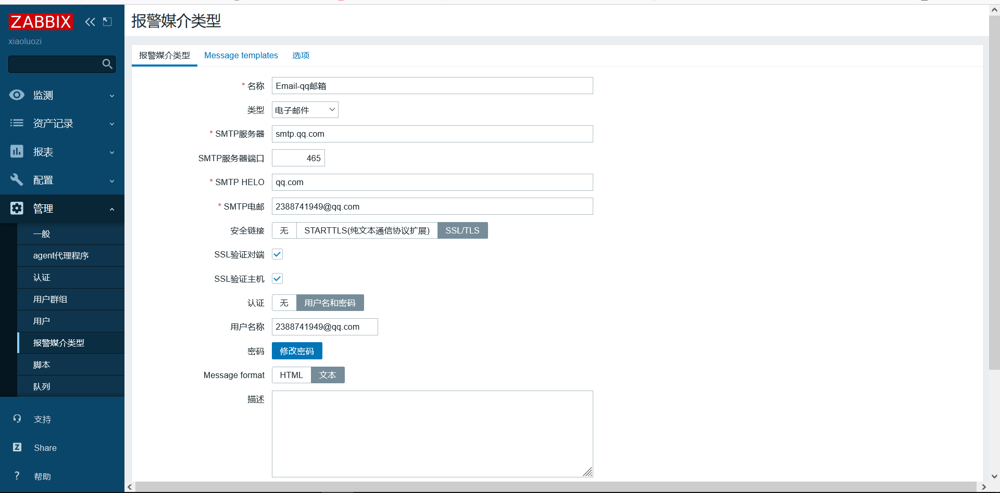
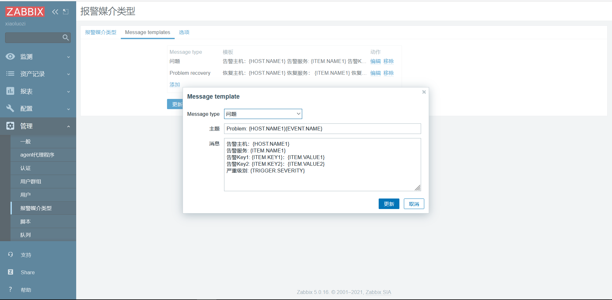
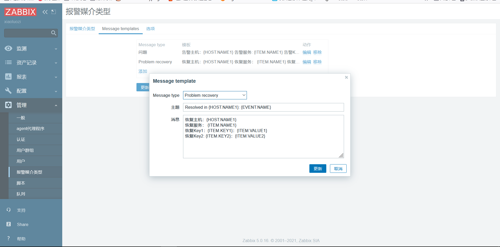
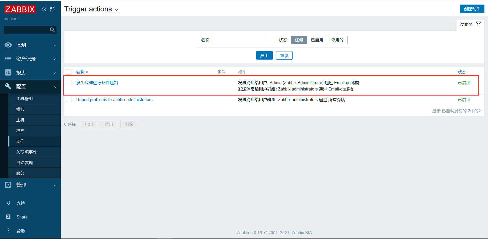
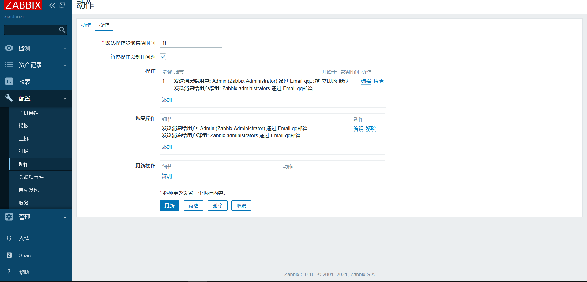
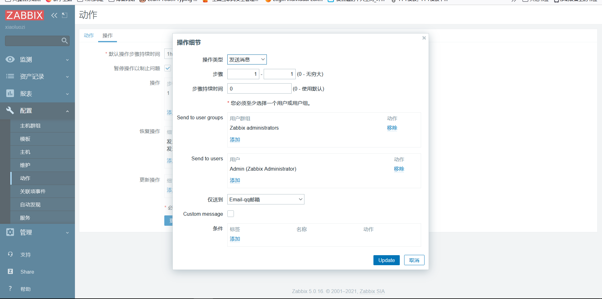
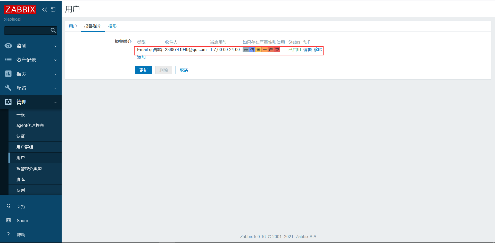
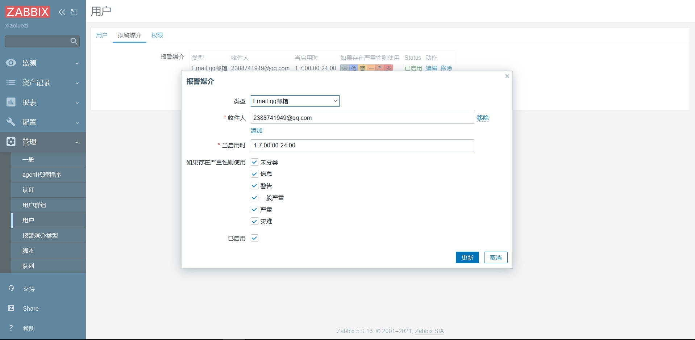

# ZABBI基础介绍

## 目录

-   [查看各类状态命令](#查看各类状态命令)
-   [zabbix主要功能组件](#zabbix主要功能组件)
    -   [agent2](#agent2)
    -   [server](#server)
    -   [database](#database)
    -   [web monitor](#web-monitor)
    -   [proxy](#proxy)
-   [zabbix安装](#zabbix安装)
-   [拆分数据库](#拆分数据库)
-   [修改监控的语言](#修改监控的语言)
-   [添加被控主机](#添加被控主机)
-   [添加服务报警](#添加服务报警)
    -   [配置邮件发送通知](#配置邮件发送通知)

## 查看各类状态命令

cpu：w、top、htop、glance

内存监控命令：free

磁盘命令：df、iotop（查看进程的读写）、iostat（查看分区的读写）

网络监控：ifconfig、route、glance、iftop、nethogs

tcp查看：ss -lntp  netstat -lntp   netstat -nt

## zabbix主要功能组件

### agent2

zabbix部署在监控目标上，用于主动监控本地资源和应用程序，并将收集的数据发送给zabbix server

### server

Zabbix server 是 Zabbix agent 向其报告可用性、系统
完整性信息的核心组件；

Zabbix server 主要用于存储所有配置信息、统计信息和
操作信息的核心存储库

### database

所有配置信息以及 Zabbix 收集到的数据都被存储在数据
库中

### web monitor

为了从任何地方或任何平台轻松访问 Zabbix ，我们提供
了基于 web 的界面。

该界面是 Zabbix server 的一部分，通常（但不一定）
和 Zabbix server 运行在同一台物理机器上。

### proxy

Zabbix proxy 可以替 Zabbix server 收集性能和可用性
数据。Zabbix proxy 是 Zabbix 环境部署的可选部分；
然而，它对于单个 Zabbix server 负载的分担是非常有
益的。

## zabbix安装

安装rpm包

```bash
rpm -Uvh https://repo.zabbix.com/zabbix/5.0/rhel/7/x86_64/zabbix-release-5.0-1.el7.noarch.rpm  #安装rpm包并配置官方源
yum clean all  #清除缓存
yum install mariadb mariadb-server#若有数据库可忽略
yum install zabbix-server-mysql zabbix-agent2  #安装服务端数据库以及agent2
yum-config-manager --enable rhel-server-rhscl-7-rpms  #启用默认软件集合
将配置文件  /etc/yum.repos.d/zabbix.repo的frontend源允许enabled=1
yum install zabbix-web-mysql-scl zabbix-nginx-conf-scl #安装zabbix的nginx和PHP

#创建初始数据库
mysql -uroot #进入数据库
mysql> create database zabbix character set utf8 collate utf8_bin;
mysql> create user zabbix@localhost identified by 'password';
mysql> grant all privileges on zabbix.* to zabbix@localhost;
mysql> quit; 

zcat /usr/share/doc/zabbix-server-mysql*/create.sql.gz | mysql -uzabbix -p zabbix #导入初始架构和数据，系统会让更改密码

修改/etc/zabbix/zabbix_server.conf配置文件中的DBPasswd=passwd配置数据库

编辑文件/etc/opt/rh/rh-nginx116/nginx/conf.d/zabbix.conf 打开监听80端口和域名解析

编辑配置文件/etc/opt/rh/rh-php72/php-fpm.d/zabbix.conf中的listen.acl_users = apache,nginx
systemctl restart zabbix-server zabbix-agent rh-nginx116-nginx rh-php72-php-fpm
systemctl enable zabbix-server zabbix-agent rh-nginx116-nginx rh-php72-php-fpm  #启动并加入开机自启动 

```

## 拆分数据库

本地数据库操作

```bash
mysqldump -uroot --database zabbix > zabbix.sql  #进行备份数据库
cat zabbix.sql|mysql -h 172.16.1.51 -uzabbix -pzabbix zabbix  #通过远程方式进行恢复数据库
scp -rp azbbix.sql root@172.16.1.51 #推送到远程主机进行恢复
进行远程主机操作
# 修改/etc/zabbix/zabbix_server.conf配置文件中数据库连接信息
DBHost=172.16.1.51
#重启zabbix-server服务
systemctl stop zabbix-server
systemctl start zabbix-server #先停后起，防止死机

# 修改/etc/zabbix/web/zabbix.conf.php配置文件中数据库连接信息
$DB['TYPE'] = 'MYSQL';
$DB['SERVER'] = '172.16.1.51';
$DB['PORT'] = '0';
$DB['DATABASE'] = 'zabbix';
$DB['USER'] = 'zabbix';
$DB['PASSWORD'] = 'zabbix';
#重启nginx和php服务

systemctl restart rh-nginx116-nginx rh-php72-php-fpm

```

远程数据库操作

```bash
yum install mariadb marisdb-server #安装数据库
mysql < zabbix.sql #将备份的数据库写入数据库中

```

## 修改监控的语言

系统默认语言：user settings———》Language

替换字体并解决乱码

```bash
zabbix存放字体的目录是:/usr/share/fonts/dejavu/DejaVuSans.ttf
将字体下载以后放入该目录，将名称替换为DejaVuSans.ttf（zabbix默认字体）即可
```

## 添加被控主机

```bash
首先被控端要下载agent
rpm -ivh https://mirrors.aliyun.com/zabbix/zabbix/5.0/rhel/7/x86_64/zabbix-agent2-5.0.15-1.el7.x86_64.rpm
配置/etc/zabbix/zabbix.agent2.conf文件中的server为能让zabbix服务端连接的网卡端口。在zabbix的web界面进行添加
```

## 添加服务报警

为实现发送和接受zabbix的通知就必须

定义媒介：（发件人）
配置动作：使用媒介像 （用户发送信息 ---》收件人）向已定义的媒介发送消息

动作由 ”触发器条件“ 和 ”操作“ 组成。总的说来，当条件满足时，则执行相应的操作。

### 配置邮件发送通知

首先要定义媒介就是发件人：单击管理→报警媒介类型，色号顶发送的介质为email







发送内容

```bash
#告警邮件
告警主机：{HOST.NAME1}
告警服务: {ITEM.NAME1}
告警Key1: {ITEM.KEY1}：{ITEM.VALUE1}
告警Key2: {ITEM.KEY2}：{ITEM.VALUE2}
严重级别: {TRIGGER.SEVERITY}
#恢复邮件
恢复主机：{HOST.NAME1}
恢复服务： {ITEM.NAME1}
恢复Key1：{ITEM.KEY1}：{ITEM.VALUE1}
恢复Key2: {ITEM.KEY2}：{ITEM.VALUE2}

```

配置动作（发送给谁）

配置→动作→创建动作。操作如下图







配置媒介（收件人）

管理→用户→报警媒介→选择类型→收件人邮箱




