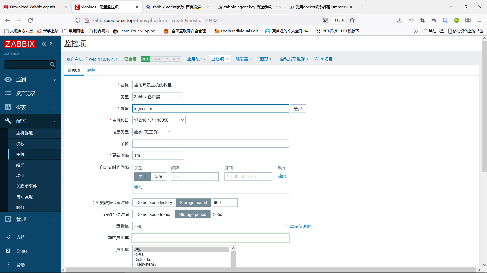
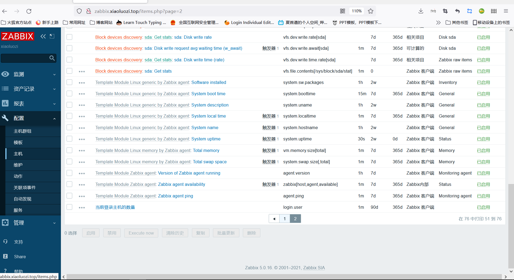
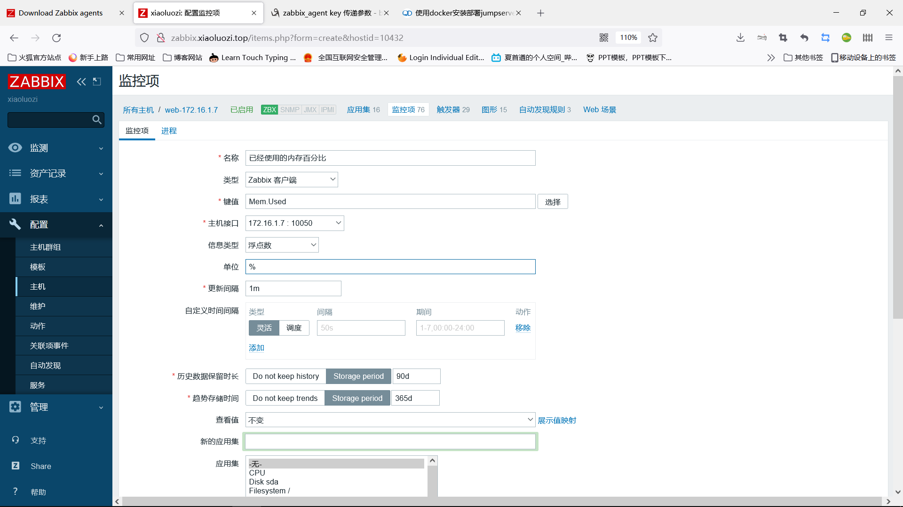
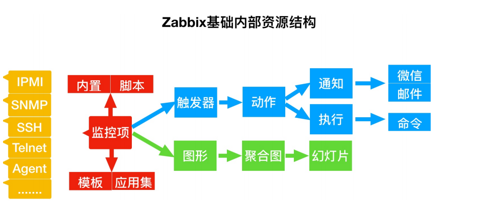

# zabbix自定义监控

## 目录

-   [什么是监控项](#什么是监控项)
    -   [创建监控项](#创建监控项)
-   [监控项的值映射](#监控项的值映射)
    -   [值映射配置](#值映射配置)
-   [自定义监控项](#自定义监控项)
    -   [操作步骤](#操作步骤)
-   [单位自定义监控项](#单位自定义监控项)
-   [传参监控项](#传参监控项)
    -   [tcp状态实践](#tcp状态实践)
-   [触发器](#触发器)
    -   [触发器严重性](#触发器严重性)
    -   [配置触发器](#配置触发器)
    -   [触发器表达式](#触发器表达式)
        -   [场景示例](#场景示例)
-   [触发器滞后](#触发器滞后)
    -   [示例](#示例)
-   [自定义触发器](#自定义触发器)
    -   [配置但条件触发器](#配置但条件触发器)
    -   [多条件配置触发器](#多条件配置触发器)
-   [触发器依赖关系2](#触发器依赖关系2)
-   [故障自愈](#故障自愈)
    -   [场景示例](#场景示例)
    -   [远程操作执行](#远程操作执行)
    -   [故障自愈实现场景](#故障自愈实现场景)
-   [图形](#图形)
    -   [自定义图形](#自定义图形)
-   [聚合图形](#聚合图形)
    -   [聚合图形轮播（ppt）](#聚合图形轮播ppt)
-   [模板](#模板)
-   [总结](#总结)

## 什么是监控项

主要用于采集主机的指标数据，一个监控项是一个独立的指标

如果需要监控CPU1分钟、5分钟、15分钟三个指标就需要定义三个监控项

### 创建监控项

在zabbix中创建一个监控项执行如下操作

1.  进入zabbix的web界面：配置—》主机
2.  在主机所在行单击监控项
3.  单机右上角的创建监控项
4.  输入表单中监控项的参数

也可以打开一个存在的监控项进行克隆，之后进行重命名保存

## 监控项的值映射

为了接收到的值能更“人性化”的显示，可以通过值映射方式，将数值与字符串之间进行关系绑定；

举个例子，一个监控项有值‘0’和‘1’能通过值映射，以认可读的形式表示值：

'0' ⇒ '不可用'

'1' ⇒ '可用'

或者,一组备份关系的值映射可以是:

'F' → '全量备份'

'D' → '差异备份'

'I' → '增量备份'

### 值映射配置

管理—》一般

下拉列表选择值映射

创建值映射

## 自定义监控项

监控主机当前登录主机的用户数。如何实现：

1.本机执行shell命令提取需要监控对象的值；

2.通过zabbix-agent2将其定义为一个监控项； （为这个值设定一个监控项的名称）

3.使用zabbix-get测试能否获取对应的值；

4.登录zabbix-web，为对应的主机添加对应的监控项；

### 操作步骤

主机测试

```bash
#获取指标数据
 who|wc -l  #获取当前主机的会话数量
#自定义监控项
vim /etc/zabbix/zabbix_agentd2.d/default.conf#添加命令到zabbix_agentd2.conf时格式为UserParameter=<key名称>,<shell command>
  UserParameter=login.user,who | wc -l  #login.user必须时主机中唯一的
#使用zabbix_agent2 -t命令进行测试此用户自定的参数
zabbix_agent2 -t login.user
login.user                                    [s|1]
systemctl restart zabbix-agent2  #重启zabbix-agent重载配置文件
#在服务端安装zbbix-get工具包获取监控端指标
 yum install zabbix-get -y
#使用zabbix_get -s IP -p port -k KeyName
  zabbix_get -s 172.16.1.7 -p 10050 -k login.user
1

```

在web页面添加监控项

第一步：点击配置→主机→监控项→创建监控项；

第二步：点击监测→最新数据→





## 单位自定义监控项

监控主机的内存使用百分比及剩余百分比

1.本机执行shell命令提取需要监控对象的值；

内存的使用百分比： free -m | awk '/^Mem/
{print \$3/\$2100}'\*
\*内存的剩余百分比：free -m | awk '/^Mem/
{print 100-(\$3/\$2100)}'

2.通过zabbix-agent2将其定义为一个监控项；

3.使用zabbix-get测试能否获取对应的值；

4.登录zabbix-web，为对应的主机添加对应的监控
项

```bash
#在/etc/zabbix/zabbix-agent2.d/下创建需要监控的数据命令
  [root@web7 ~]# cat /etc/zabbix/zabbix_agent2.d/userinfo.conf
    UserParameter=Mem.Used,free | awk '/^Mem/ {print $3/$2*100}'
    UserParameter=Mem.Ava,free | awk '/^Mem/ {print $NF/$2*100}'
systemctl restart zabbix-agent2  #重启让配置文件生效
#用服务端进行检查监控项
  [root@zabbix fonts]# zabbix_get -s 172.16.1.7 -p 10050 -k Mem.Used
  16.4633
  [root@zabbix fonts]# zabbix_get -s 172.16.1.7 -p 10050 -k Mem.Ava
  63.3643
仿照上个入门步骤导入监控数据
```



## 传参监控项

传参是为了让key接受对应的参数，从而完成多个监控项
创建的一种方式，传参的语法格式如下：`UserParameter=key[*],command`

```bash
#客户端写入配置文件
[root@web7 ~]# cat /etc/zabbix/zabbix_agent2.d/ping.conf
  UserParameter=ping[*],echo $1
#服务端进行测试
  zabbix_get -s 172.16.1.7 -p 10050 -k ping[sdkhdfghas]  #无论中括号填什么，返回的就是什么

```

复杂传参

```bash
  UserParameter=mysql.ping[*],mysqladmin -u$1 -p$2 ping | grep -c alive
#这个用户自定义参数可以用来监控 MySQL 数据库的状态。可以想下面的样式传入用户名和密码：
  mysql.ping[username,password,test]


```

### tcp状态实践

首先要在客户端进行传参操作，让服务端能直到要查询什么参数

`[root@web7 ~]# cat /etc/zabbix/zabbix_agent2.d/tcp.conf
`

`UserParameter=`tcp.status`[`\*`],netstat -ant | grep -c $1`

服务端进行测试

`zabbix_get -s 172.16.1.7 -p 10050 -k tcp.status[LISTEN,oho,ioijho]
`

`19`

## 触发器

当监控项的值发生变化后，对应的值不符合预期，则应该通过触发器来通知管理人员介入；

比如：监控tcp的80端口，如果存活则符合预期，如果不存活则不符合预期，应该通过触发器通知

### 触发器严重性

| **严重性** | **定义**   | **颜色** |
| ------- | -------- | ------ |
| 未分类     | 未知严重性    | 灰色     |
| 信息      | 提示       | 浅蓝色    |
| 警告      | 警告       | 黄色     |
| 一般严重    | 一般问题     | 橙色     |
| 严重      | 发生重要的事情  | 浅红色    |
| 灾难      | 灾难，财务损失等 | 红色     |

### 配置触发器

步骤：进入： 1.配置 → 主机

2.点击主机一行的 触发器

3.点击右上角的 创建触发器（或者点击触发器名称去修改一个已存在的触发器）

4.在窗口中输入触发器的参数

### 触发器表达式

| 函数名称                    | 作用                                                                                                                                               |
| ----------------------- | ------------------------------------------------------------------------------------------------------------------------------------------------ |
| &#xA;&#xA;   avg（）      | 监控项的平均值：&#xA;⇒ avg(#5) → 最新5个值的平均值&#xA;⇒ avg(1h) → 最近一小时的平均值&#xA;⇒ avg(1h,1d) → 一天前的一小时内的平均值                                                     |
| &#xA;&#xA;   min()      | 监控项的最小值&#xA;示例: CPU使用率最近5分钟的最小值大于&#xA;5 system.cpu.load.min(5m)>5&#xA;示例: CPU最近5次最小的值大于2&#xA;system.cpu.load.min(#5)>2                           |
| &#xA;   max()           | 监控项的最大值&#xA;⇒ max(#5) → 最新5个值的最大值&#xA;⇒ max(1h) → 最近一小时的最大值                                                                                      |
| &#xA;&#xA;  last（）      | 注意last的 #num 参数和在其它函数中的&#xA;作用不一样，例如:返回值 3, 7, 2, 6,9&#xA;last() 通常等同于 last(#1)&#xA;last(#5) - 第五个最新值 (不是五个最新值)&#xA;last(#2)将返回值为7，last(#5)返回值为9 |
| diff（）                  | 比对上一次文件内容                                                                                                                                        |
| &#xA;&#xA;&#xA;nodata（） | 监控一段时间内是否返回数据：时间不少&#xA;于30秒，因为timer处理器每30秒调用一次。&#xA;返回1 - 指定评估期没有接收到数据&#xA;返回0 - 其它                                                              |

#### 场景示例

处理器负载过高 ：`{`[www.zabbix.com](http://www.zabbix.com)`:`system.cpu.load`[all,avg1].`last()`}>`5

处理器负载大于5或者最近十分钟内最小值大于2：

`{`[www.zabbix.com](http://www.zabbix.com "www.zabbix.com")`:system.cpu.load[all,avg1].last()}>5 or {`[www.zabbix.com](http://www.zabbix.com "www.zabbix.com")`:system.cpu.load[all,avg1].min(10m)}>2`

监控文件是否被修改，当checksum值与最近的值不同时，表达式为ture：`{`[www.zabbix.com](http://www.zabbix.com "www.zabbix.com")`:vfs.file.cksum[/etc/passwd].diff()}=1`

最近5分钟，eth0接受字节数大于100kb时，表达式为真：`{`[www.zabbix.com](http://www.zabbix.com "www.zabbix.com")`:net.if.in[eth0,bytes].min(5m)}>100K`

当主机在三十分钟内超过5次不响应表示式为真：

`{www.zabbix.com:icmpping.count(30m,0)}>5`

比较今天和昨天同一时间的平均负载（第二个使用时间偏移参数）：

`{server:system.cpu.load.avg(1h)}/{server:system.cpu.load.avg(1h,1d)}>2`（如果差距超过两倍将触发）

如果表达式至少有两个触发器大于5触发触发器：

`({server1:system.cpu.load[all,avg1].last()}5) +({server2:system.cpu.load[all,avg1].last()}5)+({server3:system.cpu.load[all,avg1].last()}=2`

使用nodata()函数: 如果在180秒内没有接收到数据，则触发值变为异常状态：`{www.zabbix.com:tick.nodata(3m)}=1`

## 触发器滞后

有时我们需要触发器处于OK和问题状态之间的区间，而不是一个简单 ”阈值报警“ 就完事了。说白点就是一个报警触发器加一个恢复触发器。

### 示例

温度过高进行警报恢复则执行恢复表达式

问题表达式：大于20度报警：`{server:temp.last()}>=20`

恢复表达式：当温度小于或等于15c：`{server:temp.last()}<=15
`

磁盘剩余空间过低

问题：最近5分钟最大的值小于10G：`{server:vfs.fs.size[/,free].max(5m)}<10G`

恢复：最近10分钟最小的值大于40G：`{server:vfs.fs.size[/,free].min(10m)}>40G`

## 自定义触发器

自定义前提：触发器所触发的条件必须是该主机监控项中的一个选项，在被控端/etc/zabbix/zabbix-agent2.d/下添加监控项的conf文件

### 配置但条件触发器

设置内存低于 30% 进行告警，点击对应主机→ 创建触发器

首先设置监控内存的监控项，不然触发不了触发器

编辑表达式

问题表达式：`{web:Mem_pre.last()}<30`（当可用内存小于30时报警）

恢复表达式：`{web:Mem_pre.last()}>60`（当可用内存大于60恢复）

### 多条件配置触发器

首先确保监控项中有此触发器所有监控的选项

&#x20;自定义触发器：设置内存低于 30%并且swap使用大于1% 进行告警

首先添加swap监控项：

`[root@web7 ~]# cat /etc/zabbix/zabbix_agent2.d/awp.conf
UserParameter=Swap_pre,free -m|awk '/^Swap/{print $3*100/$2}'`

编辑触发器表达式

问题表达式：`{172.16.1.7:Mem.Ava.last()}<30 and {172.16.1.7:Swap_pre.last()}>1`

恢复表达式：`{172.16.1.7:Mem.Ava.last()}>30 and {172.16.1.7:Swap_pre.last()}<1`

测试：`dd if=/dev/zero of=/dev/null bs=300 Mcount=1024`只满足内存低于30%，所以不会警告

## 触发器依赖关系2

有时候一台主机的可用性依赖于另一台主机。如果一台路由器宕机，则路由器后端的服务器将变得不可用。如果这两者都设置了触发器，你可能会收到关于两个主机宕机的通知，然而只有路由器是真正故障的

例如：zabbix→路由器1→路由器2→主机

如果路由器1宕机，显然主机和路由器2也不可达，然而我们不想收到主机、路由器1和路由器2都宕机的3条通知。因此，在这种情况下我们定义了两个依赖关系：'主机宕机' 触发器依赖于 '路由器2宕机' 触发器

'路由器2宕机' 触发器依赖于 '路由器1宕机' 触发器

路由配置思路：首先在路由器1上配置监控路由器2的监控项和触发器，在路由器2上配置监控主机的监控项和触发器，如果主机宕机则触发器则传给路由器2，路由器1监控路由器2的监控项出现问题则对zabbix进行告警

## 故障自愈

当zabbix服务监控到指定的监控项异常时，可以通过指定的操作使故障自动恢复；

比如当运行的Nginx服务没有响应了，我们可以通过远程命令方式让其自动重启，已达到恢复的效果；

### 场景示例

使用IPMI“reboot”命令，重启那些不响应请求的远程服务器

自动释放空间不足的磁盘(删除旧文件，清理/tmp等)

根据CPU的负载情况，将虚拟机从一个物理机迁移到另一个物理机上

在CPU(磁盘、内存等)资源不足的情况下，向云环境添加新的节点

### 远程操作执行

配置远程命令的操作类似于发送消息，区别在于一个执行命令，一个发送消息；

远程命令可以直接在ZabbixServer, ZabbixProxyZabbixAgent上执行。

但在Zabbix agent和Zabbix proxy上，远程命令默认是不开启的，它们可以通过以下方式启用：

在agent配置中添加AllowKey=system.run\[ \*]UnsafeUserParameters=1参数；

在proxy配置中，将enableremotecomcommands参数设置为1；

### 故障自愈实现场景

描述：监控客户端TCP80端口。当端口不存货，通过远程执行命令方式尝试重启启动

## 图形

就是将zabbix监控到的数据以可视化图形的方式表现出来。让用户更容易了解到发生了什么事情

### 自定义图形

就是用户自己定制的功能，用户为某台主机，多塔主机或者某个模板创建自定义图表

## 聚合图形

就是将多张监控的图形整合到一张图形上

创建聚合图形步骤：监测→聚合图形→创建聚合图形

### 聚合图形轮播（ppt）

将多个聚合图形放到一个幻灯片中。然后进行轮播展示

操作步骤：检测→聚合图形→幻灯片→创建

## 模板

1.创建模板，模板得属于某个主机组(Templates)

2.在模板中创建监控项、图形、触发器

3.创建需要监控的主机，然后关联对应的模板

4.更改模板的监控项目，所以使用模板的都会自动更改

5.导出模板，后期可以至其他系统继续使用

## 总结


