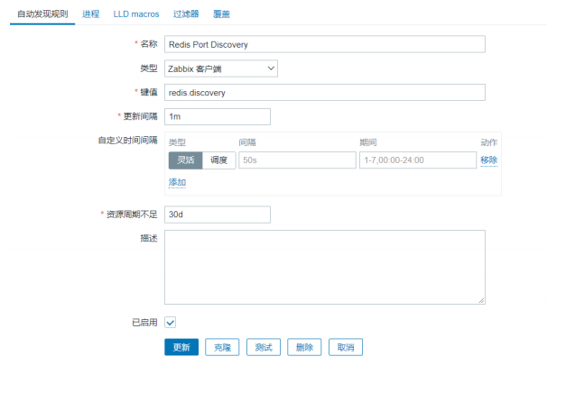

# zabbix自动化监控

## 目录

-   [自动化监控概述](#自动化监控概述)
    -   [网络发现（前提，客户端必须安装agent）](#网络发现前提客户端必须安装agent)
    -   [总结：](#总结)
-   [自动注册](#自动注册)
    -   [实践步骤](#实践步骤)
    -   [通过ansible进行自动注册监控](#通过ansible进行自动注册监控)
    -   [实践3-分不同主机进行关联模板](#实践3-分不同主机进行关联模板)
-   [主动模式和被动模式 ](#主动模式和被动模式-)
    -   [区别](#区别)
    -   [调为主动模式实践](#调为主动模式实践)
        -   [主被总结](#主被总结)
-   [LLD低级自动发现](#LLD低级自动发现)
    -   [发现规则](#发现规则)
    -   [监控原型](#监控原型)
-   [lld监控redis多实例实践](#lld监控redis多实例实践)
    -   [环境搭建](#环境搭建)
    -   [配置自动发现LLD](#配置自动发现LLD)
    -   [配置zabbix web](#配置zabbix-web)

## 自动化监控概述

自动化添加主机方式主要有两种：网络发现（network discovery）、自动注册（active agent auto-rgistration）

### 网络发现（前提，客户端必须安装agent）

主要分两个步骤：发现discovery和动作action

网络发现步骤

首先设置要遍历的网段

发现有Zabbix agent运行的主机

每10分钟执行一次

如果主机正常运行时间超过2分钟，添加主机；

如果主机停机时间超过24小时，删除主机；

将Linux主机添加到“Linux servers”组、链接模板Template OS Linux 到Linux主机

发现场景


发现步骤二

配置→动作→Discovery actions

“Zabbix agent”服务是“up”

system.uname(规则中定义的Zabbix agent键值)包含'Linux'

正常运行时间为2分钟（120秒）或更长


具体操作如下


### 总结：

网络发现虽然能发现并添加主机，但任然存在一些问
题：

1.发现时间长，效率较低； 1 2 3 4 5 6

2.扫描过程中容易漏扫；

3.当IP地址不固定难以实现；

4.无法实现不同类型主机关联不同模板； 7 tcpnginx zabbix\_Agent 51 tcp zabbix\_agent mysql

## 自动注册

自动注册（agent auto-registration）功能主要用于Agent主动向Server注册，与网络发现有同样的功能，但是这个功能更适用于云环境下，因为云环境下IP地址是随机的，难以使用网络发现方式实现；

1.注册时间短；

2.适用云复杂的环境，IP地址无规律；

3.关联不同的模板；

4.提高server性能；

过程：客户端通过用户配置的服务端IP地址，进行主动注册，直接把自己的信息进行上报主要分为两步：

1.自动注册。客户端必须开主动模式，并设定主机名称

2.在zabbix-web中配置一个自动注册的动作

#### 实践步骤

配置zabbixagent配置文件

每当活动agent刷新主动检查到服务器的请求时，都会进行自动注册尝试。

请求的延迟在agent的 RefreshActiveChecks参数中指定，第一个请求在agent重新启动后立即发送

```bash
[root@web01 ~]# vim /etc/zabbix/zabbix_agent2.conf
Server=172.16.1.71
ServerActive=172.16.1.71 # 设置主动模式
Hostname=web # 指定主机名，如不指定则服务器将使用agent的系统主机名命名主机

# 重启Agent
[root@web01 ~]# systemctl restart zabbix-agent2
```

配置zabbixserver

配置→动作→Autoregistration actions，添加动作


进行结果检查


### 通过ansible进行自动注册监控

首先编写ansible自动化注册的roles文件

任务文件(tasks)

```bash
- name: install zabbix
  yum:
    name: https://mirror.tuna.tsinghua.edu.cn/zabbix/zabbix/5.0/rhel/7/x86_64/zabbix-agent2-5.0.16-1.el7.x86_64.rpm
    state: present
    validate_certs: no
- name: copy zabbix-agent2.conf
  template:
    src: zabbix-agent.conf.j2
    dest: /etc/zabbix/zabbix_agent.conf
  notify: restart zabbix-agent2
- name: copy zabbix-agent.d files
  copy:
    src: scripts
    dest: /etc/zabbix/zabbix_agent.d/
  notify: restart zabbix-agent2
- name: start zabbix-agent2
  systemd:
    name: zabbix-agent2
    state: started
    enabled: yes
```

zabbix配置文件（templates）

```bash
Server=172.16.1.71
ServerActive=172.16.1.71 # 设置主动模式
Hostname=web # 指定主机名，如不指定则服务器将使用agent的系统主机名命名主机
```

触发器（handlers）

```bash
- name: restart zabbix-agent2
  systemd:
    name: zabbix-agent2
    state: restarted
```

files文件

就是将原来编写好的监控文件传过去

[scripts.zip](file/scripts_Li3AqhvLGG.zip " scripts.zip")

ansible.cfg

```bash
[defaults]
inventory      = ./hosts
host_key_checking = False
forks          = 50

gathering = smart
fact_caching = redis
fact_caching_timeout = 86400
fact_caching_connection = 172.16.1.41:6379
command_warnings=False

```

top.yml

```bash
- hosts: webservers
  roles:
    - role: zabbix_agent

```

### 实践3-分不同主机进行关联模板

需求：Linux主机关联Template OS Linux模板

Windows主机关联Template OS Windows模板

首先配置zabbix-agent2.conf文件

```bash
[root@web01 ~]# vim /etc/zabbix/zabbix_agent2.conf
Server=172.15.1.71
ServerActive=172.15.1.71
Hostname=web01
HostMetadataItem=system.uname#确保zabbix取得主机元数据包含linux和windows

[root@web01 ~]# systemctl restart zabbix-agent2

#Linux主机获取的元数据信息
#Linux: Linux server3 3.2.0-4-686-pae #1
SMP Debian 3.2.41-2 i686 GNU/Linux

#Windows主机获取的元数据信息
#Windows: Windows WIN-0PXGGSTYNHO 5.0.6001
Windows Server 2008 Service Pack 1 Intel IA-32

```

配置zabbix-server

第一个动作：
名称：Linux主机自动注册
条件：主机元数据似 Linux
操作：链接到模板：Template OS Linux

第二个动作：
名称：Windows主机自动注册
主机元数据似 Windows
操作：链接到模板：Template OS Windows

## 主动模式和被动模式&#x20;

默认情况下，zabbix server会直接去每个agent上抓取数据，对于 agent 来说，是被动模式，也是默认的一种获取数据的方式，但是当zabbix server监控主机数量过多的时候，由 Zabbix Server 端去抓取 agent 上的数据，Zabbix server会出现严重的性能问题，主要表现如下：

1）Web操作很卡，容易出现502错误
2）监控图形中图层断裂
3）监控告警不及时

如何解决呢? 可以使用主动模式，agent端主动汇报自己
收集到的数据给Zabbix Server，这样Zabbix Server就
会空闲很多。

### 区别

被动模式：Server轮询检测Agent。（领导找下属询问销售业绩，每隔一段时间询问一次）

主动模式：Agent主动上报给Server。（领导给下属分配任务，下属定期通知领导）

### 调为主动模式实践

agent2不支持主动模式，使用agent

修改zabbix\_agentd2.conf配置文件

```bash
[root@web01 ~]# vim /etc/zabbix/zabbix_agentd.conf
ServerActive=172.16.1.71 # 指定Agent收集的数据发送给谁
Hostname= # 要与zabbixweb中添加主机对应，否则会找不到主机
```

2.当开启agent主动发送数据模式，还需要在zabbix Server端修改如下两个参数，保证性能。

```bash
[root@zabbix-server ~]# vim /etc/zabbix/zabbix_server.conf
StartPollers=10 # zabbix Server主动采集数据进程减少一些。
StartTrappers=200 # 负责处理Agent推送过来数据的进程开大一些。
```

1.克隆一份被动模式监控项的模板

2.点击克隆后的模板->选中所有监控项->批量修改-zabbix客户端（主动式）

3.选择主机取消链接并清理被动模板，然后重新关联新”主动式“模板

#### 主被总结

当完成了主动模式的切换之后，可以持续观察zabbixserver的负载，应该会降低不少，其次在操作上也不卡了，图也不裂了，zabbix的性能也得到了较大的提升；

## LLD低级自动发现

### 发现规则

当我们查看 ”自动发现规则“ 的时候发现它定义了一个特殊的key，net.if.discovery，而这个 key 可以提取到主机所有的网卡名称

### 监控原型

通过 ”监控项原型“ 将 ”自动发现规则“ 中提取到的网卡名称依次传递给监控项，完成自动创建。


如果后期增加eth2网卡会自动添加对应的监控项，但移除eth2网卡并不会自动移除该网卡对应的监控项；

创建发现端口脚本：提取每台机器的端口，

键值：listen.tcp\[{#TCP\_PORT}]

监控脚本

```bash
[root@web7 zabbix_agent2.d]# cat tcp_port.sh
#!/usr/bin/env bash
port_arrary=($(ss -lntp | awk '{print $4}' | awk -F ':' '{print $NF}' | egrep "^[0-9]+$" | sort
| uniq| xargs))
length=${#port_arrary[@]} #统计数组个数：echo ${#array[@]}
printf "{\n"
printf "\t \"data\":[\n"
j=0
for i in ${port_arrary[@]}
 do

  j=$[ $j + 1 ]
  printf "\t\t{"
  if [ $j -eq ${length} ]; then
    printf  "\"{#TCP_PORT}\":\"${i}\"}\n"
   else
    printf "\"{#TCP_PORT}\":\"${i}\"},\n"
  fi
done
printf "\t]\n"
printf "}
```

创建键值：`UserParameter=port.discovery, /bin/bash/etc/zabbix/zabbix_agent2.d/discovery_port.sh`

重启zabbix-agent2

服务端测试：`zabbix_get -s 172.16.1.7 -k port.discovery`

```bash
[root@zabbix zabbix_agent2.d]# zabbix_get -s 172.16.1.7 -k tcp_status
{
         "data":[
                {"{#TCP_PORT}":"10050"},
                {"{#TCP_PORT}":"111"},
                {"{#TCP_PORT}":"17691"},
                {"{#TCP_PORT}":"199"},
                {"{#TCP_PORT}":"20048"},
                {"{#TCP_PORT}":"2049"},
                {"{#TCP_PORT}":"22"},
                {"{#TCP_PORT}":"25"},
                {"{#TCP_PORT}":"3306"},
                {"{#TCP_PORT}":"6007"},
                {"{#TCP_PORT}":"6379"},
                {"{#TCP_PORT}":"64726"},
                {"{#TCP_PORT}":"80"},
                {"{#TCP_PORT}":"8888"},
                {"{#TCP_PORT}":"9000"},
                {"{#TCP_PORT}":"9724"}
        ]
}

```

web为主机创建自动发现规则


创建监控项

名称：Check Port {#TCP\_PORT}

键值：net.tcp.listen\[{#TCP\_PORT}] #将端口号以此传递至该监控项中


web创建触发器


## lld监控redis多实例实践

监控配置

1.提取监控项（预留了两个传参位置，port，key）

2.发现规则，脚本，提取数据，封装特殊的监控项


### 环境搭建

安装redis服务：`yum install redis -y`

准备6379配置文件

```bash
[root@web_7 ~]# vim /opt/redis-7001.conf
bind 127.0.0.1
port 7001
daemonize yes
```

准备6380配置文件

```bash
[root@web_7 ~]# vim /opt/redis-7002.conf
bind 127.0.0.1
port 7002
daemonize yes
#启动redis服务
[root@web_7 ~]# redis-server /opt/redis-7001.conf
[root@web_7 ~]# redis-server /opt/redis-7002.conf
[root@web_7 ~]# netstat -lntp |grep redis
tcp 0 0 127.0.0.1:7001   0.0.0.0:* LISTEN 8908/redisserver
tcp 0 0 127.0.0.1:7002   0.0.0.0:* LISTEN 9042/redisserver

```

编写采集数据脚本

```bash
[root@web_7 ~]# cat /etc/zabbix/zabbix_agent2.d/redis_mutil_status.sh

#!/usr/bin/bash
port=$1
key=$2
redis-cli -p ${port} info | grep "\
<${key}\>" | awk -F ':' '{print $NF}'

# 测试脚本
#
/bin/bash/etc/zabbix/zabbix_agent2.d/redis_mutil_status.sh 7001 connected_clients
2
# /bin/bash
/etc/zabbix/zabbix_agent2.d/redis_mutil_status.sh 7002 connected_clients
1

```

创建自定义监控项

```bash
[root@web_7 ~]# cat /etc/zabbix/zabbix_agent2.d/redis_mutil_status.conf
UserParameter=rds.status[*],/etc/zabbix/zabbix_agent2.d/redis_mutil_status.sh "$1" "$2"
#重启zabbix-agent2
[root@web_7 ~]# systemctl restart zabbixagent2

```

服务端测试取值

```bash
[root@zabbix ~]# zabbix_get -s 172.16.1.7 -k rds.status[7001,connected_clients]
2
[root@zabbix ~]# zabbix_get -s 172.16.1.7 -k rds.status[7002,connected_clients]
1
```

### 配置自动发现LLD

编写发现规则脚本

```bash
[root@web_7 ~]# vim /etc/zabbix/zabbix_agent2.d/redis_mutil_discovery.sh
#!/usr/bin/bash
rds_port=($(netstat -lntp |grep redis | awk '{print $4}' | awk -F ':' '{print $NF}' | xargs))
length=${#rds_port[@]}

printf "{\n"
printf '\t'"\"data\":["

j=0
for i in ${rds_port[@]}
do
    j=$[ $j + 1 ]
    printf '\n\t\t{'
  if [ $j -eq ${length} ];then
    printf "\"{#PORT}\":\"${i}\"}"
  else
    printf "\"{#PORT}\":\"${i}\"},"
  fi
  done
    printf "\n\t]\n"
    printf "}\n"
 #执行脚本
 [root@web_7 ~]# sh /etc/zabbix/zabbix_agent2.d/redis_mutil_dis
covery.sh
{
    "data":[
        {"{#PORT}":"7001"},
        {"{#PORT}":"7002"}
    ]
}
```

创建发现规则监控项

```bash
[root@web_7 ~]# cat /etc/zabbix/zabbix_agent2.d/redis_mutil_discovery.conf
UserParameter=redis.discovery, sudo /bin/bash /etc/zabbix/zabbix_agent2.d/redis_mutil_discovery.sh

# 重启Agent
[root@web_7 ~]# systemctl restart zabbixagent2
```

服务端测试取值

```bash
[root@zabbix-server ~]# zabbix_get -s 172.16.1.7 -k redis.discovery
{
    "data":[
        {"{#PORT}":"7001"},
        {"{#PORT}":"7002"}
    ]
}
```

### 配置zabbix web

创建模板→自动发现→创建自动发现规则



创建监控项原型


创建触发器原型

```bash
# 故障表达式原型
{Redis Port 
Discovery:rds.status[{#PORT},used_memory].last()}/{Redis Port
Discovery:rds.status[{#PORT},total_system_memory].last()}*100 >=70

# 恢复表达式原型
{Redis Port 
Discovery:rds.status[{#PORT},used_memory].last()}/{Redis Port
Discovery:rds.status[{#PORT},total_system_memory].last()}*100 <=50
```


检查创建效果


测试告警并验证

```bash
[root@web_7 ~]# redis-cli -p 7001
127.0.0.1:7001> debug populate 15000000
```
