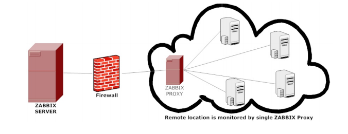
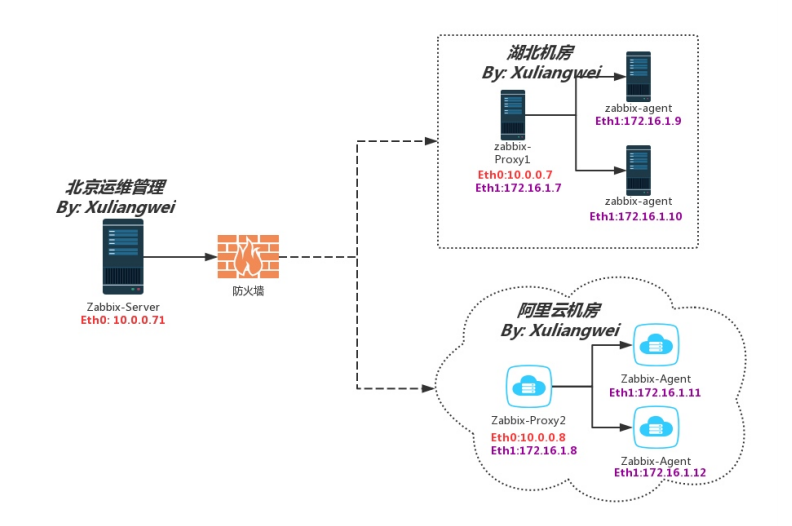
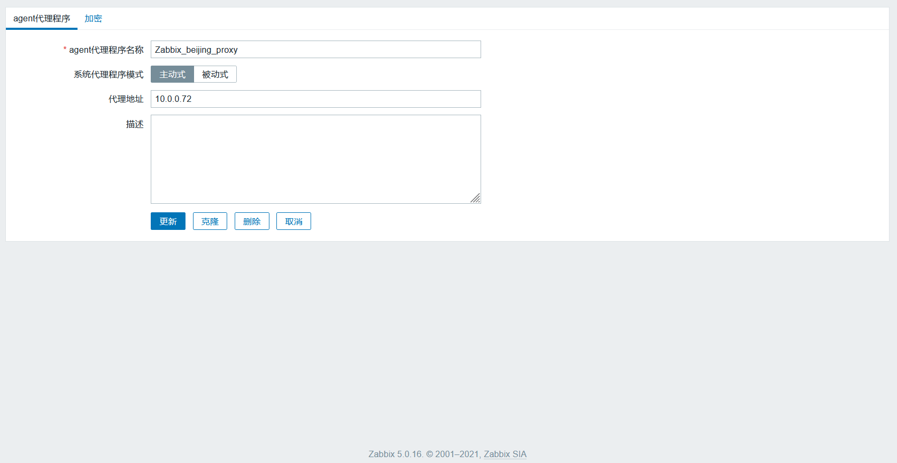
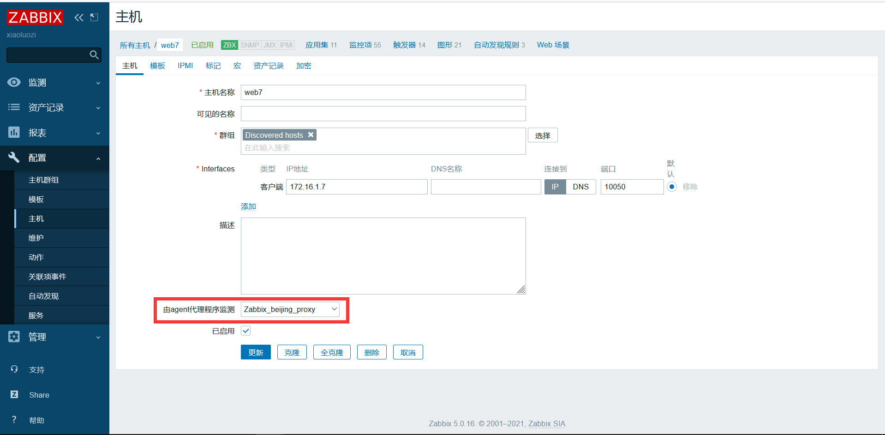
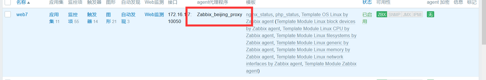

# 分布式及jvm

## 目录

-   [zabbix-proxy分布式](#zabbix-proxy分布式)
    -   [场景](#场景)
    -   [场景实践](#场景实践)
    -   [地址规划](#地址规划)

## zabbix-proxy分布式

### 场景

监控远程区域设备（当有多机房的情况）

监控上千设备时，（使用proxy减轻server 的负荷）

监控本地网络不稳定区域（跨网段造成网络抖动）

简化分布式监控的维护成本（分布式采集，集中管理并监控）



### 场景实践



### 地址规划

| 服务器           | ip公网      | 内网          |
| ------------- | --------- | ----------- |
| zabbix-server | 10.0.0.71 |             |
| zabbix-proxy  | 10.0.0.72 | 172.16.1.72 |
| zabbix-agent  | 10.0.0.7  | 172.16.1.7  |
| zabbix-agent  | 10.0.0.8  | 172.16.1.8  |

首先在proxy端下载proxy的服务

`yum localinstall https://mirrors.aliyun.com/zabbix/zabbix/5.0/rhel/7/x86_64/zabbix-server-pgsql-5.0.15-1.el7.x86_64.rpm`

数据库配置

```bash
yum install mariadb mariadb-server -y
systemctl enale mariadb && systemctl start mariadb
#登录数据库并进行设置
MariaDB [(none)]> create database zabbix_proxy default charset utf8;
MariaDB [(none)]> grant all on zabbix_proxy.* to zabbix_proxy@'localhost' identified by 'zabbix_proxy';
#导入zabbix数据
[root@zbx73 zabbix-server-mysql-5.0.15]# zcat create.sql.gz | mysql -uzabbix_proxy -pzabbix_proxy zabbix_proxy
#一共166张表
```

修改/etc/zabbix/zabbix\_proxy.conf文件

```bash
Server=10.0.0.71
DBHost=localhost
DBName=zabbix_proxy
DBUser=zabbix_proxy
DBPassword=zabbix_proxy
Timeout=30
ProxyLocalBuffer=1
ProxyOfflineBuffer=12
启动服务
systemctl enable zabbix-proxy
systemctl start zabbix-proxy
```

配置agent客户端

```bash
#安装agent
rpm -ivh https://mirrors.aliyun.com/zabbix/zabbix/5.0/rhel/7/x86_64/zabbix-agent-5.0.15-1.el7.x86_64.rpm
#配置配置文件
[root@web7 ~]# grep '^[a-Z]' /etc/zabbix/zabbix_agent2.conf
PidFile=/var/run/zabbix/zabbix_agent2.pid
LogFile=/var/log/zabbix/zabbix_agent2.log
LogFileSize=0
Server=172.16.1.72
ServerActive=172.16.1.72
Hostname=web7
Include=/etc/zabbix/zabbix_agent2.d/*.conf
ControlSocket=/tmp/agent.sock
UnsafeUserParameters=1
AllowKey=system.run[*]
systemctl enable zabbixagent2
systemctl start zabbixagent2
```

web界面创建proxy

管理→agent代理程序→创建代理（代理名称与proxy配置中Hostname一致）



web创建主机

配置主机-->创建主机-->主机名称（必须是Agent定义的Hostname），关联 Template OS Linux by Zabbix agent active 模板





