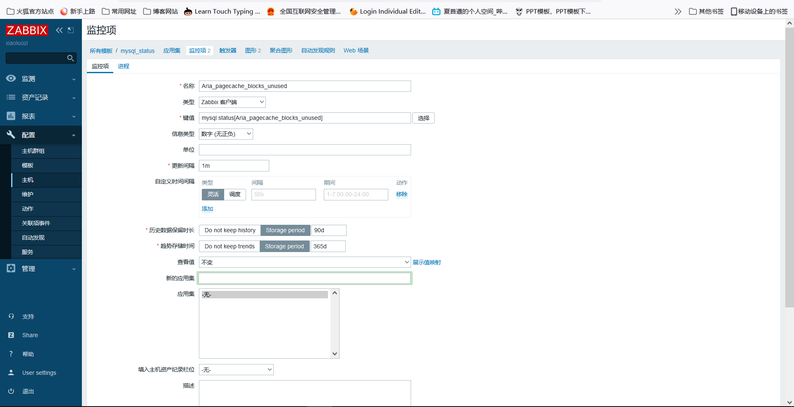

# zbbix服务监控

## 目录

-   [监控nginx状态内容](#监控nginx状态内容)
-   [监控实践](#监控实践)
    -   [编写nginx监控文件](#编写nginx监控文件)
-   [ 监控nignx错误日志实践](#-监控nignx错误日志实践)
-   [zabbix监控php](#zabbix监控php)
    -   [如何监控php状态](#如何监控php状态)
    -   [环境准备](#环境准备)
    -   [实践步骤](#实践步骤)
-   [zabbix监控MySQL](#zabbix监控MySQL)
-   [监控mysql主从模式](#监控mysql主从模式)
    -   [搭建主从环境](#搭建主从环境)

## 监控nginx状态内容

nginx状态（stub\_status）

监控进程存活，端口探测（设定触发器）

监控nginx访问日志（建议使用ELK）

监控nginx错误代码（设定触发器）

思路：

1.  启用nginx stud\_status状态模块
2.  使用curl命令获取stud\_status相关数据
3.  将获取nginx状态的数据方法凤凰装为监控项

## 监控实践

环境准备

| 角色            | 地址          |
| ------------- | ----------- |
| zabbix-server | 172.16.1.71 |
| web           | 172.16.1.76 |

### 编写nginx监控文件

```bash
[root@web7 zabbix_agent2.d]# cat /etc/nginx/conf.d/status.xiaoluozi.top.conf
server {
        listen 80;
        server_name status.xiaoluozi.top;

        location /ngx_status {
        stub_status;
        access_log off;
        allow 127.0.0.1;
        deny all;

}

}
```

在/etc/zabbix/zabbix-agent2.d/nginx\_status.sh编写zabbix监控状态取值脚本

```bash
#!/usr/bin/env bash
domain="HHost:status.xiaoluozi.top http://127.0.0.1/ngx_status"
case $1 in
  active)
    curl -s -${domain} | awk 'NR==1 {print $3}'
      ;;
  accepts)
    curl -s -${domain} | awk 'NR==3 {print $1}'
    ;;
  handlerd)
    curl -s -${domain} | awk 'NR==3 {print $2}'
    ;;
  requests)
    curl -s -${domain} | awk 'NR==3 {print $2}'
    ;;
  reading)
     curl -s -${domain} | awk 'NR==4 {print $2}'
     ;;
  writing)
    curl -s -${domain} | awk 'NR==4 {print $4}'
    ;;
  waiting)
    curl -s -${domain} | awk 'NR==4 {print $4}'
    ;;
  *)
    echo " please useage  {active | accepts | handled | requests | reading | writing | waiting }"
esac

```

在zabbix里添加自动义监控项

```bash
[root@web7 zabbix_agent2.d]# cat nginx_status.conf
  UserParameter=ngx.status[*],/bin/bash /etc/zabbix/zabbix_agent2.d/nginx_status.sh $1
  重启zabbix-agent2
```

在zabbix-web里创建模板监控项，监控到主机上

1.创建模板
2.创建监控项（创建7个监控项）
3.创建图形
4.创建触发器（设定监控项）
5.关联对应主机


测试脚本

```bash
[root@web_7 ~]# cat curl.sh
index=0
while true
do
    index=[ $index+1 ]
    for i in $(seq $(echo $RANDOM));
do
wget status.oldxu.net/test &&>/dev/null
#curl -HHost:status.oldxu.net http://10.0.0.7
done
  sleep 2
if [ $index -eq 200 ];then
      exit
    fi
done


```

## &#x20;监控nignx错误日志实践

首先要确定错误日志的位置

使用zabbix内置的log监控模块完成监控log\[file,\<regexp>,\<encoding>,\<maxlines>,\<mode>,\<output>,\<maxdelay>,\<options>]

file：文件绝对路径

regexp：要匹配的关键字，可以使用正则表达式

maxlines：发送的行数；默认配置文件定义为20行&#x20;

mode：可填参数：all（默认），skip（跳过旧数据）

output：自定义格式化输出，默认输出regexp匹配的整行数据

配置agent为主动模式

```bash
vim /etc/zabbix/zabbix_agent2.conf
ServerActive=172.16.1.71
systemctl restart zabbix-agent
```

在zabbix-web中添加监控项

键值：log\["/var/log/nginx/error.log", (error|alert|emerg|crit),,,skip,,,]

含义：监控/var/log/nginx/error.log日志文件中的error，alert，emerg关键行；

注意：zabbix对该日志文件需要有权限


配置触发器


触发器含义解释

```bash
表达式
{172.16.1.7:log["/var/log/nginx/error.log", (error|alert|emerg|crit),,,skip,,,].str(error)}=1 and
{172.16.1.7:log["/var/log/nginx/error.log", (error|alert|emerg|crit),,,skip,,,].nodata(60)}=0
#含义拆解（当匹配到error关键字，"并且" 日志有数据，则触发告警；）：
# 配到"error"关键字，表达式为真。
{web01:log["/var/log/nginx/error.log",
(error|alert|emerg),,,skip,,,].str(error)}=1
# 有数据产生则表达式为真，即60秒内如果没有新数据了，则表达式为假。
{web01:log["/var/log/nginx/error.log",
(error|alert|emerg),,,skip,,,].nodata(60)}=0

```

## zabbix监控php

1、监控php-fpm状态指标。

2、监控php-fpm端口。

3、监控php-fpm进程。

4、监控php错误日志；

### 如何监控php状态

1、启用php-fpm状态模块。
2、使用curl命令获取stub\_status的相关数据。
3、将获取php-fpm的状态数据方法封装为监控项。

> ⛔通过脚本获取端口或者zabbix自带的监控项实现

### 环境准备

| 角色            | IP          |
| ------------- | ----------- |
| zabbix-server | 172.16.1.71 |
| php           | 172.16.1.7  |

### 实践步骤

首先编写php配置文件，打开php的status监控文件

```bash
[root@web01 ~]# cat /etc/php-fpm.d/www.conf
....
pm.status_path = /fpm_status
....
```

配置php状态解析页面

```bash
[root@web7 conf.d]# cat php.xiaoluozi.top.conf
server {
        listen 80;
        server_name php.xiaoluozi.top;
        location /fpm_status {
        fastcgi_pass 127.0.0.1:9000;
        fastcgi_param  SCRIPT_FILENAME $document_root$fastcgi_script_name;
        include fastcgi_params;
}
}


```

测试能否进行取值

```bash
[root@web7 conf.d]# curl -s -HHost:php.xiaoluozi.top 127.0.0.1/fpm_status
pool:                 www
process manager:      dynamic
start time:           13/Oct/2021:09:13:52 +0800
start since:          5603
accepted conn:        72  #当前池接受的连接数
listen queue:         0  #请求队列。如果不为零需要进行增加fpm的进程数量（触发器）
max listen queue:     0  #请求队列最高的数量
listen queue len:     511  #socket等待队列长度
idle processes:       9  #空闲进程数量
active processes:     1 #活跃进程数量
total processes:      10 #总进程数量
max active processes: 1#最大的活跃进程数量（FPM启动开始计算）
max children reached: 0 #超过最大进程数的峰值的次数,如果不为0,需要调整进程的最大活跃进程数量
slow requests:        0

```

编写采取数值脚本

```bash
[root@web7 conf.d]# cat /etc/zabbix/zabbix_agent2.d/php_status.sh
#!/usr/bin/env bash
domain="php.xiaoluozi.top 127.0.0.1/fpm_status"

case $1 in
  accepted_conn)
    curl -s -HHost:${domain} | awk '/accepted conn:/ {print $NF}'
    ;;
  listen_queue)
    curl -s -HHost:${domain} | awk '/listen queue:/ {print $NF}'
    ;;
  max_listen_queue)
    curl -s -HHost:${domain} | awk '/max listen queue:/ {print $NF}'
    ;;
  active_processes)
    curl -s -HHost:${domain} | awk '/active processes:/ {print $NF}'
    ;;
  max_active_processes)
    curl -s -HHost:${domain} | awk '/max active processes:/ {print $NF}'
    ;;
  max_children_reached)
    curl -s -HHost:${domain} | awk '/max children reached:/ {print $NF}'
    ;;
  *)
    echo "USE $0 [accepted_conn|listen_queue|max_listen_queue|active_processes|max_active_processes|max_
children_reached]"
  ;;
esac
```

添加自定义的监控项

```bash
[root@web7 conf.d]# cat /etc/zabbix/zabbix_agent2.d/php_status.conf
UserParameter=fpm_status[*], /bin/bash /etc/zabbix/zabbix_agent2.d/php_status.sh $1
```

zabbix服务端测试取值

`zabbix_get -s 172.16.1.7 -k `fpm\_status`[accepted_conn]`

配置zabbix-web界面

1.创建模板


2.创建监控项


3.创建图形


4.创建触发器（监控php进程的存活）

5.关联对应主机


## zabbix监控MySQL

1、监控MySQL端口状态。

2、监控MySQL连接数，增删查改，流量等（通过showglobal status获取）

3、监控MySQL主从状态。（从库上监控）

监控数据库命令：`mysql -uroot -poldxu.net -e 'show global status'`

从中取出以下几个参数：

```bash
Threads_connected：连接数
Com_select：查询总量
Com_insert：插入总量
Com_update：更新总量
Com_delete：删除总量
Bytes_received: 流入总流量
Bytes_sent：流出总流量
Slow_queries：慢查询总量
```

环境准备

| 角色            | IP          |
| ------------- | ----------- |
| zabbix-server | 172.16.1.71 |
| mysql         | 172.16.1.51 |

编写监控脚本

```bash
[root@web7 zabbix_agent2.d]# cat /etc/zabbix/zabbix_agent2.d/mysql_status.sh
#!/usr/bin/env bash
key=$1 #定义变量，用户输入的选项进行传参
mysql  -uroot -pxiaoluozi  -e "show global status" | grep "\<${key}\>" | awk '{print $2}'
给脚本加上执行权限
chmod +x /etc/zabbix/zabbix_agent2.d/mysql_status.sh
```

添加自定义的监控项

```bash
[root@web7 zabbix_agent2.d]# cat mysql_status.conf
UserParameter=mysql.status[*], /bin/bash /etc/zabbix/zabbix_agent2.d/mysql_status.sh $1
重启zabbix-agent2
```

服务端测试取值

`zabbix_get -s 172.16.1.7 -k mysql.status[Table_locks_immediate]`

在zabbix-web界面上进行配置模板

1.创建模板


2.创建监控项（根据业务需求添加）



3.创建图形


4.关联对应主机


编写测试脚本

```bash
# 执行该脚本后，可以通过图形观测是否能正常监控MySQL的增、删、查、改等状态
[root@web01 ~]# cat mysql.sh
#!/usr/bin/bash
for i in {1..1000}
do

Var=$(echo $RANDOM)
Var2=$(echo $RANDOM)
mysql -uroot -h 127.0.0.1 -e "create database IF NOT EXISTS zabbix_db;
      use zabbix_db;
      DROP TABLE IF EXISTS test${i};
      create table test${i}(id int);
      insert into zabbix_db.test${i} values(${Var});
      update zabbix_db.test${i} set id=${Var2} where id=${Var};
      select * from zabbix_db.test${i};
      delete from zabbix_db.test${i} where id=${Var2};"
done

```

## 监控mysql主从模式

### 搭建主从环境

| 角色     | IP       |
| ------ | -------- |
| master | 10.0.0.8 |
| slave  | 10.0.0.7 |

两台机器全部装上mariadb

`yum install mariadb  mariadb-server -y`

配置主服务器(master)。增加以下内容

```bash
[root@web01 ~]# vim /etc/my.cnf
[mysqld]
log-bin=mysql-bin # 启用二进制日志
server-id=8 # 服务器唯一标识
[root@web01 ~]# systemctl restart mariadb
操作从服务器之后操作以下步骤
#创建并授权一个slave账户，并提取mysql-binlog的位置点
MariaDB [(none)]> grant replication slave on *.* to 'rep'@'%' identified by '123';
#查看master位置点
MariaDB [(none)]> show master status;
+------------------+----------+------------
--+------------------+
| File | Position |
Binlog_Do_DB | Binlog_Ignore_DB |
+------------------+----------+------------
--+------------------+
| mysql-bin.000003 | 245 |
| |
+------------------+----------+------------
--+------------------+


```

配置从服务器，增加如下内容

```bash
[root@web02 ~]# vim /etc/my.cnf
  [mysqld]
  log-bin=mysql-bin # 启用二进制日志（不是必须）
  server-id=7 # 服务器唯一标识
[root@web01 ~]# systemctl restart mariadb
配置从服务器链接主服务器
MariaDB [(none)]> change master tomaster_host='172.16.1.8',master_user='rep',master_password='123',master_log_file='mysql-bin.000001',master_log_pos=383;

```

检查主从复制状态

```bash
MariaDB [(none)]> slave start;
MariaDB [(none)]> show slave status\G
*************************** 1. row
***************************
Slave_IO_Running: Yes # 从库通过IO线程将主库上的日志复制到自己的中继日志
Slave_SQL_Running: Yes # 从库通过SQL线程读取中继日志中的事件，在本地重放
Seconds_Behind_Master: 0 # slave落后master的秒数
```

监控主从的脚本

```bash
[root@web01 ~]# vim /etc/zabbix/zabbix_agent2.d/mysql_slave_status.sh
#!/usr/bin/bash
key=$1
mysql -uroot -poldxu.com -e "show slave status\G"|grep "${key}"|awk '{print $2}'
#脚本赋予执行权限并进行执行

[root@web01 ~]# chmod +x /etc/zabbix/zabbix_agent2.d/mysql_slave_status.sh
[root@web01 ~]#/etc/zabbix/zabbix_agent2.d/mysql_slave_status.sh Slave_SQL_Running
Yes
[root@web01 ~]#/etc/zabbix/zabbix_agent2.d/mysql_slave_status.sh Slave_IO_Running
Yes

```

添加自定义监控项

```bash
[root@web01 ~]# cat /etc/zabbix/zabbix_agent2.d/mysql_slave_status.conf
UserParameter=mysql.slave.status[*], /bin/bash /etc/zabbix/zabbix_agent2.d/mysql_slave_status.sh "$1"
# 重启zabbix-agent2
[root@web01 ~]# systemctl restart zabbixagent2

```

服务端测试取值

&#x20;`zabbix_get -s xx -k mysql.slave.status[Slave_SQL_Running|Slave_IO_Running|Seconds_Behind_Master]`

配置zabbix-web

触发器一：两个状态都要为yes

```bash
{Template MySQL Slave {Template MySQL SlaveStatus:mysql.slave.status[Slave_IO_Running].str(Yes)}=0 or 
{Template MySQL SlaveStatus:mysql.slave.status[Slave_SQL_Running].str(Yes)}=0
```

触发器二：延时不超过5s

```bash
{Template MySQL SlaveStatus:mysql.slave.status[Seconds_Behind_Master].last()}>=50

```

测试

```bash
# slave节点执行
MariaDB [(none)]> create database oldxu;
# master节点执行
MariaDB [(none)]> create database oldxu;
```

恢复

```bash
# slave节点故障恢复；
MariaDB [(none)]> set global sql_slave_skip_counter=1;
MariaDB [(none)]> stop slave;
MariaDB [(none)]> start slave;
```
