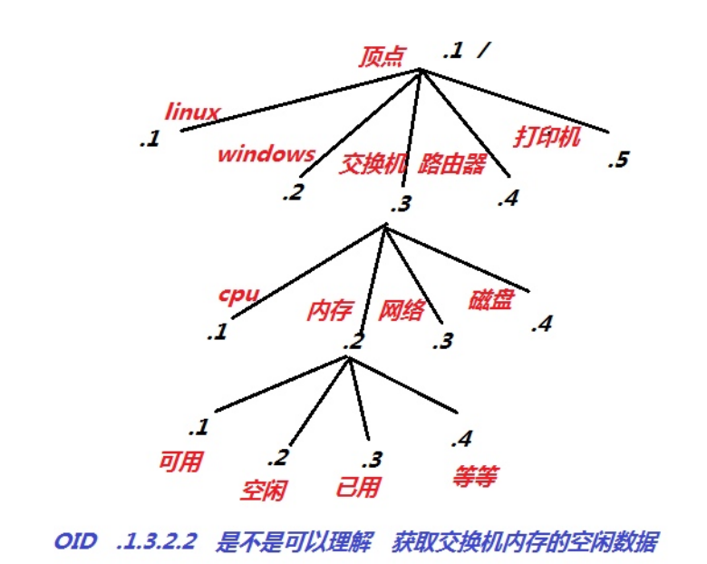
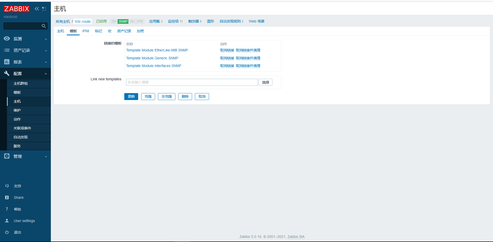
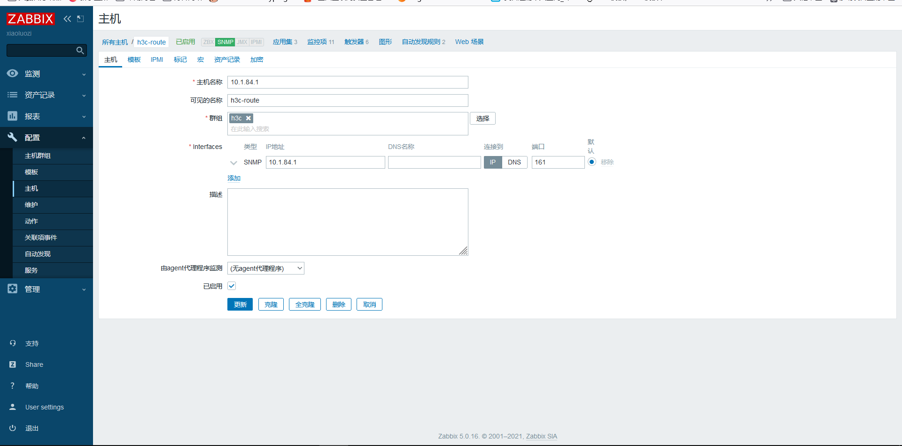

# 监控网络-SNMP结构

## 目录

-   [SNMP监控网络设备](#SNMP监控网络设备)
    -   [基本名次解释](#基本名次解释)
    -   [步骤](#步骤)
    -   [snmp监控实践](#snmp监控实践)
-   [zabbix检测web](#zabbix检测web)

## SNMP监控网络设备

snmp全称（simple network manager protocol）即简单网管理协议

### 基本名次解释

OID:

内存的大小：.1.3.6.1.2.1.25.2.2.0

内存剩余大小：.1.3.6.1.2.1.25.2.2.1

任何一个指标在snmp中都有一个唯一的值进行表示，而oid排列顺序是以树状信息排列



MIB

MIB库：统计所有的old库（国际标准）

比如：通过 hrMemorySize.0获取内存信息

可以理解MIB是域名，比较好记忆。 OID是IP地址，不太好记忆

版本

v1：不支持加密，任何人都可以取值, 不安全

v2：简单加密版，通过口令才可以取值，通过community设定口令（使用最多）

v3：复杂加密，采集效率比较低

### 步骤

开启路由器SNMP功能。设置团体名称（设备管理→SNMP）

配置zabbix-web监控

单机配置→主机→添加主机→选择类型为snmp，输入路由器色湖北的IP地址

添加以下三个模板





### snmp监控实践


客户端安装snmp服务

```bash
yum install net-snmp netsnmp-utils -y
#服务配置
[root@web01 ~]# vim /etc/snmp/snmpd.conf
#public是默认的团体名称，建议修改
com2sec notConfigUser default oldxu

#限制丛树杈哪个地方开始取值，如果需要监控的信息，设置.1从顶点开始
view systemview included .1
#启动服务并加入开机自启动
systemctl enable snmpd.service
systemctl start snmpd.service
```

服务端操作

```bash
# linux oid 参考地址：
https://www.iteye.com/blog/yeluotiying2112079
# 服务端安装snmp工具
[root@zabbix-server ~]# yum install netsnmp-utils -y

# OID获取数据方式
[root@zabbix-server ~]# snmpwalk -v2c -c oldxu 172.16.1.7 .1.3.6.1.2.1.25.2.2.0
HOST-RESOURCES-MIB::hrMemorySize.0 = INTEGER: 2030168 KBytes
# MIB获取数据方式
[root@zabbix-server ~]# snmpwalk -v2c -c oldxu 172.16.1.7 hrMemorySize.0
HOST-RESOURCES-MIB::hrMemorySize.0 = INTEGER: 2030168 KBytes

```

配置zabbix-web

添加1主机，配置团体名。关联Template OS  LinuxSNMP模板

## zabbix检测web

使用 Zabbix 对网站进行多方面可用性监控，比如下载速度，响应时间，响应状态码等；
