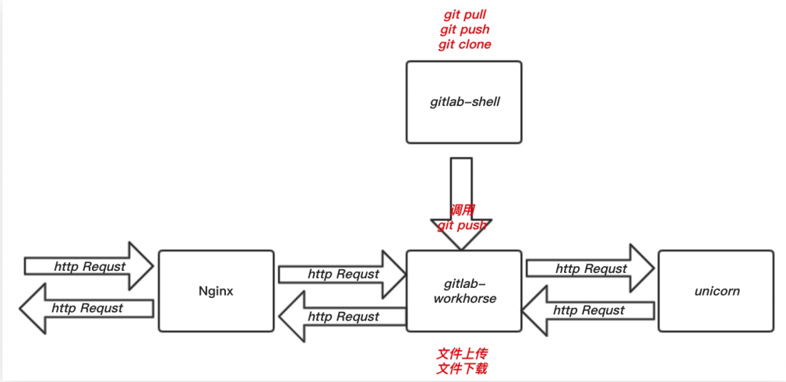
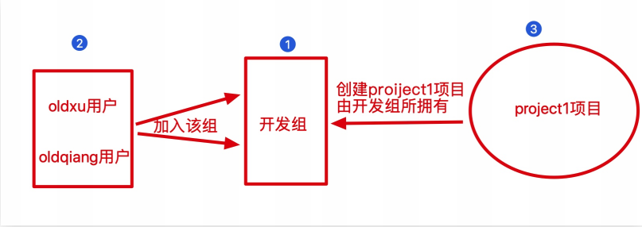
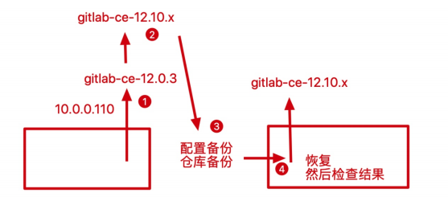

# Gitlab

## 目录

-   [gitlab基本概述](#gitlab基本概述)
    -   [gitlab服务构成](#gitlab服务构成)
    -   [gitlab安装配置](#gitlab安装配置)
    -   [Gitlab用户与组](#Gitlab用户与组)
        -   [用户与组及仓库关系](#用户与组及仓库关系)
        -   [用户与组及仓库案例](#用户与组及仓库案例)
    -   [git日常操作](#git日常操作)
        -   [关联远程仓库](#关联远程仓库)
    -   [日常运维](#日常运维)
    -   [安全](#安全)
    -   [忘记密码](#忘记密码)
    -   [gogs代码托管平台](#gogs代码托管平台)

# gitlab基本概述

Gitlab 是一个开源分布式的版本控制系统。 Ruby语言开发完成。
Gitlab 主要实现的功能：

1.管理项目源代码。

2.对源代码进行版本控制。远程仓库 git本地仓库

Gitlab 的优势：

1.开源免费，搭建简单、维护成本较低、适合中小型公司。

2.权限管理，能实现代码对部分人可见，确保项目的安全性。

3.离线同步，保证我们不在实时依赖网络环境进行代码提交。

gitlab和github之间区别

1.相同点: 两者都是提供代码托管服务，在很大程度上GitLab是仿照 GitHub来做的。
2.不同点: github创建私有仓库收费、gitlab创建私有仓库免费。

### gitlab服务构成

gitlab作为一个分布式代码托管软件，必然有相关的服务组件去支持这个系统



nginx，作为gitlab的proxy代理，处理http/https以及静态资源访问请求。

gitlab-workhorse，用于处理文件上传和下载。

gitlab-shell，用于处理git clone、git pull、gitpush。

Logrotate，用于处理日志的切割和打包等操作。

Postgresql，用于保存所有的gitlab数据相关信息。

Redis，用于缓存数据库的信息，加快前台访问速度，以及交互读写。

## gitlab安装配置

```bash
#关闭防火墙
setenforce 0
systemctl stop firewalld && systemctl disable firewalld
#安装依赖
yum install -y curl openssh-server postfix wget
#安装gitlab
wget https://mirror.tuna.tsinghua.edu.cn/gitlabce/yum/el7/gitlab-ce-12.3.9-ce.0.el7.x86_64.rpm
#安装gitlab
yum localinstall gitlabce-12.3.9-ce.0.el7.x86_64.rpm -y

```

配置gitlab域名

```bash
vim /etc/gitlab/gitlab.rb
#1.Gitlab Url
external_url 'http://gitlab.oldxu.net'
#配置邮箱
#为什么修改邮箱
    1.在账号注册时，需要使用邮件验证。
    2.后期修改密码时，需要通过邮件修改
### Email Settings
gitlab_rails['gitlab_email_enabled'] = true
gitlab_rails['gitlab_email_from'] = '邮箱@qq.com'
gitlab_rails['gitlab_email_display_name'] = 'xlz'
gitlab_rails['smtp_enable'] = true
gitlab_rails['smtp_address'] = "smtp.qq.com"
gitlab_rails['smtp_port'] = 465
gitlab_rails['smtp_user_name'] = "邮箱@qq.com"
gitlab_rails['smtp_password'] = "密码"
gitlab_rails['smtp_domain'] = "qq.com"
gitlab_rails['smtp_authentication'] = "login"
gitlab_rails['smtp_enable_starttls_auto'] = true
gitlab_rails['smtp_tls'] = true
#关闭组件:由于 Gitlab 核心功能是代码托管，所以有些额外的组件比较浪费资源，所以可以考虑关闭
#将不需要使用的组件都设定为false
1474 prometheus['enable'] = false
1475 prometheus['monitor_kubernetes'] = false
1542 alertmanager['enable'] = false
1564 node_exporter['enable'] = false
1583 redis_exporter['enable'] = false
1601 postgres_exporter['enable'] = false
1630 gitlab_exporter['enable'] = false
1643 prometheus_monitoring['enable'] = false
1650 grafana['enable'] = false

```

初始化并开启服务

```bash
[root@gitlab ~]# gitlab-ctl reconfigure（一定要运行）
[root@gitlab ~]# gitlab-ctl status
[root@gitlab ~]# gitlab-ctl stop
[root@gitlab ~]# gitlab-ctl start
登录网页后需要改新密码
```

汉化gitlab组件（[https://gitlab.com/xhang/gitlab](https://gitlab.com/xhang/gitlab "https://gitlab.com/xhang/gitlab")）

```bash
#下载汉化补丁包
wget https://gitlab.com/xhang/gitlab/-/archive/v12.3.0-zh/gitlab-v12.3.0-zh.zip
tar xf gitlab-12-0-stable-zh.tar.gz
#停止gitlab并进行中文汉化
gitlab-ctl stop
cp -r gitlab-v12.3.0-zh/*  /opt/gitlab/embedded/service/gitlab-rails/
#重启gitlab进行验证
gitlab-ctl reconfigure
gitlab-ctl restart
#点击头像的settings--> Preferences-->Localization-->选择简体中文，完成整体汉化
```

## Gitlab用户与组

### 用户与组及仓库关系



注意

如果使用user创建一个仓库，那么这个用户就是这个仓库的owner
如果使用group创建一个仓库，那这个组下面添加的所有用户就是这个仓库的owner

### 用户与组及仓库案例

案例1：验证项目是不是隶属于该组的成员才可以看见

1.首先创建dev、ops两个组
2.然后基于组创建两个项目项目
3.最后创建用户、为用户分配组、以及组中的身份

案例2：验证主程序员和开发者身份的权限

1.主程序员：能够对 master、dev 分支进行操作；\[通过命令测试]

2.开发者：仅能对非 master 分支进行操作；\[通过命令演示效果]

2.1 关闭分支保护机制；
2.2 提交到非Master分支上；

案例3：模拟日常开发者如何更新代码至 master 分支

1.首先创建一个 dev 分支，然后编写代码提交至远程 gitlab
2.登陆 gitlab 服务端，像主程序员申请合并请求，请求 dev 合并master
3.登陆主程序员账户查看合并信息，并确认合并操作
4.登陆 gitlab 查看该项目是否已经是 master 与dev 分支合并后的效果

## git日常操作

### 关联远程仓库

```bash
[root@A-devops ~]# mkdir demo && cd demo/
[root@A-devops demo]# git init
[root@A-devops demo]# git config --global user.name "Xuliangwei"
[root@A-devops demo]# git config --global user.email "xuliangwei@foxmail.com"
[root@A-devops demo]# git remote add origin git@gitlab.oldbgx.com:shoping/demo.git
[root@A-devops demo]# echo "Gitlab Web" >
README.md
[root@A-devops demo]# git add .
[root@A-devops demo]# git commit -m "initcommit"
[root@A-devops demo]# git push -u origin master
#或者
gitlab创建一个项目，推送密钥到gitlab上
本地git clone 远程主机仓库地址


```

## 日常运维

备份

```bash
#修改默认存放备份站点目录，进行重新加载配置文件
[root@gitlab-ce ~]# vim /etc/gitlab/gitlab.rb
...
gitlab_rails['backup_path'] = "/data/gitlab/backups" #备份路径变更
gitlab_rails['backup_keep_time'] = 604800#备份保留7天
...
[root@gitlab-ce ~]# gitlab-ctl reconfigure
#手动执行备份命令，会将备份的结果存储至/data/gitlab/backups中
[root@gitlab-ce ~]# mkdir -p /data/backups
[root@gitlab-ce ~]# gitlab-rake gitlab:backup:create
#写进定时任务中自动备份
[root@gitlab-ce ~]# crontab -l
00 02 * * * /usr/bin/gitlab-rake
gitlab:backup:create


```

恢复

```bash
#停止数据写入
[root@gitlab-ce ~]# gitlab-ctl stop unicorn
[root@gitlab-ce ~]# gitlab-ctl stop sidekiq
#通过 gitlab-rake 命令进行恢复，恢复时需要指定此前备份的名称。(但不需要写名称的.tar后缀)
[root@gitlab-ce ~]# gitlab-rake gitlab:backup:restore
BACKUP=1528102291_2018_06_04_10.8.3


```

迁移升级

迁移： /etc/gitlab/gitlab.rb backups 新节点：安装相对应的版本的gitlab 恢复数据；（不能跨大版本进行升级）执行升级操作； 12.3 ---> 12.9.9 --> 13



升级gitlab到12.10版本：y`um localinstall gitlab-ce12.10.9-ce.0.el7.x86_64.rpm -y`

初始化操作：`gitlab-ctl reconfigure`

安装gitlab-ce-12.10.x版本：`yum localinstall gitlabce-12.10.9-ce.0.el7.x86_64.rpm -y`

直接大版本升级会报错，根据提示编辑/etc/gitlab.rb配置文件

`gitlab_monitor['enable'] =false#变更为gitlab_exporter['enable'] = false`

修改配置后重新初始化，之后进行升级

`[root@gitlab ~]# gitlab-ctl reconfigure [root@gitlab ~]# yum localinstall gitlabce-13.0.10-ce.0.el7.x86_64.rpm -y`

## 安全

将网页的http协议升级到https协议，保证数据安装

修改gitlab配置文件

```bash
[root@gitlab ~]# vim /etc/gitlab/gitlab.rb
external_url "https://gitlab.example.com"
# 必须修改
nginx['enable'] = true
nginx['client_max_body_size'] = '1000m'
nginx['redirect_http_to_https'] = true
nginx['redirect_http_to_https_port'] = 80
# 所有请求80的都跳转到443
nginx['ssl_certificate'] = "/ssl_key/server.crt"
nginx['ssl_certificate_key'] = "/ssl_key/server.key"

nginx['ssl_ciphers'] = "ECDHE-RSA-AES256-GCM-SHA384:ECDHE-RSA-AES128-GCM-SHA256"
nginx['ssl_prefer_server_ciphers'] = "on"
nginx['ssl_protocols'] = "TLSv1.2"
nginx['ssl_session_cache'] = "builtin:1000 shared:SSL:10m"
nginx['ssl_session_timeout'] = "1440m"

6453467_gitlab.oldxu.net.key
重新初始化gitlab:gitlab-ctl reconfigure
```

## 忘记密码

```bash
#在root用户下执行
[root@gitlab-ce ~]# gitlab-rails console -e production
#获取用户数据，修改用户密码
irb(main):001:0> user = User.where(id:1).first

#更改密码并确认密码
irb(main):002:0> user.password="oldxu.net"
irb(main):003:0>user.password_confirmation="oldxu.net"

#保存退出
irb(main):004:0> user.save!
irb(main):005:0> quit

```

## gogs代码托管平台

```bash
[root@nfs ~]# cat gogs.sh
APP_NAME="gogs"
MYSQL_PASSWORD="123"
HOSTNAME="gogs.oldxu.net"
# setup mysql
yum install mariadb mariadb-server -y
systemctl start mariadb
mysqladmin -u root password "${MYSQL_PASSWORD}"
mysql -u root -p ${MYSQL_PASSWORD} -e
"CREATE DATABASE IF NOT EXISTS ${APP_NAME};
use ${APP_NAME}; 
set global
storage_engine=INNODB;"

# install nginx
yum install -y nginx
cat > /etc/nginx/conf.d/gogs.conf <<-EOF
server {
    listen 3000;
    server_name ${HOSTNAME};
    location / {
      proxy_pass http://localhost:6000;
}
}
EOF

service nginx start

###安装gogs
wget -O /etc/yum.repos.d/gogs.repo https://dl.packager.io/srv/gogs/gogs/main/installer/el/7.repo
yum install gogs
systemctl restart gogs-web

```
