# jenkins实现CI/CD

## 目录

-   [jenkins实现CI架构图](#jenkins实现CI架构图)
-   [整体思路](#整体思路)
-   [手动实现CI流程](#手动实现CI流程)
-   [web集群操作](#web集群操作)
-   [jenkins调用shell实现CI流程](#jenkins调用shell实现CI流程)
    -   [jenkins调用shell传参](#jenkins调用shell传参)
-   [jenkins调用ansible实现CI](#jenkins调用ansible实现CI)
    -   [jenkins调用ansible传参](#jenkins调用ansible传参)
    -   [测试](#测试)
    -   [定时任务](#定时任务)
    -   [scm轮询](#scm轮询)
    -   [wehook](#wehook)
-   [ jenkins基于commitID实现CI](#-jenkins基于commitID实现CI)
-   [基于commitID回滚](#基于commitID回滚)
    -   [回退脚本shell思路](#回退脚本shell思路)
-   [回退ansible脚本](#回退ansible脚本)

## jenkins实现CI架构图

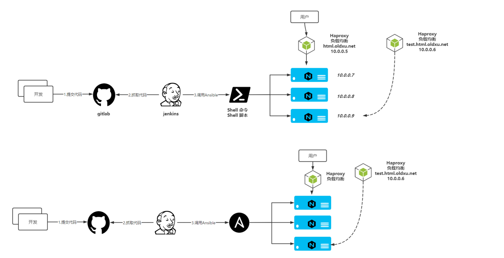

## 整体思路

1.搭建 web 集群架构环境；

2.模拟开发提交代码至 gitlab、

3.模拟运维拉取代码，并推送至 web 服务器组；

4.将手动发布的操作编写为 Shell|Ansible 脚本，由 Jenkins 调用；

## 手动实现CI流程

```bash
#安装haproxy
yum install socat -y
wget https://cdn.xuliangwei.com/haproxy22.rpm.tar.gz
tar xf haproxy22.rpm.tar.gz
# haproxy配置
[root@proxy haproxy]# cat /etc/haproxy/haproxy.cfg
#---------------------------------------------------------------------
# Global settings
#---------------------------------------------------------------------
global
    log         127.0.0.1 local2
    chroot      /var/lib/haproxy
    pidfile     /var/run/haproxy.pid
    maxconn     4000
    user        haproxy
    group       haproxy
    daemon

    # turn on stats unix socket
    stats socket /var/lib/haproxy/stats level admin


    #nbproc 4
        nbthread 8
    cpu-map 1 0
    cpu-map 2 1
    cpu-map 3 2
    cpu-map 4 3


defaults
    mode                    http
    log                     global
    option                  httplog
    option                  dontlognull
    option http-server-close
    option forwardfor       except 127.0.0.0/8
    option                  redispatch
    retries                 3
    timeout http-request    10s
    timeout queue           1m
    timeout connect         10s
    timeout client          1m
    timeout server          1m
    timeout http-keep-alive 10s
    timeout check           10s
    maxconn                 3000

#---------------------------------------------------------------------
# main frontend which proxys to the backends
#---------------------------------------------------------------------
#----------------------------------------------------------------
# Listen settings
#----------------------------------------------------------------
##
listen haproxy-stats_2
        bind *:9999
        stats enable
        stats refresh 1s
        stats hide-version
        stats uri /haproxy?stats
        stats realm "HAProxy statistics"
        stats auth admin:123456
        stats admin if TRUE
#-----------------------------------------
# frontend proxys www_site
#------------------------------------------
frontend www
    bind *:80
    mode http
    acl html_web hdr(host) -i html.oldxu.net
    use_backend web_cluster if html_web
#------------------------------------------
# Backend Servers
#------------------------------------------
backend web_cluster
  balance roundrobin
    server 172.16.1.7 172.16.1.7:80 check port 80
    server 172.16.1.8 172.16.1.8:80 check port 80
  

```

## web集群操作

```bash
[root@web7 usr]# cat /etc/nginx/conf.d/html.xiaoluozi.top.conf
server {
        listen 80;
        server_name html.xiaoluozi.top;
        root /code/web;
        location / {
        index index.html;

}

}

```

```bash
[root@web8 monitor]# cat /etc/nginx/conf.d/html.xiaoluozi.top.conf
server {
        listen 80;
        server_name html.xiaoluozi.top;
        root /code/web/monitor;
        location / {
        index index.html;
}
}

```

手动发布思路

1.使用 tar 命令打包代码；

2.使用 scp 推送代码至目标集群；

3.从负载均衡摘掉节点；

4.对代码进行更新；重启服务；测试站点；

5.将节点加入负载均衡，对外提供；

## jenkins调用shell实现CI流程

```bash
# 自动发布脚本思路如下
# 1.进入代码目录，对代码进行打包；
# 2.将代码推送至目标集群节点；
# 3.将节点从负载均衡中摘掉节点；
# 4.解压代码，创建软连接，测试站点可用性；
# 5.加入节点至负载均衡，对外提供服务；
# 6.需要通过函数的方式来编写，使得脚本更加的专业;

#!/usr/bin/env bash
web_name=web
web_dir=/opt
Date=$(date +%F_%H_%M)
#完成打包操作
cd ${WORKSPACE} && \
tar czf ${web_dir}/${web_name}_${Date}.tar.gz ./*
#推送代码
for host in ${web_servers}
do
  scp ${web_dir}/${web_name}_${Date}.tar.gz root@${host}:${web_dir}
  echo $?
done
lb_server_disable() {
  ssh root@${lbservers} "echo 'disable server web_cluster/$1' | socat stdio /var/lib/haproxy/stats"
}
lb_server_disable() {
  ssh root@${lbservers} "echo 'enbale server web_cluster/$1' | socat stdio /var/lib/haproxy/stats"
}
#下载节点
for host in ${web_servers}
do
  lb_server_disable $host
  ssh root@${host} "cd ${web_dir} && \
                    mkdir -p ${web_name}_${Date} && \
                    tar xf ${web_name}_${Date}.tar.gz -C ${web_name}_${Date} && \
                    rm -f ${web_dir}/${web_name} && \
                    ln -s ${web_dir}/${web_name}_${Date} ${web_dir}/${web_name}"
  #上线节点
  lb_server_enable $host
  sleep 5
done

```

### jenkins调用shell传参

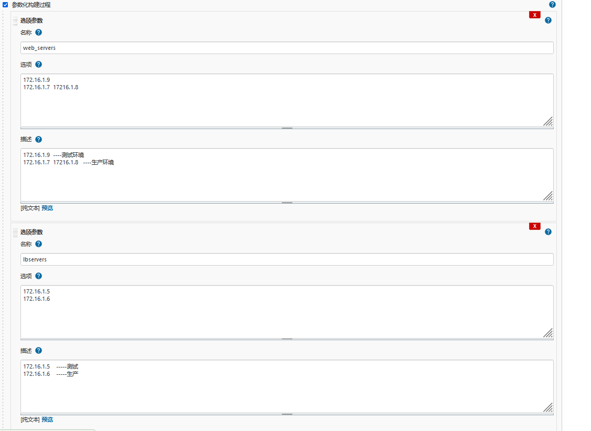

## jenkins调用ansible实现CI

创建一个项目，名称为：monitor-Ansible-CI，执行构建阶段选择 Invoke Ansible Playbook

Playbook path：/scripts/deploy\_html.yml，文件绝对路径

Inventory：File or host list（\${deploy\_env\_file}），主机清单文件路径使用外置传参

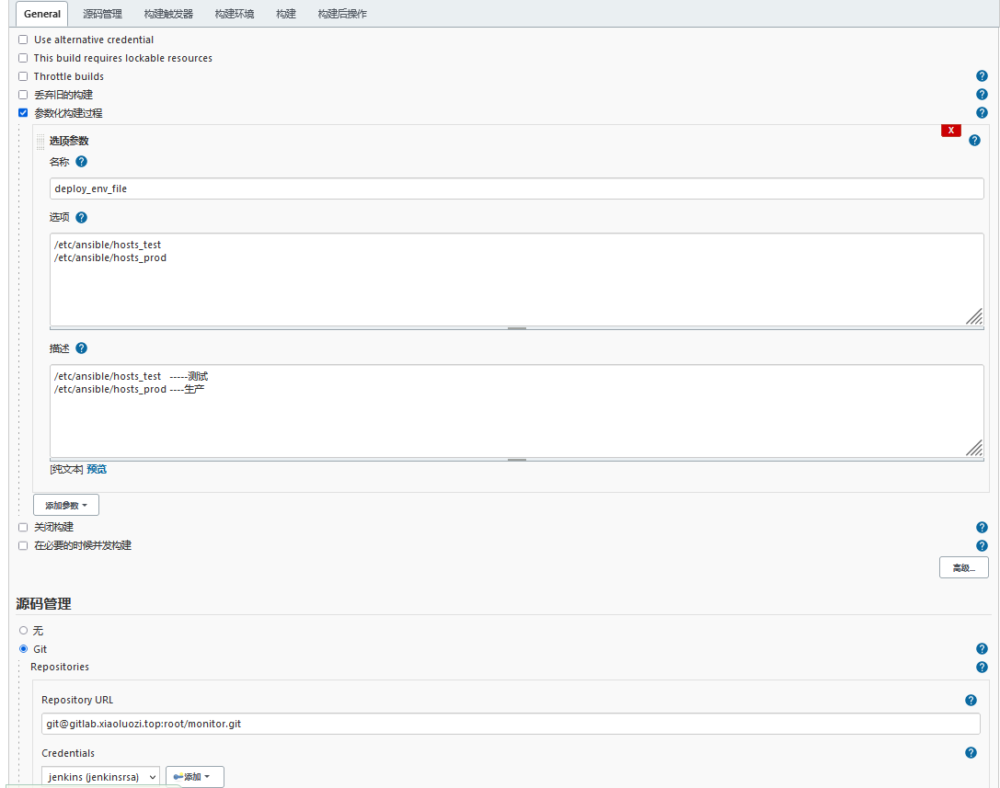

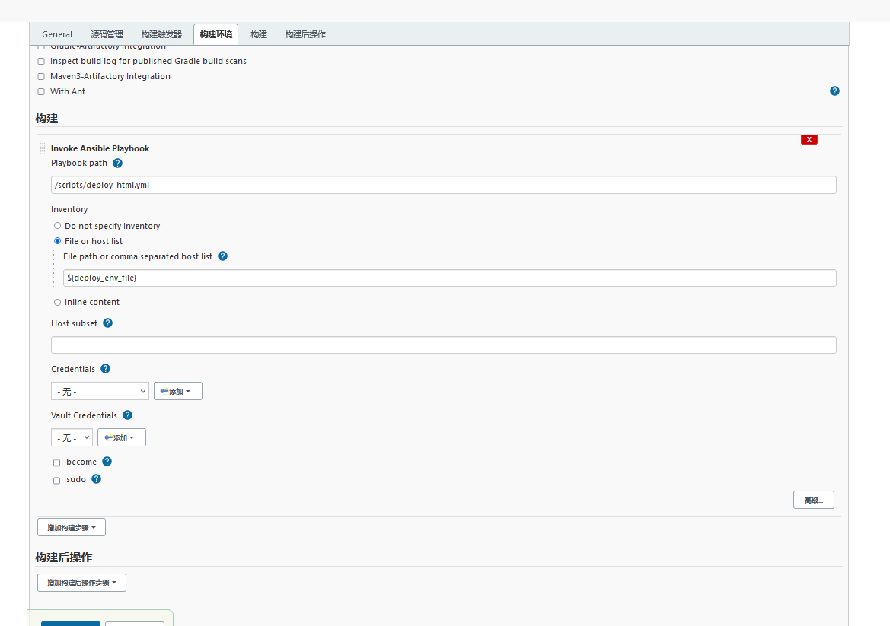

-   整体思路

    0.建立两个清单文件，用来区分环境

    1.设定时间变量，设定WorkSpace路径，代码进行打包；委派给Jenkins执行；

    2.当 web 节点代码需要更新时，先下线节点，将任务委派给Haproxy；
    3.关闭被控端的Nginx服务，然后检查服务是否真的关闭；

    4.为web节点创建站点目录，并将代码解压到对应的目录中；
    5.删除软连接，重新创建软连接；

    6.当 web 节点代码更新成功后，需要上线节点，将任务委派给Haproxy

    7.然后依次循环，直到完成所有节点的代码更新与替
    换

```bash
#定义主机清单
[root@jenkins ansible]# cat /etc/ansible/hosts_test
[lbservers]
172.16.1.6

[webservers]
172.16.1.9
[root@jenkins ansible]# cat /etc/ansible/hosts_prod
[lbservers]
172.16.1.5

[webservers]
172.16.1.7
172.16.1.8
#编写anssible-playbook文件
[root@jenkins ansible]# cat /scripts/deploy_html.yml
- hosts: webservers
  vars:
    - work_dir: /opt
    - web_name: web
    - web_backend: web_cluster
    - service_port: 80
  serial: 1  #每次仅控制一个主机
  tasks:
    #获取时间，年-月-日-时-分 {{ date.stdout }}
    - name: get time
      shell:
        cmd: "echo $(date +%F_%H_%M)"
      register: date
      delegate_to: 127.0.0.1  #委派给本机
    #获取项目的工作目录 {{ workspace.stdout }}
    - name: get workspace work path
      shell:
        cmd: "echo ${WORKSPACE}"
      register: workspace  #输出的值定义成一个变量
      delegate_to: 127.0.0.1
    #执行打包操作
    - name: archive workspace code
      archive:
        path: "{{ workspace.stdout }}/*"
        dest: "{{ work_dir }}/{{ web_name }}_{{ date.stdout }}.tar.gz"
      delegate_to: 127.0.0.1
    #下线节点（委派给lbservers）
    - name: offline haproxy "{{ inventory_hostname }}"
      haproxy:
        state: disabled
        host: '{{ inventory_hostname }}'
        backend: "{{ web_backend }}"
        socket: /var/lib/haproxy/stats
      delegate_to: "{{ item }}"
      loop: "{{ groups['lbservers'] }}"
    #关闭nginx
    - name: systemd nginx stop
      systemd:
        name: nginx
        state: stopped
    #检查端口是否存活
    - name: check nginx port
      wait_for:
        port: "{{ service_port }}"
        state: stopped
    #为web集群创建站点目录 /opt/web-time
    - name: create web site diretory
      file:
        path: "{{ work_dir }}/{{ web_name }}_{{ date.stdout }}"
        state: directory
    #解压目录
    - name: unarchive web code
      unarchive:
        src: "{{ work_dir }}/{{ web_name }}_{{ date.stdout }}.tar.gz"
        dest: "{{ work_dir }}/{{ web_name }}_{{ date.stdout }}"
    #删除软连接
    - name: unlin path #取消软连接
      file:
        path: "{{ work_dir }}/{{ web_name }}"
        state: absent
    #重新创建软连接
    - name: creat link path
      file:
        src: "{{ work_dir }}/{{ web_name }}_{{ date.stdout }}"
        dest: "{{ work_dir }}/{{ web_name }}"
        state: link
    #启动nginx
    - name: systemctl start nginx
      systemd:
        name: nginx
        state: started
    #检查端口是否存活
    - name: check nginx port
      wait_for:
        port: "{{ service_port }}"
        state: started
    #上线委派
    - name: online haproxy "{{ inventory_hostname}}"
      haproxy:
        state: enabled
        host: '{{ inventory_hostname }}'
        backend: "{{ web_backend }}"
        socket: /var/lib/haproxy/stats
      delegate_to: "{{ item }}"
      loop: "{{ groups['lbservers'] }}"


```

### jenkins调用ansible传参

anisble-playbook文件中inventory清单文件是写死的，如果需要它灵活点就需要将其写成变量参数

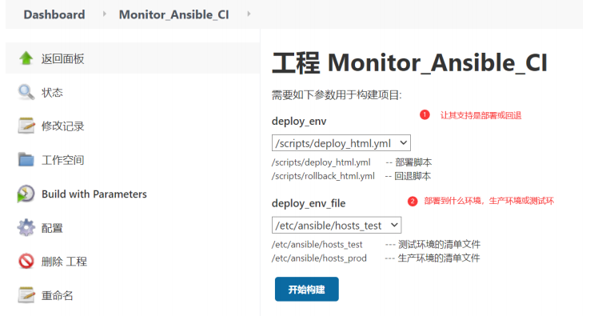

### 测试

模拟开发身份：修改网站内容，然后提交代码至gitlab远程仓库；

拉取仓库进行更改，之后`git add .`、`git commit -m ""` 、`git push origin master（枝干）`进行上传

模拟运维身份：登陆Jenkins，选择对应项目，点击构建；

模拟客户身份：访问站点域名，检查代码是否更新成果；（5域名为prod.xiaoluozi.top  6域名为html.xiaoluozi.top）nginx指向{web.dir}{web\_name}

### 定时任务

定时构建，每间隔多久执行一次；无论代码是否更新，时间到了则会执行；类似于定时任务的功能；

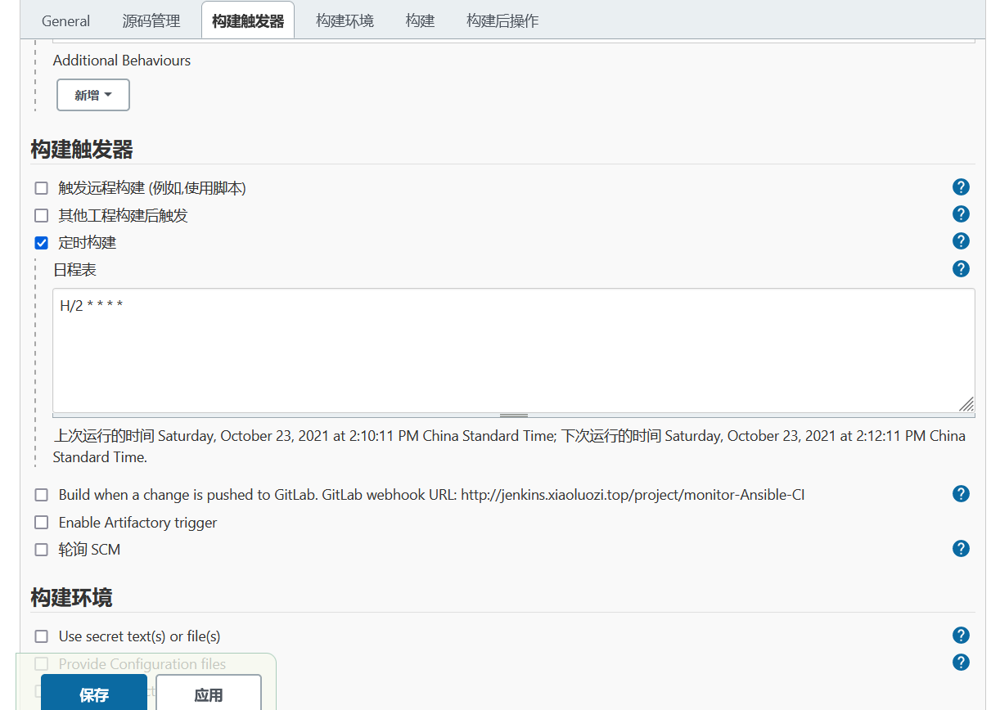

### scm轮询

SCM轮询：可以没分钟检查代码是否更新，当检查到代
码发生变更后，会触发构建，否则不执行；

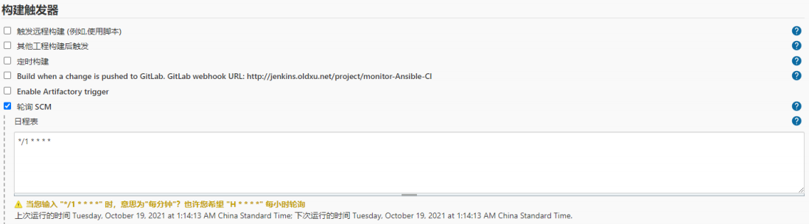

### wehook

webhook 就是当开发一提交代码，则立刻将代码部署目标集群服务节点；

-   配置Jenkins

    1.点击jenkins中对应的项目，找到构建触发器；
    2.配置jenkins通知的项目地址;
    3.找到高级，然后找到Secret token，点击Generate生成token;
    这样就可以通过外部程序调用Jenkins，进而触发构建项目的动作；
-   配置Gitlab触发

    1.配置 gitlab，管理中心->设置->网络设置->外发请求->允许钩子和服务访问本地网络(勾选)
    2.找到对应要实现自动化发布的项目，点击设置-->集成-->

    链接-->通知jenkins的哪个项目地址

    令牌-->jenkins针对项目生成的token令牌

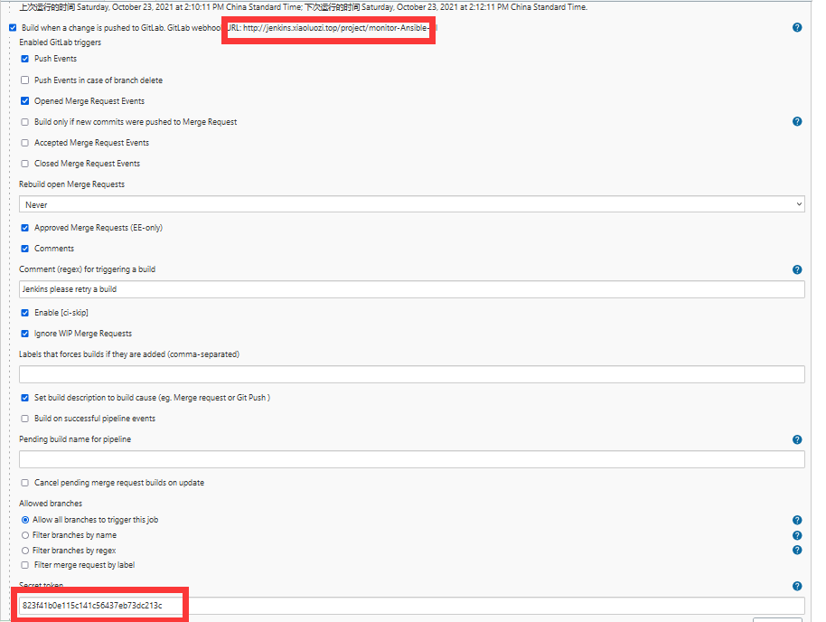

## &#x20;jenkins基于commitID实现CI

1.创建一个新的项目，monitor-Ansible-Commit-CI，然后再Jenkins前端增加git传参方式

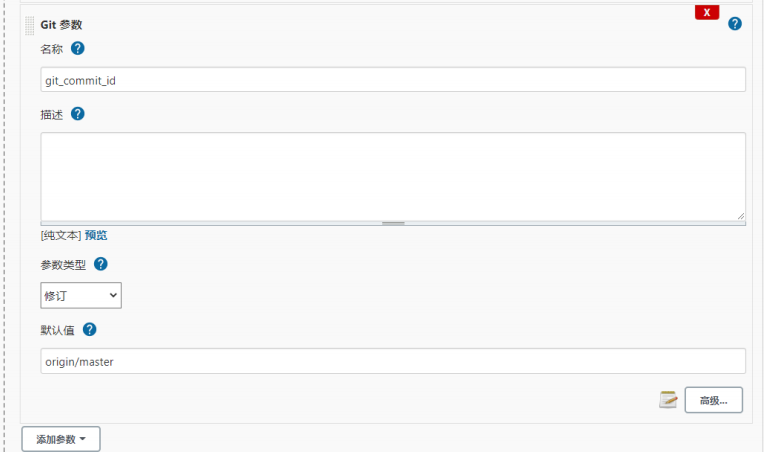

2.修改源码管理，将默认拉取 master 分支最新代码，替换为 \${git\_commit\_id} 变量获取指定的代码；


ansible配置

```yaml
#定义主机清单
[root@jenkins ansible]# cat /etc/ansible/hosts_test
[lbservers]
172.16.1.6

[webservers]
172.16.1.9
[root@jenkins ansible]# cat /etc/ansible/hosts_prod
[lbservers]
172.16.1.5

[webservers]
172.16.1.7
172.16.1.8
#编写anssible-playbook文件
[root@jenkins ansible]# cat /scripts/deploy_html.yml
- hosts: webservers
  vars:
    - work_dir: /opt
    - web_name: web
    - web_backend: web_cluster
    - service_port: 80
  serial: 1  #每次仅控制一个主机
  tasks:
    #获取时间，年-月-日-时-分 {{ date.stdout }}
    - name: get time
      shell:
        cmd: "echo $(date +%F_%H_%M)"
      register: date
      delegate_to: 127.0.0.1  #委派给本机
    #获取项目的工作目录 {{ workspace.stdout }}
    - name: get workspace work path
      shell:
        cmd: "echo ${WORKSPACE}"
      register: workspace  #输出的值定义成一个变量
      delegate_to: 127.0.0.1
    #获取git CommitID编号{{git_commir_id.stdout}}
    - name: get commitid
      shell:
        cmd: "echo ${git_commit_id} | cut -c 1-8"
      register: git_commit_id
      delegate_to: 127.0.0.1
    #执行打包操作
    - name: archive workspace code
      archive:
        path: "{{ workspace.stdout }}/*"
        dest: "{{ work_dir }}/{{ web_name }}_{{ date.stdout }}.tar.gz"
      delegate_to: 127.0.0.1
    #下线节点（委派给lbservers）
    - name: offline haproxy "{{ inventory_hostname }}"
      haproxy:
        state: disabled
        host: '{{ inventory_hostname }}'
        backend: "{{ web_backend }}"
        socket: /var/lib/haproxy/stats
      delegate_to: "{{ item }}"
      loop: "{{ groups['lbservers'] }}"
    #关闭nginx
    - name: systemd nginx stop
      systemd:
        name: nginx
        state: stopped
    #检查端口是否存活
    - name: check nginx port
      wait_for:
        port: "{{ service_port }}"
        state: stopped
    #为web集群创建站点目录 /opt/web-time
    - name: create web site diretory
      file:
        path: "{{ work_dir }}/{{ web_name }}_{{ date.stdout }}"
        state: directory
    #解压目录
    - name: unarchive web code
      unarchive:
        src: "{{ work_dir }}/{{ web_name }}_{{ date.stdout }}.tar.gz"
        dest: "{{ work_dir }}/{{ web_name }}_{{ date.stdout }}"
    #删除软连接
    - name: unlin path #取消软连接
      file:
        path: "{{ work_dir }}/{{ web_name }}"
        state: absent
    #重新创建软连接
    - name: creat link path
      file:
        src: "{{ work_dir }}/{{ web_name }}_{{ date.stdout }}"
        dest: "{{ work_dir }}/{{ web_name }}"
        state: link
    #启动nginx
    - name: systemctl start nginx
      systemd:
        name: nginx
        state: started
    #检查端口是否存活
    - name: check nginx port
      wait_for:
        port: "{{ service_port }}"
        state: started
    #上线委派
    - name: online haproxy "{{ inventory_hostname}}"
      haproxy:
        state: enabled
        host: '{{ inventory_hostname }}'
        backend: "{{ web_backend }}"
        socket: /var/lib/haproxy/stats
      delegate_to: "{{ item }}"
      loop: "{{ groups['lbservers'] }}"

```

测试：1.模拟git提交代码。2.我前段jenkins构建

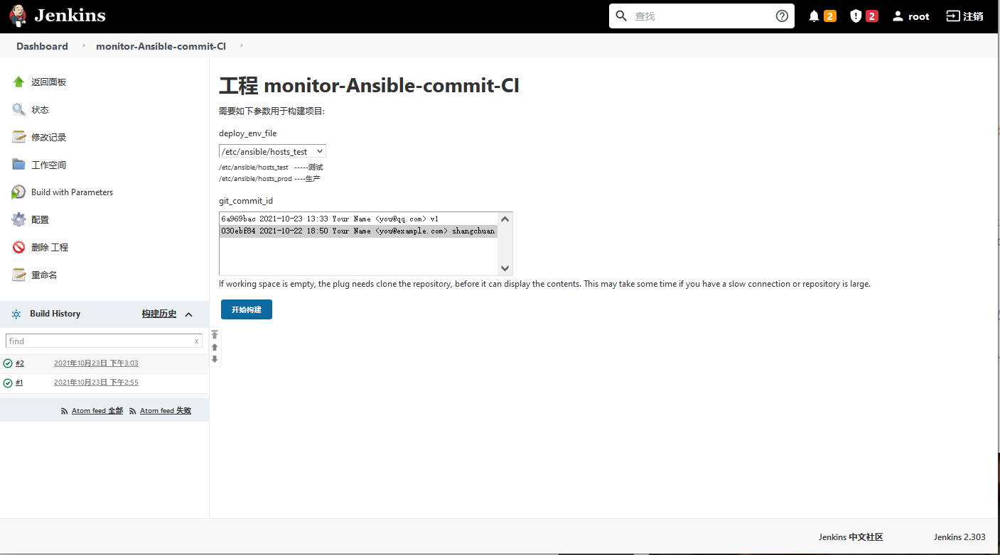

## 基于commitID回滚

-   思路

    1.从负载均衡中摘掉节点；

    2.登陆目标集群服务节点；

    3.删除软链接，重建软连接()；

    4.重载服务，加入集群服务；

### 回退脚本shell思路

查找对应的commit版本，然后进行回退；

## 回退ansible脚本

```yaml
[root@jenkins log]# cat /scripts/deploy_html_commitid.yml
- hosts: webservers
  vars:
    - work_dir: /opt
    - web_name: web
    - web_backend: web_cluster
    - service_port: 80
  serial: 1  #每次仅控制一个主机
  tasks:
    #拿到commit ID，ansible调用{{ git_commit_id.stdout }}
    - name: get commitID
      shell:
        cmd: "echo ${{ git_commit_id }} | cut -c 1-8"
      register: git_commit_id  #和jenkins配置中的定义命名一致
      delegate_to: 127.0.0.1
    #摘掉节点
    - name: offline haproxy "{{ inventory_hostname }}"
      haproxy:
        state: disabled
        host: '{{ inventory_hostname }}'
        backend: "{{ web_backend }}"
        socket: /var/lib/haproxy/stats
      delegate_to: "{{ item }}"
      loop: "{{ groups['lbservers'] }}"
    #停止nginx服务并检查端口存活
    - name: systemd nginx stop
      systemd:
        name: nginx
        state: stopped
    - name: check nginx port
      wait_for:
        port: "{{ service_port }}"
        state: stopped
    #删除软连接
    - name: unlink path
      file:
        path: "{{ work_dir }}/{{ web_name }}"
        state: absent
    #获取对应的commitID的目录属性，其中包含路径
    - name: Find {{ work_dir }} "{{ git_commit_id.stdout }}"
      find:
        paths: "{{ work_dir }}"
        patterns: " *{{ git_commit_id.stdout}}*"
        file_type: directory
      register: web_name_commitid
    #5.获取CommitID对应目录的绝对路径(map参数提取过滤器，转为list，使用first取第一个)
    - name: Output web_name_commitid Full Path
      debug: #测试是否能够取到commitid的值
        msg: "{{ web_name_commitid.files | map(attribute='path') | list | first }}"
      register: web_name_commitid_path
    #重新创建软连接
    - name: creat link path
      file:
        src: "{{ work_dir }}/{{ web_name }}_{{ date.stdout }}"
        dest: "{{ work_dir }}/{{ web_name }}"
        state: link
    #启动nginx服务
    - name: systemctl start nginx
      systemd:
        name: nginx
        state: started
    #加入集群
    - name: online haproxy "{{ inventory_hostname}}"
      haproxy:
        state: enabled
        host: '{{ inventory_hostname }}'
        backend: "{{ web_backend }}"
        socket: /var/lib/haproxy/stats
      delegate_to: "{{ item }}"
      loop: "{{ groups['lbservers'] }}"

```

测试

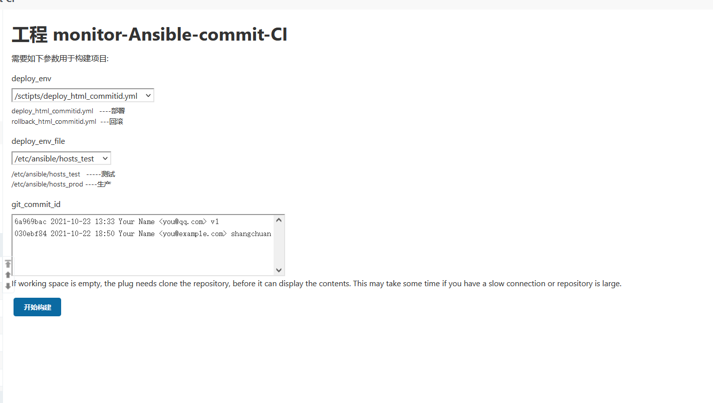

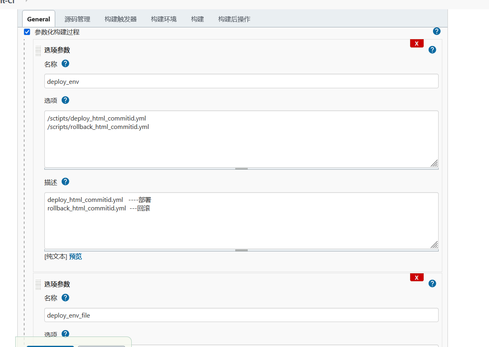
