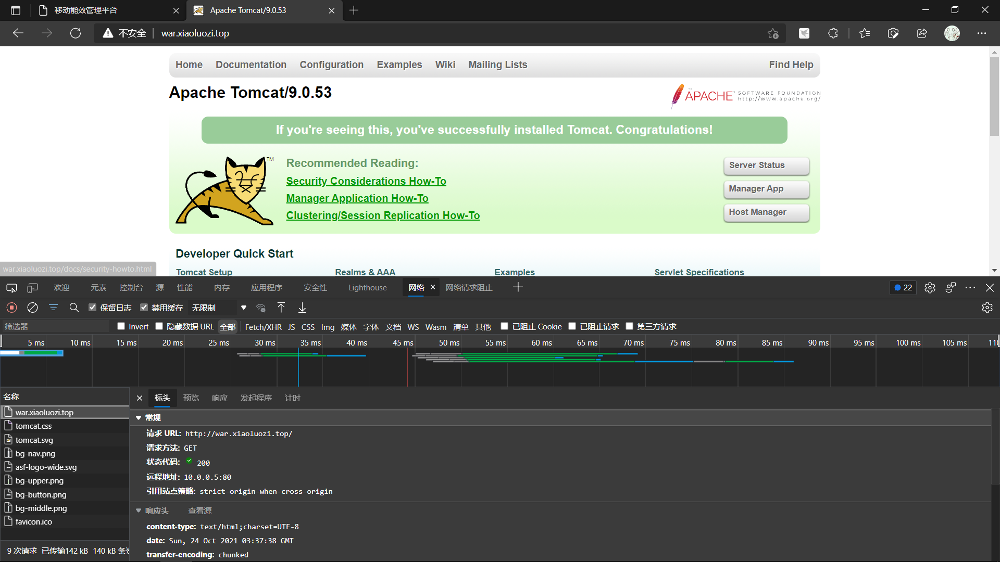
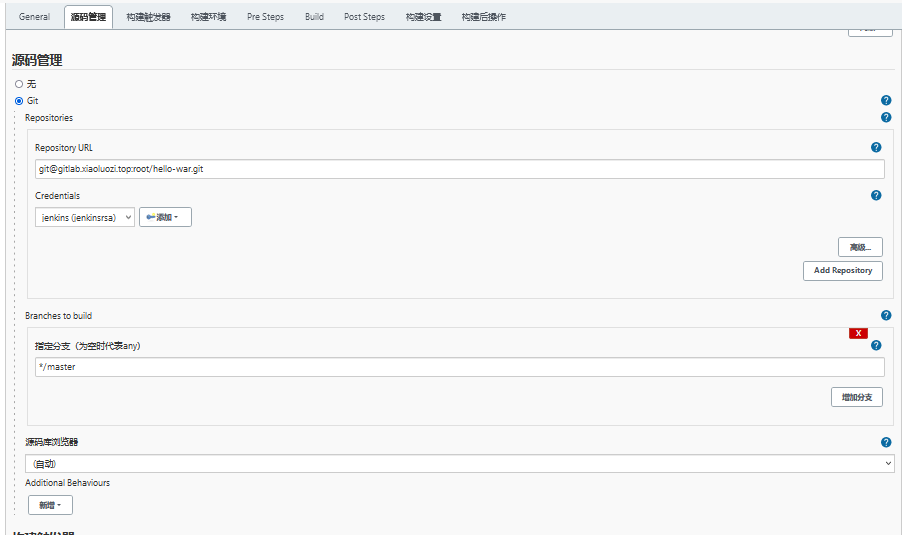
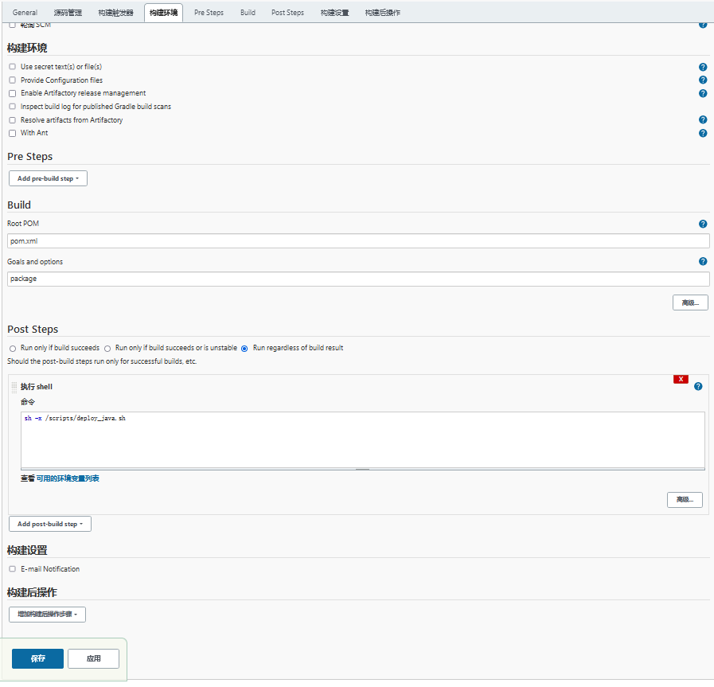

# jenkins集成java的maven实践

## 目录

-   [java项目基本概述](#java项目基本概述)
-   [java项目环境搭建](#java项目环境搭建)
-   [手动实现war包的ci部署](#手动实现war包的ci部署)
-   [自动实现war包项目的CI](#自动实现war包项目的CI)
    -   [编写脚本](#编写脚本)
    -   [通过anisble进行自动化发布](#通过anisble进行自动化发布)
-   [jenkins集成制品库](#jenkins集成制品库)
    -   [配置nexusweb](#配置nexusweb)
        -   [配置maven链接nexus](#配置maven链接nexus)
    -   [jenkins实现war包得CI/CD](#jenkins实现war包得CICD)
        -   [实现CD类型
            ](#实现CD类型)
        -   [ansible自动化发布脚本](#ansible自动化发布脚本)
    -   [完整测试CI和CD流程](#完整测试CI和CD流程)
-   [jenkins实现jar包CICD](#jenkins实现jar包CICD)

## java项目基本概述

简单来说就是使用java编写的代码，我们将其称为java项目。

由于java编写的代码是无法直接在服务器上运行，需要使用maven工具进行打包。

kaifa --> gitlab --> jenkins --> maven --> shell|ansible --> webcluster

## java项目环境搭建

负载均衡配置文件

```yaml
frontend www
    bind *:80
    mode http
    acl html_web hdr(host) -i prod.xiaoluozi.top
    use_backend web_cluster if html_web

    acl java_oldluo hdr(host) -i war.xiaoluozi.top
    use_backend java_cluster if java_oldluo
#------------------------------------------
# Backend Servers
#------------------------------------------
backend web_cluster
  balance roundrobin
    server 172.16.1.7 172.16.1.7:80  check port 80
    server 172.16.1.8 172.16.1.8:80  check port 80
backend java_cluster
 balance roundrobin
    server 172.16.1.7 172.16.1.7:8080  check port 8080
    server 172.16.1.8 172.16.1.8:8080  check port 8080
```

后端节点

```yaml
yum install java -y  #安装java
mkdir soft && cd /soft  #创建存放tomcat文件夹
wget https://dlcdn.apache.org/tomcat/tomcat-9/v9.0.54/bin/apache-tomcat-9.0.54.tar.gz   #下载tomcat
tar xf  apache-tomcat9.0.54.tar.gz -C /soft #将tomcat解压到soft
ln -s /soft/apachetomcat-9.0.54/ /soft/tomcat
/soft/tomcat/bin/startup.sh

```

测试



## 手动实现war包的ci部署

开发提交代码

1.首先在gitlab创建项目仓库

2.开发本地推送项目至gitlab项目仓库

3.检查gitlab仓库是否有已提交的代码

拉取代码：git clone 远程仓库地址

编译代码

```yaml
安装maven
yum install java maven -y
配置文件/etc/maven/settingx.xml
        <mirror>
                <id>alimaven</id>
                <name>aliyun maven</name>
        <url>http://maven.aliyun.com/nexus/content/groups/public/</url>
                <mirrorOf>central</mirrorOf>
        </mirror>
编译项目
cd helloworld
mvn package -Dmaven.test.skip=true  #跳过测试用例
```

部署代码

开发提交java源码-->推送至gitlab-->运维使用mvn手动编译-->最后推送war至web集群

```yaml
#拷贝war包并重新命名
for i in {7..8};do scp target/*.war root@172.16.1.$i:/opt/ROOT_$(date +%F-%H-%M).war; done
#删除ROOT目录
for i in {7..8};do ssh root@172.16.1.$i "rm -rf /soft/tomcat/webapps/ROOT"; done
#解压war包
for i in {7..8};do ssh root@172.16.1.$i "mkdir /opt/ROOT_$(date +%F-%H-%M) && unzip /opt/ROOT_$(date +%F-%H-%M).war -d /opt/ROOT_$(date +%F-%H-%M)"; done
#建立软连接
for i in {7..8};do ssh root@172.16.1.$i "ln -s /opt/ROOT_$(date +%F-%H-%M) /soft/tomcat/webapps/ROOT"; done
#重启tomcat
for i in {7..8};do ssh root@172.16.1.$i "pkill java && /soft/tomcat/bin/startup.sh"; done                                                                                                                                          
```

## 自动实现war包项目的CI

配置jenkins集成maven

1.安装 Maven Integration 插件，这样才能使用Jenkins构建一个Maven的项目。

2.告诉Jenkins，JDK的安装路径：点击系统-->全局工具配置-->新增JDK，然后填写JDK路径；

3.告诉Jenkins，Maven的安装路径：点击系统-->全局工具配置-->新增Maven，然后填写Maven路径；

创建maven项目

1.创建一个maven项目

2.基础配置：git参数化构建

3.配置源码：填写java项目地址

4.配置Build：在Goals and options，填写package打包命令即可；





### 编写脚本

```yaml
[root@jenkins hello-war]# cat /scripts/deploy_java.sh
#!/usr/bin/env bash
web_name=ROOT
web_dir=/opt
tomcat_bin=/soft/tomcat/bin
tomcat_site=/soft/tomcat/webapps/ROOT
Date=$(date +%F_%H_%M)
#通过haproxy进行关闭web节点
lb_server_disable() {
  ssh root@${lbservers} "echo 'disable server java_cluster/$1' | socat stdio /var/bin/lib/haproxy/stats"
}
#通过hapoxy加入到集群
lb_server_enbale() {
  ssh root@${lbservers} "echo 'enable server java_cluster/$1' | socat stdio /var/bin/lib/haproxy/stats"
}
#进入工程目录中，将war包拷贝导被控端。并进行重新命令
scp_code() {
  cd ${WORKSPACE} &&
    for host in ${webservers}; do
      scp target/*.war root@${host}:${web_dir}/${web_name}_${Date}.war
    done
}
#停止web节点上的tomcat服务、为被控端创建目录，解压到指定的目录下、删除软连接重新创建软连接、启动web节点上的tomcat服务
deploy_code() {
  for host in ${webservers}; do
    lb_server_disable ${host}
    ssh root@${host} "${tomcat_bin}/shutdown.sh && \
    cd ${web_dir} && mkdir -p ${web_name}_${Date} &&\
    unzip ${web_name}_${Date}.war -d ${web_name}_${Date} && \
    rm -f ${tomcat_site} && \
    ln -s ${web_dir}/${web_name}_${Date} ${tomcat_site} &&\
    ${tomcat_site}/startup.sh"
    #停留五秒进行上线节点
    sleep 5
    lb_server_enbale ${host}
  done
}
main() {
  scp_code
  deploy_code
}
main   #使用主函数进行引入定义函数进行执行
```

### 通过anisble进行自动化发布

```yaml
- hosts: webservers
  vars:
    - work_dir: /opt
    - web_name: ROOT
    - tomcat_site: /soft/tomcat/webapps
    - web_backend: java_cluster
    - service_port: 8080
  serial: 1         #控制每次仅操作一个主机
  tasks:

    # 获取一个时间,年-月-日-时-分  {{ date.stdout }}
    - name: Get System Time
      shell:
        cmd: "echo $(date +%F_%H_%M)"
      register: date
      delegate_to: 127.0.0.1

    # 获取项目的war包名称 {{ workspace.stdout }}
    - name: Get WorkSpace Work Path
      shell:
        cmd: "echo ${WORKSPACE}/target/*.war"
      register: workspace
      delegate_to: 127.0.0.1

   # 下载节点（委派给lbservers）
    - name: offline Haproxy "{{ inventory_hostname}}"
      haproxy:
        state: disabled
        host: '{{ inventory_hostname }}'
        backend: "{{ web_backend }}"
        socket: /var/lib/haproxy/stats
      delegate_to: "{{ item }}"
      loop: "{{ groups['lbservers'] }}"

   # 关闭Tomcat Server
    - name: Systemd Tomcat Stoppend
      shell:
        cmd: "nohup /soft/tomcat/bin/shutdown.sh &"

   # 检测端口是否存活
    - name: Check Tomcat Port
      wait_for:
        port: "{{ service_port }}"
        state: stopped

   # 为web集群创建站点目录  /opt/ROOT-2021-10-21-10-13
    - name: Create Web Site Directory
      file:
        path: "{{ work_dir }}/{{ web_name }}_{{ date.stdout }}"
        state: directory

   # 解压目录
    - name: Unarchive Web Code
      unarchive:
        src: "{{ workspace.stdout }}"
        dest: "{{ work_dir }}/{{ web_name }}_{{ date.stdout }}"

  # 删除软连接
    - name: Unlink Path
      file:
        path: "{{ tomcat_site }}/{{ web_name }}"
        state: absent

  # 重新创建连接
    - name: Create Links Path
      file:
        src: "{{ work_dir }}/{{ web_name }}_{{ date.stdout }}"
        dest: "{{ tomcat_site }}/{{ web_name }}"
        state: link

  # 启动Tomcat Server
    - name: Systemd Tomcat Started
      shell:
        cmd: "nohup /soft/tomcat/bin/startup.sh &"

   # 检测端口是否存活
    - name: Check Tomcat Port
      wait_for:
        port: "{{ service_port }}"
        state: started

   # 上线节点（委派给lbservers）
    - name: online Haproxy "{{ inventory_hostname}}"
      haproxy:
        state: enabled
        host: '{{ inventory_hostname }}'
        backend: "{{ web_backend }}"
        socket: /var/lib/haproxy/stats
      delegate_to: "{{ item }}"
      loop: "{{ groups['lbservers'] }}"

```

## jenkins集成制品库

安装nexus

```yaml
wget nexus.tar.gz
tar xf nexus压缩包 -C /usr/local  #解压nexus压缩包到指定位置
创建软连接
#配置文件
[root@jenkins ~]# vim /usr/local/nexus/bin/nexus.rc
run_as_user="root" # nexus进程运行用户
[root@jenkins ~]# vim /usr/local/nexus/etc/nexusdefault.properties
application-port=8081 # nexus监听端口
application-host=0.0.0.0 # nexus监听地址
启动: [root@jenkins ~]# /usr/local/nexus/bin/nexus start 
#nexus进行访问，获取默认nexus密码，用户名默认admin
[root@jenkins ~]# cat /usr/local/sonatypework/nexus3/admin.password

```

### 配置nexusweb

配置nexus的中央仓库（加速jar包的下载及缓存jar包）

1.点击 settings--> Repositories --> mavencentral

2.修改 proxy--> Remote storage 为http\://maven.aliyun.com/nexus/content/groups/public

3.点击 save 保存

#### 配置maven链接nexus

```yaml
[root@jenkins bin]# vim /etc/maven/settings.xml
  <servers>
  <server>
        <id>nexus-snapshots</id>
        <username>admin</username>
        <password>xiaoluozi</password>
  </server>
<server>
        <id>nexus-releases</id>
        <username>admin</username>
        <password>xiaoluozi</password>
  </server>
<server>
        <id>nexus-central</id>
        <username>admin</username>
        <password>xiaoluozi</password>
  </server>
  </servers>
  <mirrors>
          <mirror>
                <id>alimaven</id>
                <name>aliyun maven</name>
        <url>http://maven.aliyun.com/nexus/content/groups/public/</url>
                <mirrorOf>central</mirrorOf>
        </mirror>
        <mirror>
                <id>maven-central</id>
                <mirrorOf>*</mirrotOf>
        <url>http://nexus.xiaoluozi.top:8081/repositiory/maven-central/</url>
        </mirror>
        <mirror>
                <id>maven-snapshots</id>
                <mirrorOf>*</mirrotOf>
        <url>http://nexus.xiaoluozi.top:8081/repositiory/maven-central/</url>
        </mirror>        <mirror>
                <id>maven-releases</id>
                <mirrorOf>*</mirrotOf>
        <url>http://nexus.xiaoluozi.top:8081/repositiory/maven-central/</url>
        </mirror>
  </mirrors>
#上传war包至nexus
[root@jenkins ~]# mvn deploy:deploy-file \
-DgroupId=com.efsavage \
-DartifactId=hello-world-war \
-Dversion=2.0.0 \
-Dpackaging=war \
-Dfile=target/hello-world-war-2.0.0.war \
-Durl=http://nexus.xiaoluozi.top:8081/repository/maven-releases/ \
-DrepositoryId=nexus-releases \
-DgeneratePom=true

#手动测试下载war包
# wget --http-user=admin --http-passwd=admin http://nexus.oldxu.net:8081/repository/maven-releases/com/efsavage/hello-world-war/1.0.0/hello-world-war-1.0.0.war

```

### jenkins实现war包得CI/CD

编译完成后，增加一个执行shell脚本功能

```yaml
[root@jenkins ~]# cat /scripts/push_java.sh
#!/usr/bin/bash
# 通过pom获取信息
groupId=$(mvn help:evaluate -Dexpression=project.groupId | egrep -v "[INFO]")
artifactId=$(mvn help:evaluate -Dexpression=project.artifactId | egrep -v "[INFO]")
version=$(mvn help:evaluate -Dexpression=project.version | egrep -v "\[INFO\]")
packaging=$(mvn help:evaluate -Dexpression=project.packaging | egrep -v "[INFO]")

#上传至nexus
mvn deploy:deploy-file \
-DgroupId=${groupId} \
-DartifactId=${artifactId} \
-Dversion=${version} \
-Dpackaging=${packaging} \
-Dfile=target/${artifactId}-${version}.${packaging} \
-Durl=http://nexus.oldxu.net:8081/repository/maven-releases/ \
-DrepositoryId=nexus-releases \
-DgeneratePom=true
配置webhook触发器


```

#### 实现CD类型&#xA;

新建任务
配置参数化构建

发布脚本

```yaml
#!/usr/bin/env bash
username=admin
password=xiaoluozi
war_dir=/opt
# 1.获取war包名称+版本+类型
pkg_name=$(echo ${ war_name } | sed -r 's#(.*)/(.*)#\2#g')
# 2.获取war包名称+版本
pkg_name_new=$(echo ${war_name%.*} | sed -r 's#(.*)/(.*)#\2#g')
# 2.下载war包
wget -O ${war_dir}/${pkg_name} --httpuser=${username} --http-passwd=${password} ${war_name} &>/dev/null
for host in ${web_servers}; do
  scp -rp ${war_dir}/${pkg_name} root@${host}:${war_dir}/${pkg_name}
  ssh root@${host} "cd ${war_dir} && mkdir -p ${pkg_name_new} && \
    unzip ${pkg_name} -d ${pkg_name_new} && \
    rm -f /soft/tomcat/webapps/ROOT && \
    ln -s ${war_dir}/${pkg_name_new} /soft/tomcat/webapps/ROOT && \
    pkill java && /soft/tomcat/bin/startup.sh
    "
done
```

#### ansible自动化发布脚本

```yaml
# 1.通过不同的hosts清单文件，来区分部署的环境
# 2.下载war包
# 3.获取war包名称+版本+类型
# 4.将节点从集群摘除
# 5.关闭Tomcat，并等待彻底退出
# 6.创建web站点目录，将代码解压至指定的目录
# 7.删除软连接，重建软连接
# 8.启动tomcat，并等待启动就绪
# 9.将节点接入集群

[root@jenkins target]# cat /scripts/deploy_war.yml
- hosts: webservers
  vars:
    - work_dir: /opt
    - web_name: ROOT
    - tomcat_dir: /soft/tomcat/webapps
    - web_backend: java_cluster
  serial: 1
  tasks:

    # 1.提取url地址 {{ java_deploy_url.stdout }}
    - name: Get Packages Url Name
      shell:
        cmd: "echo ${java_deploy_url}"
      register: java_deploy_url
      delegate_to: 127.0.0.1

    # 2.提取url中包名称
    - name: Get Package Name
      shell:
        cmd: "echo ${java_deploy_url} | awk 'BEGIN {FS=\"/\"}  {print $NF}'"
      register: java_deploy_pkg
      delegate_to: 127.0.0.1


    #2.下载war包到/opt目录
    - name: Get Url
      get_url:
        url: "{{ java_deploy_url.stdout }}"
        dest: "{{ work_dir }}/{{ java_deploy_pkg.stdout }}"
        username: admin
        password: admin
      delegate_to: 127.0.0.1

   # 3.平滑下线web节点
    - name: Stop Haproxy Webcluster Pool Node
      haproxy:
        socket: /var/lib/haproxy/stats
        backend: "{{ web_backend }}"
        state: disabled
        host: "{{ inventory_hostname }}"
      delegate_to: "{{ item }}"
      loop: "{{ groups['lbservers']}}"


    # 关闭Tomcat服务
    - name: Shutdown Tomcat Server
      shell:
        cmd: "nohup /soft/tomcat/bin/shutdown.sh &"

    - name: wait check Tomcat Port Shutdown
      wait_for:
        port: 8080
        state: stopped

   # 创建目录
    - name: Create Tomcat Web Site Direcotry
      file:
        path: "{{ work_dir }}/{{ java_deploy_pkg.stdout }}"
        state: directory

   # 解压包到指定的路径
    - name: Unarchive Web Code
      unarchive:
        src: "{{ work_dir }}/{{ java_deploy_pkg.stdout }}"
        dest: "{{ work_dir }}/{{ java_deploy_pkg.stdout }}"

    # 删除软链接
    - name: delete WebServer Link
      file:
        path: "{{ tomcat_dir }}/{{ web_name }}"
        state: absent

    # 重建软链接
    - name: Create WebServer Link
      file:
        src: "{{ work_dir }}/{{ java_deploy_pkg.stdout }}"
        dest: "{{ tomcat_dir }}/{{ web_name }}"
        state: link

    # 启动Tomcat
    - name: Start Tomcat Server
      shell:
        cmd: "nohup /soft/tomcat/bin/startup.sh &"

    - name: Wait Tomcat Port Started
      wait_for:
        port: 8080
        state: started

    # 加入到负载均衡
    - name: Start Haproxy Webcluster Pool Node
      haproxy:
        socket: /var/lib/haproxy/stats
        backend: "{{ web_backend }}"
        state: enabled
        host: "{{ inventory_hostname }}"
      delegate_to: "{{ item }}"          # 上线节点任务委派给负载均衡节点
      loop: "{{ groups['lbservers']}}"
```

### 完整测试CI和CD流程

1.开发更新代码，并更新pom.xml版本

2.执行Spring-jar-CI 任务 （jenkins 读取 pom文件中的新 上传至Nexus，建议webhook自动化）

3.执行Spring-jar-CD 任务（Jenkins 获取 nexus 最新代码包，然后通过Shell或Ansile 推送到各个节点

## jenkins实现jar包CICD

CI

```yaml
#手动编译项目，然后测试能否正常上传至nexus
[root@jenkins ~]# mvn package
[root@jenkins ~]# mvn deploy:deploy-file \
-DgroupId=demo \
-DartifactId=demo-service \
-Dversion=3.0 \
-Dpackaging=jar \
-Dfile=target/demo-service-3.0.jar \
-Durl=http://nexus.oldxu.net:8081/repository/maven-releases/ \
-DrepositoryId=nexus-releases \
-DgeneratePom=true
#手动下载测试
wget -O /opt/ --http-user=admin --httppasswd=admin http://nexus.oldxu.net:8081/repository/maven-releases/demo/demo-service/3.0/demoservice-3.0.jar

```

实现CD（Freestyle类型）

配置参数化构建

.
Jenkins配置CD流水线（Freestyle类型）
1.安装插件：Maven Artifact ChoiceListProvider(Nexus)

2.添加参数化构建，选择 Extensile Choice
Name：jar\_name
Choice Provider：Nexus3 Artifact Choice Parameter
Nexus Server URL：[http://nexus.oldxu.net:8081](http://nexus.oldxu.net:8081 "http://nexus.oldxu.net:8081")
Credentials：添加nexus的用户名+密码
RepositoryId：maven-releases
GroupId：demo
ArtifactId：demo-service
Packaging：jar
Editable: Display all Choices

编写发布脚本shell

```bash
#!/usr/bin/bash

web_dir=/opt
server_port=8899

# 0.函数
lb_server_disable(){
        ssh root@${lbservers} "echo 'disable server jar_cluster/$1' | socat stdio /var/lib/haproxy/stats"
}

lb_server_enable(){
        ssh root@${lbservers} "echo 'enable server jar_cluster/$1' | socat stdio /var/lib/haproxy/stats"
}


# 1.提取包名称 demo-service-1.0.jar
pkg_name=$(echo ${java_deploy_url##*/})

# 2.基于包名称 demo-service
pkg_process=$(echo ${pkg_name%-*})

# 3.下载编译后的包,到指定的路径
wget -O ${web_dir}/${pkg_name} --user=admin --password=admin ${java_deploy_url}


# 3.推送jar包,停止jar包,启动jar包
for host in ${webservers}
do
  lb_server_disable ${host}
  scp ${web_dir}/${pkg_name} root@${host}:${web_dir}/${pkg_name}
  ssh root@${host} 'jar_status=$(ps aux |grep demo-service | grep -v grep  | awk "{print \$2}") && \
        kill ${jar_status}'
  ssh root@${host} "nohup java -jar ${web_dir}/${pkg_name} --server.port=${server_port} &>/dev/null &"

  sleep 10
  lb_server_enable ${host}
done

```

ansible

```bash
#编写Ansible剧本，下载对应的jar包，然后关闭旧版本的jar包，最后部署新的jar包
# 1.通过不同的hosts清单文件，来区分部署的环境
# 2.下载jar包+版本+类型
# 3.获取jar包名称(不带版本和类型)
# 4.将节点从集群摘除
# 5.推送jar包至集群节点
# 5.关闭java进程，并等待彻底退出
# 6.启动java进程，并等待启动就绪
# 7.将节点接入集群
deploy_jar.yml
- hosts: "webservers"
  vars:
    - web_dir: /opt
    - java_port: "8899"
    - web_backend: jar_cluster
  serial: 1    # 控制一次操作多少台主机
  tasks:
############################################  委派给 Jenkins 节点的操作
    - name: Output War Download Full Name
      shell:
        cmd: "echo ${java_deploy_url}"
      register: java_deploy_url
      delegate_to: "127.0.0.1"

    # 获取jar包的 demo-service-1.0.jar
    - name: Output Jar Download Pkg Full Name
      shell:
        cmd: "echo ${java_deploy_url} | awk 'BEGIN {FS=\"/\"}  {print $NF}'"
      register: java_packages
      delegate_to: "127.0.0.1"

    # 获取jar包的名称 demo-service
    - name: Output Jar Download Pkg Name
      shell:
        cmd: "test=$(echo ${java_deploy_url} | awk 'BEGIN {FS=\"/\"} {print $NF}') && echo ${test%-*}"
      register: java_package_name
      delegate_to: "127.0.0.1"

    # 1.下载jar包
    - name: Wget Java Jar Packages
      get_url: 
        url: "{{ java_deploy_url.stdout }}"
        dest: "{{ web_dir }}"
        username: admin
        password: admin
      delegate_to: 127.0.0.1

############################################ 
    # 2.下线节点
    - name: Stop Haproxy Webcluster Pool Node
      haproxy:
        socket: /var/lib/haproxy/stats
        backend: "{{ web_backend }}"
        state: disabled
        host: "{{ inventory_hostname }}" # 获取当前操作节点主机名称
      delegate_to: "{{ item }}"          # 下线节点任务委派给负载均衡节点
      loop: "{{ groups['lbservers']}}"


    # 3.拷贝代码
    - name: Cp Jar Code
      copy:
        src: "{{ web_dir }}/{{ java_packages.stdout }}"
        dest: "{{ web_dir }}/{{ java_packages.stdout }}"

    # 4.检查进程是否存在
    - name: Check Jar Process Status
      shell:
        cmd: "ps -ef | grep -v grep | grep {{ java_package_name.stdout }} | awk '{print $2}'"
      register: Jar_Running
      ignore_errors: yes

    # 5.停止Java服务
    - name: Shutdown Jar Server
      shell:
        cmd: "kill {{ Jar_Running.stdout }}"
      ignore_errors: yes

    - name: wait check Jar Port Shutdown
      wait_for:
        port: "{{ java_port }}"
        state: stopped

    # 6.启动Java服务
    - name: Start Jar Server
      shell:
        cmd: "nohup java -jar {{ web_dir }}/{{ java_packages.stdout }} --server.port={{ java_port }} &>/dev/null &"

    - name: Wait Jar Port Started
      wait_for:
        port: "{{ java_port }}"
        state: started

    # 上线节点
    - name: Start Haproxy Webcluster Pool Node
      haproxy:
        socket: /var/lib/haproxy/stats
        backend: "{{ web_backend }}"
        state: enabled
        host: "{{ inventory_hostname }}"
      delegate_to: "{{ item }}"          # 上线节点任务委派给负载均衡节点
      loop: "{{ groups['lbservers']}}"


```
