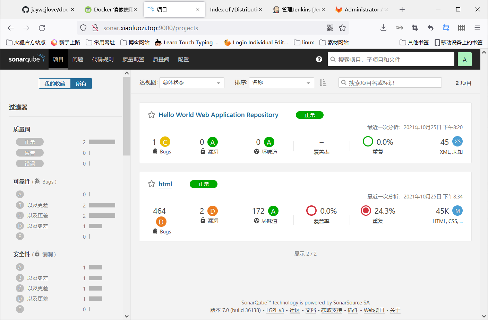

# jenkins集成sonarQube

## 目录

-   [sonarqube基本概述](#sonarqube基本概述)
    -   [使用sonarqube前提](#使用sonarqube前提)
-   [服务安装](#服务安装)
-   [安装sonarqube](#安装sonarqube)
-   [插件管理](#插件管理)
    -   [联网安装](#联网安装)
    -   [离线安装](#离线安装)
-   [java项目分析](#java项目分析)
-   [sonarqube分析其他项目代码](#sonarqube分析其他项目代码)
-   [jenkins集成sonarqube](#jenkins集成sonarqube)
    -   [集成sonar-scanner](#集成sonar-scanner)
-   [jenkins为项目添加测试阶段](#jenkins为项目添加测试阶段)
-   [jenkins集成钉钉](#jenkins集成钉钉)
    -   [jenkins集成钉钉](#jenkins集成钉钉)
-   [给项目通知质检结果](#给项目通知质检结果)

## sonarqube基本概述

SonarQube 是一个开源的代码质量管理系统，用于检测代码中的错误、漏洞。它可以与 Jenkins 集成，让我们能自动化进行代码质量扫描。


### 使用sonarqube前提

1.SonarQube基于Java开发，所以需要安装 OpenJDK8 版本。

2.SonarQube需要依赖 MySQL 数据库，至少 5.6 版本以上。

3.SonarQube的小型实例至少需要4GB 内存，如果是大型实例需要 16GB

## 服务安装

```bash
关闭防火墙
#依赖包安装
yum install git java unzip wget -y 
#安装数据库（必须安装5.6以上的）
wget https://mirrors.tuna.tsinghua.edu.cn/mysql/yum/mysql56-community-el7/mysql-community-server-5.6.45-2.el7.x86_64.rpm \
wget https://mirrors.tuna.tsinghua.edu.cn/mysql/yum/mysql56-community-el7/mysql-community-client-5.6.45-2.el7.x86_64.rpm \
wget https://mirrors.tuna.tsinghua.edu.cn/mysql/yum/mysql56-community-el7/mysql-community-common-5.6.45-2.el7.x86_64.rpm \
wget https://mirrors.tuna.tsinghua.edu.cn/mysql/yum/mysql56-community-el7/mysql-community-libs-5.6.45-2.el7.x86_64.rpm \
yum localinstall mysql-community-* -y 
#启动数据库
systemctl start mysqld
#为数据库配置密码
mysqladmin password 密码
#创建sonar库，设定字符集为utf-8
mysql -uroot -pxiaoluozi -e "CREATE DATABASE sonar DEFAULT CHARACTER SET utf8;"
[root@sonarqube ~]# mysql -uroot -pxiaoluozi -e "show databases;"

```

## 安装sonarqube

```bash
#下载sonarqube并安装解压至/usr/local
wget https://binaries.sonarsource.com/Distribution/sonarqube/sonarqube-7.0.zip
unzip sonarqube-7.0.zip -d /usr/local/  #进行解压
ln -s /usr/local/sonarqube-7.0/ /usr/local/sonarqube   #
#修改sonarqube链接数据库配置文件
[root@sonarqube sonarqube]# vim conf/sonar.properties
onar.jdbc.username=root
sonar.jdbc.password=xiaoluozi
sonar.jdbc.url=jdbc:mysql://localhost:3306/sonar?useUnicode=true&characterEncoding=utf8&rewriteBatchedStatements=true&useConfigs=maxPerformance&useSSL=false
#启动sonarqube
切记启动sonarqube服务是需要使用普通用户运行，如果使用超级用户root会导致启动失败
[root@sonarqube ~]# useradd sonar
[root@sonarqube ~]# chown -R sonar.sonar /usr/local/sonarqube-7.0/
[root@sonarqube ~]# su - sonar -c "/usr/local/sonarqube/bin/linux-x86-64/sonar.sh start"
默认是9000端口
#点击登录-->输入用户名：admin 用户密码：admin
#2.SonarQube初始化操作，配置认证Token。使用Token访问Sonar无需密码
token：63b1f2bdd5fbce247a1be175ad471fceefb924bd
```

## 插件管理

Sonarqube默认已经安装了 C Java Python Php 等代码的质量分析工具；那我们为什么还需要安装插件因为我们还需要检测 html等类型代码，而默认插件没有，所以需要安装；以便将代码检测的更加完善；3.1 联网安装插件

安装插件方式有两种：联网安装插件和离线安装插件

### 联网安装

联网安装插件比较简单，仅需要上应用市场搜索插件名称即可，如下以安装中文语言包插件为例；

点击Administration > Marketplace --> 搜索框chinese，出现一个Chinese Pack，然后点击install
安装好的插件会存储至usr/local/sonarqube/extensions/plugins/xx.jar

### 离线安装

由于 SonarQube 需要安装很多的插件，并且插件安装需要很长的时间；所以我们可以通过导入的方式来完成插件的安装；注意导入后需要重启 Sonarqube

```bash
[root@sonarqube ~]# rm -fr /usr/local/sonarqube/extensions/plugins
[root@sonarqube ~]# tar xf sonar_plugins.tar.gz -C /usr/local/sonarqube/extensions/
[root@sonarqube ~]# chown -R sonar.sonar /usr/local/sonarqube/extensions/plugins/
[root@sonarqube ~]# su - sonar -c "/usr/local/sonarqube/bin/linux-x86-64/sonar.sh restart"
```

检测代码：前面已经将 SonarQube服务以及插件安装完成，那么接下来只需要将代码推送至 Sonarqube 进行分析即可

## java项目分析

Sonarqube 分析 JAVA 项目；进入项目目录，使用 mvn命令将代码直接推送至 Sonarqube 分析；

```bash
[root@jenkins ~]# mvn sonar:sonar \
-Dsonar.host.url=http://sonar.xiaoluozi.top:9000 \
-Dsonar.login=63b1f2bdd5fbce247a1be175ad471fceefb924bd \
-Dsonar.java.binaries=target/sonar
```


## sonarqube分析其他项目代码

Sonarqube 分析 Html、php、go 项目；需要借助sonar-scanner客户端工具来完成代码的分析；[https://docs.sonarqube.org/latest/analysis/scan/sonarscanner/](https://docs.sonarqube.org/latest/analysis/scan/sonarscanner/ "https://docs.sonarqube.org/latest/analysis/scan/sonarscanner/")

```bash
#下载sonar-scanner
wget https://binaries.sonarsource.com/Distribution/sonar-scanner-cli/sonar-scanner-cli-4.0.0.1744-linux.zip
unzip sonar-scanner-cli4.0.0.1744-linux.zip -d /usr/local/
ln -s /usr/local/sonarscanner-4.0.0.1744-linux/ /usr/local/sonarscanner
#进入项目目录，使用 sonar-scanner 工具将代码推送Sonarqube 服务端进行分析
 /usr/local/sonar-scanner/bin/sonar-scanner \
-Dsonar.projectKey=html \
-Dsonar.sources=. \
-Dsonar.host.url=http://sonar.xiaoluozi.top:9000 \
-Dsonar.login=63b1f2bdd5fbce247a1be175ad471fceefb924bd

```



## jenkins集成sonarqube

Jenkins 需要知道 Sonarqube 服务；以便能将代码推送指定服务节点；
Jenkins 需要知道 Sonar-Scanner 客户端工具，以便能正常调用；

-   步骤

    1.插件安装；系统管理-->插件管理-->SonarQube Scannerfor Jenkins

    2.在 Jenkins 上配置 SonarQube 服务端地址；系统管理-->系统设置-->sonarQube (告诉jenkinsSonarQubeServers服务端地址)

    Name 可以随意填写

    URL 添加 SonarQube服务端地址；确保Jenkins能正常访问；

    token 添加一个Secret text；内容填写此前SonarQube 生成的 Token


如果 SonarQube 没有在配置->通用设置->权限->启用Force user authentication 则可忽略token 验证；

### 集成sonar-scanner

在 Jenkins 上配置 Sonar-Scanner 客户端工具路径； 系统管理-->全局工具配置-->sonar-scanner（告诉jenkins SonarScanner在本地哪个路径）

Name 可以随意填写，但最好有规范SONAR\_RUNNER\_HOME 填写 sonar-scanner 在Jenkins本地路径


## jenkins为项目添加测试阶段

maven质检


```bash
sonar:sonar \
-Dsonar.host.url=http://sonar.xiaoluozi.top:9000 \
-
Dsonar.login=63b1f2bdd5fbce247a1be175ad471fceefb924bd \
-Dsonar.java.binaries=target/sonar
```

scanner质检方式


```bash
sonar.projectName=${JOB_NAME} #项目在sonarqube上的显示名称
sonar.projectKey=${JOB_NAME} #项目的唯一标识，不能重复
sonar.sources=. #扫描哪个项目的源码
sonar.java.binaries=target/sonar
```

## jenkins集成钉钉

1.打开钉钉群组，点击群机器人。(如果你不是群主，且群主开启了仅群主可管理，那么将无法创建机器人。)

2.添加一个自定义机器人

3.可以修改机器人名称，以及机器人的名字。(这块自行修改)

4.机器人修改成功后，会给出一个webhook地址。(此处的webhook后续jenkins需要使用)

### jenkins集成钉钉

&#x20; Jenkins安装dingding插件


配置机器人


项目添加机器人


构建后触发通知机制


## 给项目通知质检结果

脚本：`yum install jq `

```bash
# 调用查询异常状态接口函数，该接口是在SonarQube平台直接爬的
function issues() {
   # 如果sonar启用了强制认证，可以通过添加 -u username:password 进行校验
  curl -sH "Content-Length:0" -X GET "http://10.0.0.122:9000/api/issues/search?resolved=false&facets=severities%2Ctypes&componentKeys=$1"
}

# 类型
for i in {0..2}
do
  a=`issues $1 | jq '.facets[1].values['${i}'].val'`

  if [ ${a} = '"BUG"' ]
  then
    BUG=$(echo "BUG：`issues $1 | jq '.facets[1].values['${i}'].count'`个")
    N_BUG=`issues $1 | jq '.facets[1].values['${i}'].count'`
  fi

  if [ ${a} = '"VULNERABILITY"' ]
  then
    VULNERABILITY=$(echo "漏洞：`issues $1 | jq '.facets[1].values['${i}'].count'`个")
    N_VULNERABILITY=`issues $1 | jq '.facets[1].values['${i}'].count'`
  fi

  if [ ${a} = '"CODE_SMELL"' ]
  then
    CODE_SMELL=$(echo "异味：`issues $1 | jq '.facets[1].values['${i}'].count'`个")
  fi
done

# 严重程度
for i in {0..4}
do
  b=`issues $1 | jq '.facets[0].values['${i}'].val'`

  if [ ${b} = '"MINOR"' ]
  then
     MINOR=$(echo "次要：`issues $1 | jq '.facets[0].values['${i}'].count'`个")
  fi

  if [ ${b} = '"MAJOR"' ]
  then
     MAJOR=$(echo "主要：`issues $1 | jq '.facets[0].values['${i}'].count'`个")
  fi

  if [ ${b} = '"CRITICAL"' ]
  then
    CRITICAL=$(echo "严重：`issues $1 | jq '.facets[0].values['${i}'].count'`个")
  fi

  if [ ${b} = '"INFO"' ]
  then
    INFO=$(echo "提示：`issues $1 | jq '.facets[0].values['${i}'].count'`个")
  fi

  if [ ${b} = '"BLOCKER"' ]
  then
  BLOCKER=$(echo "阻断：`issues $1 | jq '.facets[0].values['${i}'].count'`个")
  fi
done
# 如何将脚本的结果定义为系统变量，供钉钉调用 https://www.it1352.com/1470666.html
echo "BUG=${BUG}" > ${WORKSPACE}/build
echo "VULNERABILITY=${VULNERABILITY}" >> ${WORKSPACE}/build
echo "CODE_SMELL=${CODE_SMELL}" >> ${WORKSPACE}/build 
echo "CRITICAL=${CRITICAL}" >> ${WORKSPACE}/build

```

jenkins定义环境变量


钉钉调用环境变量


```bash
# CI:
-构建的项目：${JOB_NAME}
- Sonar质量报告：
- ${BUG}
- ${VULNERABILITY}
- ${CODE_SMELL}
- ${CRITICAL}
```

结果验证


