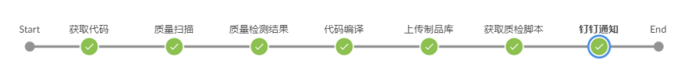
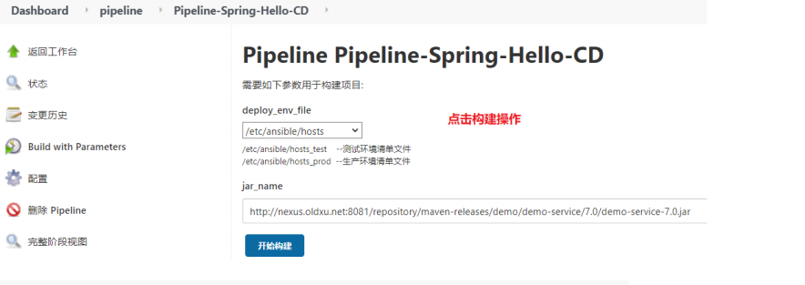
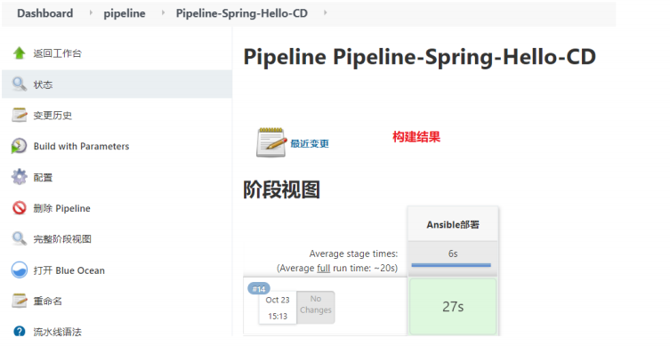
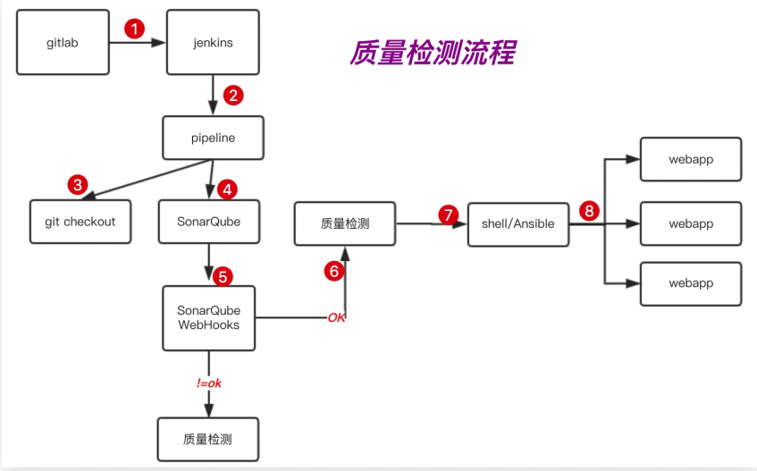
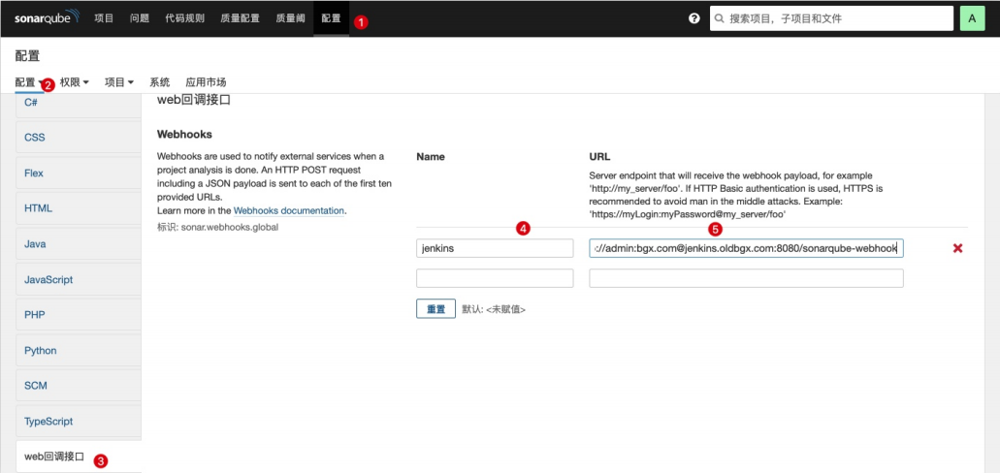
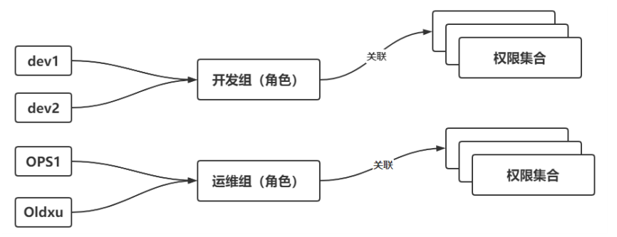

# jenkins分布式部署实践

## 目录

-   [pipeline基本概述](#pipeline基本概述)
-   [jenkins基本应用](#jenkins基本应用)
-   [pipeline实现CI/CD](#pipeline实现CICD)
-   [pipeline实现CD](#pipeline实现CD)
    -   [配置sonarqube](#配置sonarqube)
    -   [修改pipeline代码](#修改pipeline代码)
-   [jenkins分布式构建](#jenkins分布式构建)
-   [权限管理](#权限管理)

## pipeline基本概述

&#x20;简单来说·就是通过代码的方式将多分任务连接起来。共同完成一件事



pipeline语法示例

agent：节点，stage：阶段，steps：动作

```bash
pipeline {    #所有代码都包括在pipeline层中
  agent any   #定义任务在那台主机上进行运行可以是any、none等
  environment{  # environment{}变量名称=变量值，用于定义环境变量。比如PATH变量
    host='oldxu.com'
  }
  stages{  #类似一个大项目的集合，主要用来包含所有stage子任务
    stage('code'){  #类似一个项目中的单个任务，主要用来包含setup子层
      steps{   #用来实现具体执行的动作
      echo "code for host $host"
      }
    }
    stage('build'){
      steps{
      sh "echo $host"
      }
    }    
  }
}
```

## jenkins基本应用

通过jenkins创建一个流水线项目。执行如下代码构架。可以看到每个阶段内容以及花费的时长

```bash
pipeline{
  agent any
  stages {
    stage('下载代码'){
      steps {
        echo "Get Gitlab Code"
        }
      }
    stage('检测代码'){
       steps {
         echo "Unit Test"
        }
      }
    stage('构建代码'){
      steps {
        echo "Build Code"
        }
      } 
    stage('上传代码'){
      steps {
        echo "Build Code"
        }
      } 
    stage('部署代码'){
      steps {
        echo "Deploy Code"
            }
        }
    }
}
```

## pipeline实现CI/CD

代码拉取→代码质检→maven构建→代码山飞船nexus→信息通知之间结果

代码如下

```bash
pipeline {
    agent any
  
  stages {
     stage(拉取代码) {
       steps {
      git credentialsId: 'nexus_tocky', url: 'git@gitlab.xiaoluozi.top:root/hello-war.git'
     }
     }  
  stage(质量检查) {
       steps {
       withSonarQubeEnv('jenkins') {
        sh '/usr/local/sonar-scanner-4.0.0.1744-linux/bin/sonar-scanner \
          -Dsonar.projectName=${JOB_NAME} \
          -Dsonar.projectKey=${JOB_NAME} \
          -Dsonar.sources=. \
          -Dsonar.java.binaries=src \
          -Dsonar.host.url=http://sunarqube.oldxu.net:9000 \
          -Dsonar.login=0df27ab1217846a2b7f7554eeb86434f9fbcf191'
       }
     }
     }  
  stage(质量检测结果) {
       steps {
        script {
         timeout(5) {
             def qg = waitForQualityGate() 
                           if (qg.status != 'OK') {
          error "Sonarqube代码检查失败，failure: ${qg.status}"  
                           }          
         }
      }
     }
  }  
   
  stage(编译代码) {
       steps {
        sh 'mvn package -Dmaven.test.skip=true'
     }
     }  
  stage(上传代码) {
       steps {
      sh 'sh -x /scripts/push_nexus.sh'
     }
     }  
  stage(获取质检脚本) {
       steps {
        sh 'sh -x /scripts/dingding.sh ${JOB_NAME}'
         script { 
          env.BUG = sh(returnStdout: true, script: "grep 'BUG' build | awk -F '=' '{print \$2}'").trim()
            env.VULNERABILITY = sh(returnStdout: true, script: "grep 'VULNERABILITY' build | awk -F '=' '{print \$2}'").trim()
        env.CODE_SMELL = sh(returnStdout: true, script: "grep 'CODE_SMELL' build | awk -F '=' '{print \$2}'").trim()
         }
     }
    }
  stage('钉钉通知') {
     steps {
       echo "消息是"
     }
         post {
           success {
           dingtalk (
              robot: '84df1942-5ef3-4664-9ac8-722c47181605',
              type: 'MARKDOWN',
        title: '${JOB_NAME} 构建成功',
        text: [
           '# ${JOB_NAME} 构建成功',
         '- 任务：[${BUILD_DISPLAY_NAME}](${BUILD_URL})',
         '- ${BUG}',
         '- ${VULNERABILITY}',
         '- ${CODE_SMELL}',
         '- ${CRITICAL}'
        ],
        at: [
                 'oldxu'
              ]
      )
           }
        
     }
   }  
  
   }
 }

```

## pipeline实现CD





实现代码

```bash
pipeline {
 agent any
 parameters{
   choice choices:
   ['/etc/ansible/hosts_test','/etc/ansible/hosts_prod'], description:
   '''/etc/ansible/hosts_test --测试环境清单文件
      /etc/ansible/hosts_prod --生产环境清单文件''', name: 'deploy_env_file'
}
   stages {
   stage('ansible部署'){
     steps {
       sh 'ansible-playbook /scripts/deploy_jar.yml -i ${deploy_env_file}'
     
     }
   
   }
   
   }
 
 }

}
```

质检过程示例图



### 配置sonarqube

配置sonarqube web回调接口，将扫描的结果通知jenkins服务器

Name: jenkins(不是固定)
URL:http\://admin:<admin@jenkins.oldxu.net>/sonarqube-webhook



### 修改pipeline代码

jenkins配置sonarqube新增一个阶段，接收sonarqube返回的检查结果，之后进行验证

```bash
#jenkins的sonarqube(如果代码检测不为ok 则停止后续的编译及部署)
stage('质量检测结果') {
  steps {
    script {
      timeout(5) { //sonarwebhook通知pipeline代码检测结果，未通过pipeline将会fail
          def qg =waitForQualityGate()
              if (qg.status != 'OK') {
                  error "Sonarqube代码检查失败，failure: ${qg.status}"
        }
      }
    }
  }
}

```

## jenkins分布式构建

Jenkins自带分布式特性，Master/Slave模型。在Master上进行任务分配。然后由Slave或Master来完成。

（1）能够分担主节点上的压力，加快构建速度。

（2）能够将特定的任务在特定的主机上运行

> ⛔注意：Slave节点服务器不需要安装jenkins，构建事件的分发由master端（jenkins主服务）来执行。

-   配置步骤

    1.点击系统管理-->节点管理-->新建节点

    2.添加节点名称-->建议写完整这样好区分是哪台主机

    3.配置丛节点基本信息-->以及master要能通过ssh免密连接从节点

    4.配置丛节点的工具位置-->git、maven、jdk、sonarqube

    注意: 如果没有这些工具则可以通过 yum 进行安装，保持Master版本一致即可
-   注意事项
-   1.确保Master和Slave环境一致。（将master的公钥与私钥，拷贝给slave节点）
-   2.确保使用的JDK版本、Maven版本、Git版本一致。
-   3.确保Slave主机能免秘钥登陆Gitlab、以及需要部署的web节点。
-   4.确保Master上的部署脚本也存放至于Slave节点上。
-   5.指定节点运行 agent { label 'slave-node1' }

## 权限管理

基于角色的访问控制可以设定更加详细的访问控制，需要Role-based Authorization Strategy插件


