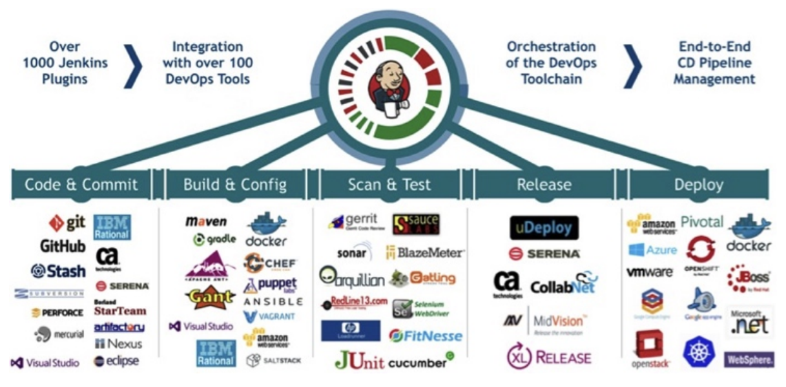
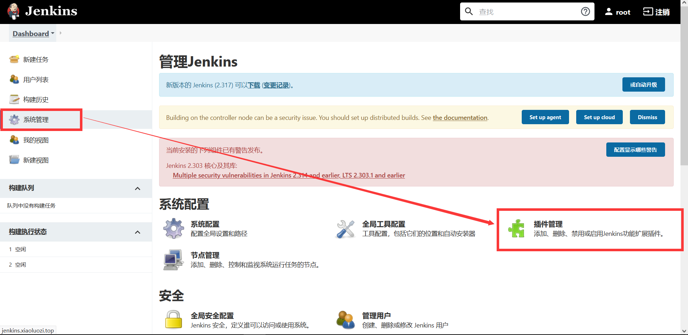
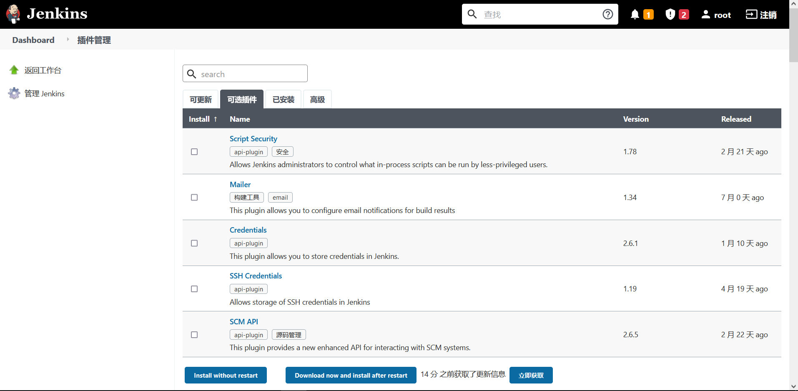
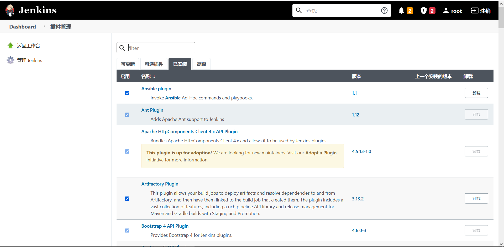
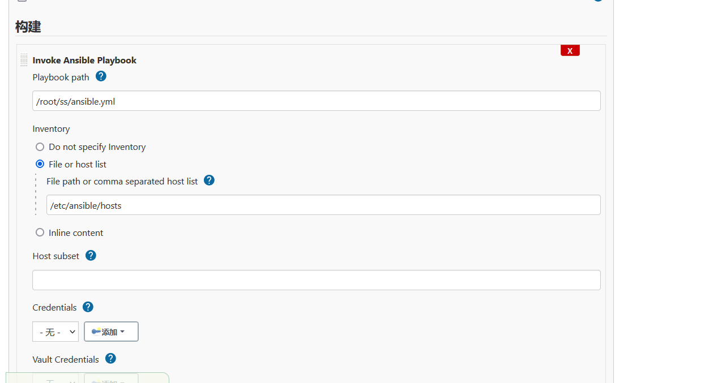
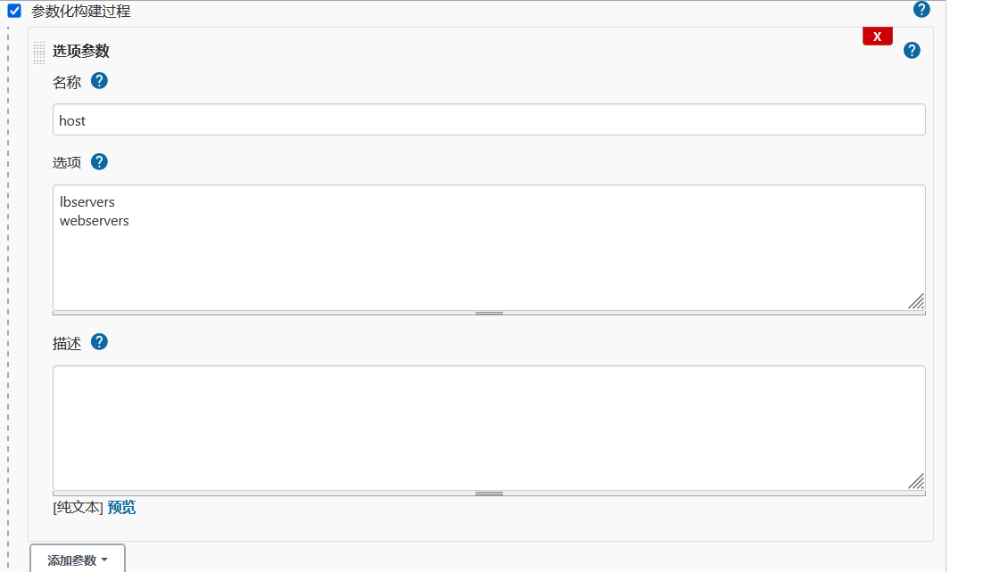

# JENKINS基本操作

## 目录

-   [基本概述](#基本概述)
    -   [jenkins安装部署](#jenkins安装部署)
    -   [优化jenkins](#优化jenkins)
        -   [手动上传插件](#手动上传插件)
        -   [优化jenkins](#优化jenkins)
    -   [Jenkins创建项目](#Jenkins创建项目)
    -   [jenkins集成shell](#jenkins集成shell)
    -   [jenkins继承ansible](#jenkins继承ansible)
        -   [ansible的配置](#ansible的配置)

# 基本概述

Jenkins是一个开源提供友好操作界面的持续集成的工具，是由 JAVA 开发而成。

Jenkins 是一个调度平台，本身不处理任何事情，调用插件来完成所有的工作。

jenkins能将各种开源的软件集成为一体，从而实现不同功能的调度工作



## jenkins安装部署

```bash
#关闭防火墙以及内核防火墙
setenforce 0
systemctl stop firewalld
#设置语言，以防后期jenkins汉化不完整，设置完后重启服务器
vim /etc/locale文件下
#安装jdk环境
yum install java-11-openjdk-devel -y
#安装jenkins
yum localinstall https://mirror.tuna.tsinghua.edu.cn/jenkins/redhat/jenkins-2.303-1.1.noarch.rpm
#配置jenkins
vim /etv/sysconfig/jenkins
JENKINS_USER="root" # 运行Jenkins的用户身份，避免后期权限不足的情况
JENKINS_PORT="80" # 如果jenkins监听在80端口，运行身份必须为root
#启动jenkins
systemctl start jenkins
systemctl enable jenkins
#查看80端口是否启动，域名进行访问（域名随便。IP地址填写Jenkins主机地址）
#首次访问网站需要输入密码，密码在/var/lib/jenkins/secrets/initialAdminPassword
创建第一个管理员用户
Username:  root
Password:  xiaoluozi
Confirm password: xiaoluozi 
Full name： root

```

## 优化jenkins

jenkins 系统管理中的插件管理非常重要，因为jenkins 的工作全部是由插件来完成。

但jenkins插件默认从国外下载，速度会很慢，所以需要在安装插件前将下载地址改为国内的下载地址

```bash
#修改jenkins的下载插件源为国内源
sed -i 's#http://www.google.com/#https://www.baiducom/#g' /var/lib/jenkins/updates/default.json
sed -i 's#updates.jenkins.io/download#mirror.tuna.tsinghua.edu.cn/jenkins#g' /var/lib/jenkins/updates/default.json

```

修改jenkins插件站点：系统管理→插件管理→高级→升级站点





### 手动上传插件

通过页面上传一个.hpi文件的方式来安装插件。
1.在 jenkins 官网 [https://plugins.jenkins.io/下](https://plugins.jenkins.io/下 "https://plugins.jenkins.io/下")载插件。( 插件是以 .hpi 结尾的 )
2.将下载好的插件通过上传的方式进行安装 系统设置->插件管理->上传插件

### 优化jenkins

将之前jenkins服务器的插件保存下来，然后导入到服务器中，(离线安装)，最后重启 Jenkins

```bash
[root@jenkins ~]# tar xf jenkins_plugins_2021-10-19.tar.gz -C /var/lib/jenkins/plugins/
[root@jenkins ~]# chown -R jenkins.jenkins /var/lib/jenkins/plugins/
[root@jenkins ~]# systemctl restart jenkins
进入插件界面进行查看

```



## Jenkins创建项目

只所以需要jenkins集成gitlab，是因为我们要抓取Gitlab上的代码，为后续发布网站做好准备；

由于 jenkins 只是一个调度平台，所有需要安装与gitlab 相关的插件才可完成对应的集成。

1、开发通过gitlab创建一个项目，然后进行代码提交；监控平台代码url

2、创建一个新的 freestyle 项目，名称为monitor-deploy

3、在 jenkins 中填写 gitlab 项目地址（域名需要解析），由于是ssh协议，所以需要添加认证凭据；

3.1 jenkins需要访问 gitlab 项目，则需要与gitlab建立信任；首先登陆Jenkins 生成一对秘钥；
3.2 将 Jenkins 服务器生成的公钥添加上 gitlab对应的用户；
3.2 然后继续操作 Jenkins，将 root 用户的私钥添加至 Jenkins 服务器上；至此就完成了“公钥加密私钥解密”；此时 jenkins 就能正常访问gitlab 项目。

4、选择对应的凭据，再次检查是否存在报错提示。如果没有点击保存即可。

5、最后点击构建，然后查看构建的输出信息是否有错误提示。

6、构建成功后，代码会被下载至 Jenkins 服务器本地 /var/log/jenkins/workspace目录下。

可以先把gitlab代码clone到本地试试

## jenkins集成shell

可以直接在jenkins中编写shell脚本，也可在远程gitlab仓库进行编写脚本，并直接构建gitlab

```bash
# 执行以下命令
pwd
echo "welcome Jenkins"
echo ${WORKSPACE}

# 构建后所产生的文件会存储在/var/lib/jenkins/workspace/jenkins_project_name目录下

```

## jenkins继承ansible

### ansible的配置

```bash
#安装ansible
yum install ansible -y
#配置ssh免密
ssh-copy-id -i ~/.ssh/id_rsa.pub root@172.16.1.5
#配置inventory
[root@jenkins ~]# cat /etc/ansible/hosts
[lbservers]
172.16.1.5

[webservers]
172.16.1.7
172.16.1.8

[testservers]
172.16.1.9
#编写测试用的playbook
[root@jenkins ~]# cat /root/test.yml
- hosts: "webservers"
  tasks:
    - name: Test Shell Command
      shell:
        cmd: ls
      register: system_cmd
    - name: Debug System Command
      debug:
        msg: "{{ system_cmd }}"

```

步骤

1.添加构建步骤，填写playbook路径，填写inventory清单文件路径



设置选项传参以及变量值


