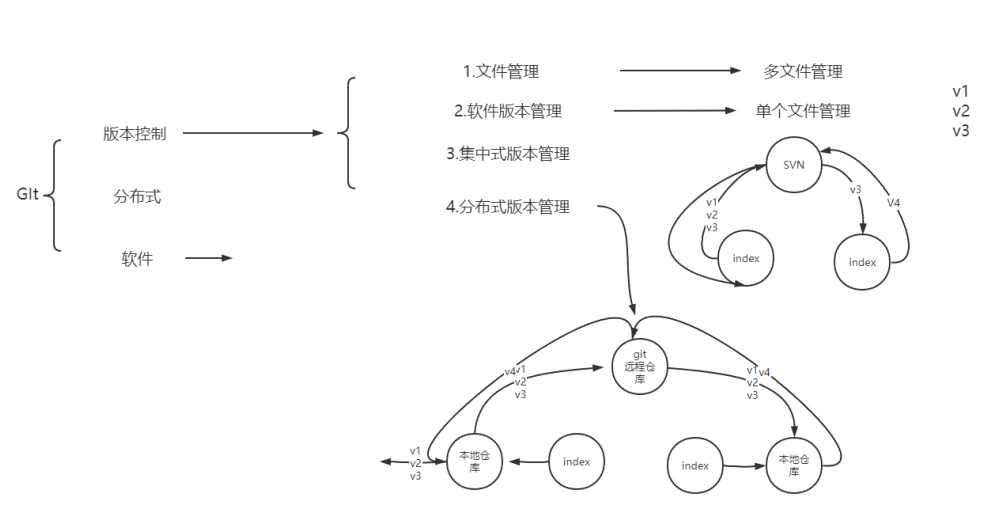
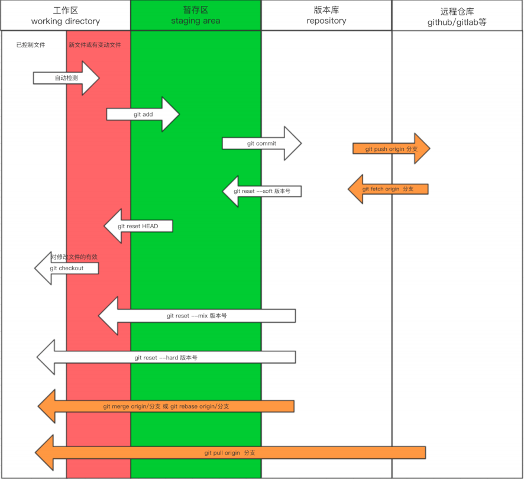
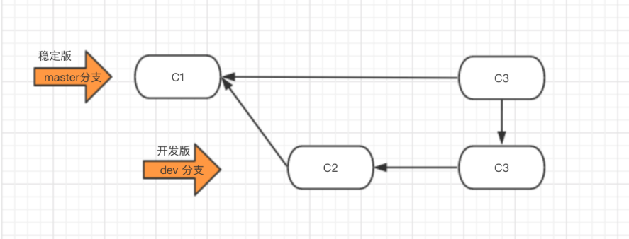
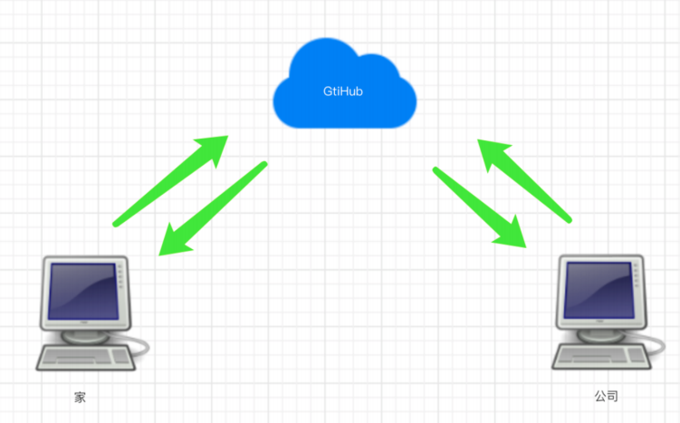

# 分布式版本控制系统git

## 目录

-   [git简介](#git简介)
    -   [初始化阶段](#初始化阶段)
    -   [分支命令总结](#分支命令总结)
    -   [工作流](#工作流)
    -   [远程仓库原理](#远程仓库原理)
    -   [知识补充/总结](#知识补充总结)
    -   [其他知识](#其他知识)
        -   [免密码登录](#免密码登录)

# git简介

git是一个分布式的管理控制软件

软件，类似于QQ、office、dota等安装到电脑上才能使用的工具。

版本控制，类似于毕业论文、写文案、视频剪辑等，需要反复修改和保留原历史数据。

分布式

文件夹拷贝
本地版本控制
集中式版本控制
分布式版本控制



[学习面试.pdf](file/学习面试_sTY5q4itIq.pdf " 学习面试.pdf")

### 初始化阶段

让git对一个目录进行版本控制需要以下步骤

进入要管理的文件夹

执行初始化命令：`git init`

管理目录下的文件状态：`git status`（如果是颜色：新增的文件和修改过后的文件都是红色）

管理指定文件：`git add 文件名   git add .（全部文件）`

个人信息配置：用户名、邮箱（配置第一次即可）

```bash
git config --global user.email "oldxu@qq.com"
git config --global user.name "oldxu"
git config --global color.ui true
```

生成版本：`git commit -m '描述信息'`

查看版本记录：git log

开发功能：先写好代码上传，进行修改  `git add .   git commit  -m '修改描述'`

进行版本回滚：首先看日志，查看commit版本号  git reset - -hard 版本号

总结：

```bash
git init # 就是将普通目录转为git的仓库;（这个目录就支持版本管理了）
git add # 将工作区的数据，拷贝到暂存区
git commit # 将暂存区的数据同步到本地仓库
git log # 查看所有的提交记录
git reflog # 查看所有的历史提交记录
git reset --hard# 回退到指定的commitID
git status # 查看状态
git remote -v #查看远程仓库地址
```



### 分支命令总结

查看分支

```bash
git branch # 查看分支  -d #删除分支
git checkout name # 切换分支
git merge dev   
# 站在master：将dev的最新代码合并到master分支；
# 站在bug：将dev的最新代码合并到bug分支；（处在哪个分支就合并到哪个分支）
```

创建分支：`git branch  分支名`

切换分支：`git checkout 分支名`

分支合并（可能会冲突）：`git merge 要合并的分支名`（注意所处分支位置）

删除分支：`git branch -d  分支名称`

### 工作流

有了分支，开发工作流程就可以变成以下方式



### 远程仓库原理



首先要创建github账户，并创建远程仓库，然后再执行如下命令

要链接远程仓库，首先要将本地公钥推送到远程仓库认证

```bash
git remote add origin 远程仓库地址  #给远程仓库起名字
git push -u origin 分支  #向远程推送代码
git clone  #远程仓库地址 (内部已实现git remote add origin 远程仓库地址)
git checkout dev #创建一个新分支
编写代码
git add .   git commit -m 'xx'   git push origin dev  #提交代码
git pull origin dev #拉取最新代码（已clone不必再进行clone，只需通过pull获取最新代码）
```

上线

```bash
1. 将dev分支合并到master，进行上线
    git checkout master
    git merge dev
    git push origin master
2. 把dev分支也推送到远程
    git checkout dev
    git merge master
    git push origin dev
```

### 知识补充/总结

```bash
git clone 第一次必须要克隆项目；
git pull origin master
git push origin master
等价于
git fetch origin
git merge origin/dev
```

添加远程链接：`git remote add origin 远程仓库地址`   `git remote -v`

推送代码：`git push origin `dev&#x20;

下载代码：`git clone 远程仓库地址`

记录图形展示：`git log --graph --pretty=format:"%h %s"`

## 其他知识

tag标签

git标签就是对commit的一次快照，便于后续将特定时期的代码快速取出。在代码发布时可以使用标签发布。

对当前最新提交的代码创建标签，-a标签名称，-m标签描述：`git tag -a "v1.1" -m "描述信息"`

创建标签，指定commitID：`git tag -a v1.2 CommitID -m "Messages"`

查看标签情况：`git tag      git log -l`

### 免密码登录

```bash
原来的地址：
https://gitee.com/oldxu/treenb.git
修改的地址：https://用户名:密码
@gitee.com/oldxu/treenb.git

git remote add origin https://用户名:密码
@gitee.com/oldxu/treenb.git
git push origin mast
```

ssh实现

直接生成密钥写在远程仓库认证中

git忽略文件

让 Git 不再管理当前目录下的某些文件。.gitignore通常情况下有如下文件可能需要忽略

1.程序运行时产生的垃圾文件

2.程序运行时产生的缓存文件

3.程序本地开发使用的图片文件

4.程序连接数据一类的配置文件
