# filebeat日志收集实践

## 目录

-   [基本介绍](#基本介绍)
    -   [工作流程](#工作流程)
-   [基本使用](#基本使用)
    -   [自定义索引名称](#自定义索引名称)
-   [filebeat收集日志实践](#filebeat收集日志实践)
-   [日志收集实践环境准备](#日志收集实践环境准备)
    -   [配置rsyslog](#配置rsyslog)
    -   [优化filebeat](#优化filebeat)
-   [filebeat收集nginx日志实践](#filebeat收集nginx日志实践)
    -   [nginx日志收集实践](#nginx日志收集实践)
    -   [nginx json日志收集实践](#nginx-json日志收集实践)
    -   [nginx多个日志收集实践](#nginx多个日志收集实践)
    -   [nginx多虚拟机主机收集实践](#nginx多虚拟机主机收集实践)
-   [filebeat收集tomcat实践](#filebeat收集tomcat实践)
    -   [日志收集实践](#日志收集实践)
    -   [tomcat错误日志收集实践](#tomcat错误日志收集实践)
    -   [ES错误日志收集实践](#ES错误日志收集实践)

## 基本介绍

Filebeat 是用于 “转发” 和 “集中日志数据” 的 “轻量型数据采集器”；
Filebeat会监视指定的日志文件路径，收集日志事件并将数据转发到 Elasticsearch、Logstash、Redis、Kafka存储服务器；[filebeat官网](https://www.elastic.co/guide/en/beats/filebeat/current/filebeat-overview.html "filebeat官网")

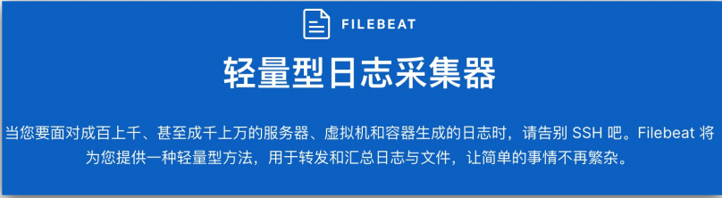

filebeat有两个重要组件：输入input和收割机harverster

输入：输入管理收割机从哪个路径下找所有课读取的资源

收割机：负责逐行读取单个文件内容，然后将内容发送到输出

### 工作流程

当 filebeat 启动后，filebeat 通过 Input 读取指定的日志路径，然后为该日志启动一个收割进程harvester，每一个收割进程读取一个日志文件的新内容，并发送这些新的日志数据到处理程序spooler，处理程序会集合这些事件，最后filebeat会发送集合的数据到你指定的位置。

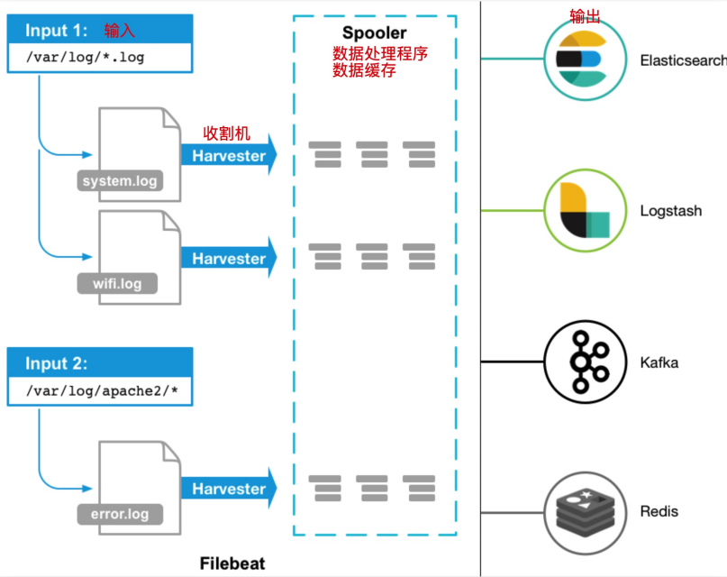

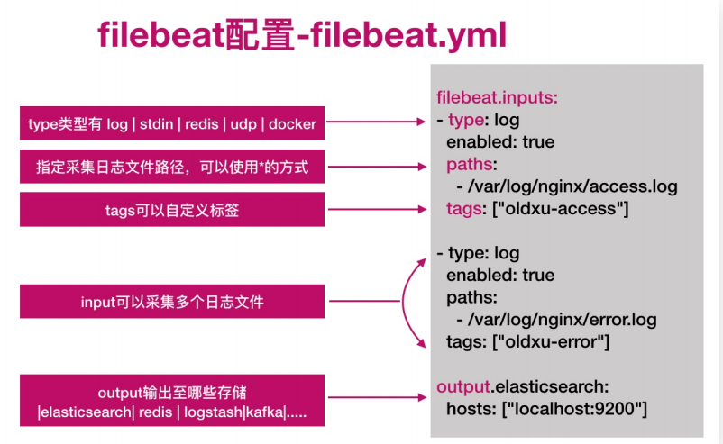

## 基本使用

```bash
#安装filebeat
wget  https://artifacts.elastic.co/downloads/beats/filebeat/filebeat-7.4.0-x86_64.rpm
rpm -ivh  filebeat-7.4.0-x86_64.rpm
systemctl enable filebeat
systemctl start filebeat
#配置filebeat从终端读入，从终端输出
[root@web7 var]# cat /etc/filebeat/dogluo.yml
filebeat.inputs:
- type: stdin
  enabled: true
output.console:
  pretty: true
  enable: true

hello
{
  "@timestamp": "2021-10-28T11:08:38.047Z",
  "@metadata": {
    "beat": "filebeat",
    "type": "_doc",
    "version": "7.4.0"
  },
  "log": {
    "offset": 0,
    "file": {
      "path": ""
    }
  },
  "message": "hehello",
  "input": {
    "type": "stdin"
  },
  "ecs": {
    "version": "1.1.0"
  },
  "host": {
    "name": "web7"
  },
  "agent": {
    "version": "7.4.0",
    "type": "filebeat",
    "ephemeral_id": "da774da2-a185-4667-8b76-29e63855ca16",
    "hostname": "web7",
    "id": "7bd41cd4-fb99-41fb-9394-afa77acf2e3c"
  }
}
#配置filebeat从文件中读取数据
[root@web7 var]# cat /etc/filebeat/dogluo.yml
filebeat.inputs:
- type: log
  enabled: true
  paths:
    - /var/log/*.log
output.console:
  pretty: true
  enable: true
#输出读取内容至elasticsearch
[root@oldxu-web01-172 ~]# cat /etc/filebeat/oldxu.yml
filebeat.inputs:
- type: log #收集日志的类型
  enabled: true #启用日志收集
  paths: /var/log/*.log #日志所在路径
output.elasticsearch: #输出日志至es
  hosts:["172.16.1.161:9200","172.16.1.162:9200","172.16.1.163:9200"] #es集群IP与端口
#默认不写index，索引名为filebeat
默认匹配文件为filebeat.yml ，若不想指定默认。则进行修改/usr/lib/systemd/system/filebeat.yml文件，将指定文件进行修改
```

### 自定义索引名称

默认 Filebeat 写入 ES 的索引名称为 filebeat- \*，如果希望修改索引名称：

1.修改 filebeat 配置文件；

2.删除 ES 的索引；删除 Kibana 的索引；

3.重启 filebeat 服务重新产生新的索引；

```bash
filebeat.inputs:
- type: log #收集日志的类型
  enabled: true #启动
  paths: /var/log/oldxu.log #收集日志的路径
output.elasticsearch: #输出日志至es
  hosts: ["172.16.1.161:9200","172.16.1.162:9200","172.16.1.163:9200"] #es的IP地址与端口
  index: "system-%{[agent.version]}-%{+yyyy.MM.dd}" #自定义索引名称
setup.ilm.enabled: false #索引生命周期ilm功能默认开启，开启情况下索引名称只能为filebeat-*
setup.template.name: "system" #定义模板名称
setup.template.pattern: "system-*" #定义模板的匹配索引名称
systemctl restart filebeat

```

默认情况下 Filebeat 写入到 ES 的索引分片为1，
如果需要修订分片，可以通过如下两种方式：

方式一：修改filebeat配置文件，增加如下内容；然后删除索引的模板，以及索引，重新产生数据；

方式二：使用 cerebro web页面修改；

1.修改模板 settings 配置，调整分片以及副本；

2.删除模板关联的索引；

3.重启filebeat产生新的索引；

```bash
setup.template.settings:
  index.number_of_shards: 3
  index.number_of_replicas: 1
```

## filebeat收集日志实践

收集思路：系统中有很多日志，挨个配置收集就变得非常麻了。所以我们需要对这些日志进行统一、集中的管理。可以通过 rsyslog 将本地所有类型的日志都写入/var/log/oldxu.log 文件中，然后使用 filebeat 对该文件进行收集即可。

日志收集架构图

rsyslog+filebeat --> elasticsearch集群 <--kibana

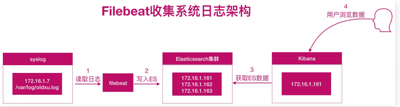

## 日志收集实践环境准备

| 主机名称    | IP地址         |
| ------- | ------------ |
| rsyslog | 172.16.1.7   |
| es1     | 172.16.1.161 |
| es2     | 172.16.1.162 |
| es3     | 172.16.1.163 |

### 配置rsyslog

```bash
#进行安装rsyslog
yum install rsyslog
#编写rsyslog配置文件
vim /etc/rsyslog.conf
# Provides UDP syslog reception #udp协议
$ModLoad imudp
$UDPServerRun 514
#配置收集日志的方式
#*.* @IP:514 #将本地所有日志通过网络发送给远程服务器
*.* /var/log/oldxu.log #将本地所有日志保存至本地/var/log/oldxu.log
重启进行测试
systemctl restart rsyslog
logger "输入一段话"
grep "输入一段话" /var/log/dogluo.log
配置索引进行索引管理查询。进入kibana的discover进行可视化查看


```

### 优化filebeat

kibana 展示的结果上有很多 Debug 消息，其实该类消息无需收集，所以我们可以对收集的日志内容进行优化，只收集警告 WARN、ERR、sshd 相关的日志；

配置文件如下

```bash
[root@web01 ~]# cat /etc/filebeat/filebeat.yml
filebeat.inputs:
- type: log #收集日志的类型
  enabled: true #启动
  paths: /var/log/oldxu.log #收集日志的路径
  include_lines: ['^WARN','^ERR','sshd']
  # 错误、警告、sshd的则记录
  #exclude_lines: ['DEBUG'] #与DEBUG相关的则排除
output.elasticsearch:
  hosts:["172.16.1.161:9200","172.16.1.162:9200","172.16.1.163:9200"]
#重启filebeat并删除索引重新生成索引
```

## filebeat收集nginx日志实践

我们需要获取用户的信息，比如：来源的IP是哪个地域，网站的PV、UV、状态码、访问时间等等；所以需要收集 Nginx 日志

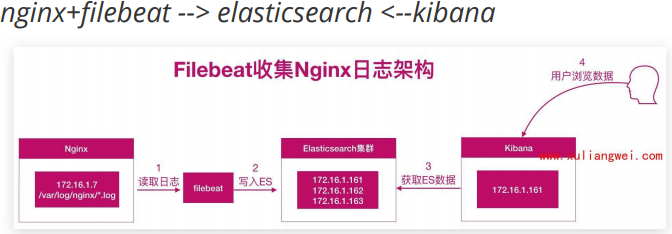

### nginx日志收集实践

```bash
#安装nginx
yum install nginx -y
[root@web7 log]# cat /etc/nginx/conf.d/elk.xiaoluozi.conf
server {
        listen 80;
        server_name elk.xiaoluozi.top;
        location / {
        root /code;
        index index.html;

}
}
systemctl restart nginx  #配置网站为了能监控用户访问网站的日志
#配置filebeat，收集本地nginx日志
[root@web7 log]# cat /etc/filebeat/filebeat.yml
filebeat.inputs:
- type: log
  enabled: true
  paths: /var/log/nginx/access.log
output.elasticsearch:
  hosts: ["172.16.1.161:9200","172.16.1.162:9200","172.16.1.163:9200"]
  index: "nginx-access-%{[agent.version]}-%{+yyyy.MM.dd}"

setup.ilm.enabled: false
setup.template.name: "nginx"
setup.template.pattern: "nginx-*"
#重启filebeat进行配置索引进行监控日志
```

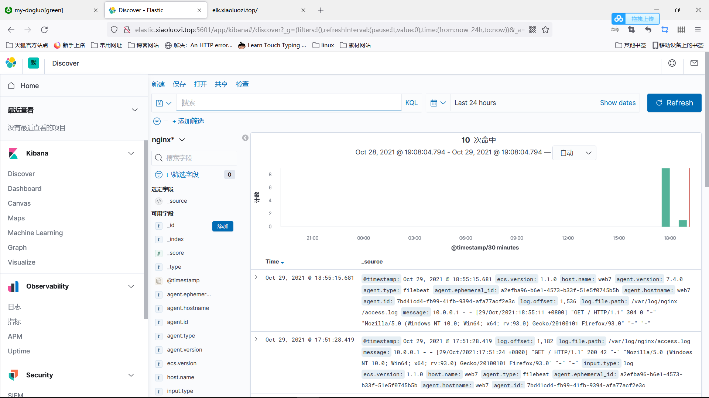

### nginx json日志收集实践

新的问题：需要统计状态码的情况；

统计所有请求总产生的流量大小；

统计来源使用的客户端；等等这些数据都在message字段中，无法满足数据分析需求

解决方案：需要将日志中的每一个选项都拆分出来，拆分成 key-value 的形式，那么就需要借助 json 的格式。

基本写法： oldxu 男 20

json写法：姓名：oldxu 性别：男 年龄：20

当需要筛选年龄时，通过 JSON 的方式就能很好的提
取出对应指标的值。这样也便于后续的分析

```bash
#首先将nginx日志格式更改为json格式（只需要更改log——format即可）
[root@web7 nginx]# cat /etc/nginx/nginx.conf
user www;
worker_processes  1;

error_log  /var/log/nginx/error.log notice;
pid        /var/run/nginx.pid;

events {
    worker_connections  1024;
}


http {
    include       /etc/nginx/mime.types;
    default_type  application/octet-stream;
    log_format  json '{ "time_local": "$time_local",' '
                        "remote_addr": "$remote_addr",' '
                        "referer": "$http_referer",' '
                        "request": "$request",' '
                        "status":"$status",' '
                        "bytes": "$body_bytes_sent",' '
                        "agent": "$http_user_agent",' '
                        "x_forwarded": "$http_x_forwarded_for",' '
                        "up_addr": "$upstream_addr",' '
                        "up_host": "$upstream_http_host",' '
                        "upstream_time": "$upstream_response_time",' '
                        "request_time": "$request_time",' '
}';
    access_log  /var/log/nginx/access.log  json;
    include /etc/nginx/conf.d/*.conf;
}
#nginx日志格式更改以后修改filebeat配置文件
[root@web7 nginx]# cat /etc/filebeat/filebeat.yml
filebeat.inputs:
- type: log
  enabled: true
  paths: /var/log/nginx/access.log
  json.keys_under_root: true  #Flase会将json解析的格式存储至messages，改为true则不存储至messages
  json.overwrite_keys: true #覆盖默认messages字段使用自定义json格式的key
output.elasticsearch:
  hosts: ["172.16.1.161:9200","172.16.1.162:9200","172.16.1.163:9200"]
  index: "nginx-access-%{[agent.version]}-%{+yyyy.MM.dd}"

setup.ilm.enabled: false
setup.template.name: "nginx"
setup.template.pattern: "nginx-*"

#清空nginx日志进行重启并重启filebeat冲刺你产生nginx的json日志
以下是更新前后日志区别
```

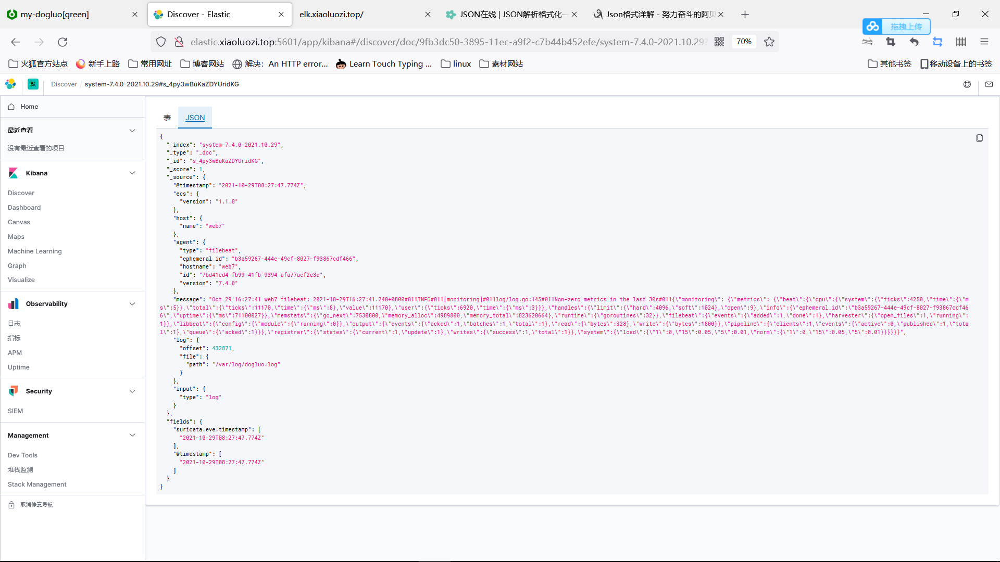

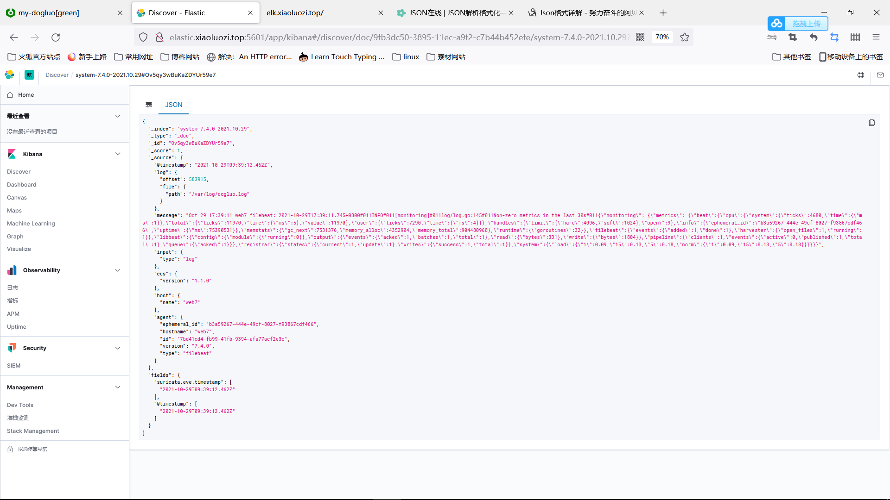

### nginx多个日志收集实践

nginx的日志存在访问日志和错误日志，怎么能让filebeat收集日志时满足以下需求

nginx访问日志 --存储--> nginx-access-7.4.0-2019.12 索引

nginx错误日志 --存储--> nginx-error-7.4.0-2019.12 索引

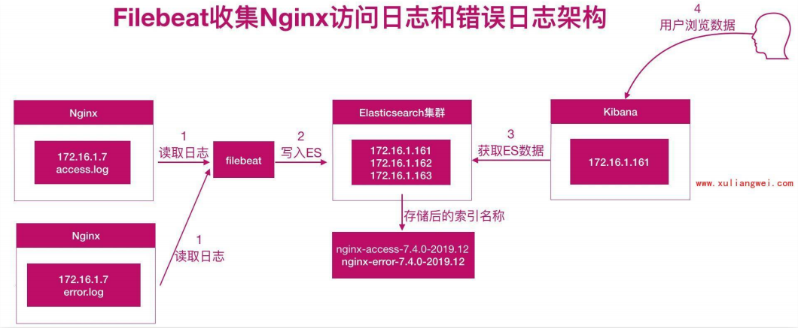

```bash
#配置filebeat收集多个日志，通过tags标签进行区分
[root@web7 ~]# cat /etc/filebeat/filebeat.yml
filebeat.inputs:
- type: log
  enabled: true
  paths: /var/log/nginx/access.log
  json.keys_under_root: true  #Flase会将json解析的格式存储至messages，改为true则不存储至messages
  json.overwrite_keys: true #覆盖默认messages字段使用自定义json格式的key
  tags: ["access"]

- type: log
  enabled: true
  paths: /var/log/nginx/error.log
  tags: ["error"]
output.elasticsearch:
  hosts: ["172.16.1.161:9200","172.16.1.162:9200","172.16.1.163:9200"]
  indices:
    - index: "nginx-access-%{[agent.version]}-%{+yyyy.MM.dd}"
      when.contains:
        tags: "access"  #tags为access的日志存储至nginx-access-*索引中
    - index: "nginx-error-%{[agent.version]}-%{+yyyy.MM.dd}"
      when.contains:
        tags: "error" #tags为error的日志存储至nginx-error-*索引
setup.ilm.enabled: false #索引生命周期ilm功能默认开启，开启情况下索引名称只能为filebeat-*
setup.template.name: "nginx"  #定义模板名称
setup.template.pattern: "nginx-*"  #定义模板的匹配索引名称
重启filebeat软件

```

使用kibana添加nginx错误日志索引，然后展示数据

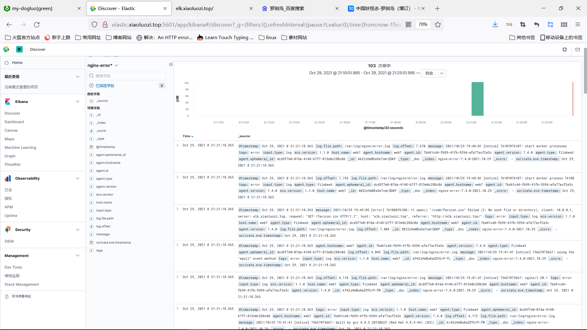

### nginx多虚拟机主机收集实践

完成单域名的多日志访问，若是多域名多日志该如何进行访问

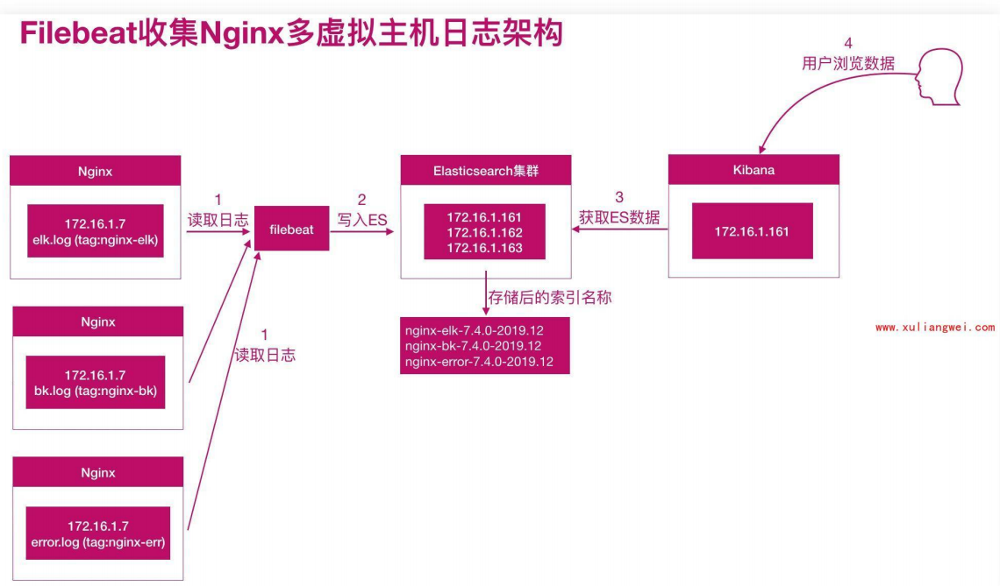

nginx配置

```bash
[root@web7 filebeat]# cat /etc/nginx/conf.d/elk.xiaoluozi.conf
server {
        listen 80;
        server_name elk.xiaoluozi.top;
        access_log  /var/log/nginx/elk.xiaoluozi.log json;  #将这个域名生成对日志存到指定日志中
        location / {
        root /code;
        index index.html;

}
}
```

&#x20;filebeat文件配置

```bash
[root@web7 filebeat]# cat filebeat.yml
filebeat.inputs:
- type: log
  enabled: true
  paths: /var/log/nginx/elk.xiaoluozi.log
  json.keys_under_root: true
  json.overwrite_keys: true
  tags: ["nginx-elk"]
- type: log
  enabled: true
  paths: /var/log/nginx/bk.xiaoluozi.log
  json.keys_under_root: true
  json.overwrite_keys: true
  tags: ["nginx-bk"]
- type: log
  enabled: true
  paths: /var/log/nginx/error.log
  tags: ["error"]
output.elasticsearch:
  hosts: ["172.16.1.161:9200","172.16.1.162:9200","172.16.1.1639200"]
  indices:
    - index: "nginx-elk-access-%{[agent.version]}-%{+yyyy.MM.dd}"
      when.contains:
        tags: "nginx-elk"
    - index: "nginx-bk-access-%{[agent.version]}-%{+yyyy.MM.dd}"
      when.contains:
        tags: "nginx-bk"
    - index: "nginx-error-%{[agent.version]}_%{+yyyy.MM.dd}"
      when.contains:
        tags: "error"
setup.ilm.enabled: false
setup.template.name: nginx
setup.template.pattern: nginx-*
```

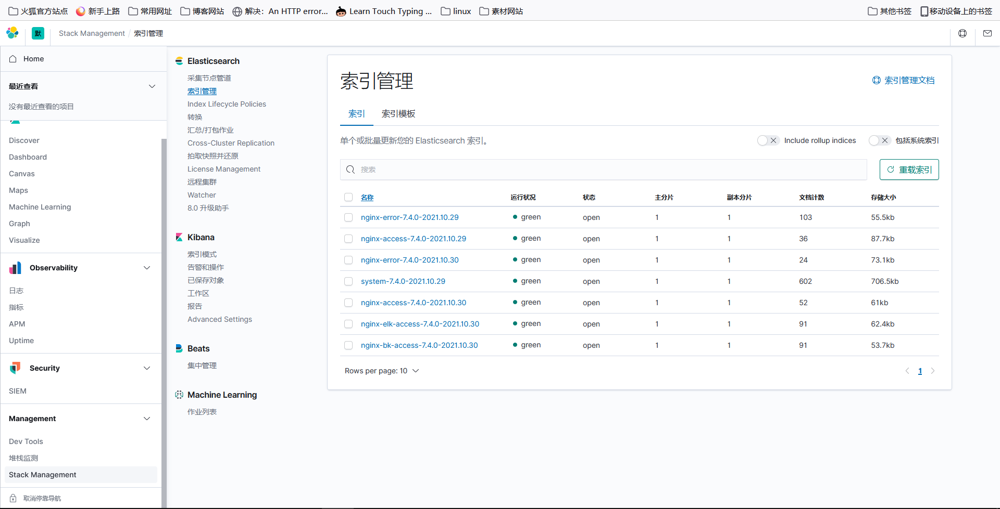

## filebeat收集tomcat实践

日志收集步骤和nginx一样，先将tomcat生成的日志文件转化为json格式，之后使用filebeat进行收集分析即可

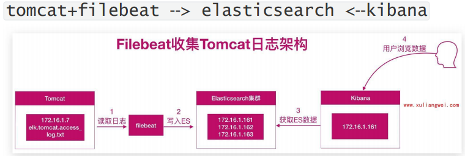

### 日志收集实践

```bash
#安装tomcat（略）
#修改tomcat网站访问日志格式为json格式
            <Host name="elk.tomcat.top" appBase="webapps" unpackWARs="true" autoDeploy="true">
                <Valve className="org.apache.catalina.valves.AccessLogValve" directory="logs"
                       prefix="elk.tomcat_access_log" suffix=".txt"
                       pattern="{&quot;clientip&quot;:&quot;%h&quot;,&quot;ClientUser&quot;:&quot;%l&
quot;,&quot;authenticated&quot;:&quot;%u&quot;,&quot;
AccessTime&quot;:&quot;%t&quot;,&quot;method&quot;:&quot;%r&quot;,&quot;status&quot;:&quot;%s&quot;,&
quot;
SendBytes&quot;:&quot;%b&quot;,&quot;Query?string&quot;:&quot;%q&quot;,&quot;partner&quot;:&quot;%{Re
ferer}i&quot;, &quot;
AgentVersion&quot;:&quot;%{User-Agent}i&quot;}"/>
</host>
启动tomcat(先停后启动)
```

检查tomcat日志格式

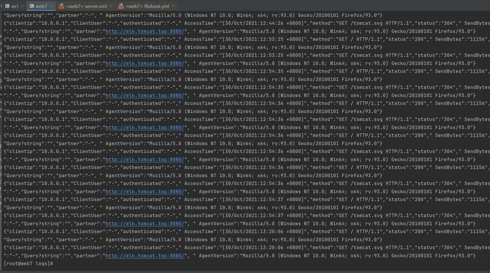

配置filebeat

```bash
filebeat.inputs:
- type: log
  enabled: true
  paths: /soft/tomcat/logs/elk.tomcat_access_log.*.txt  #进行分析监控日志
  json.keys_under_root: true
  json.overwrite_keys: true
output.elasticsearch:
  hosts: ["172.16.1.161:9200","172.16.1.162:9200","172.16.1.163:9200"]
  index: "elk-tomcat-access-%{[agent.version]}-%{+yyyy.MM.dd}"
setup.ilm.enabled: false   #索引生命周期ilm功能默认开启，开启情况下索引名称只能为filebeat-*
setup.template.name: "tomcat"  #定义模板名称
setup.template.pattern: "tomcat-*" #顶峰一模板匹配索引的名称
```

kibana结果

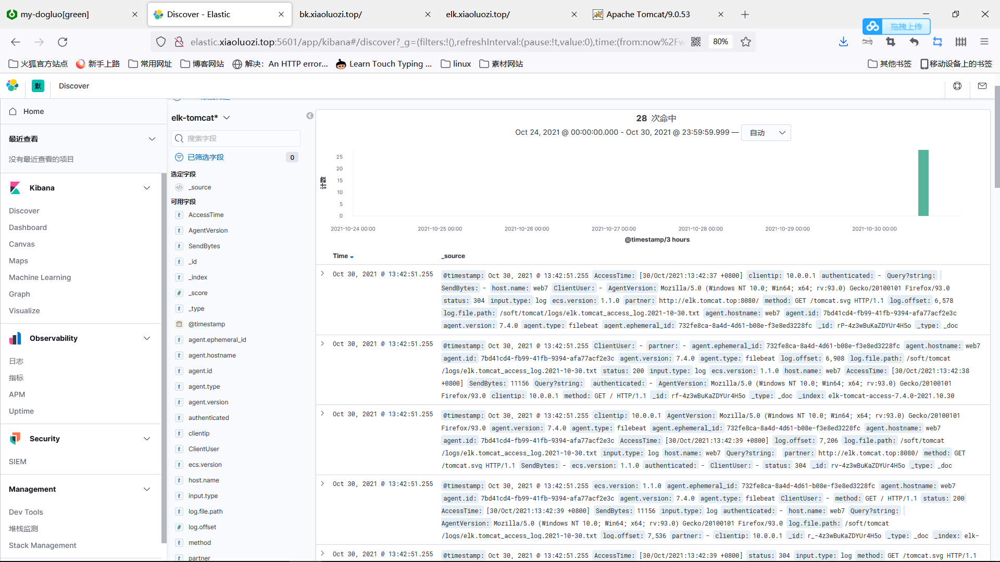

filebeat.inputs:

-   type: log

    enabled: true

    paths: /soft/tomcat/logs/elk.tomcat\_access\_log.\$(date +%Y-%m-%d).txt

    json.keys\_under\_root: true

    json.overwrite\_keys: true

output.elasticsearch:

hosts: \["172.16.1.161:9200","172.16.1.162:9200","172.16.1.163:9200"]

index: "elk-tomcat-access-%{\[agent.version]}-%{+yyyy.MM.dd}"

setup.ilm.enabled: false   #索引生命周期ilm功能默认开启，开启情况下索引名称只能为filebeat-\*

[setup.template.name](http://setup.template.name "setup.template.name"): "tomcat"  #定义模板名称

setup.template.pattern: "tomcat- \*" #顶峰一模板匹配索引的名称

### tomcat错误日志收集实践

tomcat错误日志特点

报错信息比较多

报错信息分很多行

错误日志收集思路

例1: Tomcat正常日志是以 "日期" 开头的。而报错日志中间的错误都不是以 "日期" 开头的。所以我们可以匹配以 “日期” 开头的一直到下一个日期出现则为一个事件日志。

例2: Elasticsearch正常日志是以 \[] 开头的。而报错日志中间的错误信息不是以 \[] 开头，所以可以匹配以 \[开头的行，一直到下一个 \[开头的出现则为一个事件日志。[官方匹配方式示例](https://www.elastic.co/guide/en/beats/filebeat/7.4/multiline-examples.html "官方匹配方式示例")

错误日志收集实践

```bash
#配置filebeat使filebeat收集tomcat日志
[root@web7 logs]# cat /etc/filebeat/filebeat.yml
filebeat.inputs:
- type: log
  enabled: true
  paths: /soft/tomcat/logs/elk.tomcat_access_log.*.txt
  json.keys_under_root: true
  json.overwrite_keys: true
  tags: ["access"]
- type: log
  enabled: true
  paths: /soft/tomcat/logs/catalina.out
  multiline.pattern: '^\d{2}'  #匹配以两个数字开头的
  multiline.negate: true
  multiline.match: after
  multiline.max_lines: 10000  #默认最大合并行数为500.根据实际情况进行调整
  tags: ["error"]
output.elasticsearch:
  hosts: ["172.16.1.161:9200","172.16.1.162:9200","172.16.1.163:9200"]
  indices:
    - index: "elk-tomcat-access-%{[agent.version]}-%{+yyyy.MM.dd}"
      when.contains:
        tags: "access" #当标签为access时日志索引存储到该索引
    - index: "elk-tomcat-error-%{[agent.version]}-%{+yyyy.MM.dd}"
      when.contains:
        tags: ["error"] #当tags标签为error时索引存储到该索引
setup.ilm.enabled: false   #索引生命周期ilm功能默认开启，开启情况下索引名称只能为filebeat-*
setup.template.name: "tomcat"  #定义模板名称
setup.template.pattern: "tomcat-*" #顶峰一模板匹配索引的名称

```

### ES错误日志收集实践

```bash
#配置filebeat收集elasticsearch错误日志
filebeat.inputs:
- type: log
  enabled: true
  paths: /var/log/elasticsearch/my.log
  multiline.pattern: '^\['
  multiline.negate: true
  multiline.match: after
output.elasticsearch:
  hosts: ["172.16.1.161:9200","172.16.1.162:9200","172.16.1.163:9200"]
  index: "es-%{[agent.version]}-%{+yyyy.MM.dd}"
setup.ilm.enabled: false
setup.template.name: "es"
setup.template.pattern: "es-*"

```
