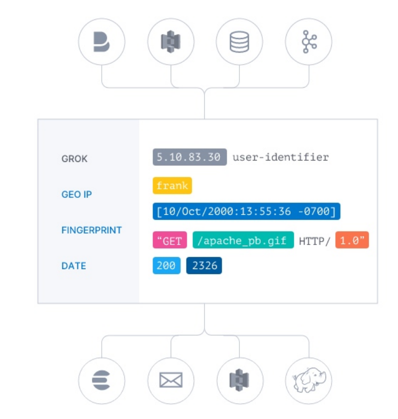
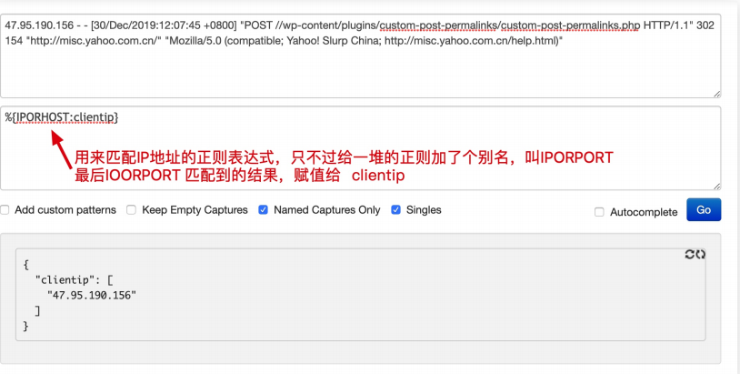
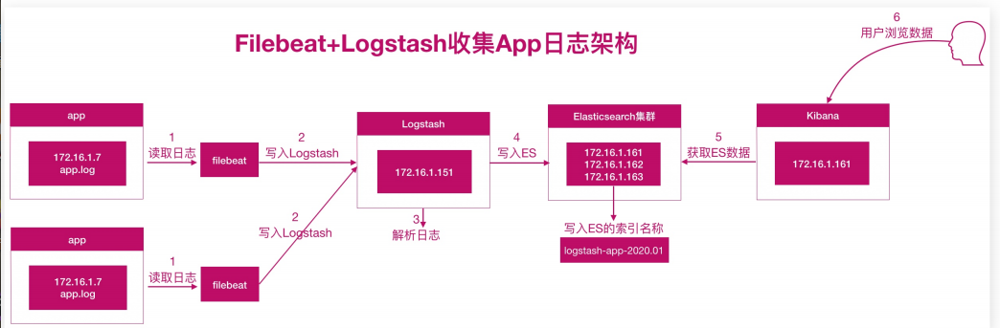
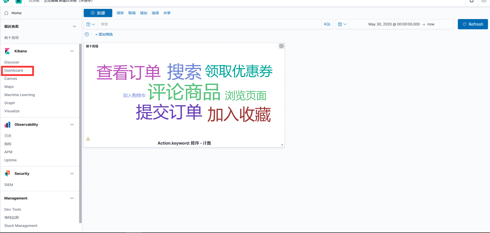
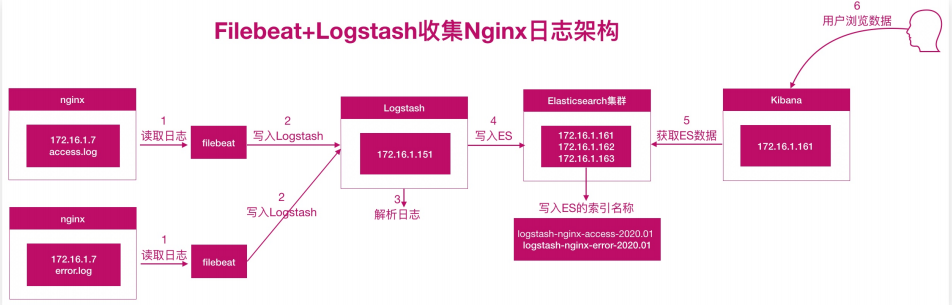
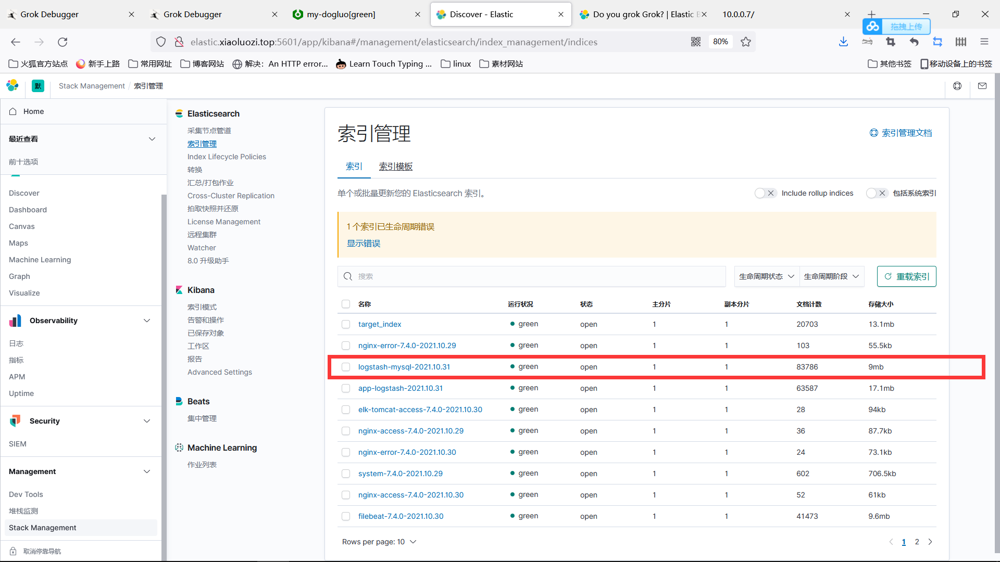

# Logstash日志收集及分析

## 目录

-   [logstash架构简介](#logstash架构简介)
    -   [架构介绍](#架构介绍)
-   [input插件](#input插件)
    -   [stdin插件](#stdin插件)
    -   [file插件](#file插件)
    -   [beats插件](#beats插件)
    -   [kafka插件](#kafka插件)
-   [logstash filter插件](#logstash-filter插件)
-   [Grok插件](#Grok插件)
    -   [grok语法示例](#grok语法示例)
    -   [geoip插件](#geoip插件)
    -   [field字段](#field字段)
    -   [Date插件](#Date插件)
    -   [useragent插件](#useragent插件)
    -   [mutate插件](#mutate插件)
        -   [remove\_field](#remove_field)
        -   [split](#split)
        -   [add\_field](#add_field)
        -   [convert](#convert)
-   [logstarsh output插件](#logstarsh-output插件)
    -   [stdout插件](#stdout插件)
        -   [file插件](#file插件)
        -   [elastic插件](#elastic插件)
-   [logstash分析app日志](#logstash分析app日志)
-   [logstash进行日志分析实践](#logstash进行日志分析实践)
    -   [实现思路及收集架构](#实现思路及收集架构)
    -   [nginx日志收集实践](#nginx日志收集实践)
-   [logstash对mysql慢日志进行收集实践](#logstash对mysql慢日志进行收集实践)

## logstash架构简介

Logstash 是开源的数据处理管道，能够同时从多个源采集数据，转换数据，然后输出数据，因为部分产生的数据无法像nginx那种直接将日志转化为json格式，但是可以节后logstash进行"非结构化数据"转为"结构化数据" [官网入口](https://www.elastic.co/cn/downloads/logstash "官网入口")

### 架构介绍

基础架构类似于pipeline流水线，如下所示

Input：数据采集（常用插件：stdin、file、kafka、beat、http）

Filter：数据解析/转换（常用插件：grok、date、geoip、mutate、useragent）

Output：数据输出 （常用插件：Elasticsearch、）

logstash安装及初始化配置

```bash
wget  https://artifacts.elastic.co/downloads/logstash/logstash-7.8.1.rpm
rpm -ivh logstash
[root@logstash-node1 ~]# vim /etc/logstash/logstash.yml
node.name: logstash-node1
path.data: /var/lib/logstash
pipeline.workers: 2
pipeline.batch.size: 1000
path.logs: /var/log/logstash

[root@logstash-node1 ~]# vim /etc/logstash/jvm.options
-Xms1g
-Xmx1g

```

## input插件

该插件用于指定输入源，一个pipeline可以有多个inut插件，主要了解以下几个：stdin，file，beat，kafka，http

### stdin插件

```bash
#从标准读取数据。从标准输出中输出内容
[root@logstash ~]# cat /etc/logstash/conf.d/stdin_logstash.conf
input {
    stdin {
    type => "stdin"  #定义实践类型，可用于后期判断
    tags => "stdin_type"  #自定义实践tag用于后续判断
}
}
output {
    stdout{
        codec => "rubydebug"
    }
}
测试: /usr/share/logstash/bin/logstash -f /etc/logstash/conf.d/stdin_logstash.conf 
返回结果
{
       "message" => "hello",
    "@timestamp" => 2021-10-30T07:36:32.852Z,
          "tags" => [
        [0] "stdin_type"
    ],
          "host" => "logstash",
          "type" => "stdin",
      "@version" => "1"
}


```

### file插件

```bash
#从file文件读取数据，然后输入至标准输入
input {
    file {
        path => "/var/log/dogluo.log"
        type => syslog
        exclude => "*.gz"  #不想监听的文件规则，基于glod语法匹配规则
        start_position => "beginning"  #第一次从头开始读取文件beginning or end
        stat_interval => "3"  #定时检查文件是否更新，默认1s
    }
}
output {
    stdout {
        codec => rubydebug
    }
}
#执行测试
/usr/share/logstash/bin/logstash -f /etc/logstash/conf.d/file_logstash.conf


反馈数据
    "@timestamp" => 2021-10-30T08:10:03.353Z,
          "host" => "logstash",
          "path" => "/var/log/dogluo.log",
      "@version" => "1",
          "type" => "syslog"
}
{
       "message" => "Oct 29 17:48:08 web7 filebeat: 2021-10-29T17:48:08.276+0800#0
11INFO#011[monitoring]#011log/log.go:145#011Non-zero metrics in the last 30s#011{\
"monitoring\": {\"metrics\": {\"beat\":{\"cpu\":{\"system\":{\"ticks\":20},\"total
\":{\"ticks\":60,\"time\":{\"ms\":2},\"value\":60},\"user\":{\"ticks\":40,\"time\"
:{\"ms\":2}}},\"handles\":{\"limit\":{\"hard\":4096,\"soft\":1024},\"open\":5},\"i
nfo\":{\"ephemeral_id\":\"d4bb793a-3beb-4210-8cc1-285a4fbf8d1a\",\"uptime\":{\"ms\
":270032}},\"memstats\":{\"gc_next\":7017088,\"memory_alloc\":3971984,\"memory_tot
al\":12109568},\"runtime\":{\"goroutines\":22}},\"filebeat\":{\"harvester\":{\"ope
n_files\":0,\"running\":0}},\"libbeat\":{\"config\":{\"module\":{\"running\":0}},\
"pipeline\":{\"clients\":1,\"events\":{\"active\":0}}},\"registrar\":{\"states\":{
\"current\":0}},\"system\":{\"load\":{\"1\":0,\"15\":0.09,\"5\":0.04,\"norm\":{\"1
\":0,\"15\":0.09,\"5\":0.04}}}}}}",


```

### beats插件

```bash
#从filebeat文件中读取数据，然后输入至标准输入
inputs {
    beats {
    port => 5044  #只要端口不冲突，随便
    }
}
output {
    stfout {
        codec => rubydebug
    }
}


#远程主机都filebeat文件添加output.logstash出口去往主机，出端端口写上边port
```

### kafka插件

```bash
#从kafka文件中读取数据，然后输入至标准输入
input {
  kafka {
    zk_connect =>
        "kafka1:2181,kafka2:2181,kafka3:2181"
        group_id => "logstash"
        topic_id => "apache_logs"
        consumer_threads => 16
}
}


```

## logstash filter插件

利用 Grok 从非结构化数据中派生出结构

利用 geoip 从 IP 地址分析出地理坐标

利用 useragent 从 请求中分析操作系统、设备类型



## Grok插件

如果我们想把一段非结构化数据解析成json结构化数据，就需要用到非常复杂的正则，而grok时带有名字的正则表达式集合，内置的很多pattern可以直接使用

[grok案列](https://www.elastic.co/cn/blog/do-you-grok-grok "grok案列")   [grok语法生成器](http://grokdebug.herokuapp.com/ "grok语法生成器")



#### grok语法示例

```bash
42.193.107.68 - - [30/Dec/2019:11:59:18 +0800] "GET / HTTP/1.1" 302 154 "." "Mozilla/5.0 (Macintosh; Intel Mac OS X10_14_1) Chrome/79.0.3945.88Safari/537.36"

#使用grok pattern将nginx日志格式转发为json格式
[root@logstash conf.d]# cat grok_logstash.conf
input {
    http {
    port => 5656
    }
}
filter {
    grok {
        match => {
        "message" => "%{COMBINEDAPACHELOG}"
        }
    }
}
output {
    stdout {
        codec => rubydebug
    }
}
nginx节点服务器的filebeat配置
。。。
output.logstash:
  hosts: ["172.16.1.151:5656"]
。。。。
```

### geoip插件

```bash
#通过geoip提取nginx日志中clientip地段，并获取低于信息
filter {
...
#提取clientip字段，获取地域信息
geoip {
source => "clientip"
}
...
}

```

### field字段

```bash
#由于输出内容太多，可以通过fileds选项选择自己需要的信息
filter {
...
# 提取clientip字段，获取地域信息
    geoip {
      source => "clientip"
      fields => ["country_name","country_code2","timezone","longitude","latitude","continent_code"]
# 仅提取需要获取的指标
}
...
}
#使用公网IP进行访问ip进行生成访问日志

```

### Date插件

date插件：将日期字符串解析为日志类型。然后替换@timestamp 字段或指定的其他字段。[timezone时间](http://joda-time.sourceforge.net/timezones.html "timezone时间")

match 类型为数组，用于指定日期匹配的格式，可以以此指定多种日期格式

target 类型为字符串，用于指定赋值的字段名，默认是 @timestamp

timezone 类型为字符串，用于指定时区域

```bash
#将nginx请求中的timestamp日志进行解析
filter {
...
#解析date日期 30/Dec/2019:11:40:44 +0800
  date {
      match => ["timestamp","dd/MMM/yyyy:HH:mm:ss Z" ]
      target => "nginx_date"
      timezone => "Asia/Shanghai"
}
}


```

### useragent插件

```bash
#根据请求中的user-agent字段，解析出浏览器设备，操作系统信息
filter {
...

#提取agent字段，进行解析
useragent {
    source => "agent" #指定丛哪个字段获取数据解析
    target => "useragent" #转换后的新字段
}
}

```

### mutate插件

mutate 主要是对字段进行、类型转换、删除、替换、更新等操作；

remove\_field 删除字段

split 字符串切割(awk取列)

add\_field 添加字段&#x20;

convert 类型转换

gsub 字符串替换

rename 字段重命名

#### remove\_field

```bash
#mutate删除无用字段。
filter {
...
    #mutate 删除操作
    mutate {
      remove_field => ["headers","message", "agent"]  #排除这些字段
}
...
}

```

#### split

```bash
#split进行字符分割，指定|为字符分隔符
filter {
  mutate {
  #字段分隔符
    split => { "message" => "|" }
}
}

```

#### add\_field

```bash
#可以将分割后的数据创建出新的字段名称方便统计分析
filter {
  mutate {
    #字段分隔符
    split => { "message" => "|" }

      #将分割后的字段添加到指定的字段名称
    add_field => {
      "UserID" => "%{[message][0]}"
      "Action" => "%{[message][1]}"
      "Date" => "%{[message][2]}"
    }
  }
}

```

#### convert

此插件进行类型转换，支持转换intger、float、string等类型

```bash
filter {
  mutate {
  #字段分隔符
    split => { "message" => "|" }

    #将分割后的字段添加到指定的字段名称
    add_field => {
      "UserID" => "%{[message][0]}"
      "Action" => "%{[message][1]}"
      "Date" => "%{[message][2]}"
}
    #对新添加字段进行格式转换
    convert => {
    "UserID" => "integer"
    "Action" => "string"
    "Date" => "string"
}
#移除无用的字段
    remove_field => ["headers","message"]
}
}

```

## logstarsh output插件

stdout、file、elasticsearch

### stdout插件

stdout插件将数据输出到屏幕终端，便于调式

```bash
output {
    stdout {
        codec => rubydebug
}
}
```

#### file插件

输出到文件，实现将分散在多地的文件统一到一处：

比如将所有 web 机器的 web 日志收集到一个文件中，从而方便查阅信息；

```bash
output {
    file {
      path => "/var/log/web.log"
}
}
```

#### elastic插件

输出到elasticsearch，最常用的输出插件

```bash
output {
  elasticsearch {
    hosts =>["172.16.1.162:9200","172.16.1.163:9200"]
    #一般写data地址
      index => "nginx-%{+YYYY.MM.dd}"
    #索引名称
      template_overwrite => true
    #覆盖索引模板
  }
}

```

## logstash分析app日志

app日志收集概述及架构

app日志主要是用来记录用户的操作，架构如下



收集日志思路

1.首先通过filebeat读取日志文件的内容，并且将内容发送给logstash

2.logstash接受内容后，将数据转化为结构化数据，然后输出给elasticsearch

3.kibana添加elasticsearch索引，读取数据，然后在利巴拿中进行分析，自组后进行展示

启动app日志并怕配置filebeat

```bash
java -jar app.jar
#配置filebeat
[root@web7 filebeat]# cat filebeat.yml
filebeat.inputs:
- type: log
  enabled: true
  paths: /var/log/app.log   #读取app.log日志
output.logstash:
  hosts: ["172.16.1.151:5000"]  #日志交给logstash进行处理
#配置logstash
[root@logstash conf.d]# cat app.logstash.conf
input {
        beats {
        port => 5000
}
}
filter {
        mutate {
            split => { "message" => "|" }
            add_field => {
                    "UserID" => "%{[message][1]}"
                    "Action" => "%{[message][2]}"
                    "Date" => "%{[message][3]}"
                    "[@metadata][target_index]" => "app-logstash-%{+YYYY.MM.dd}"
                }
        convert => {
            "UserID" => "integer"
            "Action" => "string"
            "Date" => "string"
              }
        remove_field => ["message","headers"]
            }
    date {
        match => ["Date","yyyy-MM-dd HH:mm:ss"]
        target => "%timestamp"
        timezone => "UTC"
    }
}
output {
    stdout {
    codec => rubydebug
    }
    elasticsearch {
        hosts => ["172.16.1.161:9200","172.16.1.162:9200","172.16.1.163:9200"]
        index => "%{[@metadata][target_index]}"
    }
}


```

在浏览器中进行获知kibana可视化图形，先在kibana中canva进行编辑，在dashboard进行添加



## logstash进行日志分析实践

### 实现思路及收集架构

思路：

1.将 Nginx 普通日志转换为 json

2.将 Nginx 日志的时间格式进行格式化输出

3.将 Nginx 日志的来源IP进行地域分析

4.将 Nginx 日志的 user-agent 字段进行分析

5.将 Nginx 日志的 bytes 修改为整数

6.移除没有用的字段，message、headers



### nginx日志收集实践

```bash
#filebeat配置
[root@web7 nginx]# cat /etc/filebeat/filebeat.yml
filebeat.inputs:
- type: log
  enabled: true
  paths: /var/log/nginx/access.log
  tags: ["nginx-access"]

- type: log
  enabled: true
  paths: /var/log/nginx/error.log
  tags: ["nginx-error"]
output.logstash:
  hosts: ["172.16.1.151:5044"]
#logstash配置
input {
    beats {
        port => 5044
    }
}
filter {
    if "nginx-access" in [tags][0] {
    grok {
    match => {"message" => "%{COMMONAPACHELOG}"}
        }
      date {
        match => ["timestamp","dd/MMM/yyyy:HH:mm:ss Z"]
        target => "@timstamp"
        timezone => "Asia/Shanghai"
        }
        geoip {
            source => "clientip"
        }
        useragent {
            source => "useragent"
            target => "useragent"
        }
        mutate {
        convert => ["bytes","integer"]
        #remove_field => ["messages","agent","input","ecs"]
        add_field => {"target_index" => "logstash-nginx-access-%{+YYYY.MM.dd}"}
        }
    }
    else if "nginx-error" in [tags][0] {
    mutate {
        add_field => {
        "target_index" => "logstash-nginx-error-%{+YYYY.MM.dd}"
        }
   }
    }
}
output {
    elasticsearch {
        hosts => ["172.16.1.161:9200","172.16.1.162:9200","172.16.1.162:9200"]
        index => "target_index"
    }
}


```

kibana配置


## logstash对mysql慢日志进行收集实践

```bash
#配置mysql
[mysqld]
datadir=/var/lib/mysql
socket=/var/lib/mysql/mysql.sock
# Disabling symbolic-links is recommended to prevent assorted security risks
symbolic-links=0
# Settings user and group are ignored when systemd is used.
# If you need to run mysqld under a different user or group,
# customize your systemd unit file for mariadb according to the
# instructions in http://fedoraproject.org/wiki/Systemd
slow_query_log=ON
slow_query_log_file=/var/log/mariadb/slow.log
long_query_time=3
[mysqld_safe]
log-error=/var/log/mariadb/mariadb.log
pid-file=/var/run/mariadb/mariadb.pid

#
# include all files from the config directory
#
!includedir /etc/my.cnf.d
#配置节点的filebeat
[root@db etc]# cat /etc/filebeat/filebeat.yml
filebeat.inputs:
- type: log
  enabled: true
  paths: /var/log/mariadb/slow.log
  exclude_lines: ['^\#Time']  #排除匹配的行
  multiline.pattern: '^\#User'
  multiline.netgate: true
  multiline.match: after
  multiline.max_lines: 1000
output.logstash:
  hosts: ["172.16.1.151:5055"]
#配置logstash节点
[root@logstash conf.d]# cat mysql.logstash.conf
input {
        beats {
                port => 5055
        }

}

filter {
        mutate {
                gsub => [ "message", "\n", " "]

        }


    #grok {
     #   match => { "message" => "(?m)^# User@Host: %{USER:User}\[%{USER-2:User}\] @ (?:(?<Clienthost>\S*) )?\[(?:%{IP:Client_IP})?\] # Thread_id: %{NUMBER:Thread_id:i
nteger}\s+ Schema: (?:(?<DBname>\S*) )\s+QC_hit: (?:(?<QC_hit>\S*) )# Query_time: %{NUMBER:Query_Time}\s+ Lock_time: %{NUMBER:Lock_Time}\s+ Rows_sent: %{NUMBER:Rows_Se
nt:integer}\s+Rows_examined: %{NUMBER:Rows_Examined:integer} SET timestamp=%{NUMBER:timestamp}; \s*(?<Query>(?<Action>\w+)\s+.*)" }
    #}


    #date {
    #    match => ["timestamp","UNIX", "YYYY-MM-dd HH:mm:ss"]
    #    target => "@timestamp"
    #    timezone => "Asia/Shanghai"
    #}

    #mutate {
     #   #移除message等字段
     #   remove_field => ["message","input","timestamp"]

        #对Query_time Lock_time 格式转换为浮点数
      #  convert => ["Lock_Time","float"]
       # convert => ["Query_Time","float"]

        #添加索引名称
      #add_field => { "[@metadata][target_index]" => "logstash-mysql-%{+YYYY.MM.dd}" }
 #   }


}


output {
        stdout {
                codec => rubydebug
        }

 #   elasticsearch {
  #      hosts => ["172.16.1.161:9200","172.16.1.162:9200"]
 #       index => "%{[@metadata][target_index]}"
   #     template_overwrite => true
   # }


}

```

效果展示



建立索引以后进行建立可视化图形，进行图形监控
