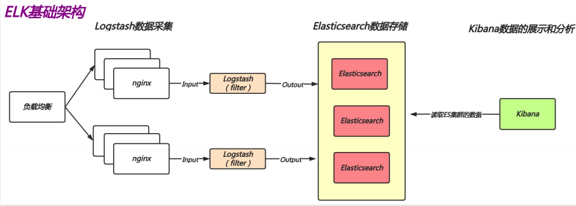
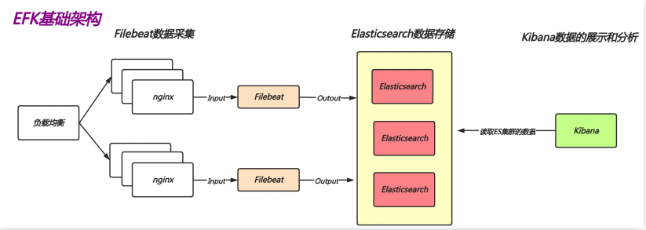
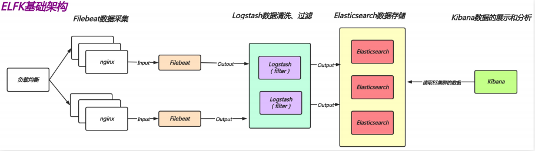

# ELK日志收集概述

## 目录

-   [ELK基本概述](#ELK基本概述)
-   [EFK](#EFK)
-   [ELFK](#ELFK)
-   [elfk主要收集的日志](#elfk主要收集的日志)

## ELK基本概述

ELK 不是一个单独的技术，而是一套技术组合，是由elasticsearch、logstash、kibana 组合而成的。

ELK 是一套开源免费、功能强大的日志分析管理系统。

ELK 可以将我们的系统日志、网站日志、应用系统日志
等各种日志进行收集、过滤、清洗，然后进行集中存放
并可用于实时检索、分析

E: elasticsearch数据存储；

L: logstash数据采集、数据清洗、数据过滤；

K: kibana 数据分析、数据展示；

## EFK

因为 logstash 是基于 JAVA 开发的，在收集日志时会大量的占用业务系统资源，从而影响正常线上业务。而替换成 filebeat 这种较为轻量的日志收集组件，会让业务系统的运行更加的稳定

## ELFK

就是将elasticsearch，logstach，filebeat，kibana结合起来的集群服。

## elfk主要收集的日志

代理： Haproxy、Nginx

web：Nginx、Tomcat、Httpd、PHP

db：mysql、redis、mongodb、elasticsearch

存储：nfs、glusterfs、fastdfs

系统：message、security

业务：app
