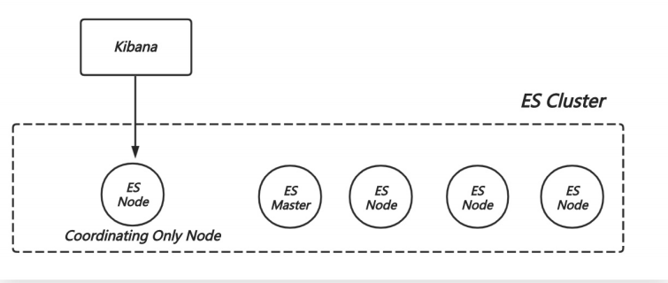
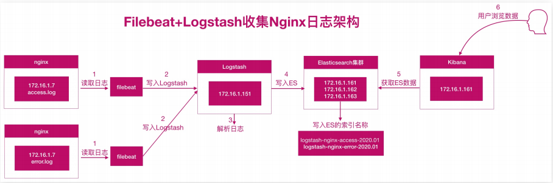

# kibana站点业务日志分析

## 目录

-   [kibana数据概述](#kibana数据概述)
    -   [基本概述及架构](#基本概述及架构)
    -   [kibana展示业务日志](#kibana展示业务日志)
    -   [日志分析架构图](#日志分析架构图)
-   [kibana安全访问机制](#kibana安全访问机制)
    -   [基于nginx访问控制](#基于nginx访问控制)
    -   [基于RBAC访问控制](#基于RBAC访问控制)
    -   [配置kibana认证](#配置kibana认证)
    -   [配置logstash](#配置logstash)

## kibana数据概述

### 基本概述及架构

kibana是用来数据展示、数据分析、数据探索的web ui工具

kibana 线上部署的推荐架构，专门部署一个coordinating only ES Node，和 Kibana 在同一台机器上；



### kibana展示业务日志

[日志下载传送门](http://cdn.xuliangwei.com/access-2020.1w.log "日志下载传送门")

不同维度分析日志

Nginx 访问分析

访问人数？流量？

访问来源分布、访问站点分布、访问页面排名

请求响应时间分布

请求响应码分布

访问地图分布

网站业务数据分析

访问量最大的是视频还是文章

最受欢迎视频、文章有哪些

最努力的用户是谁

兴趣最广泛的用户数是

用户哪个时间段最活跃

### 日志分析架构图



配置之前的nginx日志进行配置filestash进行日志分析，elasticsearch进行分析生成数据索引。进行可视化图形界面

配置kibana可视化界面

统计网站总PV、独立IP个数（指标）
统计网站的总流量（指标图）
统计访问IP Top10（水平条形图）
统计来源的refrer
统计前10的资源（饼图或标签云）
统计访问状态码（饼图或时序图）
统计客户端设备（饼图）
统计大于1s请求
统计网站时间趋势流量（垂直条形图）

## kibana安全访问机制

默认情况下，kibana 可以直接通过浏览器打开进行操作，这样的话任何人都可以通过该方式打开，极其的不安全，我们可以通过如下两种方式来实现访问控制；

方式1：nginx+kibana 非常简单实现方式；
方式2：kibana roles 比较推荐方式；

### 基于nginx访问控制

```bash
#安装nginx
yum install nginx
#生成密码文件
[root@oldxu-logstash-node1-172 ~]# htpasswd -c -b /etc/nginx/auth_conf oldxu 123456
#配置nginx反向代理以及端口隐藏
[root@oldxu-logstash-node1-172 ~]# vim /etc/nginx/conf.d/kibana.oldxu.com.conf
server {
    listen 80;
    server_name kibana.oldxu.com;
    auth_basic "closed site";
    auth_basic_user_file /etc/nginx/auth_conf;

    location / {
      proxy_pass
      http://127.0.0.1:5601$request_uri;
      include proxy_params;
}
}
#虽然解决了访问控制，但是无法限制用户的权限

```

### 基于RBAC访问控制

从elastic stack6和7开始，在默认分发中免费提供多项安全功能，例如加密通信和角色的访问控制等等

```bash
#启用eahlstic tls
[root@es-node1-172 ~]#/usr/share/elasticsearch/bin/elasticsearchcertutil \
cert -out /etc/elasticsearch/elasticcertificates.p12 -pass ""
[root@es-node1-172 ~]# chmod 660
/etc/elasticsearch/elastic-certificates.p12
#配置elastic配置文件。添加如下内容（都有添加）
[root@es-node1-172 ~]# vim /etc/elasticsearch/elasticsearch.yml
xpack.security.enabled: true
xpack.security.transport.ssl.enabled: true
xpack.security.transport.ssl.verification_mode: certificate
xpack.security.transport.ssl.keystore.path:elastic-certificates.p12
xpack.security.transport.ssl.truststore.path: elastic-certificates.p12
#拷贝TLS证书至集群的所有we节点
scp -rp /etc/elasticsearch/elasticcertificates.p12 root@172.16.1.162:/etc/elasticsearch/
scp -rp /etc/elasticsearch/elasticcertificates.p12 root@172.16.1.163:/etc/elasticsearch/
注意：需要重启所有elastic集群节点
systemctl restart elasticsearch
#设定elastic集群密码
#一旦主机点开始运行，便可以为集群设置密码了
  auto会为不同的内部栈生成随机免密
  ineractive配置可以手动定义密码
  [root@es-node1-172 ~]#
  /usr/share/elasticsearch/bin/elasticsearchsetup-passwords auto
#请记录这些密码，我们很快就会再次用到这些密码。

```

### 配置kibana认证

在 kibana 中实现安全性，我们需要为 Kibana 用户添加密码。我们可以从之前 setup-passwords 命令的输出内容中找到密码

```bash
[root@es-node1-172 ~]# vim /etc/kibana/kibana.yml
elasticsearch.username: "kibana"
elasticsearch.password: "JtE2EyyZD9muQCXOXd5q" #setup-passwords获取的 Kibana 密码
[root@es-node1-172 ~]# systemctl restart kibana
```

### 配置logstash

Logstash 数据传输至 TLS版ES 集群；需要创建一个 super角色的用户；

```bash
output {
  elasticsearch {
    hosts =>["172.16.1.161:9200","172.16.1.162:9200","172.16.1.163:9200"]
    user => ""
    password => ""
    index => "%{[target_index]}"
    template_overwrite => true
  }
登录kibana进行测试
```

[kibana配置RBAC官网](https://www.elastic.co/cn/blog/getting-started-with-elasticsearch-security "kibana配置RBAC官网")地址
