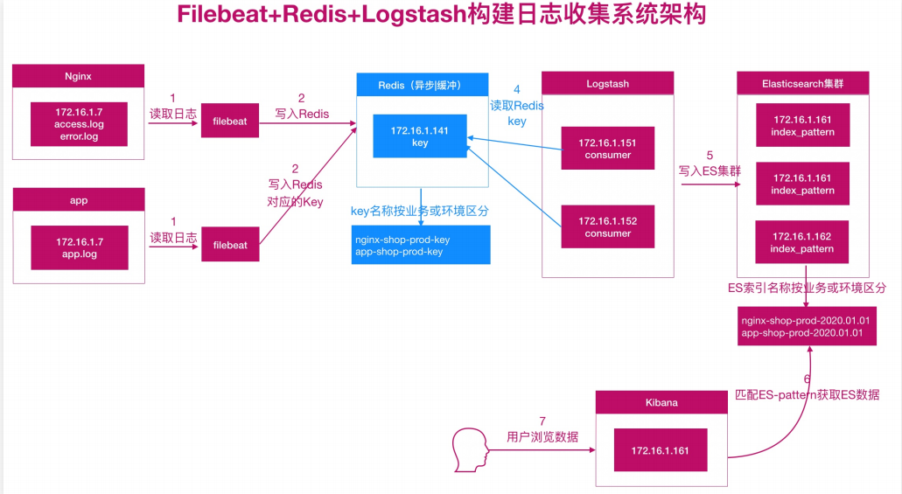
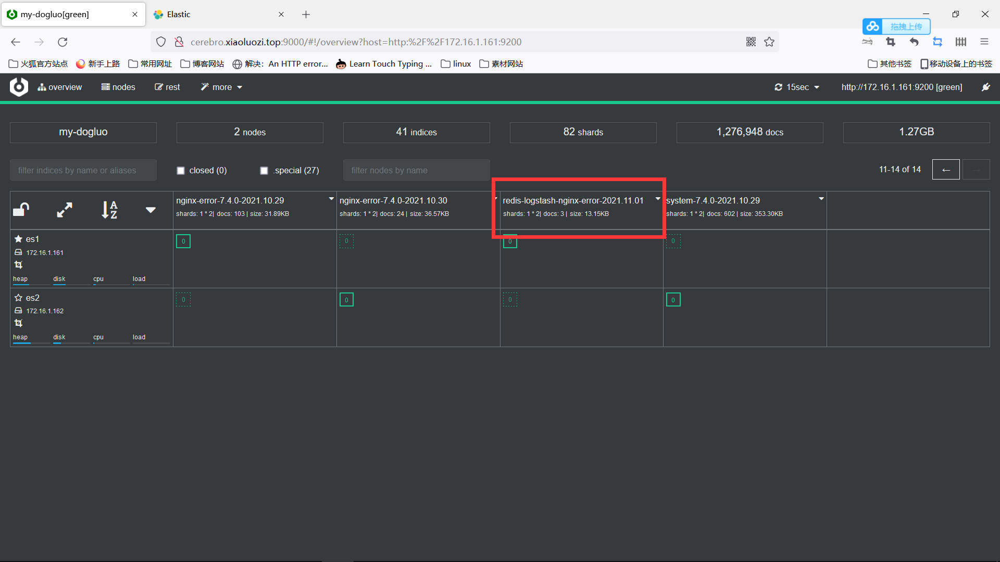
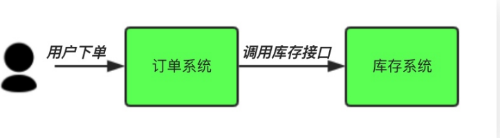
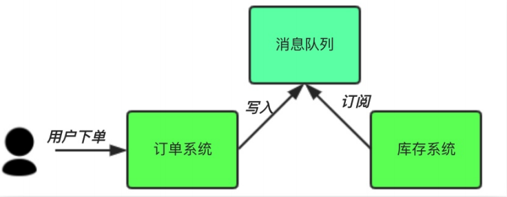
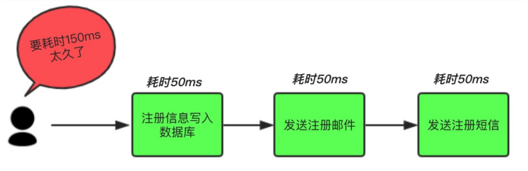
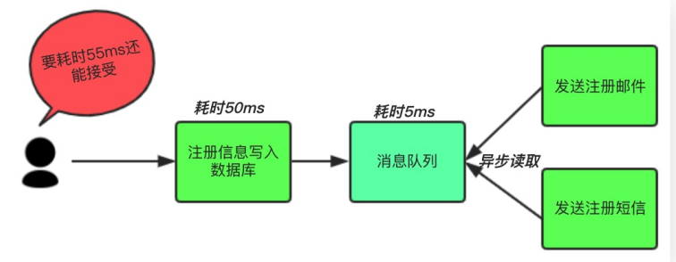
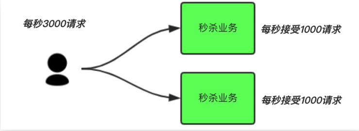
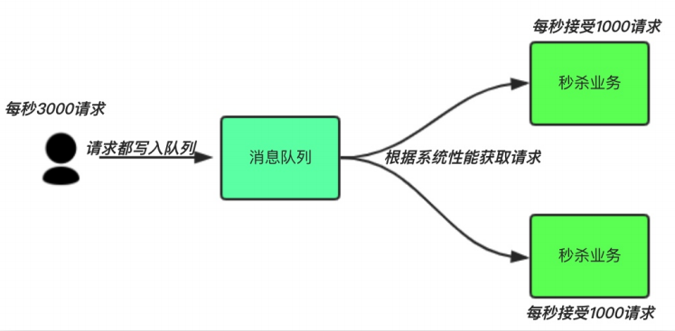
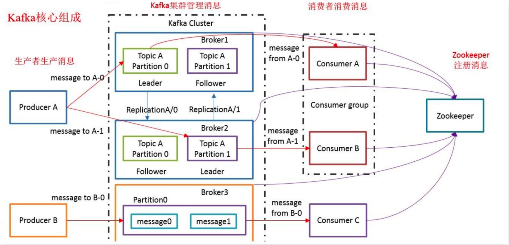

# kafka架构

## 目录

-   [当前elk架构面临的问题](#当前elk架构面临的问题)
    -   [耦合度高](#耦合度高)
    -   [性能瓶颈](#性能瓶颈)
-   [elk对接redis实践](#elk对接redis实践)
-   [消息队列概述](#消息队列概述)
-   [消息队列使用场景](#消息队列使用场景)
-   [kafka架构](#kafka架构)
-   [kafka环境准备](#kafka环境准备)
    -   [单播和多播消费](#单播和多播消费)
-   [kafka集群架构搭建](#kafka集群架构搭建)
    -   [kafka集群验证](#kafka集群验证)
    -   [kafka容错机制](#kafka容错机制)
-   [kafka-eagle安装](#kafka-eagle安装)
    -   [eagle监控](#eagle监控)
    -   [配置filebeat](#配置filebeat)

## 当前elk架构面临的问题

### 耦合度高

-   场景

    假设目前系统日志输出很频繁，十分钟大约5Gb，那么一个小时就是30Gb；而应用服务器的存储空间一般默认40Gb，所以通常会对应用服务器日志按小时轮转。如果我们的Logstash故障了1小时，那么Filebeat就无法向Logstash发送日志，但我们的应用服务器每小时会对日志进行切割，那么也就意味着我们会丢失1小时的日志数据；
-   解决方法

    使用消息队列，只要你的filebeat能够收集日志，队列能够存储足够长时间的数据，那后面logstash故障了，也不用担心，等Logstash修复后，日志依然能正常写入，也不会造成数据丢失，这样就完成了解耦；

### 性能瓶颈

-   场景

    使用filebeat或logstash直接写入ES，那么日志频繁的被写入ES的情况下，可能会造成ES出现超时、丢失等情况。因为ES需要处理数据，存储数据，所以性能会变的很缓慢；
-   解决办法

    使用消息队列，filebeat或Logstash直接写入消息队列中就可以了，因为队列可以起到一个缓冲作用，最后我们的logstash根本ES的处理能力进行数据消费，匀速写入ES集群，这样能有效缓解ES写入性能的瓶颈；

## elk对接redis实践

使用redis充当消息队列服务



实验步骤

```bash
#安装redis（在一台全新节点）
yum install redis -y 
#配置redis
[root@web02 ~]# grep "^[a-Z]" /etc/redis.conf
bind 127.0.0.1 172.16.1.41
requirepass 123456
#启动redis
systemctl restart redis
systemctl enable redis

#在filebeat节点配置filebeat
#修改filebeat输出数据至redis队列
[root@web7 filebeat]# cat filebeat.yml
filebeat.inputs:
- type: log
  enabled: true
  paths: /var/log/nginx/access.log
  tags: ["access"]

- type: log
  enabled: true
  paths: /var/log/nginx/error.log
  tags: ["error"]
output.redis:
  hosts: ["172.16.1.41:6379"]   #redis服务节点的地址
  password: 123456    #链接redis的密码
  timeout: 5  #链接超时时间
  db: 0    #写入db0库中
  keys:    #存储的可以名称
    - key: "nginx_access"
      when.contains:
        tags: "access"
    - key: "nginx_error"
      when.contains:
        tags: "error"
#进入redis进行查看索引数据
key *
#配置logstash
vim /etc/logstash/conf.d/redis_lostash.conf
input {
    redis {
        host => ["172.16.1.41"]
        port => "6379"
        password => "123456"
        data_type => "list"
        key => "nginx_access"
        db => "0"
    }
    redis {
        host => ["172.16.1.41"]
        port => "6379"
        password => "123456"
        data_type => "list"
        key => "nginx_error"
        db => "0"
    }
}
filter {
    if "access" in [tags][0] {
        grok {
            match => {"messages" => "%{IPORHOST:clientip} %{USER:ident} %{USER:auth} \[%{HTTPDATE:timestamp}\] \"%{WORD:method} %{URIPATHPARAM:request} HTTP/%{NUMBER:httpversion}\" %{NUMBER:response} (?:%{NUMBER:bytes}|-) %{QS:hostname} (?:%{QS:referrer}|-) (?:%{NOTSPACE:post_args}|-) %{QS:useragent} (?:%{QS:x_forward_for}|-) (?:%{URIHOST:upstream_host}|-) (?:%{NUMBER:upstream_response_code}|-) (?:%{NUMBER:upstream_response_time}|-) (?:%{NUMBER:response_time}|-)"}
        }
        useragent {
            source => "useragent"
            target => "useragent"
        }
        geoip {
            source => "clientip"
        }
        date {
            match => ["timestamp","dd/MMM/yyyy:HH:mm:ss Z"]
            target => "@timestamp"
            timezone => "Asia/Shanghai"
        }
        mutate {
            convert => ["bytes","integer"]
            convert => ["response_time","float"]
            remove_field => ["message","agent","tags"]
            add_field => {"target_index" => "logstash-redis-nginx-access-%{+YYYY.MM.dd}"}
        }
        if [referrer] =~ /http/ {
            grok {
                match => {"referrer" => '%{URIPROTO}://%{URIPROTO:referrer_host}'}
            }
        }
        #提取用户请求资源类型以及资源ID编号
        if "oldxu.com" in [referrer_host] {
            grok {
                match => { "referrer" => '%{URIPROTO}://%{URIHOST}/(%{NOTSPACE:oldxu_type}/%{NOTSPACE:oldxu_res_id})?"' }
            }
        }
    }
    else if "error" in [tags][0] {
        date {
            match => ["timestamp","dd/MMM/yyyy:HH:mm:ss Z"]
                target => "@timestamp"
                timezone => "Asia/Shanghai"
        }
        mutate {
            add_field => { "target_index" => "redis-logstash-nginx-error-%{+YYYY.MM.dd}" }
        }
    }
}


output {
  stdout {
    codec => rubydebug
  }


    elasticsearch {
        hosts => ["172.16.1.161:9200","172.16.1.162:9200"]
        index => "%{[target_index]}"
        template_overwrite => true
    }
}

```

进入elastic search节点web界面以及cerebro节点的web界面进行查询索引信息




## 消息队列概述

-   什么是消息队列

    消息Message：比如两个设备进行数据的传输，所传输的任何数据，都可以称为消息；
    队列Queue：是一种 先进先出 的数据结构。类似排队买票机制
    -   消息队列

        是用来保存消息的一个容器；消息队列需要提供以下两个功能接口供外部调用；

        生产者Producer：把数据放到消息队列叫生产者；

        消费者Consumer：从消息队列里取数据叫做消费者；

消息队列（MQ）主要分两类：点对点、发布/订阅

-   点对点

    消息队列Queue、发送者Sender、接收者Receiver

    一个生产者生产的消息只能有一个消费者，消息一旦被消费，消息就不在消息队列中了。比

    如：打电话，当消息发送到消息队列后只能被一个接收者接收，当接收完毕消息则销毁。
-   发布/订阅

    消息队列Queue、发布者Publisher、订阅者Subscriber、主题Topic

    每个消息可以有多个消费者，彼此互不影响，

    比如：我使用公众号发布一篇文章，关注我的人都能看到，即发布到消息队列的消息能被多个接收者(订阅者)接收；

## 消息队列使用场景

解耦、异步、削峰

-   解耦

    用户下单后，订单系统需要通知库存系统。传统的做法是，订单系统调用库存系统的接口；

    缺点：

    1）假如库存系统无法访问，则订单减库存将失败，从而导致订单失败；
    2）订单系统与库存系统耦合；

    

    中间件模式:
    订单系统：用户下单后，订单系统完将消息写入消息队列，返回用户订单下单成功。

    库存系统：订阅下单的消息，获取下单信息，库存系统根据下单信息，进行库存操作。

    假如：在下单时库存系统不能正常使用。也不影响正常下单，因为下单后，订单系统写入消息队列就不再关心其他的后续操作了。实现订单系统与库存系统的应用解耦。 程序解耦；

    
-   异步

    传统模式架构

    

    中间件模式架构

    
-   削峰

    传统架构

    

    中间件模式

    1.用户的请求，服务器接收后，首先写入消息队列。假如消息队列长度超过最大数量限制，则直接抛弃用户请求或跳转到错误页面。
    2.秒杀业务可以根据自身能处理的能力获取消息队列数据，然后做后续处理。这样即使有8000个请求也不会造成秒杀业务奔溃

    

## kafka架构

kafka是一个实时数据处理系统，就是数据一旦产生，就能快速进行处理的系统。对于实时处理系统，最常见就是消息队列

特点：高吞吐量、持久性、分布式。

高吞吐量：满足每秒百万级的消息生产和消费

持久性：有一套完善的消息存储机制，确保数据的高效安全持久性

分布式：基于分布式的扩展和容错机制，当一台节点发生故障时，可以自动实现故障自动转移



Broker：kafka集群中包含多个kafka节点，一个kafka节点就称为一个broker；

Topic：主题，kafka将消息分门别类， 每一类的消息称之为Topic；

Partition：分区，每个Topic包含一个或多个Partition，其目的是为了实现分布式存储；

Replication：副本，每个分区可以有一个或多个副本，分布在不同的Broker上；选出一个副本作为Leader，所有的读写请求都会通过Leader完成；其余的为Follower负责备份数据，所有Follower会自动的从Leader中复制数据；当Leader宕机后，会从Follower中选出一个新的Leader继续提供服务，实现故障自动转移；

Message：消息，是通信的基本单位，每个消息都属于一个Partition；

Producer：消息的生产者，向Kafka指定的topic发布消息；

Consumer：消息的消费者，订阅指定的topic并读取其发布的消息；

Consumer Group：每个Consumer属于一个特定的Consumer Group，多个Consumer可以属于同一个Consumer Group中；

Zookeeper: 主要用来存储Kafka的元数据信息，比如：有多少集群节点、主题名称、以及协调kafka的正常运行。但发送给Topic本身的消息数据并不存储在ZK中，而存在kafka磁盘文件中；

## kafka环境准备

10.0.0.141 172.16.1.141
10.0.0.142 172.16.1.142
10.0.0.143 172.16.1.143
10.0.0.144 172.16.1.144 图形界面操作kafka，监控kafka

安装zookeeper

```bash
yum install java maven -y
[root@oldxu-kafka-node1 ~]# cd /opt/
[root@oldxu-kafka-node1 opt]# tar xf apache-zookeeper-3.5.6-bin.tar.gz
[root@oldxu-kafka-node1 opt]# cd apachezookeeper-3.5.6-bin/conf/
[root@oldxu-kafka-node1 conf]# cp zoo_sample.cfg zoo.cfg
[root@oldxu-kafka-node1 conf]# ../bin/zkServer.sh start

```

安装kafka

```bash
[root@oldxu-kafka-node1 ~]# cd /opt/
[root@oldxu-kafka-node1 opt]# tar xf kafka_2.12-2.3.0.tgz
[root@oldxu-kafka-node1 opt]# cd kafka_2.12-2.3.0/bin
[root@oldxu-kafka-node1 bin]# ./kafkaserver-start.sh ../config/server.properties

```

创建topic

```bash
[root@oldxu-kafka-node1 bin]# ./kafka-topics.sh \
--create \
--zookeeper localhost:2181 \
--replication-factor 1 \
--partitions 3 \
--topic oldxu

```

查看topic

```bash
[root@oldxu-kafka-node1 bin]# ./kafka-topics.sh \
--describe \
--zookeeper localhost:2181 \
--topic oldxu
```

模拟生产者producer

```bash
[root@oldxu-kafka-node1 bin]# ./kafka-console-producer.sh \
--broker-list localhost:9092 \
--topic oldxu

```

模拟消费者consumer

```bash
[root@oldxu-kafka-node1 bin]# ./kafka-console-consumer.sh \
--bootstrap-server localhost:9092 \
--topic oldxu \
--from-beginning

```

#### 单播和多播消费

单播消费：开启两个属于同组的消费者，同一组下只有一个消费者可以消费到消息，实现负载均衡，还能保证消费者的高可用性

```bash
#生产者
[root@oldxu-kafka-node1 bin]# ./kafka-console-producer.sh \
--broker-list localhost:9092 \
--topic oldxu
#消费者
[root@oldxu-kafka-node1 bin]# ./kafka-console-consumer.sh \
--bootstrap-server localhost:9092 \
--consumer-property group.id=group1 \
--topic oldxu

[root@oldxu-kafka-node1 bin]# ./kafka-console-consumer.sh \
--bootstrap-server localhost:9092 \
--consumer-property group.id=group1 \
--topic oldxu


```

多播消费：不同组可以同时消费同一条消息

```bash
#生产者
[root@oldxu-kafka-node1 bin]# ./kafka-console-producer.sh \
--broker-list localhost:9092 \
--topic oldxu
#消费者1
[root@oldxu-kafka-node1 bin]# ./kafka-console-consumer.sh \
--bootstrap-server localhost:9092 \
--consumer-property group.id=group3 \
--topic oldxu
#消费者2
[root@oldxu-kafka-node1 bin]# ./kafka-console-consumer.sh \
--bootstrap-server localhost:9092 \
--consumer-property group.id=group4 \
--topic oldxu


```

## kafka集群架构搭建

```bash
#安装zookeeper集群
yum install java maven -y #zookeeper依赖于java环境
安装zookeeper参照上面步骤
[root@kafka1 bin]# cat ../conf/zoo.cfg
#服务器之间或客户端和服务端之间维持心跳的时间间隔ticktime以毫秒为单位
ticktime=2000
#集群中的follower服务于leader服务器之间的初始链接心跳数10*ticktime
initLimit=10
#集群中的follower服务器于leader服务器之间请求和应答之间能容忍的最多心跳数5*ticktime
syncLimit=10
#数据保存目录
dataDir=../data
#日志保存目录
dataLogDir=../logs
#客户端链接端口
clientPort=2181
#客户端最大链接数，根据自己实际情况设置，默认为60个
maxClientCnxns=60
#三个节点配置，格式为:server.服务编号=服务地址、LF通信端口、选举端口
server.1=172.16.1.141:2888:3888
server.2=172.16.1.142:2888:3888
server.3=172.16.1.143:2888:3888
#创建存储数据的目录
mkdir ../data (当前所属为bin目录)
#将配置好的bin目录推送至另外两个节点
scp -rp /opt/apache-zookeeper-3.5.6-bin root@172.16.1.142:/opt
scp -rp /opt/apache-zookeeper-3.5.6-bin root@172.16.1.143:/opt
#创建接单标记id
# 在三个节点上 /opt/apache-zookeeper-3.5.6-
bin/data/myid 写入节点标记
#node1的操作
echo "1" > /opt/apache-zookeeper-3.5.6-bin/data/myid （该文件地址要和zoo.cfg文件中定义的数据存储文件一致）
#node2的操作
echo "2" > /opt/apache-zookeeper-3.5.6-bin/data/myid
#node3的操作
echo "3" > /opt/apache-zookeeper-3.5.6-bin/data/myid
#启动zookeeper
#安装kafka集群
安装kafka参考以上步骤
[root@kafka1 kafka_2.12-2.3.0]# cat config/server.properties
#broker的id。值为整数。且必须唯一，在一个集群中不能重复
broker.id=1
#kafka监听端口，默认9092
listeners=PLAINTEXT://172.16.1.141:9092
#处理网络请求的线程数量，默认是3个
num.network.threads=3
#执行磁盘io操作的线程数量，默认是8个
num.io.threads=8
#socket服务发送数据的户缓冲区大小，默认100kb
socket.send.buffer.bytes=102400
#socket服务接受数据的缓冲区大小。默认100kb
socket.receive.buffer.bytes=102400
#socket服务所能接受的一个请求的最大大小默认是100mb
socket.request.max.bytes=104857600
######log basics#########
#kafka存储消息数据的目录
log.dirs=../data
#每个topic默认的partition
num.partition=1
##########log flush policy ######
# 消息刷新到磁盘中的消息条数阈值
log.flush.interval.messages=10000
# 消息刷新到磁盘中的最大时间间隔,1s
log.flush.interval.ms=1000
######### Log Retention #######
# 日志保留小时数，超时会自动删除，默认为7天
log.retention.hours=168
# 日志保留大小，超出大小会自动删除，默认为1G
#log.retention.bytes=1073741824
# 日志分片策略，单个日志文件的大小最大为1G，超出后则创建一个新的日志文
log.segment.bytes=1073741824
#每隔多长时间监测数据是否达到删除条件
log.retention.check.interval.ms=300000
######zookeeper#######
#zookeeper链接信息，如果是zookeeper集群。则以逗号隔开
zookeeper.connect=172.16.1.141:2181,172.16.1.142:2181,172.16.1.143:2181
#链接zookeeper的超时时间6s
zookeeper.connection.timeout.ms=6000
#创建数据存储目录
[root@es-node1 config]# mkdir ../data
[root@es-node1 config]# scp -rp /opt/kafka_2.12-2.3.0 root@172.16.1.142:/opt
[root@es-node1 config]# scp -rp /opt/kafka_2.12-2.3.0 root@172.16.1.143:/opt
#配置brokerid
# 修改142和143的 server.properties 文件中的broker.id
#node1
broker.id=1
listeners=PLAINTEXT://172.16.1.141:9092
#node2
broker.id=2
listeners=PLAINTEXT://172.16.1.142:9092
#node3
broker.id=3
listeners=PLAINTEXT://172.16.1.143:9092
#启动kafka集群
[root@kafka bin]# export KAFKA_HEAP_OPTS="-Xms128M -Xmx128M"
[root@kafka bin]# cd /opt/kafka_2.12-2.3.0/bin/
[root@kafka bin]# ./kafka-server-start.sh ../config/server.properties #启动测试
[root@kafka bin]# ./kafka-server-start.sh -daemon ../config/server.properties #放入后台

```

### kafka集群验证

```bash
#使用kafka创建一个topic
[root@oldxu-kafka-node1 bin]# ./kafka-topics.sh \
--create \
--zookeeper 172.16.1.141:2181,172.16.1.142:2181,172.16.1.143:2181 \
--partitions 1 \
--replication-factor 3 \
--topic dogluuo
#发布者测试
[root@oldxu-kafka-node1 bin]# ./kafka-console-producer.sh \
--broker-list 172.16.1.141:9092,172.16.1.142:9092,172.16.1.143:9092 \
--topic dogluo
#消息订阅者测试
[root@oldxu-kafka-node1 bin]# ./kafka-console-consumer.sh \
--bootstrap-server 172.16.1.141:9092,172.16.1.142:9092,172.16.1.143:9092 \
--topic dogluo \
--from-beginning

```

### kafka容错机制

简单来说就是实现故障转义。比如leader节点故障，follwer会提升为leader提供数据的读和写

```bash
#创建一个topic，指定partition分区1，副本数为3
[root@oldxu-kafka-node1-172 ~]# ./kafka-topics.sh --create \
--zookeeper 172.16.1.141:2181,172.16.1.142:2181,172.16.1.143:2181 \
--replication-factor 3 \
--partitions 1 \
--topic my-topic
#查看topic详情
[root@oldxu-kafka-node1-172 ~]#./kafka-topics.sh --describe \
--zookeeper 172.16.1.141:2181,172.16.1.142:2181,172.16.1.143:2181 \
--topic my-topic
Topic:my-topic  PartitionCount:1        ReplicationFactor:3     Configs:
        Topic: my-topic Partition: 0    Leader: 1       Replicas: 1,2,3 Isr: 1,2,3

#Topic： 主题名称
#PartitionCount： 分区数量
#ReplicationFactor： 分区副本数
#Leader： 分区Leader是brokerID为2的Kafka
#Replicas： 区副本存储再brokerID （2，3，1）
#Isr： 分区可用的副本brokerID （2，3，1）

#模拟生产者发送信息。消费者消费信息
#生产者product
[root@oldxu-kafka-node1-172 bin]# ./kafka-console-producer.sh \
--broker-list 172.16.1.141:9092,172.16.1.142:9092,172.16.1.143:9092 \
--topic my-topic
#消费者consumer
[root@oldxu-kafka-node1-172 bin]# ./kafka-console-consumer.sh \
--bootstrap-server 172.16.1.141:9092,172.16.1.142:9092,172.16.1.143:9092 \
--topic my-topic \
--from-beginning

#模拟broker的三节点故障，检查是否影响生产者和消费者使用（kill掉节点3的kafka查看topic的详情）
[root@oldxu-kafka-node1-172 bin]# ./kafka-topics.sh \
--describe \
--bootstrap-server 172.16.1.141:9092,172.16.1.142:9092,172.16.1.143:9092 \
--topic my-topic
Topic:my-topic  PartitionCount:1        ReplicationFactor:3     Configs:flush.ms=1000,segme
nt.bytes=1073741824,flush.messages=10000
        Topic: my-topic Partition: 0    Leader: 1       Replicas: 1,2,3 Isr: 1,2
#会发现分区可用的副本从原来的（3，2，1）变为了（2，1），也就意味着并不会影响kafka的使用
#停止该partition为leader的kafka节点
[root@oldxu-kafka-node3-172 bin]# ./kafka-topics.sh \
--describe \
--bootstrap-server 172.16.1.141:9092,172.16.1.142:9092,172.16.1.143:9092 \
--topic my-topic
Topic:my-topic  PartitionCount:1        ReplicationFactor:3     Configs:flush.ms=1000,segme
nt.bytes=1073741824,flush.messages=10000
        Topic: my-topic Partition: 0    Leader: 1       Replicas: 1,2,3 Isr: 1
 #发现 kafka 将原来为 Replicas 的 Broker1节点，提升为 Leaders，实现了故障自动转移；   
        

```

## kafka-eagle安装

```bash
wget https://cdn.xuliangwei.com/jdk-8u281-linuxx64.tar.gz
tar xf jdk-8u281-linuxx64.tar.gz -C /usr/local
#创建软连接
ln -s /usr/local/jdk1.8.0_281/ /usr/local/jdk
#安装eagle
tar xf efak-web-2.0.8-bin.tar.gz
[root@kafka4 ~]# cat /etc/profile
export JAVA_HOME=/usr/local/jdk
export PATH=$PATH:$JAVA_HOME/bin
export KE_HOME=/opt/efak-web-2.0.8
export PATH=$PATH:$KE_HOME/bin
source /etc/profile
#eagle配置
[root@es-node1 ~]# cat /opt/efak-web2.0.8/conf/system-config.properties
######################################
# 填写 zookeeper集群列表
######################################
efak.zk.cluster.alias=cluster1,cluster2
cluster1.zk.list=172.16.1.161:2181,172.16.1.162:2181,172.16.1.163:2181
######################################
# broker 最大规模数量
######################################
cluster1.efak.broker.size=20
######################################
# zk 客户端线程数
######################################
kafka.zk.limit.size=32
######################################
# EFAK webui 端口
######################################
efak.webui.port=8048
######################################
# kafka offset storage
######################################
cluster1.efak.offset.storage=kafka
cluster2.efak.offset.storage=zk
######################################
# kafka jmx uri
######################################
cluster1.efak.jmx.uri=service:jmx:rmi:///jndi/rmi://%s/jmxrmi
######################################
# kafka metrics 指标，默认存储15天
######################################
efak.metrics.charts=true
efak.metrics.retain=15
######################################
# kafka sql topic records max
######################################
efak.sql.topic.records.max=5000
efak.sql.topic.preview.records.max=10
######################################
# delete kafka topic token
######################################
efak.topic.token=keadmin
######################################
# kafka sqlite 数据库地址（需要修改存储路径）
######################################
efak.driver=org.sqlite.JDBC
efak.url=jdbc:sqlite:/opt/efak-web-2.0.8/db/ke.db
efak.username=root
efak.password=www.kafka-eagle.org
# kafka mysql 数据库地址（需要提前创建ke库）
######################################
efak.driver=com.mysql.cj.jdbc.Driver
efak.url=jdbc:mysql://172.16.1.8:3306/ke?
useUnicode=true&characterEncoding=UTF-8&zeroDateTimeBehavior=convertToNull
efak.username=ke
efak.password=123456
#启动eagle
/opt/efak-web-2.0.8/bin/ke.sh start 


[2021-11-03 12:47:52] INFO: Status Code[0]
[2021-11-03 12:47:52] INFO: [Job done!]
Welcome to
    ______    ______    ___     __ __
   / ____/   / ____/   /   |   / //_/
  / __/     / /_      / /| |  / ,<
 / /___    / __/     / ___ | / /| |
/_____/   /_/       /_/  |_|/_/ |_|
( Eagle For Apache Kafka® )

Version 2.0.8 -- Copyright 2016-2021
*******************************************************************
* EFAK Service has started success.
* Welcome, Now you can visit 'http://10.0.0.144:8048'
* Account:admin ,Password:123456
*******************************************************************
* <Usage> ke.sh [start|status|stop|restart|stats] </Usage>
* <Usage> https://www.kafka-eagle.org/ </Usage>
*******************************************************************


```

### eagle监控

通过jmx获取数据，监控Kafka客户端、生产端、消息数、请求数、处理时间等数据可视化性能。

```bash
# 1.需要开启Kafka的JMX（所有集群节点都需要）
[root@es-node1 bin]# vim /opt/kafka_2.12-2.3.0/bin/kafka-server-start.sh
if [ "x$KAFKA_HEAP_OPTS" = "x" ]; then
  export KAFKA_HEAP_OPTS="-Xmx128m -Xms128m"
  export JMX_PORT="9999"
fi

# 重启kafka
[root@es-node1 bin]# kill ${kafka_pid}
[root@es-node1 bin]# cd /opt/kafka_2.12-2.3.0/bin
[root@es-node1 bin]# ./kafka-serverstart.sh -daemon ../config/server.properties
```

### 配置filebeat

```bash
[root@oldxu-web02-172 ~]# cat /etc/filebeat/filebeat.yml
filebeat.inputs:
- type: log
  enabled: true
  paths:
    - /var/log/nginx/access.log
  tags: ["access"]

- type: log
  enabled: true
  paths:
    - /var/log/nginx/error.log
  tags: ["error"]

output.kafka:
  hosts: ["172.16.1.141:9092","172.16.1.142:9092","172.16.1.143:9092"]
  topic: nginx_kafka_prod
  required_acks: 1              # 保证消息可靠，0不保证，1等待写入主分区（默认），-1等待写入副本分区
  compression: gzip             # 压缩
  max_message_bytes: 10000      # 每条消息最大的长度，多余的被删除
#配置logstash
input {
    kafka {
        bootstrap_servers => "172.16.1.141:9092,172.16.1.142:9092,172.16.1.143:9092"
        topics => ["nginx_kafka_prod"]
        group_id => "logstash"          #消费者组名称
        client_id => "node1"            #消费者组实例名称
        consumer_threads => "3"         #理想情况下，您应该拥有与分区数一样多的线程,以实现完美的平衡,线程多于分区意味着某些线程将处于空闲状态
        #topics_pattern => "app_prod*"  #通过正则表达式匹配要订阅的主题
        codec => "json"
    }
}

filter {
    if "access" in [tags][0] {
    grok {
            match => {
                "message" => "%{IPORHOST:clientip} %{USER:ident} %{USER:auth} \[%{HTTPDATE:timestamp}\] \"%{WORD:method} %{URIPATHPARAM:request} HTTP/%{NUMBER:httpversion}\" %{NUMBER:response} (?:%{NUMBER:bytes}|-) %{QS:hostname} (?:%{QS:referrer}|-) (?:%{NOTSPACE:post_args}|-) %{QS:useragent} (?:%{QS:x_forward_for}|-) (?:%{URIHOST:upstream_host}|-) (?:%{NUMBER:upstream_response_code}|-) (?:%{NUMBER:upstream_response_time}|-) (?:%{NUMBER:response_time}|-)"
            }
        }

    useragent {
        source => "useragent"
        target => "useragent"
    }
    geoip {
        source => "clientip"
    }
    date {
        match => ["timestamp","dd/MMM/yyyy:HH:mm:ss Z"]
        target => "@timestamp"
        timezone => "Asia/Shanghai"
    }
    mutate {
        convert => ["bytes","integer"]
        convert => ["response_time", "float"]
        remove_field => ["message","agent","tags"]

        add_field => {
                "target_index" => "kafka-nginx-access-%{+YYYY.MM.dd}"
            }
    }
    #提取referrer具体的域名/^"http/
        if [referrer] =~ /http/ {
            grok {
        match => { "referrer" => '%{URIPROTO}://%{URIHOST:referrer_host}' }
            }
        }

    #提取用户请求资源类型以及资源ID编号
    if "oldxu.com" in [referrer_host] {
        grok {
            match => { "referrer" => '%{URIPROTO}://%{URIHOST}/(%{NOTSPACE:oldxu_type}/%{NOTSPACE:oldxu_res_id})?"' } }
    }

} else if "error" in [tags][0] {
    date {
        match => ["timestamp","dd/MMM/yyyy:HH:mm:ss Z"]
                target => "@timestamp"
                timezone => "Asia/Shanghai"
    }
    mutate {
        add_field => { "target_index" => "kafka-nginx-error-%{+YYYY.MM.dd}" }
    }
  }
}

output {
    stdout {
        codec => rubydebug
    }

    elasticsearch {
        hosts => ["172.16.1.161:9200","172.16.1.162:9200","172.16.1.163:9200"]
        index => "%{[target_index]}"
        template_overwrite => true
    }
}
去elasticsearch的web界面进行查看监控
```

[07 elastAlert (1).pdf](<file/07 elastAlert (1)_7yLVw5lrV4.pdf> " 07 elastAlert (1).pdf")
