# elasticsearch入门实践

## 目录

-   [ES基本介绍](#ES基本介绍)
-   [ES相关术语](#ES相关术语)
    -   [文档：document](#文档document)
    -   [索引：index](#索引index)
    -   [字段：filed](#字段filed)
    -   [总结](#总结)
-   [安装kibana](#安装kibana)
    -   [ES操作](#ES操作)
        -   [curl命令操作](#curl命令操作)
    -   [创建文档](#创建文档)
    -   [查询文档](#查询文档)
    -   [批量创建文档](#批量创建文档)
    -   [批量查询文档](#批量查询文档)
-   [ES集群部署](#ES集群部署)
    -   [集群意义](#集群意义)
    -   [环境准备](#环境准备)
    -   [ES集群健康检测](#ES集群健康检测)
        -   [cerebor检查集群状态](#cerebor检查集群状态)
-   [es集群中的以下几类节点：](#es集群中的以下几类节点)
    -   [cluster state](#cluster-state)
    -   [master](#master)
    -   [data](#data)
    -   [coordinating](#coordinating)
-   [ES集群分片副本](#ES集群分片副本)
    -   [提高集群高可用](#提高集群高可用)
    -   [增大ES集群容量](#增大ES集群容量)
-   [ES集群故障转移](#ES集群故障转移)
    -   [重新选举](#重新选举)
    -   [主分片调整](#主分片调整)
    -   [副本分片调整](#副本分片调整)
-   [ES文档路由原理](#ES文档路由原理)
    -   [创建流程](#创建流程)
    -   [读取流程](#读取流程)
    -   [文档批量创建以及批量读取流程](#文档批量创建以及批量读取流程)
-   [扩展集群节点](#扩展集群节点)
    -   [扩展检查](#扩展检查)
-   [ES集群调优](#ES集群调优)
    -   [内核层面调优](#内核层面调优)
    -   [参数优化](#参数优化)
        -   [JVM优化](#JVM优化)

## ES基本介绍

Elasticsearch 是一个分布式、RESTful 风格的搜索和数据分析引擎。

主要功能：数据存储，数据搜索，数据分析

## ES相关术语

### 文档：document

Document 文档就是用户存在 es 中的一些数据，它是es 中存储的最小单元。（类似于表中的一行数据。）注意：每个文档都有一个唯一的 ID 表示，可以自行指定，如果不指定 es 会自动生成。

### 索引：index

索引其实是一堆文档document的集合，（类似数据库中的一个表）


### 字段：filed

在 ES 中，Document就是一个 Json Object，一个Json Object其实是由多个字段组成的，每个字段它有不同的数据类型


-   字段类型

    字符串：text、keyword。

    数值型：long,integer,short,byte,double,float

    布尔：boolean

    日期：date

    二进制：binary

    范围类型：integer\_range,float\_range,long\_range,double\_range,
    date\_range

### 总结

ES索引、文档、字段关系小结：
一个索引里面存储了很多的 Document 文档，一个文档就是一个json object，一个json object是由多个不同或相同的 filed 字段组成

## 安装kibana

```bash
#首先要安装elasticsearch（kibana需要监听从这个节点传输的数据）
wget https://artifacts.elastic.co/downloads/elasticsearch/elasticsearch-7.8.1-x86_64.rpm
加入开机自启动并进行开启
systemctl enbale elasticsearch
systemctl start elasticsearch
#安装kibana
wget https://artifacts.elastic.co/downloads/kibana/kibana-7.8.1-x86_64.rpm
rpm -ivh kibana-7.8.1-x86_64.rpm(elasticsearch-7.8.1-x86_64.rpm)
#配置kibana
[root@kibana ~]# grep "^[a-Z]" /etc/kibana/kibana.yml
server.port: 5601 #kibana默认监听端口
server.host: "0.0.0.0" #kibana监听地址段
elasticsearch.hosts: ["http://localhost:9200"] # kibana从coordinating节点获取数据
i18n.locale: "zh-CN" #kibana汉化
#启动libana
systemctl start kibana

```

报错


由于没有9200端口，连接不上

### ES操作

ES 的操作和我们传统的数据库操作不太一样，它是通过 RestfulAPI 方式进行操作的，其实本质上就是通过 http 的方式去变更我们的资源状态；

通过 URI 指定要操作的资源，比如 Index、Document；

通过 Http Method 指定要操作的方法，如 GET、POST、PUT、DELETE；

#### curl命令操作

```bash
创建索引
curl -XPUT 'http://127.0.0.1:9200/oldxu_index/_doc/1' \
-H "Content-Type:application/json" \
-d '{
"name":"dogluo",
"age":18,
"salary":10000
}'


```

首先从菜单中进入堆栈检测，进行检测本地资源


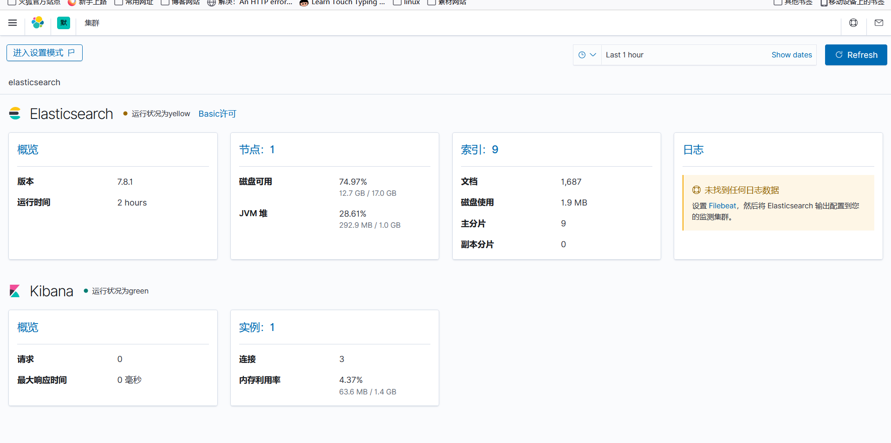

进入dev-tools进行命命令操作

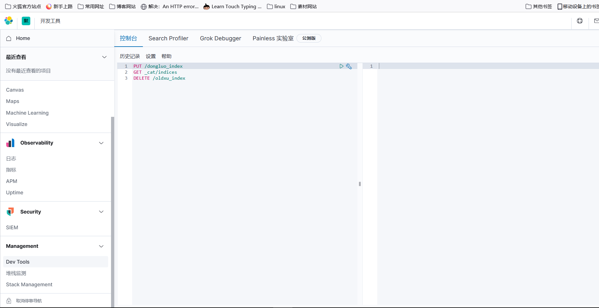

es 有专门的 Index API，用于创建、更新、删除索引配置等

创建索引：`PUT /索引名` ，查看所有已经存在的索引：`GET _cat/indices`

删除索引：`DELETE  /索引名`&#x20;

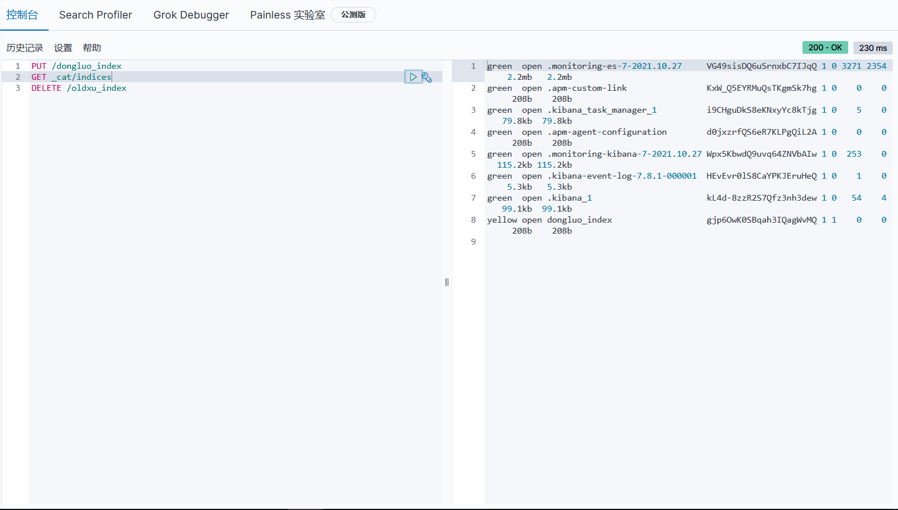

### 创建文档

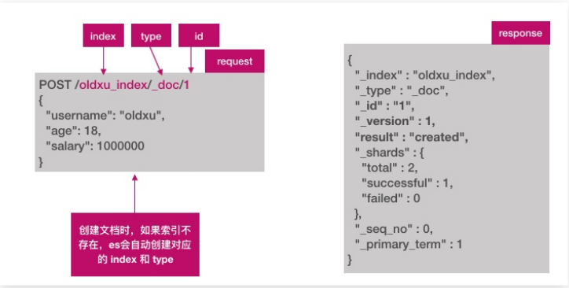

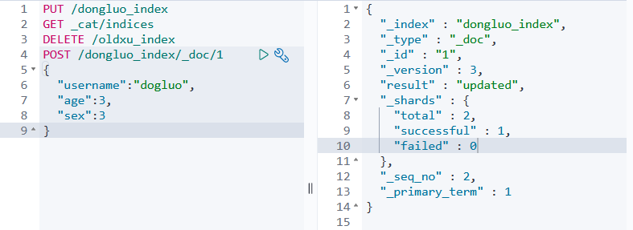

```bash
#指定id创建一个文档
POST /oldxu_index/_doc/1
{
    "username": "oldxu",
    "age": 18,
    "salary": 1000000
}

```

创建文档，不指定ID

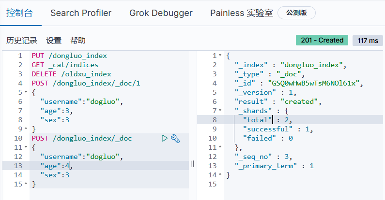

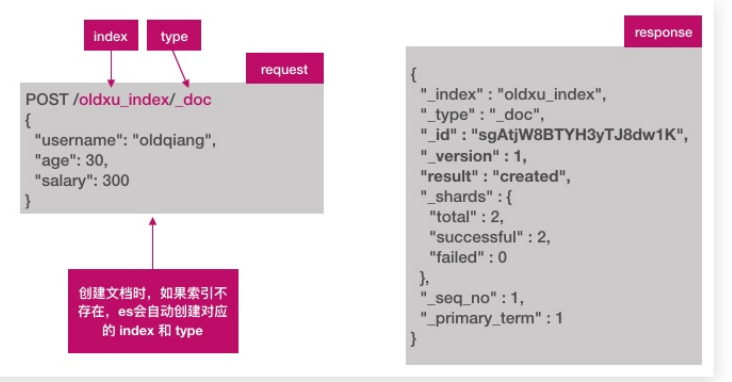

### 查询文档

查询文档id：`GET /dongluo_index/_doc/1` 查询所有文档：`GET /dongluo_index/_search`

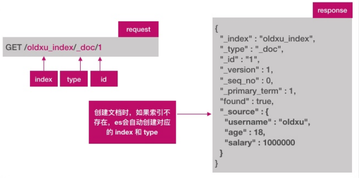


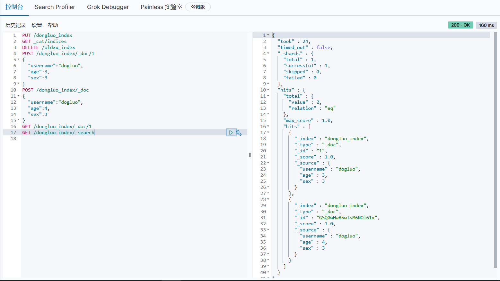

```bash
# 查询文档指定的内容
GET /oldxu_index/_search
{
    "query": {"match": {
    "user": "oldxu"
   }
}

```

### 批量创建文档

```bash
POST _bulk
{"index":{"_index":"tt","_id":"1"}}
{"name":"dogluo","age":"18"}
{"create":{"_index":"tt","_id":"1"}}
{"name":"dog","age":"8"}
```

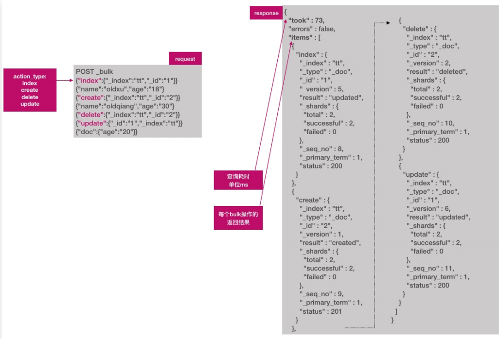

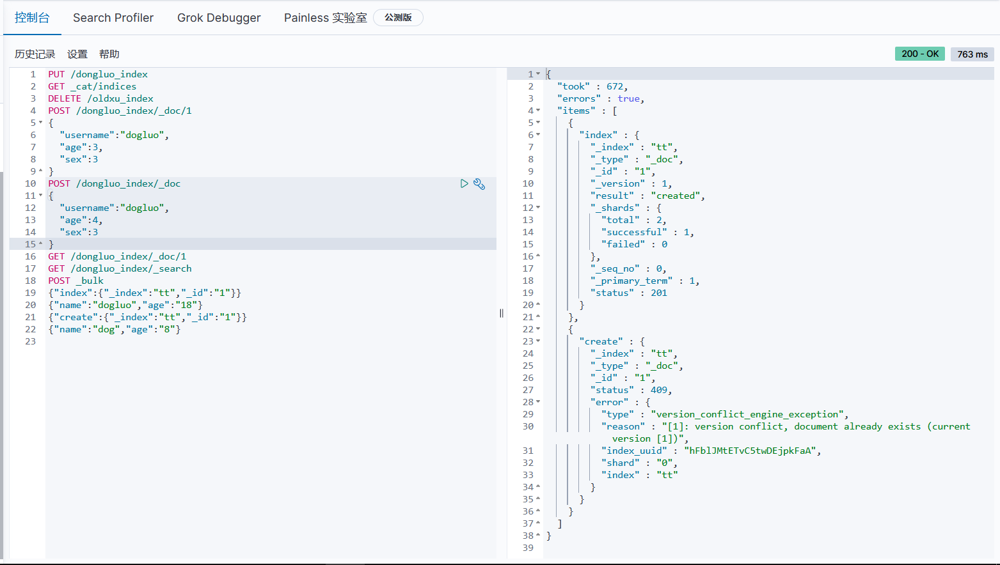

### 批量查询文档

es允许通过 \_mget 一次查询多个文档。

```bash
GET _mget
{
  "docs":[  #条件用中括号进行包括
    {
      "_index":"tt",
      "_id":"1"
    },  #匹配文档的第一个条件，条件之间用逗号隔开
    {
      "_index":"tt",
      "_id":"2"  
    }
    ] 
}
```

## ES集群部署

es天然支持集群模式，其好处主要有两个：

1.能够增大系统的容量，如内存、磁盘，使得 es集群可以支持PB级的数据；

2.能够提高系统可用性，即使部分节点停止服务，整个集群依然可以正常服务；

### 集群意义

单节点只有一个工作区域，一旦单节点出现问题，服务就不可用了，添加多个es节点加入集群能怎加容错机制

ELasticsearch 集群是由多个节点组成的，通过cluster.name 设置集群名称，并且用于区分其它的集群，每个节点通过 node.name 指定节点的名称。

### 环境准备

| 主机名称 | IP地址                    |
| ---- | ----------------------- |
| es1  | 10.0.0.161 172.16.1.161 |
| es2  | 10.0.0.162 172.16.1.162 |
| es3  | 10.0.0.163 172.16.1.163 |

```bash
#所有节点都必须安装ES软件
yum isntall java -y
wget  https://www.elastic.co/downloads/past-releases/elasticsearch-7-8-1 
#es1(主节点设置)
[root@es-node1 ~]# grep "^[a-Z]" /etc/elasticsearch/elasticsearch.yml
cluster.name: my-oldxu # 集群名称
node.name: es-node1 # 节点名称
path.data: /var/lib/elasticsearch # 数据存储路径
path.logs: /var/log/elasticsearch # 日志存储路径
#bootstrap.memory_lock: true # 不使用swap分区
network.host: 172.16.1.161 # 监听在本地哪个地址上
http.port: 9200 # 监听端口
discovery.seed_hosts: ["172.16.1.161","172.16.1.162", "172.16.1.163"] #集群主机列表
cluster.initial_master_nodes: ["172.16.1.161", "172.16.1.162","172.16.1.163"] # 仅第一次启动集群时进行选举
#es2节点配置
[root@es-node2 ~]# grep "^[a-Z]" /etc/elasticsearch/elasticsearch.yml
cluster.name: my-oldxu
node.name: es-node2
path.data: /var/lib/elasticsearch
path.logs: /var/log/elasticsearch
network.host: #本机内网IP
discovery.seed_hosts: ["172.16.1.161","172.16.1.162", "172.16.1.163"]
cluster.initial_master_nodes: ["172.16.1.161", "172.16.1.162","172.16.1.163"]
#es3节点配置
[root@es-node3 ~]# grep "^[a-Z]" /etc/elasticsearch/elasticsearch.yml
cluster.name: my-oldxu
node.name: es-node3
path.data: /var/lib/elasticsearch
path.logs: /var/log/elasticsearch
network.host: #本机内网IP
discovery.seed_hosts: ["172.16.1.161","172.16.1.162", "172.16.1.163"]
cluster.initial_master_nodes: ["172.16.1.161", "172.16.1.162","172.16.1.163"]
http.cors.enabled: true
http.cors.allow-origin: "*"

```

### ES集群健康检测

Cluster Health 获取集群的健康状态，整个集群状包括以下三种:

1.green 健康状态，指所有主副分片都正常分配

2.yellow 指所有主分片都正常分配，但是有副本分片未正常分配
3.red 有主分片未分配，表示索引不完备，写可能有问题。（但不代表不能存储数据和读取数据）检查 ES 集群是否正常运行，可以通过 curl、Cerebro两种方式；

使用curl进行集群状态检测：`curl http://172.16.1.161:9200/_cluster/health?`

如果检测结果为黄色并且只有一个节点，其他节点有两个，删除/var/lib/

监控ES集群状态脚本：

curl -s <http://172.16.1.161:9200/_cluster/health>? pretty=true | grep "status" |awk -F '"' '{print \$4}'

#### cerebor检查集群状态

这是一个可视化检查es集群状态的工具

```bash
wget https://github.com/lmenezes/cerebro/releases/download/v0.9.4/cerebro-0.9.4-1.noarch.rpm
安装：rpm -ivh cerebro-0.9.4-1.noarch.rpm
[root@es-node1 ~]# vim /etc/cerebro/application.conf
data.path: "/var/lib/cerebro/cerebro.db"
#data.path = "./cerebro.db"
#监听9000端口
```

## es集群中的以下几类节点：

Cluster State、Master、Data、Coordinating

### cluster state

Cluster State：集群相关的数据称为 cluster state；会存储在每个节点中，主要有如下信息:

1）节点信息：比如节点名称，节点链接地址等

2）索引信息：比如索引名称，索引配置信息等


### master

1.ES集群中只能有一个 master 节点，master节点用于控制整个集群的操作；

2.master 主要维护Cluster State，当有新数据产生后，Master 会将数据同步给其他 Node 节点；

3.master节点是通过选举产生的，可以通过node.master: true 指定为Master节点。（ 默认true ）


当我们通过API创建索引 PUT /oldxu\_index，Cluster State 则会发生变化，由 Master 同步至其他Node 节点；


### data

1.存储数据的节点即为 data 节点，默认节点都是 data类型，配置node.data: true（ 默认为 true ）

2.当创建索引后，索引创建的数据会存储至某个节点，能够存储数据的节点，称为data节点；


### coordinating

1.处理请求的节点即为 coordinating 节点，该节点为所有节点的默认角色，不能取消

2.coordinating 节点主要将请求路由到正确的节点处理。比如创建索引的请求会由 coordinating路由到 master 节点处理；当配置node.master:false、node.data:false 则为 coordinating节点


## ES集群分片副本

### 提高集群高可用

如何奇高有以下两个方面：

1.服务可用性：

1）2个节点的情况下，允许其中1个节点停止服务；

2）多个节点的情况下，坏的节点不能超过集群一半以上；

2.数据可用性

1）通过副本 replication 解决，这样每个节点上都有完备的数据。

2）如下图所示，node2上是 oldxu\_index 索引的一个完整副本数据。


### 增大ES集群容量

1.如何增大 ES 集群系统的容量；我们需要想办法将数据均匀分布在所有节点上；引入分片 shard 解决；

2.分片就是将一份完整的数据分散成多个分片存储

分片是es支持pd级数据的基石

分片存储了索引的部分数据，可以分布在任意节点上

分片存在主分片和负分片。分本分片主要用来实现数据的高可用

副本分片的数据由主分片同步，可以有多个，用来提高读取数据性能

> ⛔主分片数载索引创建时指定且后续不允许再更改。默认es7分片数为1个

3.在三个节点的集群中创建索引，指定3个分片和一个副本

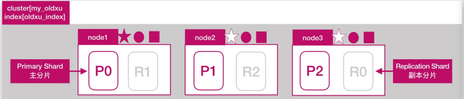

```bash
#创建索引病设定主分片负分片
PUT /oldwang
{
  "settings": {
    "index": {
      "number_of_shards": 3,
      "number_of_replicas": 1
    }
  }
}
#动态修改副本分片
PUT /dongluo/_settings
{
  "number_of_replicas": 3 
}
#分片不能删除，只能直接删除整个索引
```

问：如果一共有三个ES节点，如果增加一个新节点，能否提高送印数据容量

答：不能。因为索引只有三个分片，已经分布在三台节点上，新增的第四个节点对于索引来说是无法使用到的，所以无法带来数据容量的提升

问：目前有三个ES节点，增加副本数能否能提高索引的读吞吐量

答：不能，因为新增的副本还是会分布在这 node1、node2、node3 这三个节点上的，还是使用了相同的资源，也就意味着有读请求来时，这些请求还是会分配到node1、node2、node3 上进行处理、也就意味着，还是利用了相同的硬件资源，所以不会提升读性能；


问：如果要增加读吞量性能，该怎么做

答：增加读吞吐量还是需要添加节点，比如在增加三个节点 node4、node5、node6 那么将原来的 R0、R1、R2 分别迁移至新增的三个节点上，当有读请求来时会被分配 node4、node5、node6，也就意味着有新的 CPU、内存、IO，这样就不会在占用 node1、node2、node3 的硬件资源，那么这个时候读吞吐量才会得到真正的提升；


副本和分片总结

分片数和副本的设定很重要，需要提前规划好
1.过小会导致后续无法通过增加节点实现水平扩容；
2.设置分片过大会导致一个节点上分布过多的分片，造成资源浪费。分片过多也会影响查询性能；（读取次数增长占用电脑cpu运行空间）

## ES集群故障转移

所谓故障转移就是当集群中有节点发生故障时，这个集群是可以进行自我修复的

如下图所示ES集群式由3个节点组成状态为green


假设node1所在机器宕机导致服务终止，此时的处理大致分为三个步骤

1.重新选举

2.主分片调整

3.副本分片调整

### 重新选举

当没有宕机的机器发现宕机机器无响应一段时间时，会向master发起选举请求，选举一个新的master节点。此时集群状态为red状态

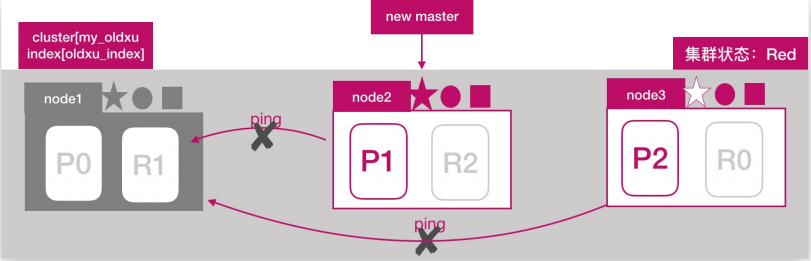

### 主分片调整

node2发现主分片p0未分配，将node3上的r0提升为主分片，此时所有的主分片都正常分配。集群状态变为yellow状态


### 副本分片调整

node2 将 P0 和 P1 主分片重新生成新的副本分片 R0、R1，此时集群状态变为 Green；


## ES文档路由原理

ES文档分布式存储，当一个文档存储至 ES集群时，存储的原理是什么样的?
如图所示，当我们想一个集群保存文档时，Document1是如何存储到分片P1的？选择P1的依据是什么？


其实是有一个映射算法从一个文档到分片，其目的就是使所有文旦均匀分布在所有分片上，那这个算法使随机还是轮询呢，由于数据存储后需要进行读取，所有这种方法是不可取的，所以在ES中，可以通过以下公式继续宁计算文档对应的分片存储到了那个节点，公式如下

```bash
shard = hash(routing) % number_of_primary_shards
# hash 算法保证将数据均匀分散在分片中
# routing 是一个关键参数，默认是文档id，也可以自定义。
# number_of_primary_shards 主分片数
# 注意：该算法与主分片数相关，一但确定后便不能更改主分片。
# 因为一旦修改主分片修改后，Share的计算就完全不一样了
```

### 创建流程

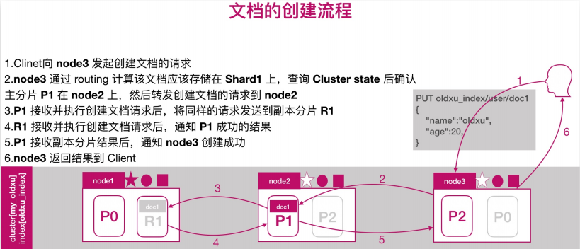

### 读取流程

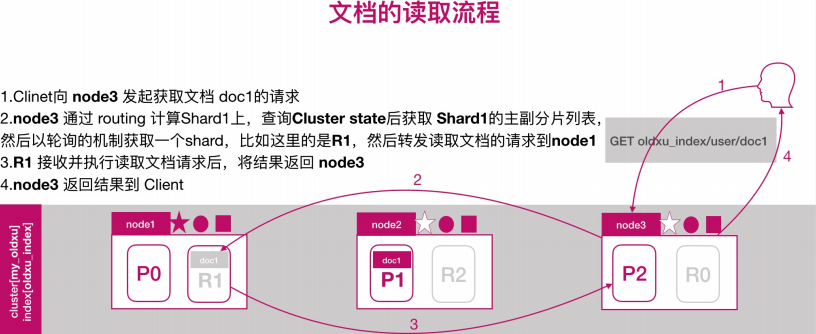

### 文档批量创建以及批量读取流程

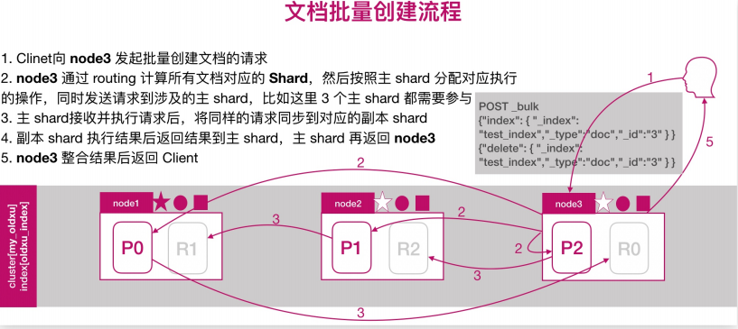


## 扩展集群节点

和创建集群节点步骤相同，不同的是扩展结点不进行mater主节点选举，只做备用节点

| 主机名称 | IP地址                    |
| ---- | ----------------------- |
| es4  | 10.0.0.164 172.16.1.764 |
| es5  | 10.0.0.165 172.16.1.165 |

两台节点配置文件配置

```bash
[root@node4 ~]# grep "^[a-Z]" /etc/elasticsearch/elasticsearch.yml
cluster.name: my-oldxu
node.name: es-node4
path.data: /var/lib/elasticsearch
path.logs: /var/log/elasticsearch
network.host: # 内网IP
#bootstrap.memory_lock: true
node.data: true # data节点
node.master: false # 不参与master选举
discovery.seed_hosts: ["172.16.1.161","172.16.1.162", "172.16.1.163"]
```

### 扩展检查

通过 cerebor检查集群扩展后的状态；如果出现集群无法加入、或者加入集群被拒绝，尝试删除/var/lib/elasticsearch 下的文件，然后重启 es；

如果将 data节点修改为 Coordinating 节点；需要清理数据，否则无法启动：`/usr/share/elasticsearch/bin/elasticsearch-node repurpose
`

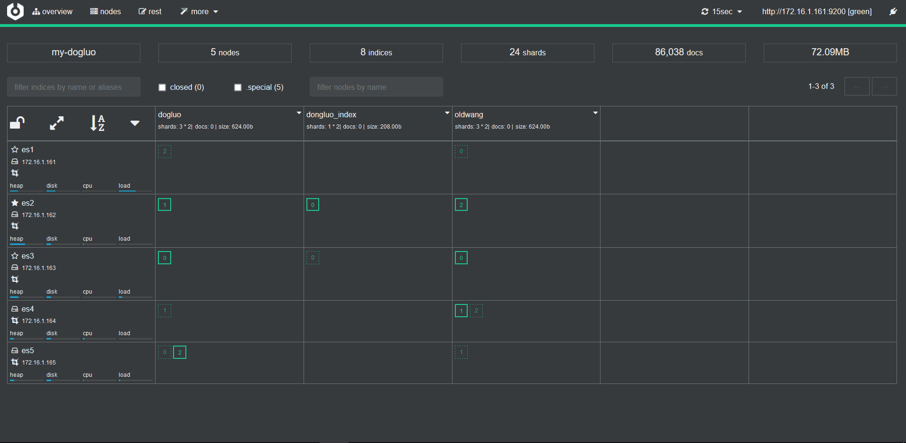

## ES集群调优

### 内核层面调优

```bash
#操作系统需要调整几个内核参数
vim /etc/syscctl.conf
fs.file-max=655360 # 设定系统最大打开文件描述符数，建议修改为655360或者更高，
vm.max_map_count = 262144 # 用于限制一个进程可以拥有的虚拟内存大小，建议修改成262144或更高。
net.core.somaxconn = 32768
net.ipv4.tcp_tw_reuse = 1
net.ipv4.ip_local_port_range = 1000 65535
net.ipv4.tcp_max_tw_buckets = 400000
#调整最大用户进程数（nproc），调整进程打开文件描述符（nofile）
[root@node ~]# rm -f /etc/security/limits.d/20-nproc.conf # 删除默认nproc设定文件
[root@node ~]# vim /etc/security/limits.conf
* soft nproc 20480
* hard nproc 20480
* soft nofile 65536
* hard nofile 65536


```

### 参数优化

```bash
# 1.锁定物理内存地址，避免es使用swap交换分区，频繁的交换，会导致IOPS变高。
[root@es-node ~]# vim /etc/elasticsearch/elasticsearch.yml
    bootstrap.memory_lock: true
#2.配置elasticsearch启动参数
[root@es-node ~]# sed -i '/\[Service\]/a LimitMEMLOCK=infinity'
/usr/lib/systemd/system/elasticsearch.service
systemctl daemnon-reload 
systemctl restart elasticsearch
```

#### JVM优化

JVM内存具体要根据 node 要存储的数据量来估算，为了保证性能，在内存和数据量间有一个建议的比例：像一般日志类文件，1G 内存能存储48G\~96GB数据； jvm堆内存最大不要超过31GB；其次就是主分片的数量，单个控制在30-50GB；

假设总数据量为1TB，3个node节点，1个副本；那么实际要存储的大小为2TB，因为有一个副本的存在；2TB / 3 = 700GB，然后每个节点需要预留20%的空间，意味着每个node要存储大约 850GB 的数据；按照内存与存储数据的比率计算：850GB/48=17GB，小于31GB，因为 31\*48=1.4TB 及每个Node可以存储1.4TB数据，所以3个节点足够；850GB/30=30个主分片，因为要尽量控制主分片的大小为30GB；
假设总数据量为2TB，3个node节点，1个副本；那么实际要存储的大小为4TB，因为有一个副本的存在；4TB/3 = 1.4TB，然后每个节点需要预留20%的空间出来，意味着每个node要存储大约 1.7TB 的数据；按照内存与存储数据的比率计算：1.7TB/48=32GB 大于31G，因为 31\*48=1.4TB及每个Node最多存储1.4TB数据，所以至少需要4个节点；1.5TB/30G=50个主分片，因为要尽量控制主分配存储的大小为30GB；

```bash
[root@es-node ~]# vim /etc/elasticsearch/jvm.options
-Xms31g # 最小堆内存
-Xmx31g # 最大堆内存

#可根据服务器内存大小，修改为合适的值。一般设置为务器物理内存的一半最佳，但最大不能超过32G

# 每天1TB左右的数据量的服务器配置16C 64G 6T 3台ECS
```
