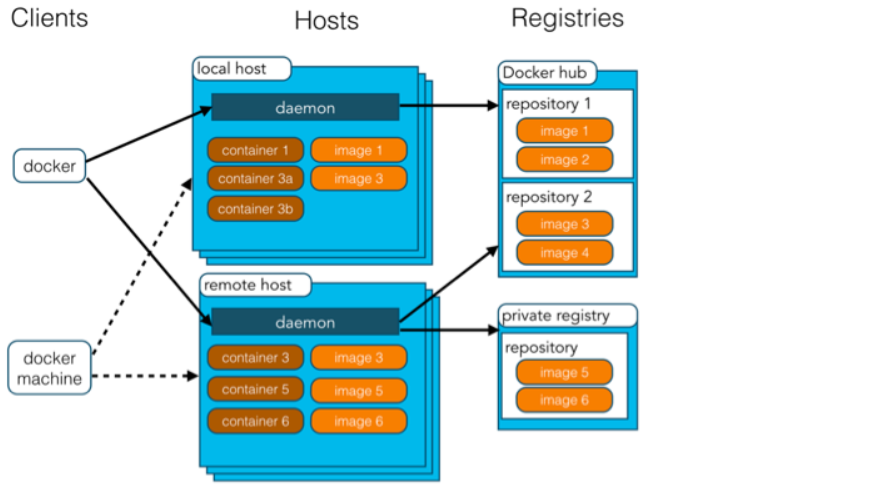
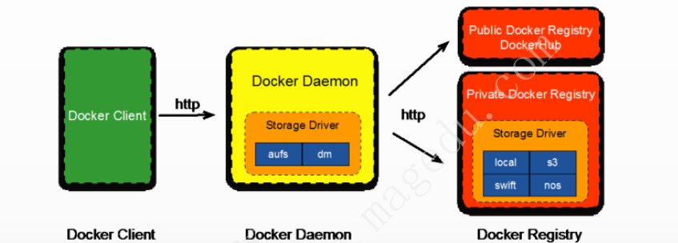
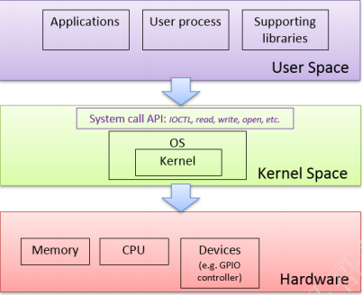
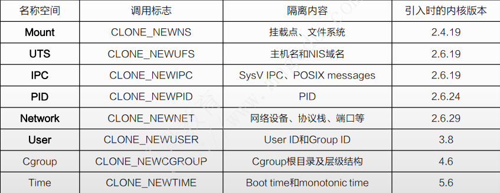
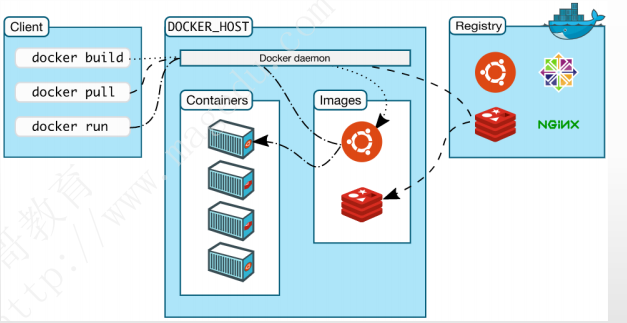

# 云原生基础

## 目录

-   [什么是docker](#什么是docker)
-   [优点](#优点)
-   [基本架构](#基本架构)
    -   [linux内核支持的命令空间](#linux内核支持的命令空间)

云原生：CNCF（Cloud Native Computing Foundation（云原生计算基金会））对云原生定义：云原生技术有利于各组织在公有云、私有云和混合云等新型动态环境中，构建和运行可弹性扩展的应用。云原生的代表技术包括容器、服务网格、微服务、不可变基础设施和声明式API

微服务：流行的“分布式”架构风格，用于构建弹性化、高度可扩
展、可独立部署且能够快速迭代的应用程序

微服务架构由一系列小型自治服务组成

每个服务都是自包含的，应该在有界上下文中实现单个业务功能

## 什么是docker

Docker 是一个开源的应用容器引擎，基于 [Go 语言](https://www.runoob.com/go/go-tutorial.html "Go 语言") 并遵从 Apache2.0 协议开源。Docker 可以让开发者打包他们的应用以及依赖包到一个轻量级、可移植的容器中，然后发布到任何流行的 Linux 机器上，也可以实现虚拟化。容器是完全使用沙箱机制，相互之间不会有任何接口（类似 iPhone 的 app）,更重要的是容器性能开销极低。

Docker 从 17.03 版本之后分为 CE（Community Edition: 社区版） 和 EE（Enterprise Edition: 企业版），我们用社区版就可以了。

## 优点

1.快速，一致性地交付您的应用程序

2.响应式部署和扩展

3.在同一硬件上运行更多工作负载

## 基本架构

&#x20;镜像（image）：相当于一个root系统，比如： centos，Ubuntu等最小的镜像文件系统+6352.041

容器（container ）： 镜像和容器之间的关系，就像面向对象程序设计中类和实例一样。像是静态运行的实体，容器可以被创建、启动、停止、删除、暂停等。

仓库（Reposity）：仓库可以堪称一个代码控制中心，用来保存镜像

客户端：痛过明令行或者其他工具使用Docker SDK（[https://docs.docker.com/develop/sdk/](https://docs.docker.com/develop/sdk/ "https://docs.docker.com/develop/sdk/")）与Docker的守护进程通信

主机：一个物理或者虚拟的机器用于执行docker守护进程和容器

docke容器可以通过docker容器来创建

docker和面向对象之间关系

| docker | 面向对象 |
| ------ | ---- |
| 容器     | 对象   |
| 镜像     | 类    |

注册中心是一个无状态的、高度可扩展的服务器端应用程序，可以存储并让你分发Docker镜像。(The Registry is a stateless, highly scalable server side application that stores and lets you distribute Docker images)

registry就是镜像存储的仓库，可以隶属于根名称空间或特定空间

每个镜像由“仓库名:标签名”标识

也可由镜像的Hash码标识

现代操作系统在内存中有两个不同地、分离的区域称为用户空间和内核空间：内核充当用户空间和硬件的中间层，负责进程调度、内存管理、中断处理等，对系统资源具有完全控制权
用户空间通过“系统调用”与内核通信，系统调用通过API向应用程序提供系统级服务

容器之间暴露出来的是系统接口

#### linux内核支持的命令空间

linux内核中与namespace相关的API有四个

clone()：创建子进程，并将其隔离至新建的名称空间之中；

◆ 负责创建一个子进程，若同时使用了CLONE\_NEW\*相关的标志，则为每个标志创建出名称空间，并将该进程置于该名称空间中；

setns()：将进程加入到指定的现有名称空间中；

◆ 通过操作进程相关的/proc/\[pid]/ns/目录完成

unshare()：将进程隔离至新建的名称空间中；

◆ 与clone()类似，但不同之处在于，unshare()在当前进程中创建名称空间，一旦调用完成，当前进程即位于新的名称空间之中；

ioctl()：获取名称空间的相关信息

docker三大组件：client、docker\_host（docker daemon）、registry

docker daemon包括：rest api 、objects（images、container、volume、network）

