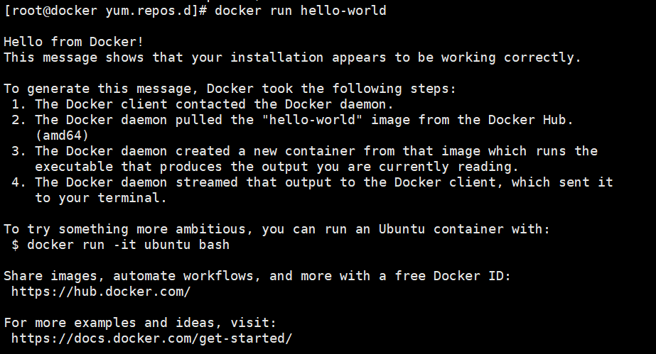

# centos安装

> 📌若本身已经处于超级用户则sudo提权则不需要使用，直接进行安装

安装必要的系统工具

```bash
sudo yum install -y yum-utils device-mapper-persistent-data lvm2 #提权进行安装，若是本就是超级用户则无需sudo提权

```

添加软件源信息：软件源主要有两种:官方源和阿里源

```bash
# docker 官方源
sudo yum-config-manager --add-repo https://download.docker.com/linux/centos/docker-ce.repo
# 阿里云源
sudo yum-config-manager --add-repo http://mirrors.aliyun.com/docker-ce/linux/centos/docker-ce.repo

```

若要编写repo配置文件则为

```bash
#官方源
vim docker-ce.repo   #若需要阿里源则把baseurl替换成阿里源http://mirrors.aliyun.com/docker-ce/linux/centos/docker-ce.repo
sed '/^baseurl/c baseurl=http://mirrors.aliyun.com/docker-ce/linux/centos/docker-ce.repo' /etc/yum.repo.d/docker-ce.repo  #若要替换阿里源则运行
[docker-ce-stable]
name=Docker CE Stable - $basearch
baseurl=https://download.docker.com/linux/centos/$releasever/$basearch/stable
enabled=1
gpgcheck=1
gpgkey=https://download.docker.com/linux/centos/gpg

[docker-ce-stable-debuginfo]
name=Docker CE Stable - Debuginfo $basearch
baseurl=https://download.docker.com/linux/centos/$releasever/debug-$basearch/stable
enabled=0
gpgcheck=1
gpgkey=https://download.docker.com/linux/centos/gpg

[docker-ce-stable-source]
name=Docker CE Stable - Sources
baseurl=https://download.docker.com/linux/centos/$releasever/source/stable
enabled=0
gpgcheck=1
gpgkey=https://download.docker.com/linux/centos/gpg

[docker-ce-test]
name=Docker CE Test - $basearch
baseurl=https://download.docker.com/linux/centos/$releasever/$basearch/test
enabled=0
gpgcheck=1
gpgkey=https://download.docker.com/linux/centos/gpg

[docker-ce-test-debuginfo]
name=Docker CE Test - Debuginfo $basearch
baseurl=https://download.docker.com/linux/centos/$releasever/debug-$basearch/test
enabled=0
gpgcheck=1
gpgkey=https://download.docker.com/linux/centos/gpg

[docker-ce-test-source]
name=Docker CE Test - Sources
baseurl=https://download.docker.com/linux/centos/$releasever/source/test
enabled=0
gpgcheck=1
gpgkey=https://download.docker.com/linux/centos/gpg

[docker-ce-nightly]
name=Docker CE Nightly - $basearch
baseurl=https://download.docker.com/linux/centos/$releasever/$basearch/nightly
enabled=0
gpgcheck=1
gpgkey=https://download.docker.com/linux/centos/gpg

[docker-ce-nightly-debuginfo]
name=Docker CE Nightly - Debuginfo $basearch
baseurl=https://download.docker.com/linux/centos/$releasever/debug-$basearch/nightly
enabled=0
gpgcheck=1
gpgkey=https://download.docker.com/linux/centos/gpg

[docker-ce-nightly-source]
name=Docker CE Nightly - Sources
baseurl=https://download.docker.com/linux/centos/$releasever/source/nightly
enabled=0
gpgcheck=1
gpgkey=https://download.docker.com/linux/centos/gp

```

可选：启用 `edge` 和 `test` 存储库。 这些存储库包含在上面的 `docker.repo` 文件中，但默认情况下处于禁用状态。您可以将它们与稳定存储库一起启用。

```bash
$ sudo yum-config-manager --enable docker-ce-edge
$ sudo yum-config-manager --enable docker-ce-test
#禁用存储库
$ sudo yum-config-manager --disable docker-ce-edge
$ sudo yum-config-manager --disable docker-ce-test

```

安装docker-ce前需先生成缓存，若不生成缓存则配置文件不会生效

```bash
yum makecache  #生成缓存
yum clean all #清理缓存
yum install docker-ce #安装docker
#若想安装特定的版本，则先列出repo中可用版本之后进行安装
yum list docker-ce --showduplicates | sort -r
# docker-ce.x86_64            18.06.1.ce-3.el7                   docker-ce-stable
# docker-ce.x86_64            18.06.1.ce-3.el7                   @docker-ce-stable
# docker-ce.x86_64            18.06.0.ce-3.el7                   docker-ce-stable
# docker-ce.x86_64            18.03.1.ce-1.el7.centos            docker-ce-stable
# docker-ce.x86_64            18.03.0.ce-1.el7.centos            docker-ce-stable
# docker-ce.x86_64            17.12.1.ce-1.el7.centos            docker-ce-stable
$ sudo yum install docker-ce-<VERSION STRING(版本号)>  #选择要安装的版本
$ sudo yum install docker-ce-18.06.1.ce  #安装docker-ce-18.06.1.ce版本
```

启动docker后台服务

```bash
$ sudo systemctl start docker
```

运行hello-world镜像，验证是否正确安装

```bash
$ docker run hello-world
```



这条消息表明你的安装似乎正在正常工作。

为了生成这条消息，Docker采取了以下步骤。

1.  Docker客户端联系了Docker守护进程。
2.  2.Docker守护进程从Docker Hub拉出 "hello-world "镜像。

    (amd64)
3.  Docker守护进程从该镜像中创建了一个新的容器，该容器运行的是

    可执行文件，产生你目前正在阅读的输出。
4.  4\. Docker守护进程将该输出流向Docker客户端，后者将其发送到你的终端。

    到你的终端。

为了尝试更多的东西，你可以用以下方式运行Ubuntu容器。

\$ docker run -it ubuntu bash

用一个免费的Docker ID来分享镜像，自动化工作流程，以及更多。

[https://hub.docker.com/](https://hub.docker.com/ "https://hub.docker.com/")

欲了解更多的例子和想法，请访问。

[https://docs.docker.com/get-started/](https://docs.docker.com/get-started/ "https://docs.docker.com/get-started/")
