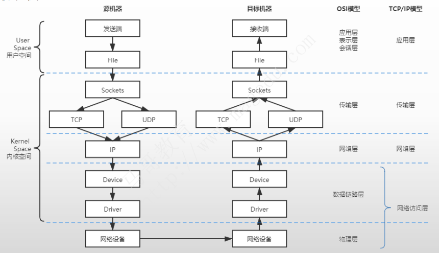
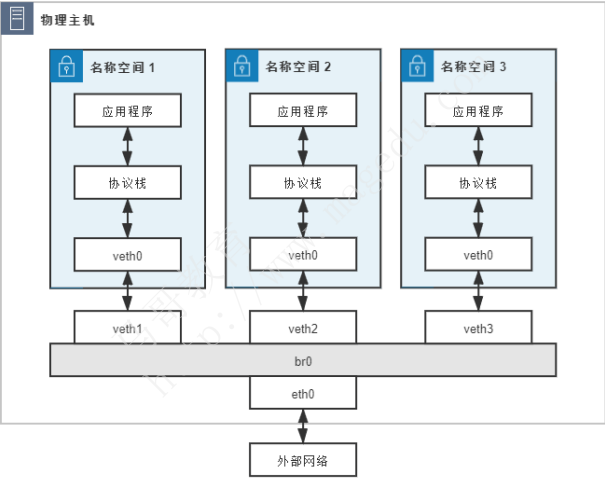
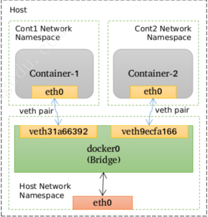
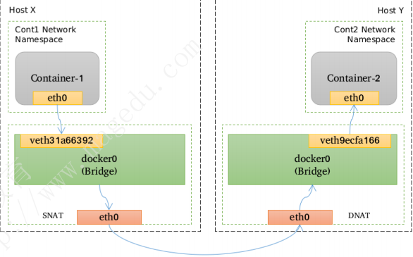

# docker-networking

## 目录

-   [将容器接入网络的步骤](#将容器接入网络的步骤)
-   [linux网络协议栈](#linux网络协议栈)
-   [虚拟化网络](#虚拟化网络)
-   [bridge](#bridge)
-   [-p选项使用](#-p选项使用)

## 将容器接入网络的步骤

①准备好相应的容器网络，通常是虚拟网络；

◆ 单机的桥接式网络

◆ 跨主机的Overlay或Underlay网络

②为每个容器配置一个独占的Network名称空间；

③ 为容器添加专用的接口设备，并将其接入到容器网络中；

④ 为容器接口分配相应的IP地址及其它网络属性值，并按需生成NAT规则；

docker默认支持的四种网络模式：host模式、container模式、none模式、bridge模式。

## linux网络协议栈

linux bridge示意图





## 虚拟化网络

SDN： Software Defined Network

SDN 的核心思路是在物理的网络之上再构造一层虚拟化的网络，将控制平面和数据平面分离开来，实现流量的灵活控制，为核心网络及应用的创新提供良好的平台

SDN 里位于下层的物理网络被称为 Underlay，它着重解决网络的连通性与可管理性，位于上层的逻辑网络被称为 Overlay，它着重为应用提供与软件需求相符的传输服务和网络拓扑

VXLAN：三层虚拟化网络的技术规范之一

设定网络参数可以在docker run命令加入以下参数：

network NETWORK”选项指定要加入的网络

“--hostname HOSTNAME”选项为容器指定主机名

“--dns DNS\_SERVER\_IP”选项能够为容器指定所使用的dns服务器地址

“--add-host HOSTNAME:IP”选项能够为容器指定本地主机名解析项

## bridge

Bridge是指Linux内核支持的虚拟网桥设备，它模拟的是物理网桥设备，工作于数据链接层，根据习得的MAC地址表向设备端口转发数据帧



跨容器之间进行通信需要nat机制全程参与

请求报文会首先由源宿主机进行一次SNAT（源地址转换）

在由目标宿主机进行一次DNAT(目标地址转换)送达容器中



如果要在容器中使用网桥需要安装网桥工具：`apt install bridge-utils`

查看本机网桥链接几个网络：brctl show

指定容器的网络（共享宿主机网络）

```bash
docker network ls
NETWORK ID     NAME      DRIVER    SCOPE
fb222c7817e0   bridge    bridge    local  #网桥网络
c0f285621931   host      host      local  #共享主机网络
a0cad684c478   none      null      local  #默认不适用网络相当于单机

docker run --name app4 --net host alipine:3.15
```

创建一个网桥网络以便让两个容器处于同一网段

```bash
docker network create -d bridge --subnet 网段（192.168.100.0/24） 网桥名
eg:
docker network create -d bridge --subnet 172.16.100.0/24 mynet

```

指定一个容器使用网桥：`docker container run - -name wpdb -v 目录映射地址  - -env-file 环境变量文件 -d - -net 网卡名称  镜像名称`&#x20;

如果一个容器想要连接到这个容器的网络：`docker container run app7 - -net 网卡名称 - -link 容器名称 -it 镜像名称`&#x20;

link作用：让ip地址映射主机名，直接主机名进行访问容器，相当于DNS解析

查看端口暴露信息：`docker container port`

## -p选项使用

```bash
-p选项的使用格式
 -p <containerPort>
◆ 将指定的容器端口映射至主机所有地址的一个动态端口
 -p <hostPort>:<containerPort>
◆ 将容器端口<containerPort>映射至指定的主机端口<hostPort>
 -p <ip>::<containerPort>
◆ 将指定的容器端口<containerPort>映射至主机指定<ip>的动态端口
 -p <ip>:<hostPort>:<containerPort>
◆ 将指定的容器端口<containerPort>映射至主机指定<ip>的端口<hostPort>
“动态端口”指随机端口，具体的映射结果可使用

```
