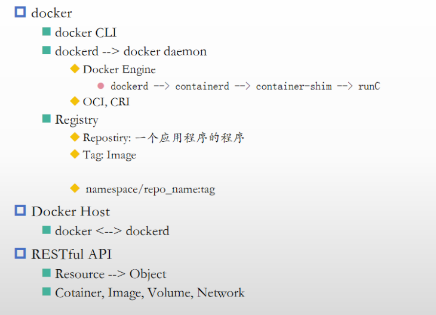

# docker笔记



```text
├── A_云原生基础
│   ├── image
│   └── 云原生基础.md
├── B_docker安装
│   ├── centos安装
│   ├── docker安装.md
│   └── ubuntu安装
├── C_基础管理及使用
│   ├── image
│   └── 基础管理及使用.md
├── D_卷管理
│   ├── image
│   └── 卷管理.md
├── E_docker-networking
│   ├── docker-networking.md
│   └── image
├── F_dockerfile
│   ├── dockerfile.md
│   └── image
├── I_docker-compose
│   └── docker-compose.md
├── J_docker部署wordpress
│   └── docker部署wordpress.md
```