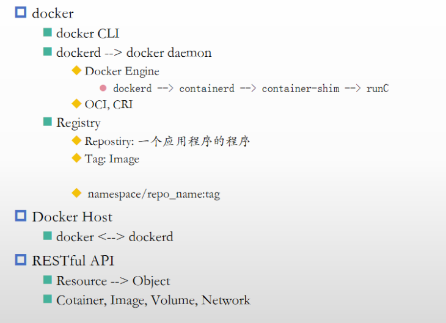

# docker笔记

[云原生基础](云原生基础/云原生基础.md "云原生基础")

[docker安装](docker安装/docker安装.md "docker安装")

[基础管理及使用](基础管理及使用/基础管理及使用.md "基础管理及使用")

[卷管理](卷管理/卷管理.md "卷管理")

[docker-networking](docker-networking/docker-networking.md "docker-networking")

[dockerfile](dockerfile/dockerfile.md "dockerfile")

[docker-compose](docker-compose/docker-compose.md "docker-compose")

[docker部署wordpress](docker部署wordpress/docker部署wordpress.md "docker部署wordpress")
