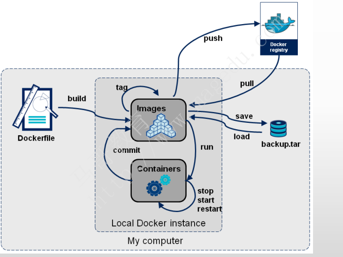
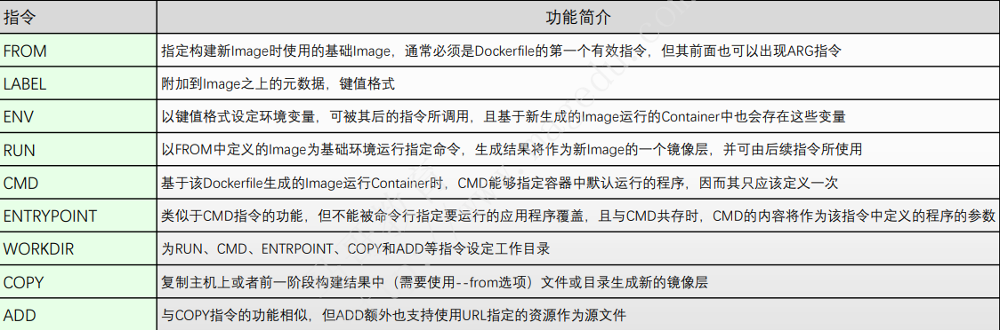
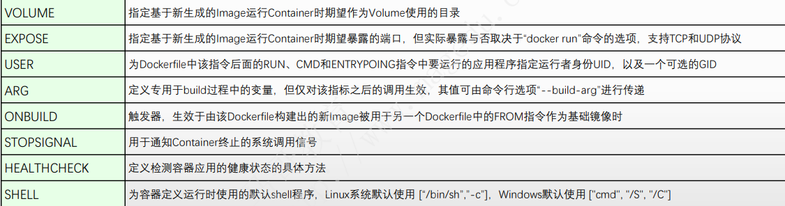

# dockerfile

## 目录

-   [通过容器创建镜像](#通过容器创建镜像)
-   [dockerfile常用指令](#dockerfile常用指令)
    -   [FROM](#FROM)
    -   [LABEL](#LABEL)
    -   [MAINTAINER](#MAINTAINER)
    -   [RUN](#RUN)
    -   [ENV](#ENV)
    -   [EXPOSE](#EXPOSE)
    -   [ADD](#ADD)
    -   [volume](#volume)
    -   [WORKDIR](#WORKDIR)

### 通过容器创建镜像

更新镜像前我们需要一个镜像来创建一个容器

`docker run -t -i ubuntu:15.10 /bin/bash`

可以通过以下两种方式对镜像进行更改

1.从已经创建的容器中更新镜像，并且提交这个镜像

2.使用dockerfile指令来创建一个新的镜像

在运行的容器内使用 **apt-get update** 命令进行更新。

在完成操作之后，输入 exit 命令来退出这个容器。

此时 ID 为 a6b0a6cfdacf 的容器，是按我们的需求更改的容器。我们可以通过命令 docker commit 来提交容器副本。

```bash
docker commit -m="First Docker" -a="wcjiang" a6b0a6cfdacf wcjiang/nginx:v1.2.1

```

上面命令参数 说明

-   `-m` 提交的描述信息
-   `-a` 指定镜像作者
-   `a6b0a6cfdacf` 记住这个是容器id，不是镜像id
-   `wcjiang/nginx:v1.2.1` 创建的目标镜像名

基于容器进行创建镜像:`docker commit [OPTIONS] CONTAINER [REPOSITORY[:TAG]]`

使用dicker images进行查看镜像

docker容器创建有时需要基于dockerfile文件进行创建

dockerfile就是用于只是docker images build命令自动创建image的源代码是个纯文本文件

创建容器的流程如下



## dockerfile常用指令





> ⛔指令要大写

dcokerfile创建镜像过程：首先创建一个存放镜像以及dockerfile文件的目录，编写file文件，输入docker build . -t 容器名 . 进行创建，docker 读取当前目录中的file文件进行docker run创建，如果要基于当前dockerfile文件创建的镜像再次进行创建镜像可以在dockerfile文件中编写onbuild可以进行二次进行创建。

dockerfile主要组成部分

| 主要部分      | 代表性命令                                                |
| --------- | ---------------------------------------------------- |
| 基础镜像信息    | from                                                 |
| 维护者信息     | MAINTAINR                                            |
| 镜像操作指令    | RUN、COPY、ADD、WORDKDIR、EXPOSE、ONBUILD、USER、VOLUME、ENV |
| 容器启动时执行指令 | CMD、ENTRYPONIT                                       |

#### FROM

指定基础镜像，必须为文件中的第一个命令

```bash
格式：
　　FROM <image>
　　FROM <image>:<tag>
　　FROM <image>@<digest>
示例：
　　FROM mysql:5.6
注：
　　tag或digest是可选的，如果不使用这两个值时，会使用latest版本的基础镜像

```

#### LABEL

用于为镜像添加元数据也就是备注

```bash
格式：
    LABEL <key>=<value> <key>=<value> <key>=<value> ...
示例：
　　LABEL version="1.0" description="这是一测试工程"
注：
　　使用LABEL指定元数据时，一条LABEL指定可以指定一或多条元数据，指定多条元数据时不同元数据之间通过空格分隔。推荐将所有的元数据通过一条LABEL指令指定，以免生成过多的中间镜像。

```

#### MAINTAINER

指示维护者信息

```bash
格式：MAINTAINER <name>
一般放在LABEL标签中
```

#### RUN

构建镜像文件时执行的命令，一个文件可以包含多个RUN命令

```bash
RUN用于在镜像容器中执行命令，有以下两种命令执行方式：
shell执行，即/bin/sh 
格式：
    RUN <command>
    
    
exec执行
格式：
    RUN ["executable", "param1", "param2"]
    要注意的是，executable是命令，后面的param是参数 
示例： RUN yum install -y nginx 
      RUN ["yum", "install", "-y", "nginx"] 
注：
　　RUN指令创建的中间镜像会被缓存，并会在下次构建中使用。如果不想使用这些缓存镜像，可以在构建时指定--no-cache参数，如：docker build --no-cache
　　并且这样写还有个优点，apt-get update 和 apt-get install 被放在一个 RUN 指令中执行，这样能够保证每次安装的是最新的包。如果 apt-get install 
　　在单独的 RUN 中执行，则会使用 apt-get update 创建的镜像层，而这一层可能是很久以前缓存的
```

run并不是越多越好，在创建过程中run自上而下依次执行，如果一条run过多则使用\换行和&&链接

#### ENV

设置环境变量

```bash
格式：
    ENV <key> <value>  #<key>之后的所有内容均会被视为其<value>的组成部分，因此，一次只能设置一个变量
    ENV <key>=<value> ...  #可以设置多个变量，每个变量为一个"<key>=<value>"的键值对，如果<key>中包含空格，可以使用\来进行转义，也可以通过""来进行标示；另外，反斜线也可以用于续行
示例：
    ENV myName John Doe
    ENV myDog Rex The Dog
    ENV myCat=fluffy
```

#### EXPOSE

指定暴露镜像的端口供主机做映射

```bash
格式：
    EXPOSE <port> [<port>...]
示例：
    EXPOSE 80 443
    EXPOSE 8080
    EXPOSE 11211/tcp 11211/udp
注：
　　EXPOSE并不会让容器的端口访问到主机。要使其可访问，需要在docker run运行容器时通过-p来发布这些端口，或通过-P参数来发布EXPOSE导出的所有端口
```

#### ADD

将本地文件添加到容器中，压缩包会自动解压，要是url中的压缩资源不会被解压

```bash
格式：
    ADD <src>... <dest>
    ADD ["<src>",... "<dest>"] 用于支持包含空格的路径
示例：
    ADD hom* /mydir/          # 添加所有以"hom"开头的文件
    ADD hom?.txt /mydir/      # ? 替代一个单字符,例如："home.txt"
    ADD test relativeDir/     # 添加 "test" 到 `WORKDIR`/relativeDir/
    ADD test /absoluteDir/    # 添加 "test" 到 /absoluteDir/
  注意：

      需要复制的本地文件一定要放在Dockerfile文件的同级目录下
  原因：

      因为构建环境将会先上传到Docker守护进程，而复制是在Docker守护进程中进行的。任何位于构建环境之外的东西都是不可用的。ADD指令的目的的位置则必须是容器内部的一个绝对路径。
```

copy和add功能一样，都是上传文件到容器，但copy不支持url和压缩包，

#### volume

#### WORKDIR

指定工作目录。类似cd命令，之后的命令都是基于此工作目录

```bash
格式：
    WORKDIR /path/to/workdir
示例：
    WORKDIR /a  (这时工作目录为/a)
    WORKDIR b  (这时工作目录为/a/b)
    WORKDIR c  (这时工作目录为/a/b/c)
注：
　　通过WORKDIR设置工作目录后，Dockerfile中其后的命令RUN、CMD、ENTRYPOINT、ADD、COPY等命令都会在该目录下执行。在使用docker run运行容器时，可以通过-w参数覆盖构建时所设置的工作目录。
```
