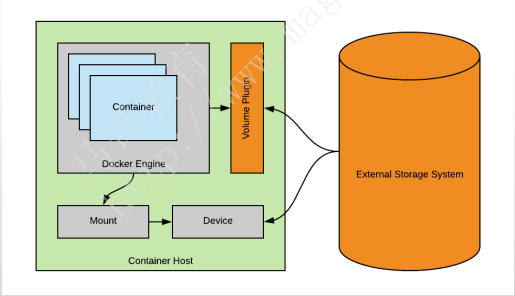
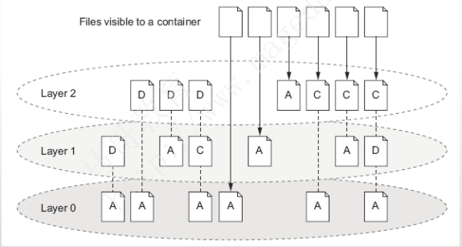
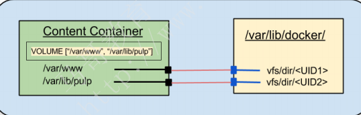
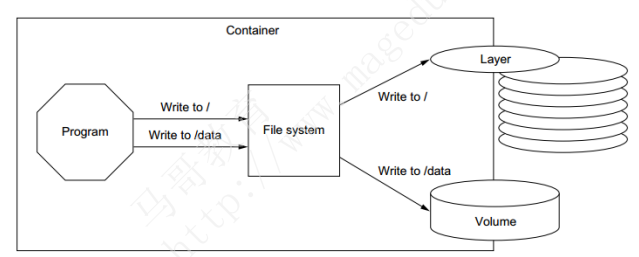

# 卷管理

## 目录

-   [卷的挂载和使用](#卷的挂载和使用)
-   [docker volume](#docker-volume)

存储卷：通过存储卷技术绕过存储驱动程序，将数据存储在宿主机上，实现跨容器数据持久性，也支持卷驱动（docker上的存储卷插件）讲数据直接存储到远程存储设备上，实现跨主机持久性



Docker镜像由多个只读层叠加而成，启动容器时，Docker会加载只读镜像层并在镜像栈顶部添加一个读写层

如果运行中的容器修改了现有的一个已经存在的文件，那该文件将会从读写层下面的只读层复制到读写层，该文件的只读版本仍然存在，只是已经被读写层中该文件的副本所隐藏，此即“写时复制(COW)”机制



为防止关闭容器以后数据更改不会丢失需引入卷（volume）：容器上的一个或多个目录，此类目录直接可绕过过联合文件系统，与宿主机上的某个目录进行绑定



卷为docker提供了ocker提供了独立于容器的数据管理机制

实现了镜像可以重用，卷可以分享，实现了镜像和数据分离以及程序和主机分离，用户使用镜像时无需再考虑镜像运行的容器所处环境



docker两种类型的卷：`bind mount volume、docker-managed volume`

都有一个挂载点，但在宿主机上的位置不同


## 卷的挂载和使用

```bash
#在容器中使用Volumes
#为docker run命令使用-v选项即可使用Volume
 Docker-managed volume
docker run -it -name bbox1 –v /data busybox
docker inspect -f {{.Mounts}} bbox1
#查看bbox1容器的卷、卷标识符及挂载的主机目录
 Bind-mount Volume
docker run -it -v HOSTDIR:VOLUMEDIR --name bbox2 busybox
docker inspect -f {{.Mounts}} bbox2
eg：docker run --name word -v /data/container/appq:/data -it xiaoluozi/wordpress:alp
There are two ways to share volumes between containers
#多个容器的卷使用同一个主机目录，例如
docker run –it --name c1 -v /docker/volumes/v1:/data busybox
docker run –it --name c2 -v /docker/volumes/v1:/data busybox
#复制使用其它容器的卷，为docker run命令使用--volumes-from选项
docker run -it --name bbox1 -v /docker/volumes/v1:/data busybox
docker run -it --name bbox2 --volumes-from bbox1 busybox

```

## docker volume

Commands:

create      Create a volume  创建卷

inspect     Display detailed information on one or more volumes  查看卷

ls          List volumes  查看卷列表

prune       Remove all unused local volumes   删除没有使用的卷

rm          Remove one or more volumes 删除指定卷
