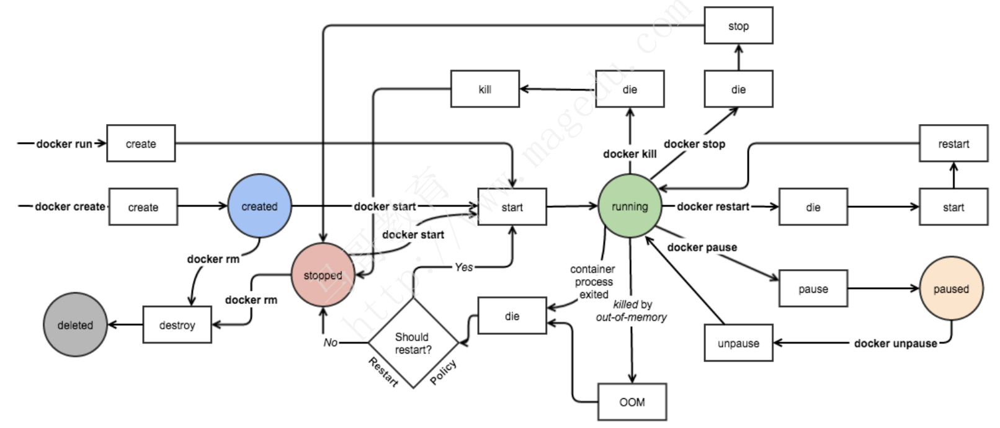
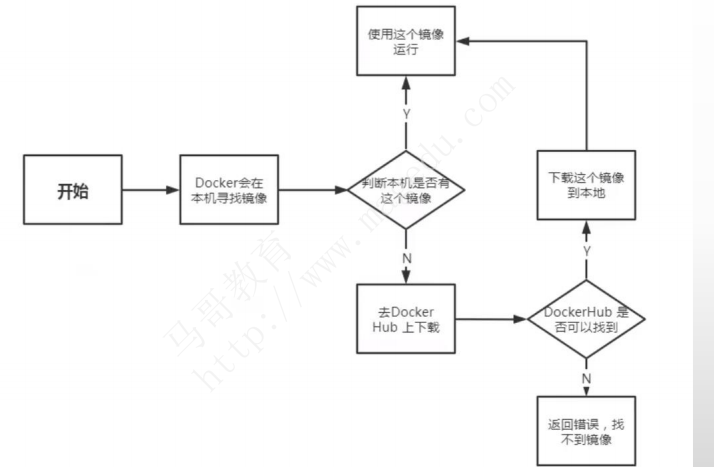
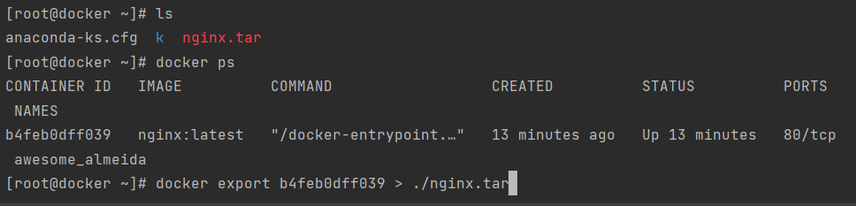

# 基础管理及使用

## 目录

-   [服务管理](#服务管理)
-   [镜像管理](#镜像管理)
    -   [获取新的镜像](#获取新的镜像)
    -   [查找镜像](#查找镜像)
    -   [docker镜像基本使用](#docker镜像基本使用)
    -   [删除镜像](#删除镜像)
    -   [运行一份web应用](#运行一份web应用)
    -   [env](#env)
-   [镜像的推动和拉取](#镜像的推动和拉取)

docker容器常用命令之间的容器状态转换



docker的帮助命令可以使用:man  docker  ，docker - -help进行查询

| 命令        | 含义                  | 命令      | 含义                 |
| --------- | ------------------- | ------- | ------------------ |
| container | 管理容器                | attach  | 接入一个正在运行的容器        |
| image     | 管理镜像                | build   | 根据dockerfile构建一个镜像 |
| network   | 管理网络                | commit  | 根据容易的更改拆功能键一个新的镜像  |
| cp        | 在本地文件系统与容器中复制文件\文件夹 | create  | 创建一个新容器            |
| exec      | 在容器中执行一个命令          | images  | 列出镜像               |
| kill      | 杀死一个或多个正在运行的镜像      | logs    | 取得容器的日志            |
| pause     | 暂停一个或多个正在运行的容器      | ps      | 列出所有容器             |
| pull      | 拉取一个镜像或仓库到registry  | push    | 推送一个镜像或仓库到registry |
| rename    | 重命名一个容器             | restart | 重新启动一个或多个容器        |
| rm        | 删除一个或多个容器           | rmi     | 删除一个或多个容器          |
| run       | 在一个新容器中执行一条命令       | search  | 在docker hub中所搜索镜像  |
| start     | 启动一个或多个已经停止运行的镜像    | stop    | 停止一个或多个正在运行的镜像     |
| stats     | 显示一个容器的实施资源占用       | tag     | 为镜像创建一个新的标签        |
| top       | 显示一个容器内所有进程         | unpause | 恢复一个或多个容器内呗暂停的进程   |

## 服务管理

```bash
service docker start #启动docker服务，守护进程
service docker stop #停止docker服务
service docker status #查看docker服务状态
chkonfig docker on  #设置为开机自启动

```

## 镜像管理

镜像可以看成是系统镜像里的一个运行环境

```bash
docker pull centos:latest  #从docker.io中下载centos镜像到本地
docker images  #查看已经下载的镜像
docker rmi [imaged_id]  #删除镜像，指定镜像的id
docker rmi $(docker images | grep none | awk '{print $3}' | sort -r)  #删除所有镜像，none默认为docker.io
docker run  -t   -i   nginx : latest   /bin/bash  #链接进行进入命令模式，exit命令退出
```

### 获取新的镜像

当我们在本地主机上使用一个不存在的镜像时 Docker 就会自动下载这个镜像。如果我们想预先下载这个镜像，我们可以使用 docker pull 命令来下载它。

```bash
[root@docker ~]# docker pull ubuntu:13.10
13.10: Pulling from library/ubuntu
6599cadaf950: Pull complete 
23eda618d451: Pull complete 
f0be3084efe9: Pull complete 
52de432f084b: Pull complete 
a3ed95caeb02: Pull complete 
Digest: sha256:15b79a6654811c8d992ebacdfbd5152fcf3d165e374e264076aa435214a947a3
Status: Downloaded newer image for ubuntu:13.10
```

### 查找镜像

从 Docker Hub 网站来搜索镜像。docker hub网址为：[https://hub.docker.com/](https://hub.docker.com/ "https://hub.docker.com/")

查找镜像：`docker pull 镜像名`，查找以后进行pull拉取下载：`docker pull 名称`。下载完成以后进行使用：`docker run 名称`

```bash
[root@docker ~]# docker search httpd
NAME                                    DESCRIPTION                                     STARS     OFFICIAL   A
UTOMATED
httpd                                   The Apache HTTP Server Project                  3738      [OK]
centos/httpd-24-centos7                 Platform for running Apache httpd 2.4 or bui…   40
centos/httpd                                                                            34                   [
OK]
arm32v7/httpd                           The Apache HTTP Server Project                  10
arm64v8/httpd                           The Apache HTTP Server Project                  8
solsson/httpd-openidc                   mod_auth_openidc on official httpd image, ve…   2                    [
NAME: 镜像仓库源的名称
DESCRIPTION: 镜像的描述
OFFICIAL: 是否 docker 官方发布
stars: 类似 Github 里面的 star，表示点赞、喜欢的意思。
AUTOMATED: 自动构建。

```

### docker镜像基本使用

docker启动流程：输入启动命令。docker去本机进行寻找是否有找个镜像，如果有直接使用本镜像进行启动，如果没有则去dockerhub进行查找，找到进行下载到本地，以备以后使用，如果查找不到则返回错误，找不到镜像。



启动已经停止的容器：`docker ps -a (查看所有的容器信息）docker start 容器id（启动一个已经停止的容器）`

后台运行：`docker run -itd - -name ubuntu-test ubnuntu /bin/bash`

&#x20;-d  默认不会进入容器，想要进入容器就需要使用docker exec

停止一个容器：`docker stop （容器id），停止以后重启：docker restart （容器id）`

进入容器：当我们使用d参数将容器放入后台进行运行时想要进入容器就需要以下指令进入：

`docker attach`   退出容器终端会导致容器停止

docker exec  退出容器时不会导致容器停止 `docker exec -it 容器id /bin/bash` 在容器内部进行执行命令而不退出终端：`docekr exec 容器名称 选项`

查看容器运行状态信息：docker inspect 容器名称

导出容器：`docker export|save 容器进程id  > 要导出的位置`



导入镜像：`docker image load -i 镜像包`

> ⛔save打包和export打包导入方式不同。export导入方式为：`cat alpin.tar | docker import - 镜像名`

导入镜像：`cat 镜像文件地址 | docker import - 要导入的镜像`

清理所有处理终止状态的镜像：`docker container prune`

查看容器日志：`docker logs 容器名`

### 删除镜像

镜像删除使用 **docker rmi** 命令：`docker rmi 镜像名`、`docker rm -f 镜像id`  （rm删镜像、rmi删容器本地的）

```bash
[root@docker ~]# docker rmi ubuntu:13.10
Untagged: ubuntu:13.10
Untagged: ubuntu@sha256:403105e61e2d540187da20d837b6a6e92efc3eb4337da9c04c191fb5e28c44dc
Deleted: sha256:7f020f7bf34554411031ec0d4f2ab46a2976dad403e1c26bc21dc1bf4c48c8aa
Deleted: sha256:2aac093d13faafda4d0da3534d30274bcc4e5475b1e126c84b9d670862f5e4ef
Deleted: sha256:c676fe3dd3ceb6442e8b23350de88adc6546a52f75bd92dbb1a789b7c6de0fcf
Deleted: sha256:7c6a37fb8fe6a41aaf7c6c7a2cc3d448c01df026b2056a9f35e490e7bf6285cc
Deleted: sha256:b0e8be8278c28daa541ad564fc91dbea99263caa6e5e68db033061c5e08f0315
Deleted: sha256:78dcbd700c6678a7af4422e0ad516628852973a255526f4b617f33db218e1075
Deleted: sha256:5f70bf18a086007016e948b04aed3b82103a36bea41755b6cddfaf10ace3c6ef
```

### 运行一份web应用

首先载入一个web应用的镜像：`docker pull tarining/webapp`

### env

env可以指定一个镜像运行时的所要运行的配置文件后缀为env

## 镜像的推动和拉取

默认拉取镜像从dockerhub上进行拉取，也可从本地仓库进行拉取。

pull的命令格式：`docker pull <registry>[:<port>]/[<namespace>]<name>:<tag>`

```bash
<registry>是一个在TCP <端口>上提供docker-distribution服务的主机（默认：5000）。
<namespace>和<name>一起标识了<namespace>在该注册中心控制的特定镜像。
有些注册中心也支持原始的<名称>；对于这些注册中心，<namespace>是可选的。
然而，当它被包括在内时，<namespace>提供的额外层次结构有助于区分具有相同<name>的图像。
的时候，<namespace>提供了额外的层次结构，有助于区分具有相同<name>的图像。

```

给镜像打上标签进行制作：`docker commit -m "镜像注释" -c "CMD[/usr/bin/nginx -g 'deamon off;']"(关闭守护进程) 基于的容器名（要起来）  镜像名/标签tags`  eg：`docker  commit -m "my nginx:alpine" alpine ikubernetes/nginx:alpine-1.20.2`&#x20;

登录dockerhub商店：`docker login`

推送镜像到Docker Hub的前提是于Docker Hub有用户账号，且镜像标签格式为“\$DOCKER\_USER\_ID/IMAGE”

修改镜像标签：`docker image tag oldtags  镜像newtags`

docker cli常用管理命令总结

```bash
Container管理相关：docker container
◆ create/run, stop/kill/start/restart, pause/unpause, rm/prune
◆ inspect/stats/logs, ls/top/port, exec/cp/attach, export/commit
 Image管理相关：docker image
◆ pull/push, save/load, ls/inspect, rm/prune, tag
◆ build/history
 Volume管理相关：docker volume
◆ create, rm/prune, ls/inspect
 Network管理相关：docker network
◆ create, rm/prune, ls/inspect, connect/disconnect

```

示例

```bash
运行demoapp应用
 docker run --name demoapp -d --rm ikubernetes/demoapp:v1.0
 docker run --name demoapp02 -d -e "PORT=8080" ikubernetes/demoapp:v1.0
在容器中运行命令
 docker exec demoapp ifconfig
了解容器的详细信息
 docker inspect --format="{{ .NetworkSettings.IPAddress }}" demoapp
获取运行中的容器列表
 docker ps --format="{{.Names}} "
系统资源利用率等相关的数据
 docker stats demoapp
终止容器
 docker stop demoapp
删除容器
 docker rm demoapp # 提示：删除容器，将删除其可写层上生成的数据

```

为镜像打标签

```bash
docker tag SOURCE_IMAGE[:TAG] TARGET_IMAGE[:TAG]
示例：
◆基于ID打标
docker tag 9133dae37bd8 mageedu/busybox/httpd:latest
◆基于名称和标签打标
docker tag mageedu/busybox/httpd:v0.1 mageedu/busybox/httpd:version0.1
◆为私有Registry打标
docker tag 9133dae37bd8 myregistry:5000/busybox/httpd:v0.1

```
