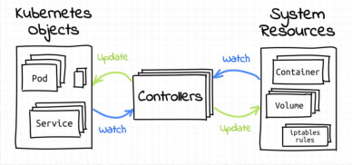

# k8s基础

## 目录

-   [kubernetes关键特性](#kubernetes关键特性)
-   [主要组件](#主要组件)
    -   [支持容器运行的命令空间（NameSpace）](#支持容器运行的命令空间NameSpace)
-   [集群架构](#集群架构)

## kubernetes关键特性

容器编排系统、遵循控制器模式的声明式API、"以应用为中心"的现代应用基础设施（纳管各类支撑类服务，并经由声明式API向上层应用暴露这些基础设施的能力）、platform for platfrom类型的系统（根本目标在于方便基础设施工程师构建其他的平台系统，例如service mesh和serverless）

## 主要组件

两类主要节点为：master控制节点和worker工作节点，控制节点只能有一个而worker节点可以有多个

运行逻辑：

Kubernetes将所有工作节点的资源集结在一起形成一台更加强大的“服务器”

计算和存储接口通过Master之上的API Server暴露

客户端通过API提交应用程序的运行请求，而后由Master通过调度算法将其自动指派至某特定的工作节点以Pod对象的形式运行

Master会自动处理因工作节点的添加、故障或移除等变动对Pod的影响

### 支持容器运行的命令空间（NameSpace）

mount：隔离文件系统

User：隔离用户id

PID：隔离进程id号

Network：隔离网络定义

IPC：隔离容器之间通信机制

UTS:隔离主机之间名称

## 集群架构

k8s属于典型的server-client形式的二层架构

master主要有API server、Controller-Manager和scheduler三个组件，以及一个用于集群状态存储的etcd存储服务组成，这些构成集群的控制平面

每个Node节点则主要包含kubeler、kube、kube proxy及容器运行时三个组件，他们承载运行各类应用容器
